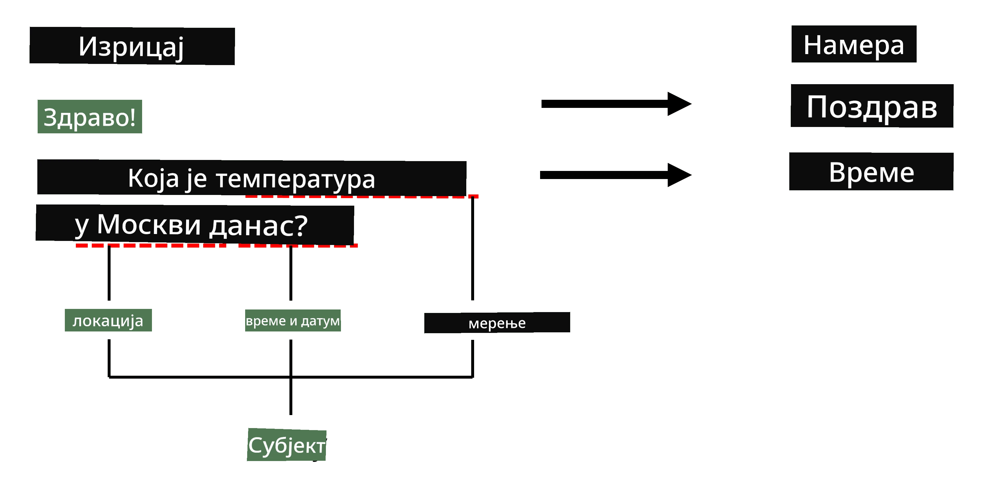
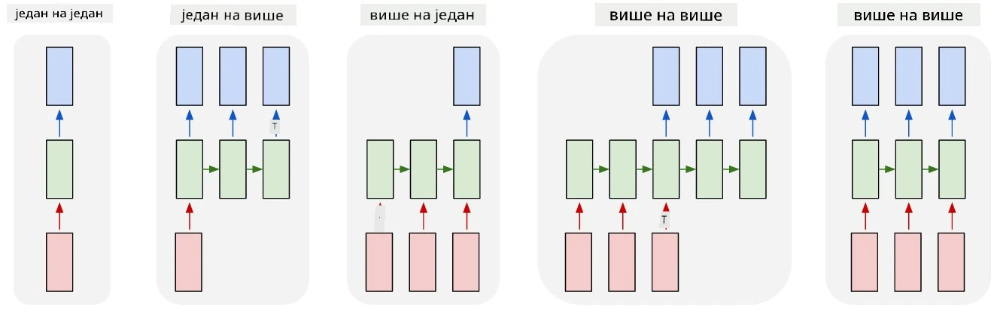

# Препознавање именованих ентитета

До сада смо се углавном концентрисали на један NLP задатак - класификацију. Међутим, постоје и други NLP задаци који се могу решити помоћу неуронских мрежа. Један од тих задатака је **[Препознавање именованих ентитета](https://wikipedia.org/wiki/Named-entity_recognition)** (NER), који се бави препознавањем специфичних ентитета у тексту, као што су места, имена особа, временски интервали, хемијске формуле и слично.

## [Квиз пре предавања](https://ff-quizzes.netlify.app/en/ai/quiz/37)

## Пример коришћења NER-а

Претпоставимо да желите да развијете чет-бот за природни језик, сличан Amazon Alexa или Google Assistant. Начин на који интелигентни чет-ботови функционишу је да *разумеју* шта корисник жели, вршећи класификацију текста на улазној реченици. Резултат те класификације је такозвани **намерни сигнал** (intent), који одређује шта чет-бот треба да уради.

> Слика аутора

Међутим, корисник може да пружи неке параметре као део фразе. На пример, када пита за временску прогнозу, може да наведе локацију или датум. Бот би требало да разуме те ентитете и попуни одговарајуће параметарске слотове пре него што изврши акцију. Управо ту долази NER.

> ✅ Још један пример би био [анализа научних медицинских радова](https://soshnikov.com/science/analyzing-medical-papers-with-azure-and-text-analytics-for-health/). Једна од главних ствари коју треба тражити су специфични медицински термини, као што су болести и медицинске супстанце. Док се мали број болести вероватно може издвојити претрагом подстринга, сложенији ентитети, као што су хемијска једињења и називи лекова, захтевају сложенији приступ.

## NER као класификација токена

NER модели су у суштини **модели за класификацију токена**, јер за сваки од улазних токена треба да одлучимо да ли припада неком ентитету или не, и ако припада - којој класи ентитета.

Размотримо следећи наслов рада:

**Регургитација трикуспидалног залиска** и **литијум карбонат** **токсичност** код новорођенчета.

Ентитети овде су:

* Регургитација трикуспидалног залиска је болест (`DIS`)
* Литијум карбонат је хемијска супстанца (`CHEM`)
* Токсичност је такође болест (`DIS`)

Приметите да један ентитет може обухватати неколико токена. И, као у овом случају, треба да разликујемо два узастопна ентитета. Због тога је уобичајено користити две класе за сваки ентитет - једну која означава први токен ентитета (често се користи префикс `B-`, за **почетак**), и другу - наставак ентитета (`I-`, за **унутрашњи токен**). Такође користимо `O` као класу за представљање свих **осталих** токена. Такво означавање токена назива се [BIO означавање](https://en.wikipedia.org/wiki/Inside%E2%80%93outside%E2%80%93beginning_(tagging)) (или IOB). Када се означи, наш наслов ће изгледати овако:

Токен | Ознака
------|-----
Трикуспидалног | B-DIS
залиска | I-DIS
регургитација | I-DIS
и | O
литијум | B-CHEM
карбонат | I-CHEM
токсичност | B-DIS
код | O
новорођенчета | O
. | O

Пошто треба да изградимо један-на-један кореспонденцију између токена и класа, можемо обучити десни **многи-на-многе** модел неуронске мреже из ове слике:

> *Слика из [овог блога](http://karpathy.github.io/2015/05/21/rnn-effectiveness/) аутора [Андреја Карпатија](http://karpathy.github.io/). Модели за класификацију токена у NER-у одговарају десној архитектури мреже на овој слици.*

## Обука NER модела

Пошто је NER модел у суштини модел за класификацију токена, можемо користити RNN-ове са којима смо већ упознати за овај задатак. У овом случају, сваки блок рекурентне мреже ће враћати ID токена. Следећи пример нотебука показује како обучити LSTM за класификацију токена.

## ✍️ Пример нотебука: NER

Наставите учење у следећем нотебуку:

* [NER са TensorFlow-ом](NER-TF.ipynb)

## Закључак

NER модел је **модел за класификацију токена**, што значи да се може користити за класификацију токена. Ово је веома чест задатак у NLP-у, који помаже у препознавању специфичних ентитета у тексту, укључујући места, имена, датуме и још много тога.

## 🚀 Изазов

Завршите задатак повезан испод да обучите модел за препознавање именованих ентитета за медицинске термине, а затим га испробајте на другом скупу података.

## [Квиз после предавања](https://ff-quizzes.netlify.app/en/ai/quiz/38)

## Преглед и самостално учење

Прочитајте блог [Неразумна ефикасност рекурентних неуронских мрежа](http://karpathy.github.io/2015/05/21/rnn-effectiveness/) и пратите секцију Додатно читање у том чланку како бисте продубили своје знање.

## [Задатак](lab/README.md)

У задатку за ову лекцију, мораћете да обучите модел за препознавање медицинских ентитета. Можете почети са обуком LSTM модела као што је описано у овој лекцији, а затим наставити са коришћењем BERT трансформер модела. Прочитајте [упутства](lab/README.md) да бисте добили све детаље.

---

