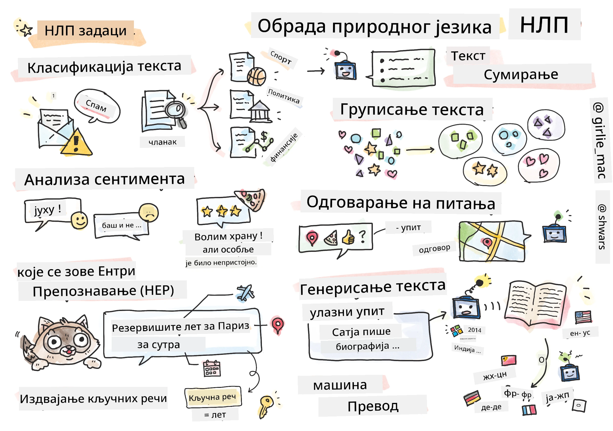

# Обрада природног језика



У овом одељку ћемо се фокусирати на коришћење неуронских мрежа за решавање задатака везаних за **Обраду природног језика (NLP)**. Постоји много NLP проблема које желимо да рачунари могу да реше:

* **Класификација текста** је типичан проблем класификације који се односи на секвенце текста. Примери укључују класификовање мејлова као спам или не-спам, или категоризацију чланака као спорт, бизнис, политика итд. Такође, када развијамо ћаскање роботе, често морамо да разумемо шта је корисник желео да каже -- у овом случају радимо са **класификацијом намере**. Често у класификацији намере морамо да обрадимо много категорија.
* **Анализа сентимента** је типичан проблем регресије, где морамо да доделимо број (сентимент) који одговара колико је значење реченице позитивно/негативно. Напреднија верзија анализе сентимента је **анализa сентимента по аспектима** (ABSA), где сентимент додељујемо не целој реченици, већ различитим њеним деловима (аспектима), нпр. *У овом ресторану ми се свидела кухиња, али атмосфера је била ужасна*.
* **Препознавање именованих ентитета** (NER) односи се на проблем извлачења одређених ентитета из текста. На пример, можда треба да разумемо да у фрази *Морам сутра да путујем у Париз* реч *сутра* означава ДАТУМ, а *Париз* је ЛОКАЦИЈА.  
* **Извлачење кључних речи** је слично NER-у, али треба да аутоматски извучемо речи важне за значење реченице, без претходног тренирања за специфичне типове ентитета.
* **Груписање текста** може бити корисно када желимо да удружимо сличне реченице, на пример, сличне захтеве у разговорима техничке подршке.
* **Одговарање на питања** односи се на способност модела да одговори на конкретно питање. Модел добија текст и питање као улаз и треба да наведе место у тексту где се налази одговор на питање (или понекад да генерише текст одговора).
* **Генерисање текста** је способност модела да генерише нови текст. Може се сматрати као задатак класификације који предвиђа следеће слово/реч на основу неког *текстуалног упита*. Напредни модели за генерисање текста, као што је GPT-3, могу решавати и друге NLP задатке као што је класификација користећи технике које се зову [prompt programming](https://towardsdatascience.com/software-3-0-how-prompting-will-change-the-rules-of-the-game-a982fbfe1e0) или [prompt engineering](https://medium.com/swlh/openai-gpt-3-and-prompt-engineering-dcdc2c5fcd29)
* **Сажимање текста** је техника када желимо да рачунар „прочита“ дугачак текст и сажме га у неколико реченица.
* **Машински превод** се може посматрати као комбинација разумевања текста на једном језику и генерисања текста на другом.

У почетку су већина NLP задатака решавана коришћењем традиционалних метода као што су граматике. На пример, у машинском превођењу користили су се парсери да трансформишу почетну реченицу у синтаксно стабло, затим су из њега извлачене вишег нивоа семантичке структуре које представљају значење реченице, а на основу тог значења и граматике циљног језика генерисао се резултат. Данас, многи NLP задаци се ефикасније решавају коришћењем неуронских мрежа.

> Многе класичне NLP методе су реализоване у [Natural Language Processing Toolkit (NLTK)](https://www.nltk.org) Python библиотеци. Постоји одличан [NLTK књига](https://www.nltk.org/book/) доступан на мрежи који објашњава како се разни NLP задаци могу решавати коришћењем NLTK-а.

У нашем курсу ћемо углавном користити неуронске мреже за NLP, и користићемо NLTK када буде потребно.

Већ смо научили о коришћењу неуронских мрежа за рад са табеларним подацима и са сликама. Главна разлика између тих типова података и текста је што је текст секвенца променљиве дужине, док је величина улаза код слика унапред позната. Док конволуционе мреже могу извлачити обрасце из улазних података, обрасци у тексту су сложенији. Нпр., можемо имати негацију која је удаљена од субјекта за произвољан број речи (нпр. *Не волим поморанџе*, у поређењу са *Не волим те велике шарене укусне поморанџе*), а то треба и даље да се тумачи као један образац. Због тога, да бисмо обрадили језик, морамо да уводимо нове типове неуронских мрежа, као што су *рекурентне мреже* и *трансформери*.

## Инсталирање библиотека

Ако користите локалну Python инсталацију за покретање овог курса, можда ћете морати да инсталирате све потребне библиотеке за NLP користећи следеће команде:

**За PyTorch**
```bash
pip install -r requirements-pytorch.txt
```
**За TensorFlow**
```bash
pip install -r requirements-tf.txt
```

> Можете испробати NLP са TensorFlow-ом на [Microsoft Learn](https://docs.microsoft.com/learn/modules/intro-natural-language-processing-tensorflow/?WT.mc_id=academic-77998-cacaste)

## Упозорење за GPU

У овом одељку ћемо неке примере тренирати прилично велике моделе.
* **Користите рачунар са омогућеним GPU-ом**: Препоручује се да покрећете своје сличице на рачунару са омогућеним GPU-ом како бисте смањили време чекања када радите са великим моделима.
* **Ограничења меморије GPU-а**: Покретање на GPU-у може довести до ситуација у којима вам понестаје меморије GPU-а, посебно код тренирања великих модела.
* **Потрошња меморије GPU-а**: Количина меморије GPU-а која се троши током тренинга зависи од различитих фактора, укључујући величину минибатча.
* **Минимализујте величину минибатча**: Ако наиђете на проблеме са меморијом GPU-а, размислите о смањењу величине минибатча у свом коду као могућем решењу.
* **Ослобађање меморије GPU-а у TensorFlow-у**: Старије верзије TensorFlow-а можда не ослобађају меморију GPU-а правилно када се тренира више модела унутар једног Python кеpнела. Да бисте ефикасно управљали коришћењем GPU меморије, можете конфигурисати TensorFlow да додељује GPU меморију само када је потребно.
* **Укључивање кода**: Да бисте поставили TensorFlow да повећава доделу GPU меморије само кад је потребно, укључите следећи код у своје сличице:

```python
physical_devices = tf.config.list_physical_devices('GPU') 
if len(physical_devices)>0:
    tf.config.experimental.set_memory_growth(physical_devices[0], True) 
```

Ако желите да учите о NLP из класичне перспективе машинског учења, посетите [овој скуп недеља](https://github.com/microsoft/ML-For-Beginners/tree/main/6-NLP)

## У овом одељку
У овом одељку ћемо научити о:

* [Представљање текста као тензора](13-TextRep/README.md)
* [Уградње речи](14-Embeddings/README.md)
* [Језички модели](15-LanguageModeling/README.md)
* [Рекурентне неуронске мреже](16-RNN/README.md)
* [Генеративне мреже](17-GenerativeNetworks/README.md)
* [Трансформери](18-Transformers/README.md)

---

<!-- CO-OP TRANSLATOR DISCLAIMER START -->
**Изјава о одрицању одговорности**:
Овај документ је преведен коришћењем услуге за аутоматски превод [Co-op Translator](https://github.com/Azure/co-op-translator). Иако тежимо тачности, имајте у виду да аутоматски преводи могу садржати грешке или нетачности. Оригинални документ на његовом изворном језику треба сматрати ауторитативним извором. За критичне информације препоручује се професионални људски превод. Нисмо одговорни за било каква неспоразума или погрешна тумачења која произилазе из коришћења овог превода.
<!-- CO-OP TRANSLATOR DISCLAIMER END -->