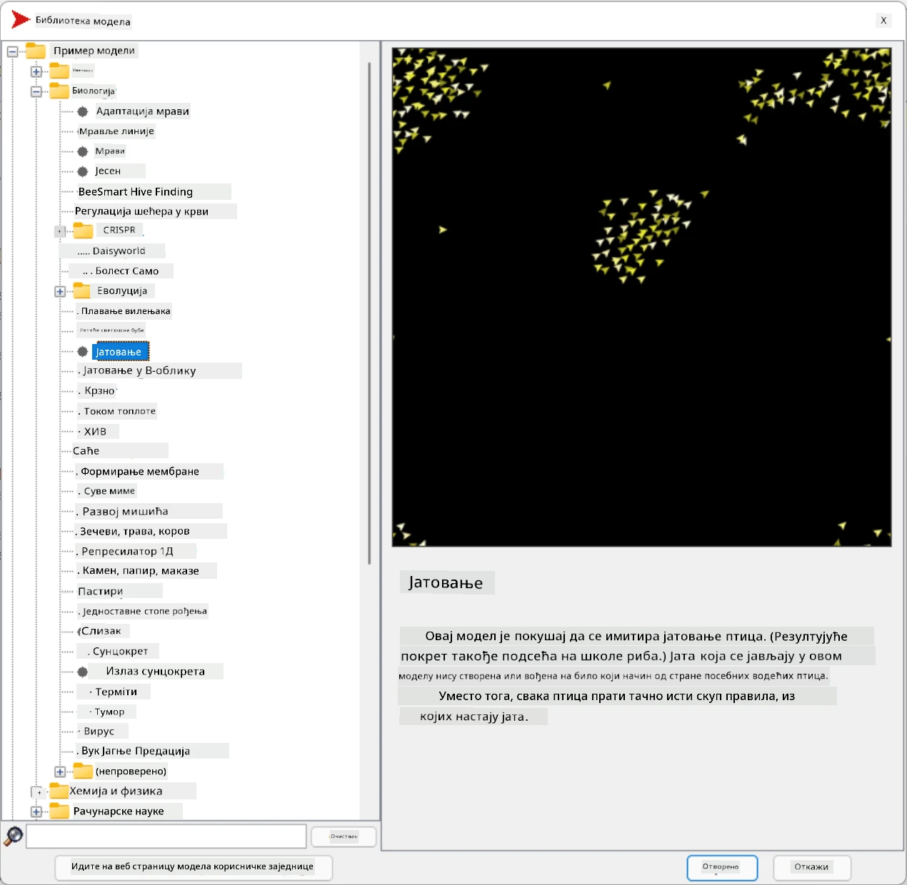
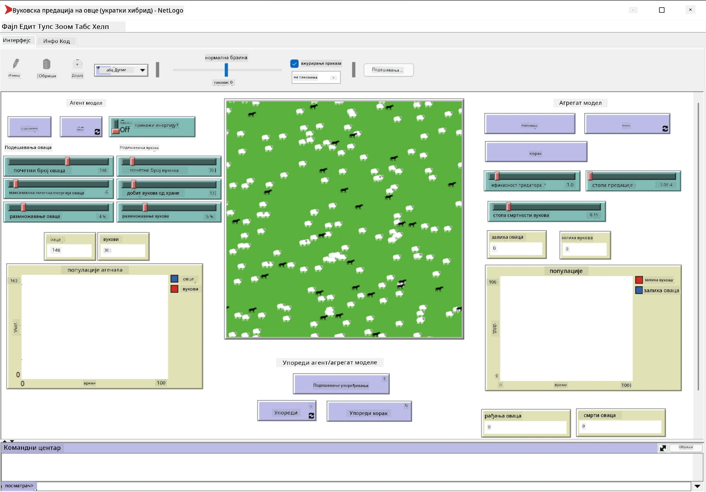

# Мултиагентски системи

Један од могућих начина постизања интелигенције је такозвани **емергентни** (или **синергетски**) приступ, који се заснива на чињеници да комбиновано понашање многих релативно једноставних агената може резултирати укупно сложенијим (или интелигентнијим) понашањем система као целине. Теоријски, ово се заснива на принципима [Колективне интелигенције](https://en.wikipedia.org/wiki/Collective_intelligence), [Емергентизма](https://en.wikipedia.org/wiki/Global_brain) и [Еволуционе кибернетике](https://en.wikipedia.org/wiki/Global_brain), који тврде да системи вишег нивоа добијају неку врсту додатне вредности када се правилно комбинују из система нижег нивоа (такозвани *принцип транзиције метасистема*).

## [Квиз пре предавања](https://ff-quizzes.netlify.app/en/ai/quiz/45)

Правци **мултиагентских система** појавили су се у области вештачке интелигенције током 1990-их као одговор на раст Интернета и дистрибуираних система. Један од класичних уџбеника о вештачкој интелигенцији, [Artificial Intelligence: A Modern Approach](https://en.wikipedia.org/wiki/Artificial_Intelligence:_A_Modern_Approach), фокусира се на класичну вештачку интелигенцију из перспективе мултиагентских система.

Централни концепт мултиагентског приступа је појам **агента** - ентитета који живи у неком **окружењу**, које може да перципира и на које може да делује. Ово је веома широка дефиниција, и постоји много различитих типова и класификација агената:

* Према способности резоновања:
   - **Реактивни** агенти обично имају једноставно понашање типа захтев-одговор
   - **Делиберативни** агенти користе неку врсту логичког резоновања и/или способности планирања
* Према месту извршавања кода агента:
   - **Статички** агенти раде на посебном чвору мреже
   - **Мобилни** агенти могу да премештају свој код између чворова мреже
* Према понашању:
   - **Пасивни агенти** немају специфичне циљеве. Такви агенти могу реаговати на спољашње стимулусе, али неће сами иницирати акције.
   - **Активни агенти** имају одређене циљеве које следе
   - **Когнитивни агенти** укључују сложено планирање и резоновање

Мултиагентски системи данас се користе у бројним апликацијама:

* У играма, многи ликови који нису играчи користе неку врсту вештачке интелигенције и могу се сматрати интелигентним агентима
* У видео продукцији, рендеровање сложених 3D сцена које укључују гомиле обично се ради помоћу симулације мултиагентских система
* У моделовању система, мултиагентски приступ се користи за симулацију понашања сложеног модела. На пример, мултиагентски приступ је успешно коришћен за предвиђање ширења болести COVID-19 широм света. Сличан приступ може се користити за моделовање саобраћаја у граду и анализу реакција на промене у саобраћајним правилима.
* У сложеним аутоматизованим системима, сваки уређај може деловати као независни агент, што чини цео систем мање монолитним и робуснијим.

Нећемо трошити много времена на дубоко проучавање мултиагентских система, али ћемо размотрити један пример **моделовања мултиагентских система**.

## NetLogo

[NetLogo](https://ccl.northwestern.edu/netlogo/) је окружење за моделовање мултиагентских система засновано на модификованој верзији програмског језика [Logo](https://en.wikipedia.org/wiki/Logo_(programming_language)). Овај језик је развијен за подучавање концепата програмирања деци и омогућава вам да контролишете агента названог **корњача**, који може да се креће остављајући траг иза себе. Ово омогућава креирање сложених геометријских фигура, што је веома визуелан начин за разумевање понашања агента.

У NetLogo-у можемо креирати много корњача помоћу команде `create-turtles`. Затим можемо наредити свим корњачама да изврше неке акције (у примеру испод - да се помере 10 корака напред):

```
create-turtles 10
ask turtles [
  forward 10
]
```

Наравно, није занимљиво када све корњаче раде исту ствар, па можемо `ask` групе корњача, нпр. оне које су у близини одређене тачке. Такође можемо креирати корњаче различитих *врста* користећи команду `breed [cats cat]`. Овде је `cat` назив врсте, и потребно је навести и једнину и множину речи, јер различите команде користе различите форме ради јасноће.

> ✅ Нећемо улазити у учење самог NetLogo језика - можете посетити одличан ресурс [Beginner's Interactive NetLogo Dictionary](https://ccl.northwestern.edu/netlogo/bind/) ако сте заинтересовани за више информација.

Можете [преузети](https://ccl.northwestern.edu/netlogo/download.shtml) и инсталирати NetLogo да бисте га испробали.

### Библиотека модела

Сјајна ствар код NetLogo-а је што садржи библиотеку готових модела које можете испробати. Идите на **File &rightarrow; Models Library**, и имате много категорија модела за избор.



> Снимак екрана библиотеке модела, Дмитриј Сошњиков

Можете отворити један од модела, на пример **Biology &rightarrow; Flocking**.

### Главни принципи

Након отварања модела, бићете пребачени на главни екран NetLogo-а. Ево примера модела који описује популацију вукова и оваца, уз ограничене ресурсе (трава).



> Снимак екрана, Дмитриј Сошњиков

На овом екрану можете видети:

* Секцију **Interface** која садржи:
  - Главно поље, где сви агенти живе
  - Различите контроле: дугмад, клизаче, итд.
  - Графике које можете користити за приказ параметара симулације
* Таб **Code** који садржи уређивач, где можете писати NetLogo програм

У већини случајева интерфејс ће имати дугме **Setup**, које иницијализује стање симулације, и дугме **Go** које покреће извршење. Ове функције се обрађују одговарајућим обрађивачима у коду који изгледају овако:

```
to go [
...
]
```

NetLogo свет се састоји од следећих објеката:

* **Агенти** (корњаче) који могу да се крећу по пољу и раде нешто. Агенти се командују помоћу синтаксе `ask turtles [...]`, а код у заградама извршавају сви агенти у *режиму корњаче*.
* **Плочице** су квадратне области поља на којима агенти живе. Можете се позвати на све агенте на истој плочици, или можете мењати боје плочица и неке друге особине. Такође можете `ask patches` да ураде нешто.
* **Посматрач** је јединствени агент који контролише свет. Сви обрађивачи дугмади се извршавају у *режиму посматрача*.

> ✅ Лепота мултиагентског окружења је у томе што се код који се извршава у режиму корњаче или у режиму плочице извршава истовремено од стране свих агената паралелно. Тако, пишући мало кода и програмирајући понашање појединачног агента, можете креирати сложено понашање симулационог система као целине.

### Флокирање

Као пример мултиагентског понашања, размотримо **[Флокирање](https://en.wikipedia.org/wiki/Flocking_(behavior))**. Флокирање је сложен образац који је веома сличан начину на који јата птица лете. Гледајући их како лете, можете помислити да следе неку врсту колективног алгоритма или да поседују неки облик *колективне интелигенције*. Међутим, ово сложено понашање настаје када сваки појединачни агент (у овом случају, *птица*) само посматра неке друге агенте на кратком растојању од себе и следи три једноставна правила:

* **Усклађеност** - усмерава се ка просечном правцу кретања суседних агената
* **Кохезија** - покушава да се усмери ка просечној позицији суседа (*дугорочно привлачење*)
* **Раздвајање** - када се превише приближи другим птицама, покушава да се удаљи (*краткорочно одбијање*)

Можете покренути пример флокирања и посматрати понашање. Такође можете подесити параметре, као што су *степен раздвајања* или *опсег видљивости*, који дефинише колико далеко свака птица може да види. Имајте на уму да ако смањите опсег видљивости на 0, све птице постају слепе и флокирање престаје. Ако смањите раздвајање на 0, све птице се окупљају у праву линију.

> ✅ Пребаците се на таб **Code** и погледајте где су три правила флокирања (усклађеност, кохезија и раздвајање) имплементирана у коду. Обратите пажњу на то како се односимо само на оне агенте који су у видокругу.

### Други модели за истраживање

Постоји још неколико занимљивих модела које можете експериментисати:

* **Art &rightarrow; Fireworks** показује како ватромет може бити сматран колективним понашањем појединачних струја ватре
* **Social Science &rightarrow; Traffic Basic** и **Social Science &rightarrow; Traffic Grid** приказују модел градског саобраћаја у 1D и 2D мрежи са или без семафора. Сваки аутомобил у симулацији следи следећа правила:
   - Ако је простор испред њега празан - убрзава (до одређене максималне брзине)
   - Ако види препреку испред - кочи (и можете подесити колико далеко возач може да види)
* **Social Science &rightarrow; Party** показује како се људи групишу током коктел забаве. Можете пронаћи комбинацију параметара која доводи до најбржег повећања среће групе.

Као што можете видети из ових примера, симулације мултиагентских система могу бити веома користан начин за разумевање понашања сложеног система који се састоји од појединаца који следе исту или сличну логику. Такође се могу користити за контролу виртуелних агената, као што су [NPCs](https://en.wikipedia.org/wiki/NPC) у компјутерским играма или агенти у 3D анимираним световима.

## Делиберативни агенти

Агенти описани изнад су веома једноставни, реагујући на промене у окружењу користећи неку врсту алгоритма. Као такви, они су **реактивни агенти**. Међутим, понекад агенти могу резоновати и планирати своје акције, у ком случају се називају **делиберативни**.

Типичан пример био би лични агент који прима инструкцију од човека да резервише туристичко путовање. Претпоставимо да на интернету постоји много агената који му могу помоћи. Он би онда требало да контактира друге агенте да види који летови су доступни, које су цене хотела за различите датуме и да покуша да преговара о најбољој цени. Када је план путовања комплетан и потврђен од стране власника, може приступити резервацији.

Да би то урадили, агенти морају да **комуницирају**. За успешну комуникацију потребно је:

* Неке **стандардне језике за размену знања**, као што су [Knowledge Interchange Format](https://en.wikipedia.org/wiki/Knowledge_Interchange_Format) (KIF) и [Knowledge Query and Manipulation Language](https://en.wikipedia.org/wiki/Knowledge_Query_and_Manipulation_Language) (KQML). Ови језици су дизајнирани на основу [теорије говорних чинова](https://en.wikipedia.org/wiki/Speech_act).
* Ови језици такође треба да укључују неке **протоколе за преговоре**, засноване на различитим **типовима аукција**.
* **Заједничка онтологија** коју ће користити, како би се позивали на исте концепте знајући њихову семантику
* Начин да **открију** шта различити агенти могу да ураде, такође заснован на некој врсти онтологије

Делиберативни агенти су много сложенији од реактивних, јер не само да реагују на промене у окружењу, већ треба да буду у стању да *иницирају* акције. Једна од предложених архитектура за делиберативне агенте је такозвани агент веровања-жеље-намера (BDI):

* **Веровања** чине скуп знања о окружењу агента. Могу бити структурисана као база знања или скуп правила која агент може применити на одређену ситуацију у окружењу.
* **Жеље** дефинишу шта агент жели да уради, тј. његове циљеве. На пример, циљ личног асистента агента изнад је да резервише путовање, а циљ агента хотела је да максимизира профит.
* **Намере** су специфичне акције које агент планира да постигне своје циљеве. Акције обично мењају окружење и узрокују комуникацију са другим агентима.

Постоје неке платформе доступне за изградњу мултиагентских система, као што је [JADE](https://jade.tilab.com/). [Овај рад](https://arxiv.org/ftp/arxiv/papers/2007/2007.08961.pdf) садржи преглед платформи за мултиагентске системе, заједно са кратком историјом мултиагентских система и њиховим различитим сценаријима употребе.

## Закључак

Мултиагентски системи могу имати веома различите форме и користити се у многим различитим апликацијама. 
Сви они теже да се фокусирају на једноставније понашање појединачног агента и постигну сложеније понашање целокупног система захваљујући **синергетском ефекту**.

## 🚀 Изазов

Примените ово предавање у стварном свету и покушајте да концептуализујете мултиагентски систем који може решити проблем. Шта би, на пример, мултиагентски систем требало да уради да оптимизује руту школског аутобуса? Како би могао да функционише у пекари?

## [Квиз после предавања](https://ff-quizzes.netlify

---

