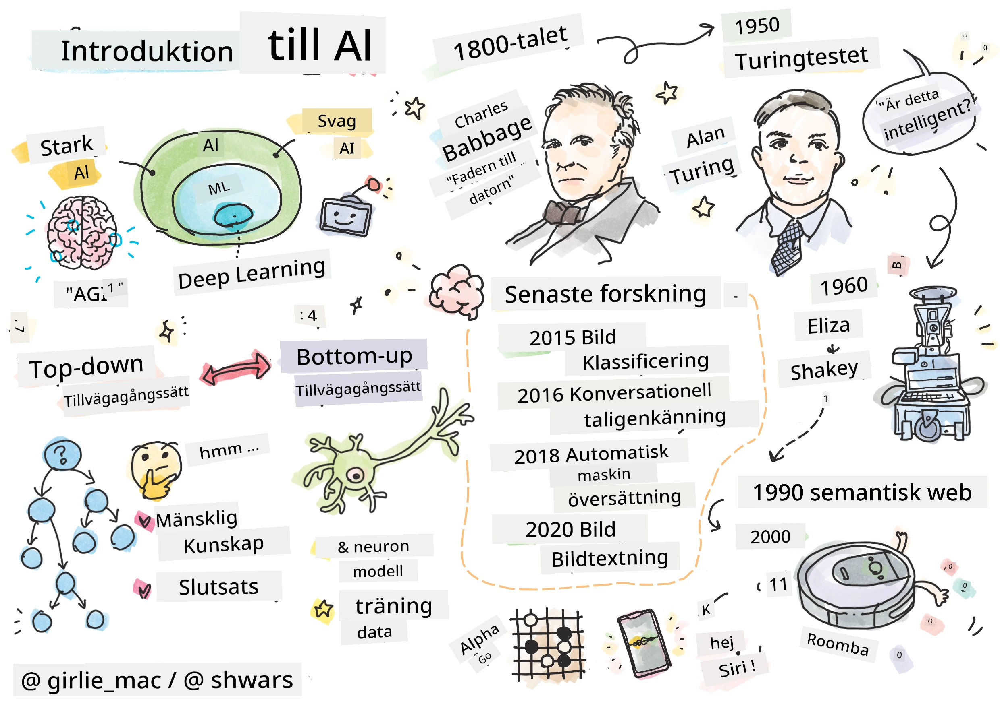
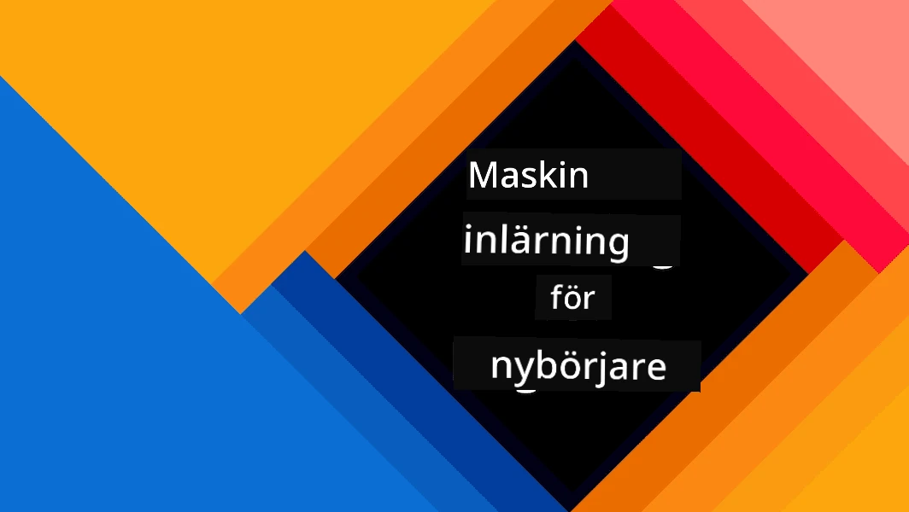
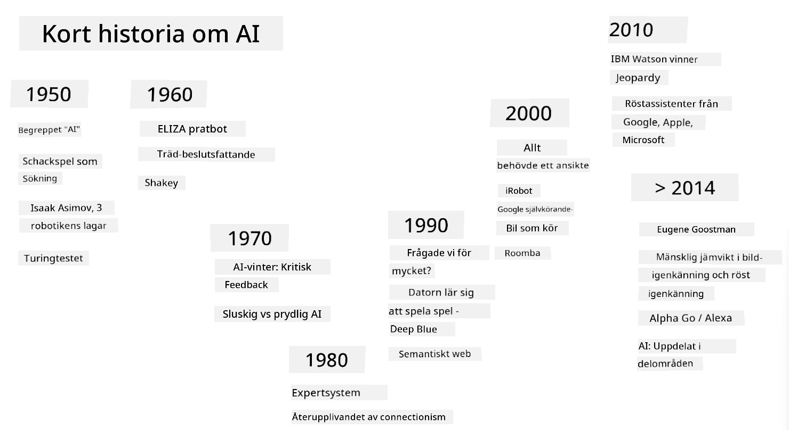
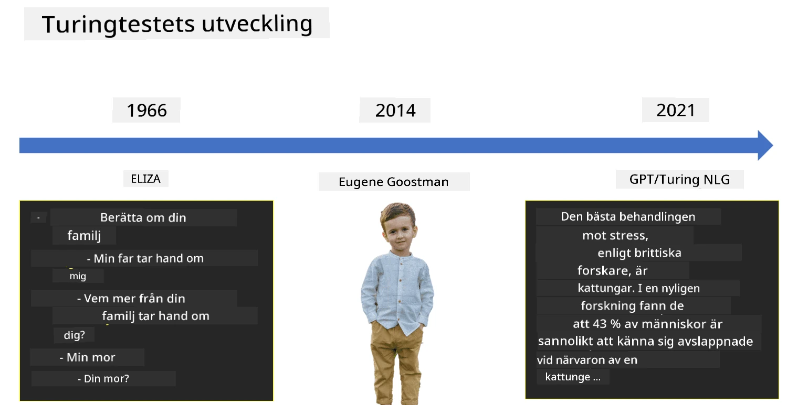

# Introduktion till AI

> Skiss av [Tomomi Imura](https://twitter.com/girlie_mac)

## [Quiz före föreläsningen](https://ff-quizzes.netlify.app/en/ai/quiz/1)

**Artificiell intelligens** är en spännande vetenskaplig disciplin som studerar hur vi kan få datorer att uppvisa intelligent beteende, t.ex. utföra sådana saker som människor är bra på att göra.

Ursprungligen uppfanns datorer av [Charles Babbage](https://en.wikipedia.org/wiki/Charles_Babbage) för att arbeta med siffror enligt en väl definierad procedur - en algoritm. Moderna datorer, även om de är betydligt mer avancerade än den ursprungliga modellen som föreslogs på 1800-talet, följer fortfarande samma idé om kontrollerade beräkningar. Därför är det möjligt att programmera en dator att göra något om vi vet den exakta sekvensen av steg som behövs för att uppnå målet.

> Foto av [Vickie Soshnikova](http://twitter.com/vickievalerie)

> ✅ Att definiera en persons ålder från ett fotografi är en uppgift som inte kan programmeras explicit, eftersom vi inte vet hur vi kommer fram till ett nummer i vårt huvud när vi gör det.

---

Det finns dock vissa uppgifter som vi inte explicit vet hur vi ska lösa. Tänk på att bestämma en persons ålder från ett fotografi. Vi lär oss på något sätt att göra det, eftersom vi har sett många exempel på människor i olika åldrar, men vi kan inte förklara exakt hur vi gör det, och vi kan inte heller programmera datorn att göra det. Det är precis den typen av uppgifter som är intressanta för **artificiell intelligens** (AI).

✅ Fundera på några uppgifter som du skulle kunna överlåta till en dator som skulle dra nytta av AI. Tänk på områden som finans, medicin och konst - hur drar dessa områden nytta av AI idag?

## Svag AI vs. Stark AI

Svag AI | Stark AI
---------------------------------------|-------------------------------------
Svag AI avser AI-system som är designade och tränade för en specifik uppgift eller en begränsad uppsättning uppgifter.|Stark AI, eller Artificiell General Intelligens (AGI), avser AI-system med mänsklig nivå av intelligens och förståelse.
Dessa AI-system är inte generellt intelligenta; de är utmärkta på att utföra en fördefinierad uppgift men saknar verklig förståelse eller medvetenhet.|Dessa AI-system har förmågan att utföra alla intellektuella uppgifter som en människa kan göra, anpassa sig till olika områden och besitter en form av medvetenhet eller självinsikt.
Exempel på svag AI inkluderar virtuella assistenter som Siri eller Alexa, rekommendationsalgoritmer som används av streamingtjänster och chatbots som är designade för specifika kundtjänstuppgifter.|Att uppnå stark AI är ett långsiktigt mål för AI-forskning och skulle kräva utveckling av AI-system som kan resonera, lära sig, förstå och anpassa sig över ett brett spektrum av uppgifter och sammanhang.
Svag AI är mycket specialiserad och har inte mänskliga kognitiva förmågor eller generell problemlösningsförmåga utanför sitt begränsade område.|Stark AI är för närvarande ett teoretiskt koncept, och inget AI-system har nått denna nivå av generell intelligens.

För mer information, se **[Artificiell General Intelligens](https://en.wikipedia.org/wiki/Artificial_general_intelligence)** (AGI).

## Definitionen av intelligens och Turing-testet

Ett av problemen med att hantera termen **[intelligens](https://en.wikipedia.org/wiki/Intelligence)** är att det inte finns någon tydlig definition av termen. Man kan argumentera för att intelligens är kopplad till **abstrakt tänkande** eller **självmedvetenhet**, men vi kan inte definiera det ordentligt.

> [Foto](https://unsplash.com/photos/75715CVEJhI) av [Amber Kipp](https://unsplash.com/@sadmax) från Unsplash

För att se tvetydigheten i termen *intelligens*, försök att svara på frågan: "Är en katt intelligent?". Olika människor tenderar att ge olika svar på denna fråga, eftersom det inte finns något universellt accepterat test för att bevisa att påståendet är sant eller falskt. Och om du tror att det finns - försök att låta din katt göra ett IQ-test...

✅ Fundera en stund på hur du definierar intelligens. Är en kråka som kan lösa en labyrint för att få mat intelligent? Är ett barn intelligent?

---

När vi talar om AGI behöver vi ha ett sätt att avgöra om vi har skapat ett verkligt intelligent system. [Alan Turing](https://en.wikipedia.org/wiki/Alan_Turing) föreslog ett sätt som kallas **[Turing-testet](https://en.wikipedia.org/wiki/Turing_test)**, vilket också fungerar som en definition av intelligens. Testet jämför ett givet system med något som är inneboende intelligent - en riktig människa, och eftersom varje automatisk jämförelse kan kringgås av ett datorprogram, använder vi en mänsklig förhörsledare. Så, om en människa inte kan skilja mellan en riktig person och ett datorsystem i textbaserad dialog - anses systemet vara intelligent.

> En chatbot som heter [Eugene Goostman](https://en.wikipedia.org/wiki/Eugene_Goostman), utvecklad i St. Petersburg, kom nära att klara Turing-testet 2014 genom att använda ett smart personlighetsknep. Den meddelade direkt att den var en 13-årig ukrainsk pojke, vilket skulle förklara bristen på kunskap och vissa avvikelser i texten. Botten övertygade 30% av domarna att den var mänsklig efter en 5-minuters dialog, en måttstock som Turing trodde att en maskin skulle kunna klara av år 2000. Men man bör förstå att detta inte indikerar att vi har skapat ett intelligent system, eller att ett datorsystem har lurat den mänskliga förhörsledaren - systemet lurade inte människorna, utan snarare botens skapare gjorde det!

✅ Har du någonsin blivit lurad av en chatbot att tro att du pratar med en människa? Hur övertygade den dig?

## Olika tillvägagångssätt för AI

Om vi vill att en dator ska bete sig som en människa, måste vi på något sätt modellera vårt sätt att tänka inuti datorn. Följaktligen måste vi försöka förstå vad som gör en människa intelligent.

> För att kunna programmera intelligens i en maskin måste vi förstå hur våra egna beslutsprocesser fungerar. Om du gör lite självreflektion kommer du att inse att det finns vissa processer som sker undermedvetet – t.ex. vi kan skilja en katt från en hund utan att tänka på det - medan andra involverar resonemang.

Det finns två möjliga tillvägagångssätt för detta problem:

Top-down-ansats (symboliskt resonemang) | Bottom-up-ansats (neurala nätverk)
---------------------------------------|-------------------------------------
En top-down-ansats modellerar hur en person resonerar för att lösa ett problem. Det innebär att extrahera **kunskap** från en människa och representera den i en datorläsbar form. Vi behöver också utveckla ett sätt att modellera **resonemang** inuti en dator. | En bottom-up-ansats modellerar strukturen av en mänsklig hjärna, bestående av ett stort antal enkla enheter som kallas **neuroner**. Varje neuron fungerar som ett viktat medelvärde av sina ingångar, och vi kan träna ett nätverk av neuroner att lösa användbara problem genom att tillhandahålla **träningsdata**.

Det finns också några andra möjliga tillvägagångssätt för intelligens:

* En **Emergent**, **Synergetisk** eller **multi-agent-ansats** baseras på att komplex intelligent beteende kan uppnås genom interaktion mellan ett stort antal enkla agenter. Enligt [evolutionär cybernetik](https://en.wikipedia.org/wiki/Global_brain#Evolutionary_cybernetics) kan intelligens *uppstå* från enklare, reaktivt beteende i processen av *metasystemövergång*.

* En **Evolutionär ansats**, eller **genetisk algoritm** är en optimeringsprocess baserad på evolutionens principer.

Vi kommer att överväga dessa tillvägagångssätt senare i kursen, men just nu kommer vi att fokusera på två huvudriktningar: top-down och bottom-up.

### Top-down-ansatsen

I en **top-down-ansats** försöker vi modellera vårt resonemang. Eftersom vi kan följa våra tankar när vi resonerar, kan vi försöka formalisera denna process och programmera den inuti datorn. Detta kallas **symboliskt resonemang**.

Människor tenderar att ha vissa regler i sitt huvud som styr deras beslutsprocesser. Till exempel, när en läkare diagnostiserar en patient, kan han eller hon inse att en person har feber, och därför kan det finnas någon inflammation i kroppen. Genom att tillämpa ett stort antal regler på ett specifikt problem kan en läkare komma fram till den slutliga diagnosen.

Denna ansats är starkt beroende av **kunskapsrepresentation** och **resonemang**. Att extrahera kunskap från en mänsklig expert kan vara den svåraste delen, eftersom en läkare i många fall inte exakt vet varför han eller hon kommer fram till en viss diagnos. Ibland dyker lösningen bara upp i huvudet utan explicit tänkande. Vissa uppgifter, såsom att bestämma en persons ålder från ett fotografi, kan inte alls reduceras till att manipulera kunskap.

### Bottom-up-ansatsen

Alternativt kan vi försöka modellera de enklaste elementen i vår hjärna – en neuron. Vi kan konstruera ett så kallat **artificiellt neuralt nätverk** inuti en dator och sedan försöka lära det att lösa problem genom att ge det exempel. Denna process liknar hur ett nyfött barn lär sig om sin omgivning genom att göra observationer.

✅ Gör lite forskning om hur bebisar lär sig. Vilka är de grundläggande elementen i en bebis hjärna?

> | Vad sägs om ML?         |      |
> |--------------|-----------|
> | En del av artificiell intelligens som bygger på att datorn lär sig att lösa ett problem baserat på viss data kallas **Machine Learning**. Vi kommer inte att behandla klassisk maskininlärning i denna kurs - vi hänvisar dig till en separat [Machine Learning for Beginners](http://aka.ms/ml-beginners) läroplan. |       |

## En kort historia om AI

Artificiell intelligens startade som ett område i mitten av 1900-talet. Ursprungligen var symboliskt resonemang en dominerande ansats, och det ledde till ett antal viktiga framgångar, såsom expertsystem – datorprogram som kunde agera som en expert inom vissa begränsade problemområden. Men det blev snart klart att en sådan ansats inte skalar bra. Att extrahera kunskap från en expert, representera den i en dator och hålla den kunskapsbasen korrekt visade sig vara en mycket komplex uppgift och för dyr för att vara praktisk i många fall. Detta ledde till den så kallade [AI-vintern](https://en.wikipedia.org/wiki/AI_winter) på 1970-talet.

> Bild av [Dmitry Soshnikov](http://soshnikov.com)

Med tiden blev datorresurser billigare och mer data blev tillgänglig, så neurala nätverksansatser började visa stor prestanda i att konkurrera med människor inom många områden, såsom datorseende eller talförståelse. Under det senaste decenniet har termen artificiell intelligens mestadels använts som en synonym för neurala nätverk, eftersom de flesta AI-framgångar vi hör om är baserade på dem.

Vi kan observera hur ansatserna har förändrats, till exempel vid skapandet av ett schackspelande datorprogram:

* Tidiga schackprogram var baserade på sökning – ett program försökte explicit uppskatta möjliga drag från en motståndare för ett givet antal kommande drag och valde ett optimalt drag baserat på den optimala positionen som kan uppnås inom några drag. Det ledde till utvecklingen av den så kallade [alpha-beta beskärning](https://en.wikipedia.org/wiki/Alpha%E2%80%93beta_pruning) sökalgoritmen.
* Sökningsstrategier fungerar bra mot slutet av spelet, där sökrymden är begränsad av ett litet antal möjliga drag. Men i början av spelet är sökrymden enorm, och algoritmen kan förbättras genom att lära sig från befintliga matcher mellan mänskliga spelare. Efterföljande experiment använde så kallad [case-baserat resonemang](https://en.wikipedia.org/wiki/Case-based_reasoning), där programmet letade efter fall i kunskapsbasen som liknar den aktuella positionen i spelet.
* Moderna program som vinner över mänskliga spelare är baserade på neurala nätverk och [förstärkningsinlärning](https://en.wikipedia.org/wiki/Reinforcement_learning), där programmen lär sig att spela enbart genom att spela länge mot sig själva och lära sig av sina egna misstag – ungefär som människor gör när de lär sig spela schack. Men ett datorprogram kan spela många fler spel på mycket kortare tid och därmed lära sig mycket snabbare.

✅ Gör lite forskning om andra spel som har spelats av AI.

På samma sätt kan vi se hur ansatsen för att skapa "talande program" (som kan klara Turing-testet) har förändrats:

* Tidiga program av denna typ, såsom [Eliza](https://en.wikipedia.org/wiki/ELIZA), var baserade på mycket enkla grammatiska regler och omformulering av den inmatade meningen till en fråga.
* Moderna assistenter, såsom Cortana, Siri eller Google Assistant, är alla hybridsystem som använder neurala nätverk för att konvertera tal till text och känna igen vår avsikt, och sedan använder vissa resonemang eller explicita algoritmer för att utföra nödvändiga åtgärder.
* I framtiden kan vi förvänta oss en komplett neuralbaserad modell som hanterar dialoger själv. Den senaste GPT- och [Turing-NLG](https://www.microsoft.com/research/blog/turing-nlg-a-17-billion-parameter-language-model-by-microsoft)-familjen av neurala nätverk visar stor framgång i detta.

> Bild av Dmitry Soshnikov, [foto](https://unsplash.com/photos/r8LmVbUKgns) av [Marina Abrosimova](https://unsplash.com/@abrosimova_marina_foto), Unsplash

## Senaste AI-forskningen

Den enorma tillväxten inom forskning om neurala nätverk började runt 2010, när stora offentliga dataset blev tillgängliga. En enorm samling bilder kallad [ImageNet](https://en.wikipedia.org/wiki/ImageNet), som innehåller cirka 14 miljoner annoterade bilder, gav upphov till [ImageNet Large Scale Visual Recognition Challenge](https://image-net.org/challenges/LSVRC/).

> Bild av [Dmitry Soshnikov](http://soshnikov.com)

År 2012 användes [Convolutional Neural Networks](../4-ComputerVision/07-ConvNets/README.md) för första gången inom bildklassificering, vilket ledde till en betydande minskning av klassificeringsfel (från nästan 30% till 16,4%). År 2015 uppnådde ResNet-arkitekturen från Microsoft Research [mänsklig nivå av noggrannhet](https://doi.org/10.1109/ICCV.2015.123).

Sedan dess har neurala nätverk visat mycket framgångsrikt beteende inom många uppgifter:

---

År | Mänsklig nivå uppnådd
-----|--------
2015 | [Bildklassificering](https://doi.org/10.1109/ICCV.2015.123)
2016 | [Konverserande taligenkänning](https://arxiv.org/abs/1610.05256)
2018 | [Automatisk maskinöversättning](https://arxiv.org/abs/1803.05567) (Kinesiska till engelska)
2020 | [Bildtextning](https://arxiv.org/abs/2009.13682)

Under de senaste åren har vi bevittnat stora framgångar med stora språkmodeller, såsom BERT och GPT-3. Detta skedde främst på grund av att det finns mycket generell textdata tillgänglig som gör det möjligt att träna modeller för att fånga strukturen och innebörden av texter, förträna dem på generella textsamlingar och sedan specialisera dessa modeller för mer specifika uppgifter. Vi kommer att lära oss mer om [Natural Language Processing](../5-NLP/README.md) senare i denna kurs.

## 🚀 Utmaning

Gör en rundtur på internet för att avgöra var, enligt din åsikt, AI används mest effektivt. Är det i en kartapp, eller någon tal-till-text-tjänst eller ett videospel? Undersök hur systemet byggdes.

## [Quiz efter föreläsningen](https://ff-quizzes.netlify.app/en/ai/quiz/2)

## Granskning & Självstudier

Granska AI:s och ML:s historia genom att läsa igenom [denna lektion](https://github.com/microsoft/ML-For-Beginners/tree/main/1-Introduction/2-history-of-ML). Ta ett element från sketchnoten högst upp i den lektionen eller denna och undersök det mer ingående för att förstå den kulturella kontexten som informerade dess utveckling.

**Uppgift**: [Game Jam](assignment.md)

---

<!-- CO-OP TRANSLATOR DISCLAIMER START -->
**Ansvarsfriskrivning**:  
Detta dokument har översatts med hjälp av AI-översättningstjänsten [Co-op Translator](https://github.com/Azure/co-op-translator). Även om vi strävar efter noggrannhet, bör det noteras att automatiserade översättningar kan innehålla fel eller felaktigheter. Det ursprungliga dokumentet på dess ursprungliga språk bör betraktas som den auktoritativa källan. För kritisk information rekommenderas professionell mänsklig översättning. Vi ansvarar inte för eventuella missförstånd eller feltolkningar som uppstår vid användning av denna översättning.
<!-- CO-OP TRANSLATOR DISCLAIMER END -->