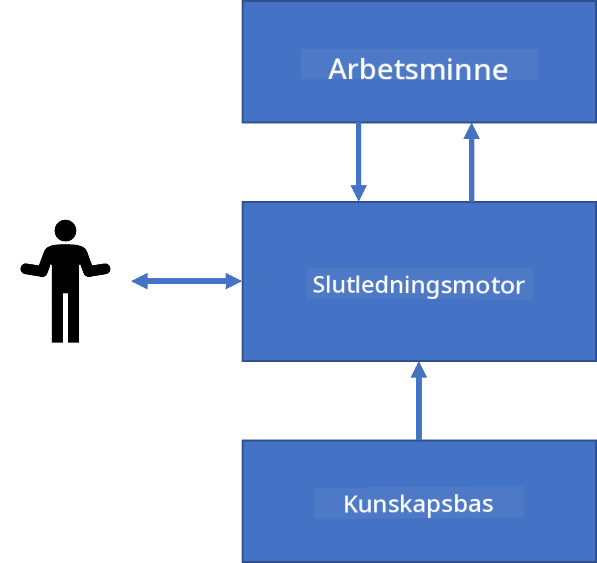
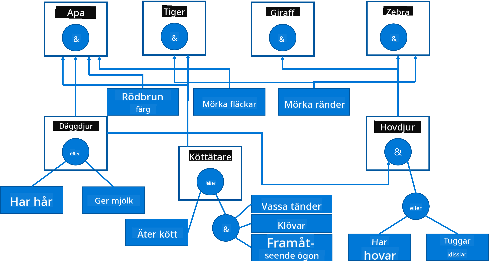

<!--
CO_OP_TRANSLATOR_METADATA:
{
  "original_hash": "7d097f7fda9166ead615e4c34552381b",
  "translation_date": "2025-09-23T09:19:42+00:00",
  "source_file": "lessons/2-Symbolic/README.md",
  "language_code": "sv"
}
-->
# Kunskapsrepresentation och Expertsystem


> Sketchnote av [Tomomi Imura](https://twitter.com/girlie_mac)

Strävan efter artificiell intelligens bygger på en jakt efter kunskap, för att förstå världen på ett sätt som liknar hur människor gör. Men hur kan man gå tillväga för att uppnå detta?

## [Quiz före föreläsningen](https://ff-quizzes.netlify.app/en/ai/quiz/3)

Under AI:s tidiga dagar var den top-down-metoden för att skapa intelligenta system (diskuterad i föregående lektion) populär. Idén var att extrahera kunskap från människor till en maskinläsbar form och sedan använda den för att automatiskt lösa problem. Denna metod baserades på två stora idéer:

* Kunskapsrepresentation
* Resonerande

## Kunskapsrepresentation

Ett av de viktiga begreppen inom Symbolisk AI är **kunskap**. Det är viktigt att skilja kunskap från *information* eller *data*. Till exempel kan man säga att böcker innehåller kunskap, eftersom man kan studera böcker och bli expert. Men det böcker faktiskt innehåller kallas *data*, och genom att läsa böcker och integrera denna data i vår världsmodell omvandlar vi data till kunskap.

> ✅ **Kunskap** är något som finns i vårt huvud och representerar vår förståelse av världen. Den erhålls genom en aktiv **lärande** process, som integrerar bitar av information vi får in i vår aktiva världsmodell.

Oftast definierar vi inte strikt vad kunskap är, utan vi relaterar den till andra begrepp med hjälp av [DIKW-pyramiden](https://en.wikipedia.org/wiki/DIKW_pyramid). Den innehåller följande begrepp:

* **Data** är något som representeras i fysiska medier, såsom skriven text eller talade ord. Data existerar oberoende av människor och kan överföras mellan personer.
* **Information** är hur vi tolkar data i vårt huvud. Till exempel, när vi hör ordet *dator*, har vi en viss förståelse för vad det är.
* **Kunskap** är information som integreras i vår världsmodell. Till exempel, när vi lär oss vad en dator är, börjar vi få idéer om hur den fungerar, hur mycket den kostar och vad den kan användas till. Detta nätverk av relaterade begrepp bildar vår kunskap.
* **Visdom** är ytterligare en nivå av vår förståelse av världen och representerar *meta-kunskap*, t.ex. en uppfattning om hur och när kunskapen ska användas.


*Bild [från Wikipedia](https://commons.wikimedia.org/w/index.php?curid=37705247), Av Longlivetheux - Eget arbete, CC BY-SA 4.0*

Således är problemet med **kunskapsrepresentation** att hitta ett effektivt sätt att representera kunskap i en dator i form av data, för att göra den automatiskt användbar. Detta kan ses som ett spektrum:


> Bild av [Dmitry Soshnikov](http://soshnikov.com)

* Till vänster finns mycket enkla typer av kunskapsrepresentationer som kan användas effektivt av datorer. Den enklaste är algoritmisk, där kunskap representeras av ett datorprogram. Detta är dock inte det bästa sättet att representera kunskap, eftersom det inte är flexibelt. Kunskap i vårt huvud är ofta icke-algoritmisk.
* Till höger finns representationer som naturlig text. Det är den mest kraftfulla, men kan inte användas för automatisk resonerande.

> ✅ Fundera en stund på hur du representerar kunskap i ditt huvud och omvandlar den till anteckningar. Finns det ett format som fungerar bra för dig för att underlätta inlärning?

## Klassificering av datorbaserade kunskapsrepresentationer

Vi kan klassificera olika metoder för datorbaserad kunskapsrepresentation i följande kategorier:

* **Nätverksrepresentationer** baseras på det faktum att vi har ett nätverk av relaterade begrepp i vårt huvud. Vi kan försöka återskapa samma nätverk som en graf i en dator - ett så kallat **semantiskt nätverk**.

1. **Objekt-Attribut-Värde-tripel** eller **attribut-värde-par**. Eftersom en graf kan representeras i en dator som en lista av noder och kanter, kan vi representera ett semantiskt nätverk med en lista av tripler som innehåller objekt, attribut och värden. Till exempel bygger vi följande tripler om programmeringsspråk:

Objekt | Attribut | Värde
-------|----------|------
Python | är | Otypat språk
Python | uppfunnet av | Guido van Rossum
Python | blocksyntax | indragning
Otypat språk | har inte | typdefinitioner

> ✅ Fundera på hur tripler kan användas för att representera andra typer av kunskap.

2. **Hierarkiska representationer** betonar det faktum att vi ofta skapar en hierarki av objekt i vårt huvud. Till exempel vet vi att kanariefågel är en fågel, och alla fåglar har vingar. Vi har också en uppfattning om vilken färg en kanariefågel vanligtvis har och vad deras flyghastighet är.

   - **Ramrepresentation** baseras på att representera varje objekt eller klass av objekt som en **ram** som innehåller **platser**. Platser har möjliga standardvärden, värdebegränsningar eller lagrade procedurer som kan anropas för att få värdet av en plats. Alla ramar bildar en hierarki som liknar en objekt-hierarki i objektorienterade programmeringsspråk.
   - **Scenarier** är en speciell typ av ramar som representerar komplexa situationer som kan utvecklas över tid.

**Python**

Plats | Värde | Standardvärde | Intervall |
------|-------|---------------|----------|
Namn | Python | | |
Är-A | Otypat språk | | |
Variabelstil | | CamelCase | |
Programlängd | | | 5-5000 rader |
Blocksyntax | Indragning | | |

3. **Procedurrepresentationer** baseras på att representera kunskap med en lista av åtgärder som kan utföras när ett visst villkor inträffar.
   - Produktionsregler är om-så-uttalanden som gör det möjligt att dra slutsatser. Till exempel kan en läkare ha en regel som säger att **OM** en patient har hög feber **ELLER** höga nivåer av C-reaktivt protein i blodprovet **SÅ** har han en inflammation. När vi stöter på ett av villkoren kan vi dra en slutsats om inflammation och sedan använda den i vidare resonerande.
   - Algoritmer kan betraktas som en annan form av procedurrepresentation, även om de nästan aldrig används direkt i kunskapsbaserade system.

4. **Logik** föreslogs ursprungligen av Aristoteles som ett sätt att representera universell mänsklig kunskap.
   - Predikatlogik som matematisk teori är för rik för att vara beräkningsbar, därför används normalt en delmängd av den, såsom Horn-klasuler som används i Prolog.
   - Beskrivande logik är en familj av logiska system som används för att representera och resonera om hierarkier av objekt i distribuerade kunskapsrepresentationer såsom *semantisk web*.

## Expertsystem

En av de tidiga framgångarna med symbolisk AI var de så kallade **expertsystemen** - datorsystem som designades för att agera som experter inom ett begränsat problemområde. De baserades på en **kunskapsbas** som extraherades från en eller flera mänskliga experter och innehöll en **slutsatsmotor** som utförde resonerande ovanpå den.

 | 
---------------------------------------------|------------------------------------------------
Förenklad struktur av ett mänskligt nervsystem | Arkitektur av ett kunskapsbaserat system

Expertsystem är byggda som det mänskliga resoneringssystemet, som innehåller **korttidsminne** och **långtidsminne**. På samma sätt skiljer vi i kunskapsbaserade system följande komponenter:

* **Probleminne**: innehåller kunskapen om det problem som för närvarande löses, t.ex. temperaturen eller blodtrycket hos en patient, om han har inflammation eller inte, etc. Denna kunskap kallas också **statisk kunskap**, eftersom den innehåller en ögonblicksbild av vad vi för närvarande vet om problemet - det så kallade *problemstadiet*.
* **Kunskapsbas**: representerar långtidskunskap om ett problemområde. Den extraheras manuellt från mänskliga experter och ändras inte från konsultation till konsultation. Eftersom den gör det möjligt för oss att navigera från ett problemstadium till ett annat, kallas den också **dynamisk kunskap**.
* **Slutsatsmotor**: orkestrerar hela processen med att söka i problemstadiets utrymme, ställer frågor till användaren när det behövs. Den är också ansvarig för att hitta rätt regler som ska tillämpas på varje stadium.

Som ett exempel, låt oss överväga följande expertsystem för att bestämma ett djur baserat på dess fysiska egenskaper:



> Bild av [Dmitry Soshnikov](http://soshnikov.com)

Detta diagram kallas ett **AND-OR-träd**, och det är en grafisk representation av en uppsättning produktionsregler. Att rita ett träd är användbart i början av att extrahera kunskap från experten. För att representera kunskapen i datorn är det mer praktiskt att använda regler:

```
IF the animal eats meat
OR (animal has sharp teeth
    AND animal has claws
    AND animal has forward-looking eyes
) 
THEN the animal is a carnivore
```

Du kan märka att varje villkor på vänster sida av regeln och åtgärden i grunden är objekt-attribut-värde (OAV)-tripler. **Arbetsminne** innehåller uppsättningen OAV-tripler som motsvarar det problem som för närvarande löses. En **regelmotor** letar efter regler vars villkor är uppfyllda och tillämpar dem, vilket lägger till en ny tripel i arbetsminnet.

> ✅ Skapa ditt eget AND-OR-träd om ett ämne du gillar!

### Framåt- vs. Bakåtresonerande

Processen som beskrivs ovan kallas **framåtresonerande**. Den börjar med viss initial data om problemet som finns tillgänglig i arbetsminnet och utför sedan följande resoneringsloop:

1. Om målattributet finns i arbetsminnet - stoppa och ge resultatet
2. Leta efter alla regler vars villkor för närvarande är uppfyllda - erhåll **konfliktuppsättning** av regler.
3. Utför **konfliktlösning** - välj en regel som kommer att utföras i detta steg. Det kan finnas olika strategier för konfliktlösning:
   - Välj den första tillämpliga regeln i kunskapsbasen
   - Välj en slumpmässig regel
   - Välj en *mer specifik* regel, dvs. den som uppfyller flest villkor på vänster sida (LHS)
4. Tillämpa vald regel och lägg till ny kunskap i problemstadiet
5. Upprepa från steg 1.

Men i vissa fall kanske vi vill börja med tom kunskap om problemet och ställa frågor som hjälper oss att komma fram till en slutsats. Till exempel, vid medicinsk diagnos utför vi vanligtvis inte alla medicinska analyser i förväg innan vi börjar diagnostisera patienten. Vi vill snarare utföra analyser när ett beslut behöver fattas.

Denna process kan modelleras med **bakåtresonerande**. Den drivs av **målet** - attributvärdet som vi försöker hitta:

1. Välj alla regler som kan ge oss värdet av ett mål (dvs. med målet på höger sida (RHS)) - en konfliktuppsättning
1. Om det inte finns några regler för detta attribut, eller om det finns en regel som säger att vi ska fråga användaren om värdet - fråga om det, annars:
1. Använd konfliktlösningsstrategi för att välja en regel som vi kommer att använda som *hypotes* - vi kommer att försöka bevisa den
1. Upprepa processen rekursivt för alla attribut på vänster sida av regeln, och försök att bevisa dem som mål
1. Om processen misslyckas vid någon punkt - använd en annan regel vid steg 3.

> ✅ I vilka situationer är framåtresonerande mer lämpligt? Hur är det med bakåtresonerande?

### Implementering av expertsystem

Expertsystem kan implementeras med olika verktyg:

* Programmera dem direkt i något högnivåprogrammeringsspråk. Detta är inte den bästa idén, eftersom den stora fördelen med ett kunskapsbaserat system är att kunskap är separerad från resonerande, och en problemområdesexpert bör potentiellt kunna skriva regler utan att förstå detaljerna i resoneringsprocessen.
* Använda **expertsystemskal**, dvs. ett system som specifikt är designat för att fyllas med kunskap med hjälp av ett kunskapsrepresentationsspråk.

## ✍️ Övning: Djurinferens

Se [Animals.ipynb](https://github.com/microsoft/AI-For-Beginners/blob/main/lessons/2-Symbolic/Animals.ipynb) för ett exempel på implementering av framåt- och bakåtresonerande expertsystem.

> **Note**: Detta exempel är ganska enkelt och ger bara en idé om hur ett expertsystem ser ut. När du börjar skapa ett sådant system kommer du bara att märka viss *intelligent* beteende från det när du når ett visst antal regler, runt 200+. Vid något tillfälle blir reglerna för komplexa för att hålla alla i minnet, och vid denna punkt kan du börja undra varför systemet fattar vissa beslut. Men den viktiga egenskapen hos kunskapsbaserade system är att du alltid kan *förklara* exakt hur något av besluten fattades.

## Ontologier och den semantiska webben

I slutet av 1900-talet fanns det en initiativ att använda kunskapsrepresentation för att annotera internetresurser, så att det skulle vara möjligt att hitta resurser som motsvarar mycket specifika frågor. Denna rörelse kallades **semantisk webb**, och den byggde på flera koncept:

- En speciell kunskapsrepresentation baserad på **[beskrivande logik](https://en.wikipedia.org/wiki/Description_logic)** (DL). Den liknar ramkunskapsrepresentation, eftersom den bygger en hierarki av objekt med egenskaper, men den har formell logisk semantik och resonerande. Det finns en hel familj av DL som balanserar mellan uttrycksfullhet och algoritmisk komplexitet i resonerande.
- Distribuerad kunskapsrepresentation, där alla begrepp representeras av en global URI-identifierare, vilket gör det möjligt att skapa kunskapshierarkier som sträcker sig över internet.
- En familj av XML-baserade språk för kunskapsbeskrivning: RDF (Resource Description Framework), RDFS (RDF Schema), OWL (Ontology Web Language).

Ett centralt begrepp inom den semantiska webben är **ontologi**. Det syftar på en explicit specifikation av ett problemområde med hjälp av någon formell kunskapsrepresentation. Den enklaste formen av en ontologi kan vara en hierarki av objekt inom ett problemområde, men mer komplexa ontologier inkluderar regler som kan användas för härledning.

På den semantiska webben är alla representationer baserade på tripletter. Varje objekt och varje relation identifieras unikt med en URI. Till exempel, om vi vill ange att denna AI-kurs skapades av Dmitry Soshnikov den 1 januari 2022, kan vi använda följande tripletter:


```
http://github.com/microsoft/ai-for-beginners http://www.example.com/terms/creation-date “Jan 13, 2007”
http://github.com/microsoft/ai-for-beginners http://purl.org/dc/elements/1.1/creator http://soshnikov.com
```

> ✅ Här är `http://www.example.com/terms/creation-date` och `http://purl.org/dc/elements/1.1/creator` välkända och universellt accepterade URI:er för att uttrycka begreppen *skapare* och *skapelsedatum*.

I ett mer komplext fall, om vi vill definiera en lista över skapare, kan vi använda vissa datastrukturer som definieras i RDF.


> Diagrammen ovan av [Dmitry Soshnikov](http://soshnikov.com)

Utvecklingen av den semantiska webben har på vissa sätt bromsats av framgången för sökmotorer och tekniker för naturlig språkbehandling, som möjliggör extrahering av strukturerad data från text. Men inom vissa områden görs fortfarande betydande insatser för att upprätthålla ontologier och kunskapsbaser. Några projekt värda att nämna:

* [WikiData](https://wikidata.org/) är en samling maskinläsbara kunskapsbaser kopplade till Wikipedia. De flesta av data hämtas från Wikipedias *InfoBoxar*, strukturerade innehållsdelar på Wikipediasidor. Du kan [fråga](https://query.wikidata.org/) WikiData med SPARQL, ett speciellt frågespråk för den semantiska webben. Här är ett exempel på en fråga som visar de vanligaste ögonfärgerna bland människor:

```sparql
#defaultView:BubbleChart
SELECT ?eyeColorLabel (COUNT(?human) AS ?count)
WHERE
{
  ?human wdt:P31 wd:Q5.       # human instance-of homo sapiens
  ?human wdt:P1340 ?eyeColor. # human eye-color ?eyeColor
  SERVICE wikibase:label { bd:serviceParam wikibase:language "en". }
}
GROUP BY ?eyeColorLabel
```

* [DBpedia](https://www.dbpedia.org/) är ett annat initiativ liknande WikiData.

> ✅ Om du vill experimentera med att bygga egna ontologier eller öppna befintliga, finns det en fantastisk visuell ontologiredigerare som heter [Protégé](https://protege.stanford.edu/). Ladda ner den eller använd den online.


*Webbredigeraren Protégé öppen med Romanov-familjens ontologi. Skärmdump av Dmitry Soshnikov*

## ✍️ Övning: En familjeontologi

Se [FamilyOntology.ipynb](https://github.com/Ezana135/AI-For-Beginners/blob/main/lessons/2-Symbolic/FamilyOntology.ipynb) för ett exempel på hur man använder tekniker från den semantiska webben för att resonera kring familjerelationer. Vi kommer att ta ett släktträd representerat i det vanliga GEDCOM-formatet och en ontologi över familjerelationer och bygga en graf över alla familjerelationer för en given uppsättning individer.

## Microsoft Concept Graph

I de flesta fall skapas ontologier noggrant för hand. Det är dock också möjligt att **utvinna** ontologier från ostrukturerad data, till exempel från texter på naturligt språk.

Ett sådant försök gjordes av Microsoft Research och resulterade i [Microsoft Concept Graph](https://blogs.microsoft.com/ai/microsoft-researchers-release-graph-that-helps-machines-conceptualize/?WT.mc_id=academic-77998-cacaste).

Det är en stor samling av entiteter grupperade med hjälp av `is-a`-arvsrelationer. Den möjliggör att svara på frågor som "Vad är Microsoft?" - svaret kan vara något i stil med "ett företag med sannolikhet 0,87 och ett varumärke med sannolikhet 0,75".

Grafen är tillgänglig antingen som REST API eller som en stor nedladdningsbar textfil som listar alla entitetspar.

## ✍️ Övning: En konceptgraf

Prova [MSConceptGraph.ipynb](https://github.com/microsoft/AI-For-Beginners/blob/main/lessons/2-Symbolic/MSConceptGraph.ipynb)-notebooken för att se hur vi kan använda Microsoft Concept Graph för att gruppera nyhetsartiklar i flera kategorier.

## Slutsats

Numera betraktas AI ofta som synonymt med *maskininlärning* eller *neurala nätverk*. Men en människa uppvisar också explicit resonemang, något som för närvarande inte hanteras av neurala nätverk. I verkliga projekt används explicit resonemang fortfarande för att utföra uppgifter som kräver förklaringar eller förmågan att ändra systemets beteende på ett kontrollerat sätt.

## 🚀 Utmaning

I Family Ontology-notebooken som är kopplad till denna lektion finns en möjlighet att experimentera med andra familjerelationer. Försök att upptäcka nya kopplingar mellan personer i släktträdet.

## [Efterföreläsningsquiz](https://ff-quizzes.netlify.app/en/ai/quiz/4)

## Granskning & Självstudier

Gör lite efterforskningar på internet för att upptäcka områden där människor har försökt kvantifiera och kodifiera kunskap. Ta en titt på Blooms taxonomi och gå tillbaka i historien för att lära dig hur människor försökte förstå sin värld. Utforska Linnaeus arbete med att skapa en taxonomi över organismer och observera hur Dmitrij Mendelejev skapade ett sätt att beskriva och gruppera kemiska element. Vilka andra intressanta exempel kan du hitta?

**Uppgift**: [Bygg en ontologi](assignment.md)

---

