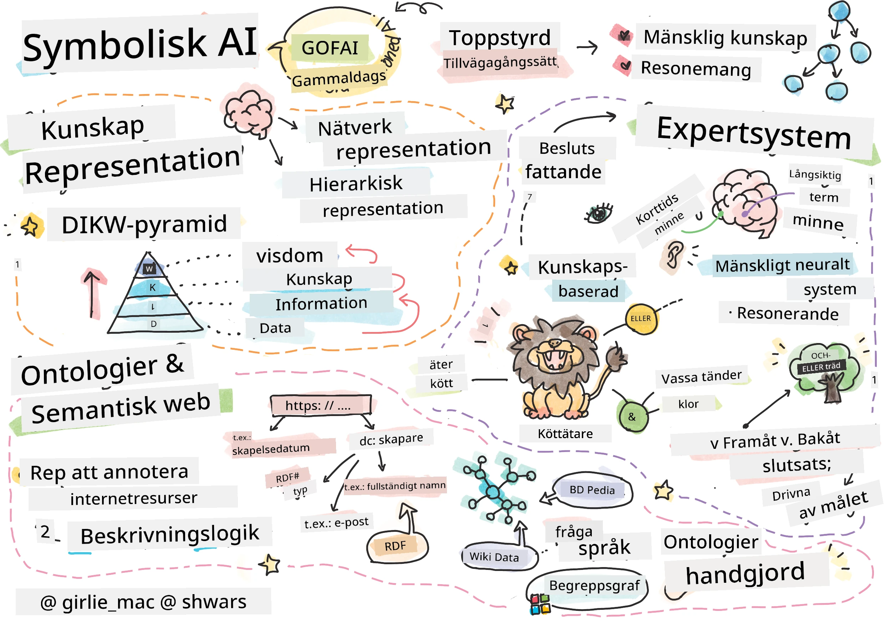
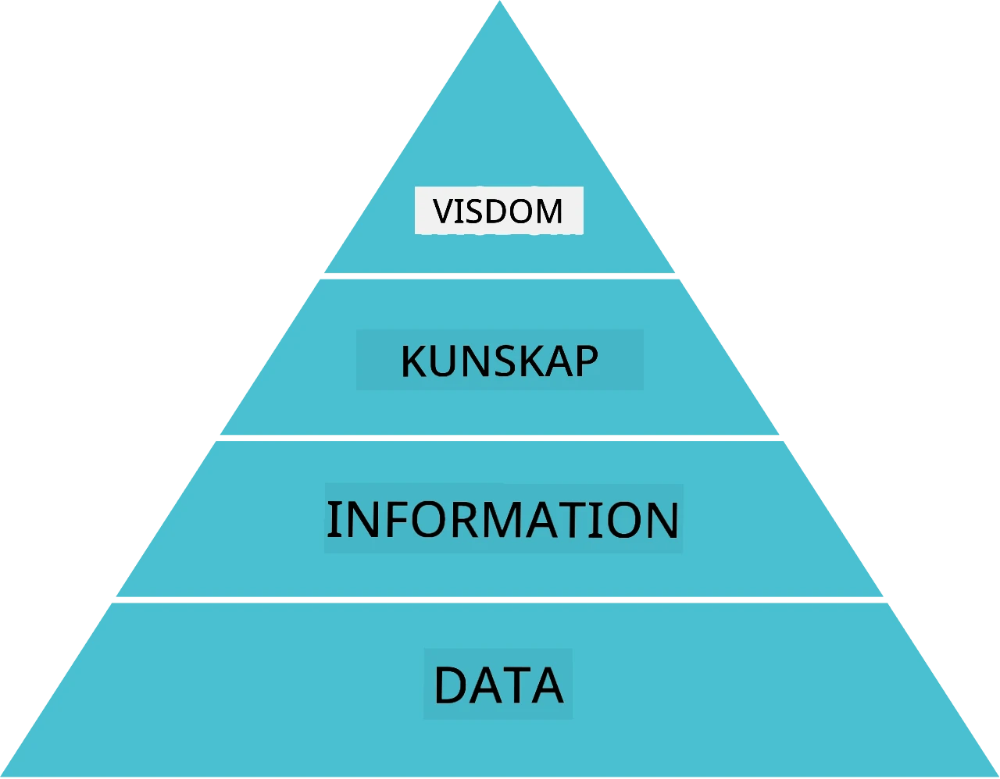
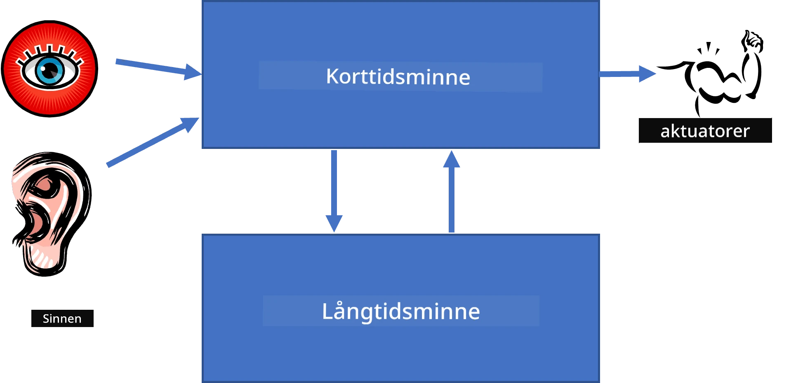
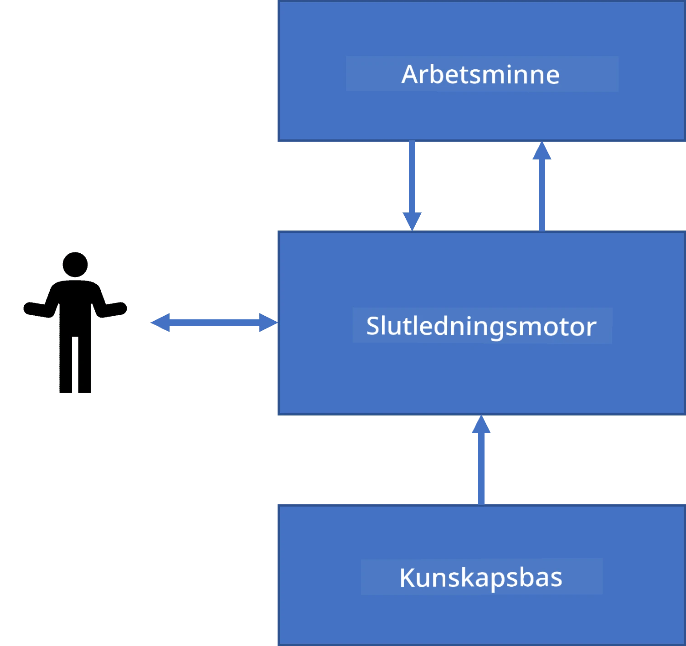
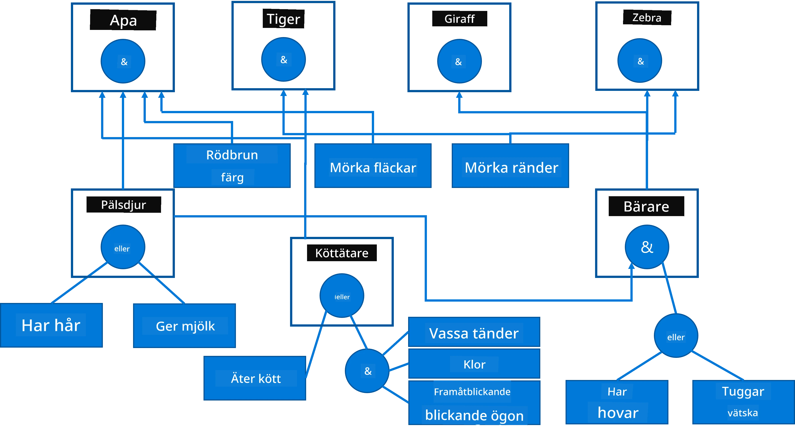
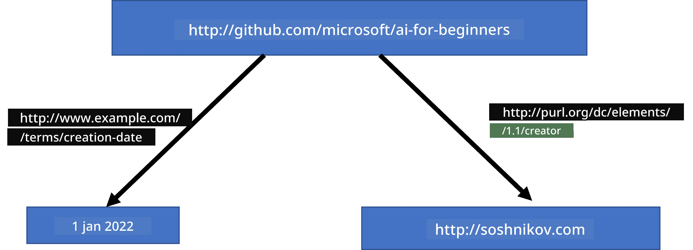
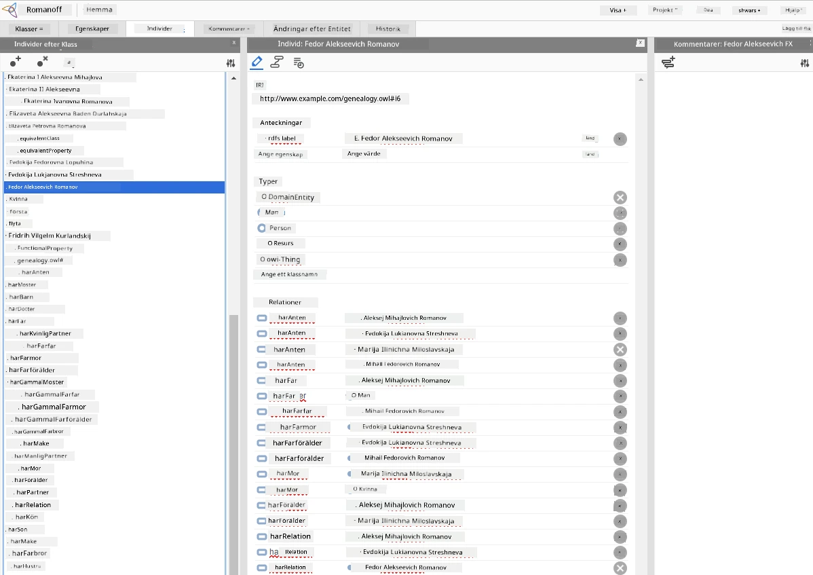

# Kunskapsrepresentation och expertsystem



> Sketchnote av [Tomomi Imura](https://twitter.com/girlie_mac)

Jakten på artificiell intelligens bygger på en sökning efter kunskap, för att skapa mening i världen på liknande sätt som människor gör. Men hur kan man gå till väga för detta?

## [För- föreläsningsquiz](https://ff-quizzes.netlify.app/en/ai/quiz/3)

I AI:s tidiga dagar var den top-down-baserade metoden för att skapa intelligenta system (diskuterad i föregående lektion) populär. Idén var att extrahera kunskap från människor till någon maskinläsbar form, och sedan använda den för att automatiskt lösa problem. Denna metod baserades på två stora idéer:

* Kunskapsrepresentation
* Resonemang

## Kunskapsrepresentation

Ett av de viktiga begreppen inom Symbolisk AI är **kunskap**. Det är viktigt att skilja kunskap från *information* eller *data*. Till exempel kan man säga att böcker innehåller kunskap, eftersom man kan studera böcker och bli expert. Men vad böcker egentligen innehåller kallas *data*, och genom att läsa böcker och integrera dessa data i vår världsmodell omvandlar vi data till kunskap.

> ✅ **Kunskap** är något som finns i vårt huvud och representerar vår förståelse av världen. Den erhålls genom en aktiv **inlärningsprocess**, som integrerar informationsbitar vi får till vår aktiva modell av världen.

Ofta definierar vi inte kunskap strikt, utan vi relaterar det till andra närliggande begrepp med hjälp av [DIKW Pyramid](https://en.wikipedia.org/wiki/DIKW_pyramid). Den innehåller följande begrepp:

* **Data** är något representerat i fysisk media, såsom skriven text eller talade ord. Data existerar oberoende av människor och kan överföras mellan personer.
* **Information** är hur vi tolkar data i vårt huvud. Till exempel, när vi hör ordet *dator*, har vi någon förståelse av vad det är.
* **Kunskap** är information som integrerats i vår världsmodell. Till exempel, när vi lär oss vad en dator är, får vi idéer om hur den fungerar, hur mycket den kostar och vad den kan användas till. Detta nätverk av sammanlänkade begrepp bildar vår kunskap.
* **Visdom** är en ytterligare nivå av vår förståelse av världen, och representerar *meta-kunskap*, t.ex. någon insikt om hur och när kunskapen bör användas.



*Bild [från Wikipedia](https://commons.wikimedia.org/w/index.php?curid=37705247), Av Longlivetheux - Egna arbeten, CC BY-SA 4.0*

Således är problemet med **kunskapsrepresentation** att finna ett effektivt sätt att representera kunskap i en dator i form av data, för att göra den automatiskt användbar. Detta kan ses som ett spektrum:


> Bild av [Dmitry Soshnikov](http://soshnikov.com)

* Till vänster finns mycket enkla typer av kunskapsrepresentationer som datorer kan använda effektivt. Den enklaste är algoritmisk, där kunskap representeras av ett datorprogram. Detta är dock inte det bästa sättet att representera kunskap, eftersom det inte är flexibelt. Kunskap i vårt huvud är ofta icke-algoritmisk.
* Till höger finns representationer som naturlig text. Det är den mest kraftfulla, men kan inte användas för automatiskt resonemang.

> ✅ Tänk en minut på hur du representerar kunskap i ditt huvud och omvandlar den till anteckningar. Finns det något särskilt format som fungerar bra för att hjälpa dig att minnas?

## Klassificering av datorbaserade kunskapsrepresentationer

Vi kan klassificera olika datorbaserade metoder för kunskapsrepresentation i följande kategorier:

* **Nätverksrepresentationer** baseras på att vi har ett nätverk av sammanlänkade begrepp i huvudet. Vi kan försöka reproducera samma nätverk som en graf i en dator – ett så kallat **semantiskt nätverk**.

1. **Objekt-Attribut-Värde-tripletter** eller **attribut-värde-par**. Eftersom en graf kan representeras i en dator som en lista av noder och kanter kan vi representera ett semantiskt nätverk med en lista av tripletter som innehåller objekt, attribut och värden. Exempelvis bygger vi följande tripletter om programmeringsspråk:

Objekt | Attribut | Värde  
-------|----------|------  
Python | är | Untyped-Language  
Python | uppfunnet-av | Guido van Rossum  
Python | block-syntax | indentering  
Untyped-Language | har inte | typedeklarationer  

> ✅ Fundera på hur tripletter kan användas för att representera andra typer av kunskap.

2. **Hierarkiska representationer** betonar att vi ofta skapar en hierarki av objekt i vårt huvud. Till exempel vet vi att kanariefågel är en fågel, och alla fåglar har vingar. Vi har också en uppfattning om vilken färg en kanariefågel brukar ha och dess flyghastighet.

   - **Ramrepresentation (frame)** baseras på att varje objekt eller objektklass representeras som en **ram** som innehåller **fack** (slots). Facken har möjliga standardvärden, värderestriktioner eller lagrade procedurer som kan anropas för att hämta ett värde. Alla ramar bildar en hierarki liknande en objektklasshierarki i objektorienterade programmeringsspråk.
   - **Scenarier** är en speciell typ av ramar som representerar komplexa situationer som kan utvecklas över tid.

**Python**

Fack | Värde | Standardvärde | Intervall |  
-----|-------|---------------|----------|  
Namn | Python | | |  
Är | Untyped-Language | | |  
Variabelstil | | CamelCase | |  
Programlängd | | | 5-5000 rader |  
Blocksyntax | Indent | | |  

3. **Procedurala representationer** baseras på att representera kunskap som en lista av åtgärder som kan utföras när ett visst villkor inträffar.
   - Produktionsregler är om-då-uttalanden som gör att vi kan dra slutsatser. Till exempel kan en läkare ha en regel som säger att **OM** en patient har hög feber **ELLER** hög nivå av C-reaktivt protein i blodtest **SÅ** har patienten inflammation. När vi stöter på ett av villkoren kan vi dra en slutsats om inflammation och använda den i fortsatta resonemang.
   - Algoritmer kan ses som en annan form av procedural representation, men de används nästan aldrig direkt i kunskapsbaserade system.

4. **Logik** föreslogs ursprungligen av Aristoteles som ett sätt att representera universell mänsklig kunskap.
   - Predikatlogik som matematisk teori är för rik för att kunna beräknas, därför används normalt en delmängd, som Horn-klasuler i Prolog.
   - Deskriptiv logik är en familj av logiska system som används för att representera och resonera om objektshierarkier och distribuerade kunskapsrepresentationer såsom *semantiskt web*.

## Expertsystem

En av de tidiga framgångarna för symbolisk AI var de så kallade **expertsystemen** – datasystem utformade för att agera som experter inom ett begränsat problemområde. De byggde på en **kunskapsbas** extraherad från en eller flera mänskliga experter, och innehöll en **slutledningsmotor** som utförde resonemang ovanpå den.

 | 
---------------------------------------------|------------------------------------------------
Förenklad struktur av ett mänskligt nervsystem | Arkitektur för ett kunskapsbaserat system

Expertsystem byggs som det mänskliga resonemangssystemet, som innehåller **korttidsminne** och **långtidsminne**. På liknande sätt skiljer vi inom kunskapsbaserade system följande komponenter:

* **Problemminne**: innehåller kunskap om det problem som för närvarande löses, t.ex. patientens temperatur eller blodtryck, om han har inflammation eller inte etc. Denna kunskap kallas även **statisk kunskap**, eftersom det är en ögonblicksbild av vad vi för närvarande vet om problemet – det så kallade *problemets tillstånd*.
* **Kunskapsbas**: representerar långtidskunskap om ett problemområde. Den extraheras manuellt från mänskliga experter och ändras inte mellan konsultationer. Eftersom den låter oss navigera från ett problemstillstånd till ett annat kallas den även **dynamisk kunskap**.
* **Slutledningsmotor**: orkestrerar hela processen att söka i problemets tillståndsrum, ställer frågor till användaren vid behov. Den ansvarar också för att hitta rätt regler att applicera på varje tillstånd.

Som exempel, låt oss betrakta följande expertsystem för att bestämma ett djur baserat på dess fysiska egenskaper:



> Bild av [Dmitry Soshnikov](http://soshnikov.com)

Detta diagram kallas för ett **AND-OR-träd** och är en grafisk representation av en uppsättning produktionsregler. Att rita ett träd är användbart i början när kunskap ska extraheras från experten. För att representera kunskap i datorn är det oftare lämpligare att använda regler:

```
IF the animal eats meat
OR (animal has sharp teeth
    AND animal has claws
    AND animal has forward-looking eyes
) 
THEN the animal is a carnivore
```
  
Du kan notera att varje villkor på vänstra sidan av regeln och åtgärden i princip är objekt-attribut-värde (OAV) tripletter. **Arbetsminnet** innehåller uppsättningen av OAV-tripletter som motsvarar det problem som för närvarande löses. En **regelmotor** söker efter regler vars villkor uppfylls och tillämpar dem, och lägger till en ny triplet i arbetsminnet.

> ✅ Skriv ditt eget AND-OR-träd om ett ämne som intresserar dig!

### Framåt- vs bakåtslutledning

Processen som beskrivs ovan kallas **framåtslutledning**. Den startar med viss initial data om problemet som finns i arbetsminnet och utför sedan följande resonemangsloop:

1. Om mål-attributet finns i arbetsminnet – stoppa och ge resultatet
2. Leta efter alla regler vars villkor för närvarande är uppfyllda – få en **konfliktsats** av regler.
3. Utför **konfliktlösning** – välj en regel som ska köras i detta steg. Det kan finnas olika strategier:
   - Välj den första tillämpliga regeln i kunskapsbasen
   - Välj en slumpmässig regel
   - Välj en *mer specifik* regel, d.v.s. den som uppfyller flest villkor i vänstra sidan (LHS)
4. Tillämpa vald regel och lägg till en ny kunskapsbit i problemets tillstånd
5. Upprepa från steg 1.

I vissa fall kanske man vill börja med tom kunskap om problemet och ställa frågor som hjälper oss att nå en slutsats. Till exempel vid medicinsk diagnos utförs vanligtvis inte alla medicinska analyser på förhand innan diagnos. Vi vill snarare göra analyser när ett beslut behöver fattas.

Denna process kan modelleras med **bakåtslutledning**. Den styrs av **målet** – det attributvärde vi söker:

1. Välj alla regler som kan ge mål-värdet (d.v.s. med målet på högersidan (RHS)) – konfliktmängd
2. Om det inte finns några regler för detta attribut, eller det finns en regel som säger att värdet ska frågas från användaren – fråga efter det, annars:
3. Använd konfliktlösningsstrategi för att välja en regel som används som *hypotes* – vi försöker bevisa den
4. Upprepa processen rekursivt för alla attribut i vänstra sidan av regeln som mål
5. Om processen misslyckas – använd en annan regel i steg 3

> ✅ I vilka situationer är framåtslutledning mest lämplig? Hur är det med bakåtslutledning?

### Implementering av expertsystem

Expertsystem kan implementeras med olika verktyg:

* Programmera dem direkt i något högnivåprogrammeringsspråk. Detta är inte bästa idén eftersom den största fördelen med ett kunskapsbaserat system är att kunskap separeras från slutsatsdragningsprocessen, och potentiellt ska en ämnesexpert kunna skriva regler utan att nödvändigtvis förstå inferensens detaljer.
* Använda ett **expertsystemskal**, alltså ett system speciellt utformat för att fyllas med kunskap via något kunskapsrepresentationsspråk.

## ✍️ Övning: Djurslutledning

Se [Animals.ipynb](https://github.com/microsoft/AI-For-Beginners/blob/main/lessons/2-Symbolic/Animals.ipynb) för ett exempel på implementering av framåt- och bakåtslutande expertsystem.

> **Notera**: Detta exempel är ganska enkelt och ger bara en idé om hur ett expertsystem ser ut. När du börjar skapa ett sådant system kommer du först att märka något *intelligent* beteende från det när du når ett visst antal regler, runt 200+. Vid en viss punkt blir regler för komplexa för att komma ihåg alla, och då kan du börja undra varför systemet gör vissa beslut. Men viktiga egenskaper hos kunskapsbaserade system är att du alltid kan *förklara* exakt hur ett beslut fattades.

## Ontologier och det semantiska webben

I slutet av 1900-talet fanns en initiativ för att använda kunskapsrepresentation för att annotera internetresurser, så att det skulle vara möjligt att hitta resurser som motsvarar mycket specifika frågor. Denna rörelse kallades **semantiskt web** och byggde på flera koncept:

- En särskild kunskapsrepresentation baserad på **[deskriptiv logik](https://en.wikipedia.org/wiki/Description_logic)** (DL). Den liknar ramkunskapsrepresentation eftersom den bygger en hierarki av objekt med egenskaper, men har formell logisk semantik och inferens. Det finns en hel familj av DL:er som balanserar mellan uttrycksfullhet och algoritmisk komplexitet i inferens.
- Distribuerad kunskapsrepresentation, där alla begrepp representeras av en global URI-identifikator vilket gör det möjligt att skapa kunskapshierarkier som sträcker sig över internet.
- En familj av XML-baserade språk för kunskapsbeskrivning: RDF (Resource Description Framework), RDFS (RDF Schema), OWL (Ontology Web Language).

Ett kärnbegrepp inom det semantiska webben är begreppet **Ontologi**. Det avser en explicit specifikation av ett problemområde med hjälp av någon formell kunskapsrepresentation. Den enklaste ontologin kan bara vara en hierarki av objekt i ett problemområde, men mer komplexa ontologier inkluderar regler som kan användas för slutsatser.

I det semantiska webben baseras alla representationer på tripletter. Varje objekt och varje relation identifieras unikt med URI. Till exempel, om vi vill ange faktumet att detta AI-läroplan har utvecklats av Dmitry Soshnikov den 1 januari 2022 – här är tripletterna vi kan använda:



```
http://github.com/microsoft/ai-for-beginners http://www.example.com/terms/creation-date “Jan 1, 2022”
http://github.com/microsoft/ai-for-beginners http://purl.org/dc/elements/1.1/creator http://soshnikov.com
```

> ✅ Här är `http://www.example.com/terms/creation-date` och `http://purl.org/dc/elements/1.1/creator` några välkända och universellt accepterade URI:er för att uttrycka begreppen *skapare* och *skapelsedatum*.

I ett mer komplext fall, om vi vill definiera en lista av skapare, kan vi använda vissa datastrukturer definierade i RDF.


> Diagram ovan av [Dmitry Soshnikov](http://soshnikov.com)

Utvecklingen av det semantiska webben fördröjdes delvis av framgången för sökmotorer och tekniker för naturlig språkbearbetning, som tillåter att extrahera strukturerad data från text. Men inom vissa områden pågår fortfarande betydande insatser för att underhålla ontologier och kunskapsbaser. Några projekt som är värda att nämna:

* [WikiData](https://wikidata.org/) är en samling maskinläsbara kunskapsbaser kopplade till Wikipedia. Mest data hämtas från Wikipedias *InfoBoxes*, delar av strukturerat innehåll inne i Wikipediasidor. Du kan [fråga](https://query.wikidata.org/) wikidata med SPARQL, ett speciellt frågespråk för det semantiska webben. Här är ett exempel som visar de vanligaste ögonfärgerna bland människor:

```sparql
#defaultView:BubbleChart
SELECT ?eyeColorLabel (COUNT(?human) AS ?count)
WHERE
{
  ?human wdt:P31 wd:Q5.       # human instance-of homo sapiens
  ?human wdt:P1340 ?eyeColor. # human eye-color ?eyeColor
  SERVICE wikibase:label { bd:serviceParam wikibase:language "en". }
}
GROUP BY ?eyeColorLabel
```

* [DBpedia](https://www.dbpedia.org/) är ett annat initiativ liknande WikiData.

> ✅ Om du vill experimentera med att bygga dina egna ontologier, eller öppna befintliga sådana, finns en utmärkt visuell ontologiredigerare kallad [Protégé](https://protege.stanford.edu/). Ladda ner den eller använd den online.



*Web Protégé-editor öppen med Romanov Family-ontologin. Skärmdump av Dmitry Soshnikov*

## ✍️ Övning: En familjeontologi

Se [FamilyOntology.ipynb](https://github.com/Ezana135/AI-For-Beginners/blob/main/lessons/2-Symbolic/FamilyOntology.ipynb) för ett exempel på hur man använder tekniker från det semantiska webben för att resonera om familjerelationer. Vi tar ett släktträd representerat i vanligt GEDCOM-format och en ontologi av familjerelationer och bygger en graf över alla familjerelationer för en given mängd individer.

## Microsoft Concept Graph

I de flesta fall skapas ontologier noggrant för hand. Det är dock också möjligt att **utvinna** ontologier från ostrukturerad data, till exempel från naturliga språkliga texter.

Ett sådant försök gjordes av Microsoft Research, vilket resulterade i [Microsoft Concept Graph](https://blogs.microsoft.com/ai/microsoft-researchers-release-graph-that-helps-machines-conceptualize/?WT.mc_id=academic-77998-cacaste).

Det är en stor samling entiteter grupperade med `is-a` ärftlighetsrelation. Den möjliggör att svara på frågor som "Vad är Microsoft?" – svaret kan vara något i stil med "ett företag med sannolikhet 0,87 och ett varumärke med sannolikhet 0,75".

Grafen finns tillgänglig som REST API eller som en stor nedladdningsbar textfil som listar alla entitetsparet.

## ✍️ Övning: En konceptgraf

Prova [MSConceptGraph.ipynb](https://github.com/microsoft/AI-For-Beginners/blob/main/lessons/2-Symbolic/MSConceptGraph.ipynb) för att se hur vi kan använda Microsoft Concept Graph för att gruppera nyhetsartiklar i olika kategorier.

## Slutsats

Numera betraktas AI ofta som ett synonym för *Maskininlärning* eller *Neurala nätverk*. Men en människa uppvisar också explicit resonemang, vilket är något som neurala nätverk för närvarande inte hanterar. I verkliga världens projekt används explicit resonemang fortfarande för att utföra uppgifter som kräver förklaringar, eller för att kunna modifiera systemets beteende på ett kontrollerat sätt.

## 🚀 Utmaning

I Family Ontology-notebooken kopplad till denna lektion finns möjlighet att experimentera med andra familjerelationer. Försök att upptäcka nya samband mellan personer i släktträdet.

## [Quiz efter föreläsning](https://ff-quizzes.netlify.app/en/ai/quiz/4)

## Genomgång & Självstudier

Gör en undersökning på internet för att upptäcka områden där människor försökt kvantifiera och kodifiera kunskap. Ta en titt på Blooms taxonomi och gå tillbaka i historien för att lära dig hur människor försökte förstå sin värld. Utforska Linnés arbete med att skapa en taxonomi av organismer och studera hur Dmitrij Mendelejev skapade ett sätt att beskriva och gruppera kemiska element. Vilka andra intressanta exempel kan du hitta?

**Uppgift**: [Bygg en ontologi](assignment.md)

---

<!-- CO-OP TRANSLATOR DISCLAIMER START -->
**Ansvarsfriskrivning**:
Detta dokument har översatts med hjälp av AI-översättningstjänsten [Co-op Translator](https://github.com/Azure/co-op-translator). Trots att vi strävar efter noggrannhet, var vänlig observera att automatiska översättningar kan innehålla fel eller brister. Det ursprungliga dokumentet på dess modersmål bör betraktas som den auktoritativa källan. För kritisk information rekommenderas professionell mänsklig översättning. Vi ansvarar inte för några missförstånd eller feltolkningar som uppstår till följd av användningen av denna översättning.
<!-- CO-OP TRANSLATOR DISCLAIMER END -->