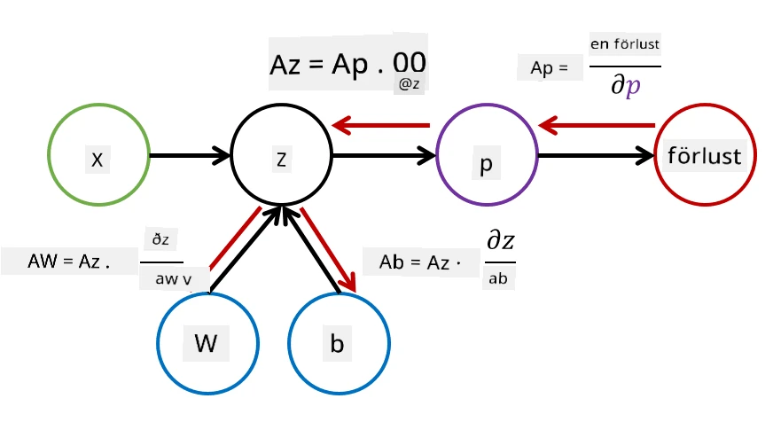

# Introduktion till neurala nätverk. Flerlagers perceptron

I föregående avsnitt lärde du dig om den enklaste modellen för neurala nätverk – en enlagers perceptron, en linjär tvåklassklassificeringsmodell.

I detta avsnitt kommer vi att utöka denna modell till en mer flexibel ram, vilket gör det möjligt för oss att:

* utföra **flervalsklassificering** utöver tvåklassklassificering  
* lösa **regressionsproblem** utöver klassificering  
* separera klasser som inte är linjärt separerbara  

Vi kommer också att utveckla vår egen modulära ram i Python som gör det möjligt för oss att konstruera olika arkitekturer för neurala nätverk.

## [Förtest](https://ff-quizzes.netlify.app/en/ai/quiz/7)

## Formalisering av maskininlärning

Låt oss börja med att formalisera problemet med maskininlärning. Anta att vi har ett träningsdataset **X** med etiketter **Y**, och vi behöver bygga en modell *f* som gör de mest exakta förutsägelserna. Kvaliteten på förutsägelserna mäts med hjälp av en **förlustfunktion** &lagran;. Följande förlustfunktioner används ofta:

* För regressionsproblem, när vi behöver förutsäga ett tal, kan vi använda **absolut fel** &sum;i|f(x(i))-y(i)|, eller **kvadratiskt fel** &sum;i(f(x(i))-y(i))2  
* För klassificering använder vi **0-1-förlust** (vilket i princip är detsamma som modellens **noggrannhet**) eller **logistisk förlust**.

För en enlagers perceptron definierades funktionen *f* som en linjär funktion *f(x)=wx+b* (här är *w* viktmatrisen, *x* är vektorn av indataegenskaper, och *b* är biasvektorn). För olika arkitekturer av neurala nätverk kan denna funktion anta en mer komplex form.

> Vid klassificering är det ofta önskvärt att få sannolikheter för motsvarande klasser som nätverkets utdata. För att omvandla godtyckliga tal till sannolikheter (t.ex. för att normalisera utdatan) använder vi ofta **softmax**-funktionen &sigma;, och funktionen *f* blir *f(x)=&sigma;(wx+b)*.

I definitionen av *f* ovan kallas *w* och *b* för **parametrar** &theta;=⟨*w,b*⟩. Givet datasetet ⟨**X**,**Y**⟩ kan vi beräkna ett totalt fel för hela datasetet som en funktion av parametrarna &theta;.

> ✅ **Målet med träning av neurala nätverk är att minimera felet genom att variera parametrarna &theta;**

## Optimering med gradientnedstigning

Det finns en välkänd metod för funktionsoptimering som kallas **gradientnedstigning**. Idén är att vi kan beräkna en derivata (i flerdimensionella fall kallad **gradient**) av förlustfunktionen med avseende på parametrarna och variera parametrarna på ett sätt som minskar felet. Detta kan formaliseras enligt följande:

* Initiera parametrarna med några slumpmässiga värden w(0), b(0)  
* Upprepa följande steg många gånger:  
    - w(i+1) = w(i)-&eta;&part;&lagran;/&part;w  
    - b(i+1) = b(i)-&eta;&part;&lagran;/&part;b  

Under träningen ska optimeringsstegen beräknas med hänsyn till hela datasetet (kom ihåg att förlusten beräknas som en summa över alla träningsprover). Men i praktiken tar vi små delar av datasetet som kallas **minibatcher** och beräknar gradienter baserat på ett delmängd av data. Eftersom delmängden väljs slumpmässigt varje gång kallas denna metod för **stokastisk gradientnedstigning** (SGD).

## Flerlagers perceptron och backpropagation

Ett enlagers nätverk, som vi har sett ovan, kan klassificera linjärt separerbara klasser. För att bygga en rikare modell kan vi kombinera flera lager i nätverket. Matematiskt innebär det att funktionen *f* får en mer komplex form och beräknas i flera steg:
* z1=w1x+b1  
* z2=w2&alpha;(z1)+b2  
* f = &sigma;(z2)  

Här är &alpha; en **icke-linjär aktiveringsfunktion**, &sigma; är en softmax-funktion, och parametrarna är &theta;=<*w1,b1,w2,b2*>.

Gradientnedstigningsalgoritmen förblir densamma, men det blir svårare att beräkna gradienterna. Med hjälp av kedjeregeln för derivator kan vi beräkna derivatorna som:

* &part;&lagran;/&part;w2 = (&part;&lagran;/&part;&sigma;)(&part;&sigma;/&part;z2)(&part;z2/&part;w2)  
* &part;&lagran;/&part;w1 = (&part;&lagran;/&part;&sigma;)(&part;&sigma;/&part;z2)(&part;z2/&part;&alpha;)(&part;&alpha;/&part;z1)(&part;z1/&part;w1)  

> ✅ Kedjeregeln används för att beräkna derivator av förlustfunktionen med avseende på parametrarna.

Observera att den vänstra delen av alla dessa uttryck är densamma, och därför kan vi effektivt beräkna derivatorna genom att börja från förlustfunktionen och gå "bakåt" genom beräkningsgrafen. Därför kallas metoden för att träna ett flerlagers perceptron för **backpropagation**, eller 'backprop'.

> TODO: bildcitering

> ✅ Vi kommer att gå igenom backpropagation mycket mer detaljerat i vårt notebook-exempel.  

## Slutsats

I denna lektion har vi byggt vårt eget bibliotek för neurala nätverk och använt det för en enkel tvådimensionell klassificeringsuppgift.

## 🚀 Utmaning

I den medföljande notebooken kommer du att implementera din egen ram för att bygga och träna flerlagers perceptron. Du kommer att kunna se i detalj hur moderna neurala nätverk fungerar.

Gå vidare till [OwnFramework](OwnFramework.ipynb) och arbeta igenom den.

## [Eftertest](https://ff-quizzes.netlify.app/en/ai/quiz/8)

## Granskning och självstudier

Backpropagation är en vanlig algoritm som används inom AI och ML, och det är värt att studera [mer i detalj](https://wikipedia.org/wiki/Backpropagation).

## [Uppgift](lab/README.md)

I detta labb ombeds du använda den ram du konstruerade i denna lektion för att lösa klassificering av handskrivna siffror i MNIST-datasetet.

* [Instruktioner](lab/README.md)  
* [Notebook](lab/MyFW_MNIST.ipynb)  

---

