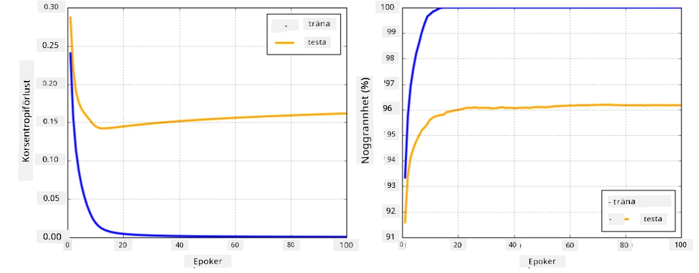

# Ramverk för neurala nätverk

Som vi redan har lärt oss, för att kunna träna neurala nätverk effektivt behöver vi göra två saker:

* Arbeta med tensorer, t.ex. multiplicera, addera och beräkna funktioner som sigmoid eller softmax.
* Beräkna gradienter för alla uttryck för att kunna utföra gradientnedstigningsoptimering.

## [Förtest](https://ff-quizzes.netlify.app/en/ai/quiz/9)

Medan biblioteket `numpy` kan hantera den första delen, behöver vi en mekanism för att beräkna gradienter. I [vårt ramverk](../04-OwnFramework/OwnFramework.ipynb) som vi utvecklade i föregående avsnitt var vi tvungna att manuellt programmera alla derivatafunktioner i metoden `backward`, som utför backpropagation. Idealt sett bör ett ramverk ge oss möjlighet att beräkna gradienter för *vilket uttryck som helst* som vi kan definiera.

En annan viktig aspekt är att kunna utföra beräkningar på GPU eller andra specialiserade beräkningsenheter, som [TPU](https://en.wikipedia.org/wiki/Tensor_Processing_Unit). Träning av djupa neurala nätverk kräver *väldigt mycket* beräkningar, och att kunna parallellisera dessa beräkningar på GPU:er är mycket viktigt.

> ✅ Begreppet 'parallellisera' betyder att fördela beräkningarna över flera enheter.

De två mest populära ramverken för neurala nätverk idag är: [TensorFlow](http://TensorFlow.org) och [PyTorch](https://pytorch.org/). Båda erbjuder ett låg-nivå API för att arbeta med tensorer på både CPU och GPU. Utöver låg-nivå API finns det också hög-nivå API, kallade [Keras](https://keras.io/) respektive [PyTorch Lightning](https://pytorchlightning.ai/).

Låg-nivå API | [TensorFlow](http://TensorFlow.org) | [PyTorch](https://pytorch.org/)
-------------|-------------------------------------|--------------------------------
Hög-nivå API | [Keras](https://keras.io/) | [PyTorch Lightning](https://pytorchlightning.ai/)

**Låg-nivå API** i båda ramverken låter dig bygga så kallade **beräkningsgrafer**. Denna graf definierar hur man beräknar utdata (vanligtvis förlustfunktionen) med givna indata och kan skickas för beräkning på GPU, om sådan finns tillgänglig. Det finns funktioner för att differentiera denna beräkningsgraf och beräkna gradienter, som sedan kan användas för att optimera modellparametrar.

**Hög-nivå API** betraktar i stort sett neurala nätverk som en **sekvens av lager**, vilket gör konstruktionen av de flesta neurala nätverk mycket enklare. Att träna modellen kräver vanligtvis att man förbereder data och sedan anropar en `fit`-funktion för att utföra jobbet.

Hög-nivå API gör det möjligt att snabbt konstruera typiska neurala nätverk utan att behöva oroa sig för många detaljer. Samtidigt erbjuder låg-nivå API mycket mer kontroll över träningsprocessen och används därför ofta inom forskning, när man arbetar med nya arkitekturer för neurala nätverk.

Det är också viktigt att förstå att du kan använda båda API:erna tillsammans, t.ex. kan du utveckla din egen nätverkslagerarkitektur med låg-nivå API och sedan använda den i ett större nätverk som konstrueras och tränas med hög-nivå API. Eller så kan du definiera ett nätverk med hög-nivå API som en sekvens av lager och sedan använda din egen låg-nivå träningsloop för att utföra optimering. Båda API:erna bygger på samma grundläggande koncept och är designade för att fungera bra tillsammans.

## Lärande

I den här kursen erbjuder vi det mesta av innehållet både för PyTorch och TensorFlow. Du kan välja ditt föredragna ramverk och endast gå igenom motsvarande anteckningsböcker. Om du inte är säker på vilket ramverk du ska välja, läs några diskussioner på internet om **PyTorch vs. TensorFlow**. Du kan också titta på båda ramverken för att få en bättre förståelse.

Där det är möjligt kommer vi att använda hög-nivå API för enkelhetens skull. Men vi anser att det är viktigt att förstå hur neurala nätverk fungerar från grunden, så i början börjar vi med att arbeta med låg-nivå API och tensorer. Om du däremot vill komma igång snabbt och inte vill spendera mycket tid på att lära dig dessa detaljer, kan du hoppa över dem och gå direkt till anteckningsböckerna för hög-nivå API.

## ✍️ Övningar: Ramverk

Fortsätt ditt lärande i följande anteckningsböcker:

Låg-nivå API | [TensorFlow+Keras Notebook](IntroKerasTF.ipynb) | [PyTorch](IntroPyTorch.ipynb)
-------------|-------------------------------------|--------------------------------
Hög-nivå API | [Keras](IntroKeras.ipynb) | *PyTorch Lightning*

Efter att ha bemästrat ramverken, låt oss repetera begreppet överanpassning.

# Överanpassning

Överanpassning är ett extremt viktigt koncept inom maskininlärning, och det är mycket viktigt att förstå det rätt!

Tänk på följande problem med att approximera 5 punkter (representerade av `x` på graferna nedan):

 | 
-------------------------|--------------------------
**Linjär modell, 2 parametrar** | **Icke-linjär modell, 7 parametrar**
Träningsfel = 5.3 | Träningsfel = 0
Valideringsfel = 5.1 | Valideringsfel = 20

* Till vänster ser vi en bra rak linje-approximation. Eftersom antalet parametrar är tillräckligt, fångar modellen korrekt punkternas fördelning.
* Till höger är modellen för kraftfull. Eftersom vi bara har 5 punkter och modellen har 7 parametrar, kan den justeras så att den passerar genom alla punkter, vilket gör träningsfelet till 0. Detta hindrar dock modellen från att förstå det korrekta mönstret i data, vilket resulterar i ett mycket högt valideringsfel.

Det är mycket viktigt att hitta en korrekt balans mellan modellens komplexitet (antal parametrar) och antalet träningsprover.

## Varför överanpassning uppstår

  * För lite träningsdata
  * För kraftfull modell
  * För mycket brus i indata

## Hur man upptäcker överanpassning

Som du kan se från grafen ovan kan överanpassning upptäckas genom ett mycket lågt träningsfel och ett högt valideringsfel. Normalt under träning ser vi både tränings- och valideringsfel minska, och sedan vid någon punkt kan valideringsfelet sluta minska och börja öka. Detta är ett tecken på överanpassning och en indikation på att vi förmodligen bör sluta träna vid denna punkt (eller åtminstone spara en ögonblicksbild av modellen).

## Hur man förhindrar överanpassning

Om du märker att överanpassning uppstår kan du göra något av följande:

 * Öka mängden träningsdata
 * Minska modellens komplexitet
 * Använd någon [regulariseringsteknik](../../4-ComputerVision/08-TransferLearning/TrainingTricks.md), som [Dropout](../../4-ComputerVision/08-TransferLearning/TrainingTricks.md#Dropout), vilket vi kommer att gå igenom senare.

## Överanpassning och Bias-Variance-avvägning

Överanpassning är faktiskt ett fall av ett mer generellt problem inom statistik som kallas [Bias-Variance-avvägning](https://en.wikipedia.org/wiki/Bias%E2%80%93variance_tradeoff). Om vi betraktar möjliga felkällor i vår modell kan vi se två typer av fel:

* **Bias-fel** orsakas av att vår algoritm inte kan fånga relationen mellan träningsdata korrekt. Det kan bero på att vår modell inte är tillräckligt kraftfull (**underanpassning**).
* **Variansfel**, som orsakas av att modellen approximera brus i indata istället för meningsfulla relationer (**överanpassning**).

Under träning minskar bias-fel (eftersom vår modell lär sig att approximera data), och variansfel ökar. Det är viktigt att sluta träna - antingen manuellt (när vi upptäcker överanpassning) eller automatiskt (genom att införa regularisering) - för att förhindra överanpassning.

## Slutsats

I denna lektion lärde du dig om skillnaderna mellan de olika API:erna för de två mest populära AI-ramverken, TensorFlow och PyTorch. Dessutom lärde du dig om ett mycket viktigt ämne, överanpassning.

## 🚀 Utmaning

I de medföljande anteckningsböckerna hittar du 'uppgifter' längst ner; arbeta igenom anteckningsböckerna och slutför uppgifterna.

## [Eftertest](https://ff-quizzes.netlify.app/en/ai/quiz/10)

## Granskning & Självstudier

Gör lite forskning om följande ämnen:

- TensorFlow
- PyTorch
- Överanpassning

Ställ dig själv följande frågor:

- Vad är skillnaden mellan TensorFlow och PyTorch?
- Vad är skillnaden mellan överanpassning och underanpassning?

## [Uppgift](lab/README.md)

I denna labb ska du lösa två klassificeringsproblem med hjälp av enkla och flerskiktade fullt anslutna nätverk med PyTorch eller TensorFlow.

* [Instruktioner](lab/README.md)
* [Anteckningsbok](lab/LabFrameworks.ipynb)

---

