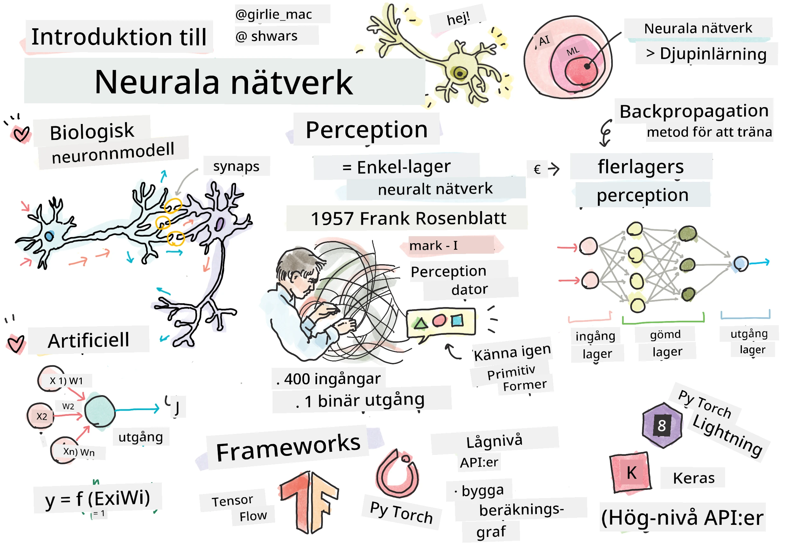
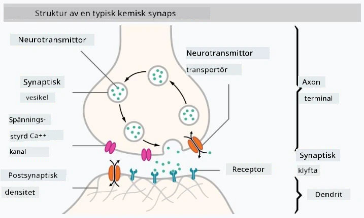
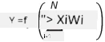

# Introduktion till neurala nätverk

Som vi diskuterade i introduktionen är ett av sätten att uppnå intelligens att träna en **datormodell** eller en **artificiell hjärna**. Sedan mitten av 1900-talet har forskare testat olika matematiska modeller, och på senare år har denna riktning visat sig vara mycket framgångsrik. Sådana matematiska modeller av hjärnan kallas **neurala nätverk**.

> Ibland kallas neurala nätverk för *Artificiella Neurala Nätverk*, ANNs, för att indikera att vi pratar om modeller, inte verkliga nätverk av neuroner.

## Maskininlärning

Neurala nätverk är en del av en större disciplin som kallas **Maskininlärning**, vars mål är att använda data för att träna datormodeller som kan lösa problem. Maskininlärning utgör en stor del av artificiell intelligens, men vi täcker inte klassisk ML i denna kursplan.

> Besök vår separata **[Maskininlärning för nybörjare](http://github.com/microsoft/ml-for-beginners)** kursplan för att lära dig mer om klassisk maskininlärning.

Inom maskininlärning antar vi att vi har en dataset med exempel **X** och motsvarande utgångsvärden **Y**. Exempel är ofta N-dimensionella vektorer som består av **egenskaper**, och utgångarna kallas **etiketter**.

Vi kommer att titta på de två vanligaste problemen inom maskininlärning:

* **Klassificering**, där vi behöver klassificera ett inmatningsobjekt i två eller fler klasser.
* **Regression**, där vi behöver förutsäga ett numeriskt värde för varje inmatningsprov.

> När man representerar indata och utdata som tensorer är datasetet för indata en matris av storlek M&times;N, där M är antalet prover och N är antalet egenskaper. Utgångsetiketter Y är en vektor av storlek M.

I denna kursplan kommer vi endast att fokusera på modeller för neurala nätverk.

## En modell av en neuron

Från biologin vet vi att vår hjärna består av nervceller (neuroner), var och en med flera "ingångar" (dendriter) och en enda "utgång" (axon). Både dendriter och axoner kan leda elektriska signaler, och kopplingarna mellan dem — kända som synapser — kan uppvisa varierande grad av ledningsförmåga, som regleras av neurotransmittorer.

 | 
----|----
Verklig neuron *([Bild](https://en.wikipedia.org/wiki/Synapse#/media/File:SynapseSchematic_lines.svg) från Wikipedia)* | Artificiell neuron *(Bild av författaren)*

Således innehåller den enklaste matematiska modellen av en neuron flera ingångar X1, ..., XN och en utgång Y, samt en serie vikter W1, ..., WN. En utgång beräknas som:

där f är någon icke-linjär **aktiveringsfunktion**.

> Tidiga modeller av neuroner beskrevs i den klassiska artikeln [A logical calculus of the ideas immanent in nervous activity](https://www.cs.cmu.edu/~./epxing/Class/10715/reading/McCulloch.and.Pitts.pdf) av Warren McCullock och Walter Pitts år 1943. Donald Hebb föreslog i sin bok "[The Organization of Behavior: A Neuropsychological Theory](https://books.google.com/books?id=VNetYrB8EBoC)" hur dessa nätverk kan tränas.

## I denna sektion

I denna sektion kommer vi att lära oss om:
* [Perceptron](03-Perceptron/README.md), en av de tidigaste modellerna för neurala nätverk för tvåklassklassificering
* [Flerlagers nätverk](04-OwnFramework/README.md) med en tillhörande notebook [hur man bygger vårt eget ramverk](04-OwnFramework/OwnFramework.ipynb)
* [Ramverk för neurala nätverk](05-Frameworks/README.md), med dessa notebooks: [PyTorch](05-Frameworks/IntroPyTorch.ipynb) och [Keras/Tensorflow](05-Frameworks/IntroKerasTF.ipynb)
* [Överanpassning](../../../../lessons/3-NeuralNetworks/05-Frameworks)

---

**Ansvarsfriskrivning**:  
Detta dokument har översatts med hjälp av AI-översättningstjänsten [Co-op Translator](https://github.com/Azure/co-op-translator). Även om vi strävar efter noggrannhet, vänligen notera att automatiska översättningar kan innehålla fel eller felaktigheter. Det ursprungliga dokumentet på dess originalspråk bör betraktas som den auktoritativa källan. För kritisk information rekommenderas professionell mänsklig översättning. Vi ansvarar inte för eventuella missförstånd eller feltolkningar som uppstår vid användning av denna översättning.