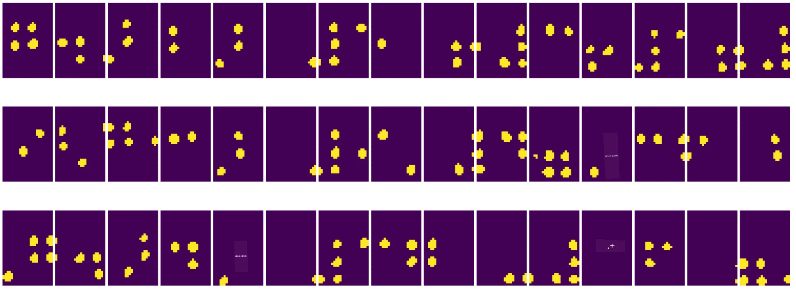

# Introduktion till datorseende

[Computer Vision](https://wikipedia.org/wiki/Computer_vision) är ett område som syftar till att ge datorer en hög nivå av förståelse för digitala bilder. Detta är en ganska bred definition, eftersom *förståelse* kan innebära många olika saker, inklusive att hitta ett objekt på en bild (**objektdetektion**), förstå vad som händer (**händelsedetektion**), beskriva en bild i text eller rekonstruera en scen i 3D. Det finns också specifika uppgifter relaterade till bilder av människor: ålders- och känsloestimering, ansiktsdetektion och identifiering, samt 3D-positionsestimering, för att nämna några.

## [Quiz före föreläsningen](https://ff-quizzes.netlify.app/en/ai/quiz/11)

En av de enklaste uppgifterna inom datorseende är **bildklassificering**.

Datorseende anses ofta vara en gren av AI. Idag löses de flesta uppgifter inom datorseende med hjälp av neurala nätverk. Vi kommer att lära oss mer om den speciella typen av neurala nätverk som används för datorseende, [konvolutionella neurala nätverk](../07-ConvNets/README.md), under denna sektion.

Men innan du skickar en bild till ett neuralt nätverk kan det i många fall vara vettigt att använda vissa algoritmiska tekniker för att förbättra bilden.

Det finns flera Python-bibliotek tillgängliga för bildbehandling:

* **[imageio](https://imageio.readthedocs.io/en/stable/)** kan användas för att läsa/skriva olika bildformat. Det stöder också ffmpeg, ett användbart verktyg för att konvertera videoramar till bilder.
* **[Pillow](https://pillow.readthedocs.io/en/stable/index.html)** (även känt som PIL) är lite mer kraftfullt och stöder även viss bildmanipulation som morfning, palettjusteringar och mer.
* **[OpenCV](https://opencv.org/)** är ett kraftfullt bildbehandlingsbibliotek skrivet i C++, som har blivit standard för bildbehandling. Det har ett bekvämt Python-gränssnitt.
* **[dlib](http://dlib.net/)** är ett C++-bibliotek som implementerar många maskininlärningsalgoritmer, inklusive några av datorseendealgoritmerna. Det har också ett Python-gränssnitt och kan användas för utmanande uppgifter som ansikts- och ansiktslandmärkesdetektion.

## OpenCV

[OpenCV](https://opencv.org/) anses vara standard för bildbehandling. Det innehåller många användbara algoritmer, implementerade i C++. Du kan också använda OpenCV från Python.

En bra plats att lära sig OpenCV är [denna Learn OpenCV-kurs](https://learnopencv.com/getting-started-with-opencv/). I vår kursplan är målet inte att lära sig OpenCV, utan att visa några exempel på när det kan användas och hur.

### Ladda bilder

Bilder i Python kan bekvämt representeras av NumPy-arrayer. Till exempel skulle gråskalebilder med storleken 320x200 pixlar lagras i en 200x320-array, och färgbilder med samma dimension skulle ha formen 200x320x3 (för 3 färgkanaler). För att ladda en bild kan du använda följande kod:

```python
import cv2
import matplotlib.pyplot as plt

im = cv2.imread('image.jpeg')
plt.imshow(im)
```

Traditionellt använder OpenCV BGR (Blå-Grön-Röd) kodning för färgbilder, medan resten av Python-verktygen använder den mer traditionella RGB (Röd-Grön-Blå). För att bilden ska se rätt ut måste du konvertera den till RGB-färgrymden, antingen genom att byta dimensioner i NumPy-arrayen eller genom att kalla en OpenCV-funktion:

```python
im = cv2.cvtColor(im,cv2.COLOR_BGR2RGB)
```

Samma `cvtColor`-funktion kan användas för att utföra andra färgrymdstransformationer, såsom att konvertera en bild till gråskala eller till HSV (Hue-Saturation-Value) färgrymden.

Du kan också använda OpenCV för att ladda videor bildruta för bildruta - ett exempel ges i övningen [OpenCV Notebook](OpenCV.ipynb).

### Bildbehandling

Innan du matar en bild till ett neuralt nätverk kan du vilja tillämpa flera förbehandlingssteg. OpenCV kan göra många saker, inklusive:

* **Ändra storlek** på bilden med `im = cv2.resize(im, (320,200),interpolation=cv2.INTER_LANCZOS)`
* **Suddighet** på bilden med `im = cv2.medianBlur(im,3)` eller `im = cv2.GaussianBlur(im, (3,3), 0)`
* Ändra **ljusstyrka och kontrast** på bilden kan göras med NumPy-arraymanipulationer, som beskrivs [i denna Stackoverflow-notis](https://stackoverflow.com/questions/39308030/how-do-i-increase-the-contrast-of-an-image-in-python-opencv).
* Använda [tröskling](https://docs.opencv.org/4.x/d7/d4d/tutorial_py_thresholding.html) genom att kalla `cv2.threshold`/`cv2.adaptiveThreshold`-funktioner, vilket ofta är att föredra framför att justera ljusstyrka eller kontrast.
* Tillämpa olika [transformationer](https://docs.opencv.org/4.5.5/da/d6e/tutorial_py_geometric_transformations.html) på bilden:
    - **[Affina transformationer](https://docs.opencv.org/4.5.5/d4/d61/tutorial_warp_affine.html)** kan vara användbara om du behöver kombinera rotation, storleksändring och skevhet på bilden och du vet käll- och destinationspositionen för tre punkter i bilden. Affina transformationer håller parallella linjer parallella.
    - **[Perspektivtransformationer](https://medium.com/analytics-vidhya/opencv-perspective-transformation-9edffefb2143)** kan vara användbara när du vet käll- och destinationspositionen för fyra punkter i bilden. Till exempel, om du tar en bild av ett rektangulärt dokument med en smartphonekamera från en viss vinkel och vill göra en rektangulär bild av själva dokumentet.
* Förstå rörelse i bilden genom att använda **[optisk flöde](https://docs.opencv.org/4.5.5/d4/dee/tutorial_optical_flow.html)**.

## Exempel på användning av datorseende

I vår [OpenCV Notebook](OpenCV.ipynb) ger vi några exempel på när datorseende kan användas för att utföra specifika uppgifter:

* **Förbehandling av ett fotografi av en Braille-bok**. Vi fokuserar på hur vi kan använda tröskling, funktionsdetektion, perspektivtransformation och NumPy-manipulationer för att separera individuella Braille-symboler för vidare klassificering av ett neuralt nätverk.

 |  | 
----|-----|-----

> Bild från [OpenCV.ipynb](OpenCV.ipynb)

* **Detektera rörelse i video med hjälp av bildruteskillnad**. Om kameran är fast, bör bildrutor från kameraflödet vara ganska lika varandra. Eftersom bildrutor representeras som arrayer, kan vi genom att subtrahera dessa arrayer för två efterföljande bildrutor få pixeldifferensen, som bör vara låg för statiska bildrutor och bli högre när det finns betydande rörelse i bilden.


> Bild från [OpenCV.ipynb](OpenCV.ipynb)

* **Detektera rörelse med hjälp av optiskt flöde**. [Optiskt flöde](https://docs.opencv.org/3.4/d4/dee/tutorial_optical_flow.html) gör det möjligt för oss att förstå hur individuella pixlar på videobildrutor rör sig. Det finns två typer av optiskt flöde:

   - **Tätt optiskt flöde** beräknar vektorfältet som visar för varje pixel var den rör sig.
   - **Gles optiskt flöde** baseras på att ta några distinkta funktioner i bilden (t.ex. kanter) och bygga deras bana från bildruta till bildruta.


> Bild från [OpenCV.ipynb](OpenCV.ipynb)

## ✍️ Exempel Notebooks: OpenCV [prova OpenCV i praktiken](OpenCV.ipynb)

Låt oss göra några experiment med OpenCV genom att utforska [OpenCV Notebook](OpenCV.ipynb)

## Slutsats

Ibland kan relativt komplexa uppgifter som rörelsedetektion eller fingertoppsdetektion lösas enbart med datorseende. Därför är det mycket användbart att känna till de grundläggande teknikerna inom datorseende och vad bibliotek som OpenCV kan göra.

## 🚀 Utmaning

Titta på [denna video](https://docs.microsoft.com/shows/ai-show/ai-show--2021-opencv-ai-competition--grand-prize-winners--cortic-tigers--episode-32?WT.mc_id=academic-77998-cacaste) från AI-showen för att lära dig om Cortic Tigers-projektet och hur de byggde en blockbaserad lösning för att demokratisera datorseendeuppgifter via en robot. Gör lite forskning om andra projekt som detta som hjälper nya lärande att komma in i området.

## [Quiz efter föreläsningen](https://ff-quizzes.netlify.app/en/ai/quiz/12)

## Granskning & Självstudier

Läs mer om optiskt flöde [i denna utmärkta handledning](https://learnopencv.com/optical-flow-in-opencv/).

## [Uppgift](lab/README.md)

I detta labb kommer du att ta en video med enkla gester, och ditt mål är att extrahera upp/ner/vänster/höger rörelser med hjälp av optiskt flöde.


---

