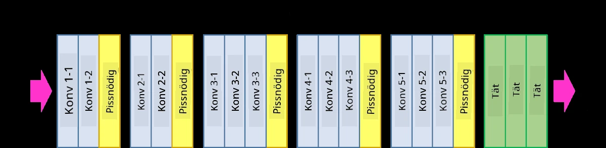
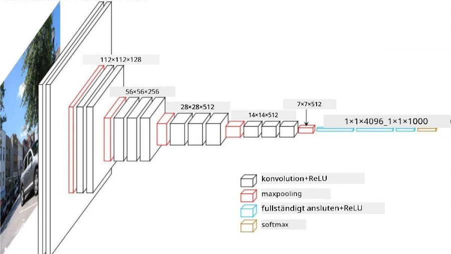
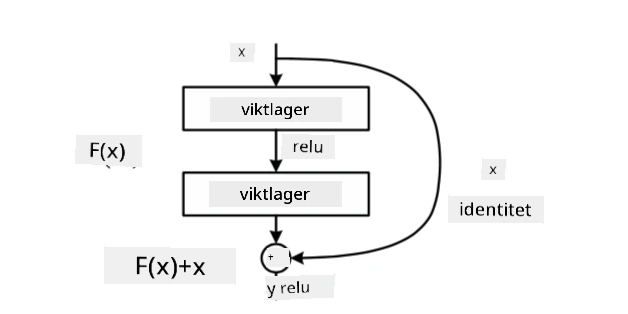
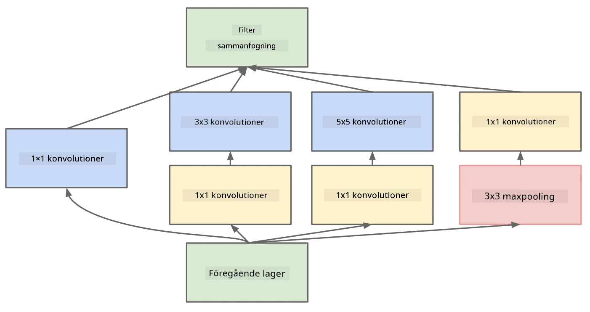

# Välkända CNN-arkitekturer

### VGG-16

VGG-16 är ett nätverk som uppnådde 92,7% noggrannhet i ImageNet top-5 klassificering år 2014. Det har följande lagerstruktur:

Som du kan se följer VGG en traditionell pyramidarkitektur, vilket är en sekvens av konvolutions- och poolinglager.

> Bild från [Researchgate](https://www.researchgate.net/figure/Vgg16-model-structure-To-get-the-VGG-NIN-model-we-replace-the-2-nd-4-th-6-th-7-th_fig2_335194493)

### ResNet

ResNet är en familj av modeller som föreslogs av Microsoft Research år 2015. Huvudidén med ResNet är att använda **residualblock**:

> Bild från [denna artikel](https://arxiv.org/pdf/1512.03385.pdf)

Anledningen till att använda identitetsgenomgång är att låta lagret förutsäga **skillnaden** mellan resultatet från ett tidigare lager och utgången från residualblocket - därav namnet *residual*. Dessa block är mycket lättare att träna, och man kan konstruera nätverk med flera hundra sådana block (de vanligaste varianterna är ResNet-52, ResNet-101 och ResNet-152).

Du kan också tänka på detta nätverk som att det kan anpassa sin komplexitet till datasetet. I början, när du börjar träna nätverket, är vikterna små och det mesta av signalen går genom identitetslagren. När träningen fortskrider och vikterna blir större, ökar betydelsen av nätverkets parametrar, och nätverket anpassar sig för att tillhandahålla den uttryckskraft som krävs för att korrekt klassificera träningsbilder.

### Google Inception

Google Inception-arkitekturen tar denna idé ett steg längre och bygger varje nätverkslager som en kombination av flera olika vägar:

> Bild från [Researchgate](https://www.researchgate.net/figure/Inception-module-with-dimension-reductions-left-and-schema-for-Inception-ResNet-v1_fig2_355547454)

Här behöver vi betona rollen av 1x1-konvolutioner, eftersom de vid första anblick inte verkar logiska. Varför skulle vi behöva köra genom bilden med ett 1x1-filter? Men du måste komma ihåg att konvolutionsfilter också arbetar med flera djupkanaler (ursprungligen - RGB-färger, i efterföljande lager - kanaler för olika filter), och 1x1-konvolution används för att blanda dessa ingångskanaler med olika träningsbara vikter. Det kan också ses som en nedsampling (pooling) över kanaldimensionen.

Här är [en bra bloggpost](https://medium.com/analytics-vidhya/talented-mr-1x1-comprehensive-look-at-1x1-convolution-in-deep-learning-f6b355825578) om ämnet, och [den ursprungliga artikeln](https://arxiv.org/pdf/1312.4400.pdf).

### MobileNet

MobileNet är en familj av modeller med reducerad storlek, lämpliga för mobila enheter. Använd dem om du har begränsade resurser och kan offra lite noggrannhet. Huvudidén bakom dem är den så kallade **depthwise separable convolution**, som gör det möjligt att representera konvolutionsfilter genom en sammansättning av rumsliga konvolutioner och 1x1-konvolution över djupkanaler. Detta minskar avsevärt antalet parametrar, vilket gör nätverket mindre i storlek och också lättare att träna med mindre data.

Här är [en bra bloggpost om MobileNet](https://medium.com/analytics-vidhya/image-classification-with-mobilenet-cc6fbb2cd470).

## Slutsats

I denna enhet har du lärt dig huvudkonceptet bakom neurala nätverk för datorseende - konvolutionsnätverk. Verkliga arkitekturer som driver bildklassificering, objektigenkänning och till och med bildgenereringsnätverk är alla baserade på CNN, bara med fler lager och några ytterligare träningsknep.

## 🚀 Utmaning

I de medföljande anteckningsböckerna finns det anteckningar längst ner om hur man kan uppnå högre noggrannhet. Gör några experiment för att se om du kan uppnå bättre resultat.

## [Quiz efter föreläsningen](https://ff-quizzes.netlify.app/en/ai/quiz/14)

## Granskning & Självstudier

Även om CNN oftast används för datorseendeuppgifter, är de generellt bra på att extrahera mönster av fast storlek. Till exempel, om vi arbetar med ljud, kan vi också vilja använda CNN för att leta efter specifika mönster i ljudsignalen - i så fall skulle filtren vara 1-dimensionella (och detta CNN skulle kallas 1D-CNN). Ibland används också 3D-CNN för att extrahera funktioner i multidimensionellt utrymme, såsom vissa händelser som inträffar på video - CNN kan fånga vissa mönster av funktioner som förändras över tid. Gör en granskning och självstudier om andra uppgifter som kan utföras med CNN.

## [Uppgift](lab/README.md)

I detta labb ska du klassificera olika katt- och hundraser. Dessa bilder är mer komplexa än MNIST-datasetet och har högre dimensioner, och det finns fler än 10 klasser.

---

