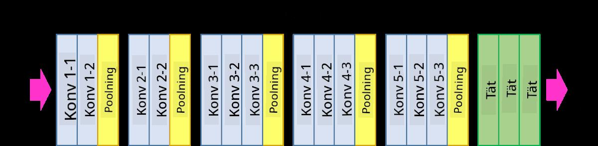

<!--
CO_OP_TRANSLATOR_METADATA:
{
  "original_hash": "088837b42b7d99198bf62db8a42411e0",
  "translation_date": "2025-08-28T15:12:00+00:00",
  "source_file": "lessons/4-ComputerVision/07-ConvNets/README.md",
  "language_code": "sv"
}
-->
# Konvolutionella neurala nätverk

Vi har tidigare sett att neurala nätverk är ganska bra på att hantera bilder, och till och med en enkellagers perceptron kan känna igen handskrivna siffror från MNIST-datasetet med rimlig noggrannhet. MNIST-datasetet är dock väldigt speciellt, eftersom alla siffror är centrerade i bilden, vilket gör uppgiften enklare.

## [Förhandsquiz](https://red-field-0a6ddfd03.1.azurestaticapps.net/quiz/107)

I verkliga livet vill vi kunna känna igen objekt i en bild oavsett deras exakta position i bilden. Datorseende skiljer sig från generell klassificering, eftersom vi, när vi försöker hitta ett visst objekt i en bild, skannar bilden och letar efter specifika **mönster** och deras kombinationer. Till exempel, när vi letar efter en katt, kan vi först leta efter horisontella linjer som kan bilda morrhår, och sedan kan en viss kombination av morrhår indikera att det faktiskt är en bild av en katt. Den relativa positionen och förekomsten av vissa mönster är viktiga, inte deras exakta position i bilden.

För att extrahera mönster använder vi oss av **konvolutionella filter**. Som du vet representeras en bild av en 2D-matris eller en 3D-tensor med färgdjup. Att applicera ett filter innebär att vi tar en relativt liten **filterkärna** (en matris), och för varje pixel i den ursprungliga bilden beräknar vi det viktade medelvärdet med närliggande punkter. Vi kan se detta som ett litet fönster som glider över hela bilden och jämnar ut alla pixlar enligt vikterna i filterkärnan.

 | 
----|----

> Bild av Dmitry Soshnikov

Till exempel, om vi applicerar 3x3 vertikala och horisontella kantfilter på MNIST-siffrorna, kan vi få framhöjningar (t.ex. höga värden) där det finns vertikala och horisontella kanter i vår ursprungliga bild. Dessa två filter kan alltså användas för att "leta efter" kanter. På samma sätt kan vi designa olika filter för att leta efter andra låg-nivå mönster:

> Bild av [Leung-Malik Filter Bank](https://www.robots.ox.ac.uk/~vgg/research/texclass/filters.html)

Men även om vi kan designa filter för att manuellt extrahera vissa mönster, kan vi också designa nätverket så att det lär sig mönstren automatiskt. Detta är en av huvudidéerna bakom CNN.

## Huvudidéer bakom CNN

Så här fungerar CNNs baserat på följande viktiga idéer:

* Konvolutionella filter kan extrahera mönster
* Vi kan designa nätverket så att filtren tränas automatiskt
* Vi kan använda samma metod för att hitta mönster i högre nivåers funktioner, inte bara i den ursprungliga bilden. Därmed arbetar CNN med en hierarki av funktioner, från låg-nivå pixelkombinationer till högre nivåers kombinationer av bilddelar.

> Bild från [en artikel av Hislop-Lynch](https://www.semanticscholar.org/paper/Computer-vision-based-pedestrian-trajectory-Hislop-Lynch/26e6f74853fc9bbb7487b06dc2cf095d36c9021d), baserad på [deras forskning](https://dl.acm.org/doi/abs/10.1145/1553374.1553453)

## ✍️ Övningar: Konvolutionella neurala nätverk

Låt oss fortsätta utforska hur konvolutionella neurala nätverk fungerar och hur vi kan uppnå träningsbara filter genom att arbeta igenom motsvarande anteckningsböcker:

* [Konvolutionella neurala nätverk - PyTorch](ConvNetsPyTorch.ipynb)
* [Konvolutionella neurala nätverk - TensorFlow](ConvNetsTF.ipynb)

## Pyramidarkitektur

De flesta CNNs som används för bildbehandling följer en så kallad pyramidarkitektur. Det första konvolutionella lagret som appliceras på de ursprungliga bilderna har vanligtvis ett relativt lågt antal filter (8-16), som motsvarar olika pixelkombinationer, såsom horisontella/vertikala linjer eller streck. På nästa nivå minskar vi nätverkets rumsliga dimension och ökar antalet filter, vilket motsvarar fler möjliga kombinationer av enkla funktioner. Med varje lager, när vi rör oss mot den slutliga klassificeraren, minskar bildens rumsliga dimensioner och antalet filter ökar.

Som exempel, låt oss titta på arkitekturen för VGG-16, ett nätverk som uppnådde 92,7% noggrannhet i ImageNets topp-5 klassificering år 2014:

> Bild från [Researchgate](https://www.researchgate.net/figure/Vgg16-model-structure-To-get-the-VGG-NIN-model-we-replace-the-2-nd-4-th-6-th-7-th_fig2_335194493)

## Mest kända CNN-arkitekturer

[Fortsätt din studie om de mest kända CNN-arkitekturerna](CNN_Architectures.md)

---

**Ansvarsfriskrivning**:  
Detta dokument har översatts med hjälp av AI-översättningstjänsten [Co-op Translator](https://github.com/Azure/co-op-translator). Även om vi strävar efter noggrannhet, bör det noteras att automatiska översättningar kan innehålla fel eller felaktigheter. Det ursprungliga dokumentet på dess ursprungliga språk bör betraktas som den auktoritativa källan. För kritisk information rekommenderas professionell mänsklig översättning. Vi ansvarar inte för eventuella missförstånd eller feltolkningar som uppstår vid användning av denna översättning.