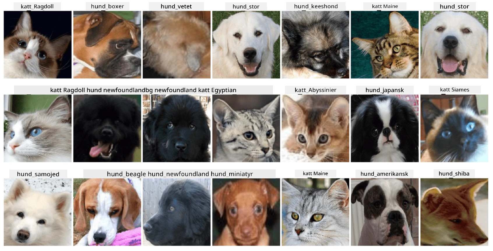

# Klassificering av husdjursansikten

Labuppgift från [AI för nybörjare-kursen](https://github.com/microsoft/ai-for-beginners).

## Uppgift

Föreställ dig att du behöver utveckla en applikation för ett djurdagis för att katalogisera alla husdjur. En fantastisk funktion i en sådan applikation skulle vara att automatiskt identifiera rasen från ett fotografi. Detta kan framgångsrikt göras med hjälp av neurala nätverk.

Du behöver träna ett konvolutionellt neuralt nätverk för att klassificera olika raser av katter och hundar med hjälp av datasetet **Pet Faces**.

## Datasetet

Vi kommer att använda [Oxford-IIIT Pet Dataset](https://www.robots.ox.ac.uk/~vgg/data/pets/), som innehåller bilder av 37 olika raser av hundar och katter.



För att ladda ner datasetet, använd följande kodsnutt:

```python
!wget https://thor.robots.ox.ac.uk/~vgg/data/pets/images.tar.gz
!tar xfz images.tar.gz
!rm images.tar.gz
```

**Obs:** Bilderna i Oxford-IIIT Pet Dataset är organiserade efter filnamn (t.ex. `Abyssinian_1.jpg`, `Bengal_2.jpg`). Notebooken innehåller kod för att organisera dessa bilder i ras-specifika underkataloger för enklare klassificering.

## Starta Notebooken

Börja labben genom att öppna [PetFaces.ipynb](PetFaces.ipynb)

## Slutsats

Du har löst ett relativt komplext problem med bildklassificering från grunden! Det fanns ganska många klasser, och du lyckades ändå uppnå rimlig noggrannhet! Det är också vettigt att mäta top-k noggrannhet, eftersom det är lätt att förväxla vissa klasser som inte är tydligt olika, även för människor.

---

**Ansvarsfriskrivning**:  
Detta dokument har översatts med hjälp av AI-översättningstjänsten [Co-op Translator](https://github.com/Azure/co-op-translator). Även om vi strävar efter noggrannhet, bör det noteras att automatiserade översättningar kan innehålla fel eller felaktigheter. Det ursprungliga dokumentet på dess originalspråk bör betraktas som den auktoritativa källan. För kritisk information rekommenderas professionell mänsklig översättning. Vi ansvarar inte för eventuella missförstånd eller feltolkningar som uppstår vid användning av denna översättning.