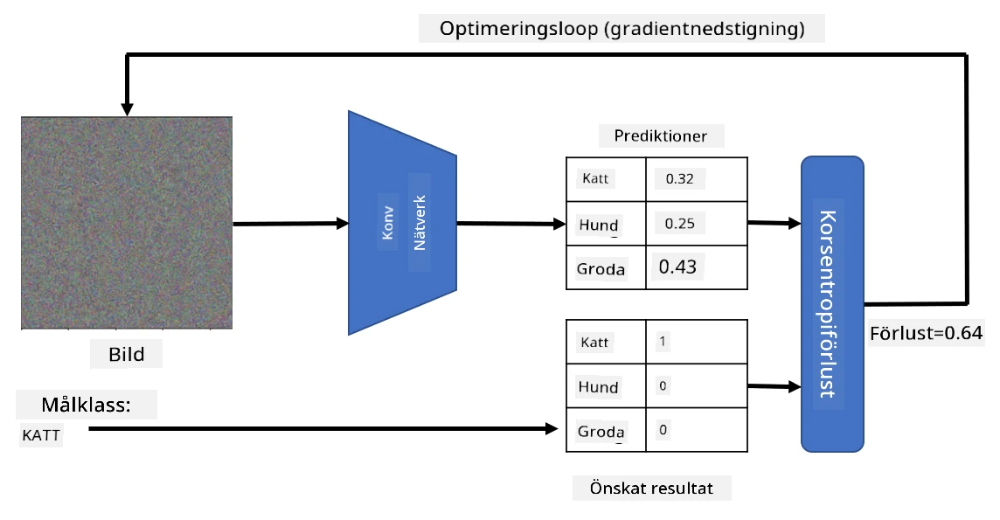

# Förtränade nätverk och transfer learning

Att träna CNNs kan ta mycket tid, och det krävs en stor mängd data för att utföra uppgiften. Mycket av tiden går åt till att lära nätverket de bästa låg-nivåfiltren för att kunna extrahera mönster från bilder. En naturlig fråga uppstår - kan vi använda ett neuralt nätverk som tränats på ett dataset och anpassa det för att klassificera andra bilder utan att behöva genomföra en fullständig träningsprocess?

## [Quiz före föreläsningen](https://ff-quizzes.netlify.app/en/ai/quiz/15)

Denna metod kallas **transfer learning**, eftersom vi överför viss kunskap från en neuralt nätverksmodell till en annan. Vid transfer learning börjar vi vanligtvis med en förtränad modell, som har tränats på ett stort bilddataset, såsom **ImageNet**. Dessa modeller kan redan göra ett bra jobb med att extrahera olika funktioner från generiska bilder, och i många fall kan man uppnå bra resultat genom att bygga en klassificerare ovanpå de extraherade funktionerna.

> ✅ Transfer learning är ett begrepp som även förekommer inom andra akademiska områden, såsom utbildning. Det syftar på processen att ta kunskap från ett område och tillämpa det på ett annat.

## Förtränade modeller som feature-extraktorer

De konvolutionella nätverk vi diskuterade i föregående avsnitt innehåller flera lager, där varje lager är avsett att extrahera funktioner från bilden, från låg-nivå pixelkombinationer (som horisontella/vertikala linjer eller streck) till högre nivåkombinationer av funktioner, som exempelvis ett öga eller en flamma. Om vi tränar ett CNN på ett tillräckligt stort dataset med generiska och varierande bilder, bör nätverket lära sig att extrahera dessa vanliga funktioner.

Både Keras och PyTorch innehåller funktioner för att enkelt ladda förtränade neurala nätverksvikter för några vanliga arkitekturer, varav de flesta har tränats på ImageNet-bilder. De mest använda beskrivs på sidan [CNN Architectures](../07-ConvNets/CNN_Architectures.md) från föregående lektion. I synnerhet kan du överväga att använda någon av följande:

* **VGG-16/VGG-19** är relativt enkla modeller som ändå ger bra noggrannhet. Att använda VGG som ett första försök är ofta ett bra val för att se hur transfer learning fungerar.
* **ResNet** är en familj av modeller som föreslogs av Microsoft Research 2015. De har fler lager och kräver därför mer resurser.
* **MobileNet** är en familj av modeller med reducerad storlek, lämpliga för mobila enheter. Använd dem om du har begränsade resurser och kan kompromissa lite med noggrannheten.

Här är exempel på funktioner som extraherats från en bild av en katt med VGG-16-nätverket:

## Dataset för katter och hundar

I detta exempel kommer vi att använda ett dataset med [katter och hundar](https://www.microsoft.com/download/details.aspx?id=54765&WT.mc_id=academic-77998-cacaste), vilket ligger nära ett verkligt scenario för bildklassificering.

## ✍️ Övning: Transfer learning

Låt oss se transfer learning i praktiken i motsvarande notebooks:

* [Transfer Learning - PyTorch](TransferLearningPyTorch.ipynb)
* [Transfer Learning - TensorFlow](TransferLearningTF.ipynb)

## Visualisering av en "idealkatt"

Ett förtränat neuralt nätverk innehåller olika mönster i sitt *"hjärna"*, inklusive föreställningar om en **ideal katt** (liksom ideal hund, ideal zebra, etc.). Det vore intressant att på något sätt **visualisera denna bild**. Men det är inte enkelt, eftersom mönstren är spridda över nätverkets vikter och dessutom organiserade i en hierarkisk struktur.

En metod vi kan använda är att börja med en slumpmässig bild och sedan försöka använda **gradient descent-optimering** för att justera bilden så att nätverket börjar tro att det är en katt.

Om vi gör detta kommer vi dock att få något som liknar slumpmässigt brus. Detta beror på att *det finns många sätt att få nätverket att tro att inmatningsbilden är en katt*, inklusive sådana som inte är visuellt meningsfulla. Även om dessa bilder innehåller många mönster som är typiska för en katt, finns det inget som begränsar dem till att vara visuellt distinkta.

För att förbättra resultatet kan vi lägga till en annan term i förlustfunktionen, kallad **variation loss**. Det är en metrik som visar hur lika angränsande pixlar i bilden är. Genom att minimera variation loss blir bilden mjukare och bruset försvinner - vilket avslöjar mer visuellt tilltalande mönster. Här är exempel på sådana "ideala" bilder som klassificeras som katt och zebra med hög sannolikhet:

 | 
-----|-----
 *Ideal katt* | *Ideal zebra*

En liknande metod kan användas för att utföra så kallade **adversarial attacks** på ett neuralt nätverk. Anta att vi vill lura ett neuralt nätverk och få en hund att se ut som en katt. Om vi tar en bild av en hund som nätverket känner igen som en hund, kan vi sedan justera den lite med gradient descent-optimering tills nätverket börjar klassificera den som en katt:

 | 
-----|-----
*Originalbild av en hund* | *Bild av en hund klassificerad som en katt*

Se koden för att reproducera resultaten ovan i följande notebook:

* [Ideal och adversarial katt - TensorFlow](AdversarialCat_TF.ipynb)

## Slutsats

Med transfer learning kan du snabbt sätta ihop en klassificerare för en anpassad objektklassificeringsuppgift och uppnå hög noggrannhet. Du kan se att mer komplexa uppgifter som vi löser nu kräver högre beräkningskraft och inte enkelt kan lösas på en CPU. I nästa enhet kommer vi att försöka använda en mer lättviktig implementation för att träna samma modell med lägre beräkningsresurser, vilket resulterar i bara något lägre noggrannhet.

## 🚀 Utmaning

I de medföljande notebooks finns anteckningar längst ner om hur transfer knowledge fungerar bäst med något liknande träningsdata (en ny typ av djur, kanske). Gör några experiment med helt nya typer av bilder för att se hur bra eller dåligt dina transfer knowledge-modeller presterar.

## [Quiz efter föreläsningen](https://ff-quizzes.netlify.app/en/ai/quiz/16)

## Granskning & Självstudier

Läs igenom [TrainingTricks.md](TrainingTricks.md) för att fördjupa din kunskap om andra sätt att träna dina modeller.

## [Uppgift](lab/README.md)

I detta labb kommer vi att använda det verkliga [Oxford-IIIT](https://www.robots.ox.ac.uk/~vgg/data/pets/) pets-datasetet med 35 raser av katter och hundar, och vi kommer att bygga en transfer learning-klassificerare.

---

