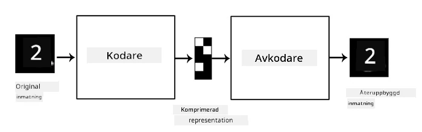
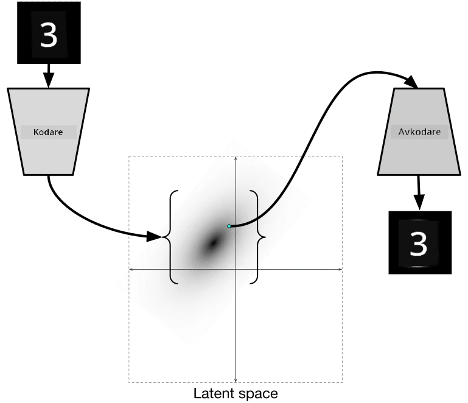

# Autoencoders

När vi tränar CNNs är ett av problemen att vi behöver mycket märkt data. När det gäller bildklassificering måste vi dela upp bilder i olika klasser, vilket är en manuell process.

## [Pre-lecture quiz](https://ff-quizzes.netlify.app/en/ai/quiz/17)

Men vi kanske vill använda rå (omärkt) data för att träna CNN-funktionsextraktorer, vilket kallas **självövervakad inlärning**. Istället för etiketter använder vi träningsbilder som både nätverksinmatning och -utmatning. Huvudidén med en **autoencoder** är att vi har ett **encoder-nätverk** som omvandlar inmatningsbilden till någon **latent space** (vanligtvis är det bara en vektor av mindre storlek), och sedan ett **decoder-nätverk**, vars mål är att rekonstruera den ursprungliga bilden.

> ✅ En [autoencoder](https://wikipedia.org/wiki/Autoencoder) är "en typ av artificiellt neuralt nätverk som används för att lära sig effektiva kodningar av omärkt data."

Eftersom vi tränar en autoencoder för att fånga så mycket information som möjligt från den ursprungliga bilden för en korrekt rekonstruktion, försöker nätverket hitta den bästa **embedding** av inmatningsbilder för att fånga dess betydelse.

> Bild från [Keras blog](https://blog.keras.io/building-autoencoders-in-keras.html)

## Scenarier för att använda Autoencoders

Även om att rekonstruera ursprungliga bilder inte verkar användbart i sig självt, finns det några scenarier där autoencoders är särskilt användbara:

* **Minska dimensionen på bilder för visualisering** eller **träna bildembeddings**. Vanligtvis ger autoencoders bättre resultat än PCA, eftersom de tar hänsyn till bilders spatiala natur och hierarkiska funktioner.
* **Denoising**, dvs. ta bort brus från bilden. Eftersom brus innehåller mycket onödig information kan autoencodern inte passa in allt i det relativt lilla latenta utrymmet, och fångar därför bara den viktiga delen av bilden. När vi tränar brusreducerare börjar vi med ursprungliga bilder och använder bilder med artificiellt tillagt brus som inmatning för autoencodern.
* **Superupplösning**, öka bildens upplösning. Vi börjar med högupplösta bilder och använder bilden med lägre upplösning som autoencoderns inmatning.
* **Generativa modeller**. När vi har tränat autoencodern kan den dekoderande delen användas för att skapa nya objekt från slumpmässiga latenta vektorer.

## Variational Autoencoders (VAE)

Traditionella autoencoders minskar dimensionen på inmatningsdata på något sätt och identifierar viktiga funktioner i inmatningsbilder. Men latenta vektorer är ofta svåra att tolka. Med andra ord, om vi tar MNIST-datasetet som exempel, är det inte enkelt att avgöra vilka siffror som motsvarar olika latenta vektorer, eftersom närliggande latenta vektorer inte nödvändigtvis motsvarar samma siffror.

För att träna *generativa* modeller är det däremot bättre att ha en viss förståelse för det latenta utrymmet. Denna idé leder oss till **variational autoencoder** (VAE).

VAE är en autoencoder som lär sig att förutsäga *statistisk fördelning* av de latenta parametrarna, den så kallade **latenta fördelningen**. Till exempel kanske vi vill att latenta vektorer ska vara normalt fördelade med en viss medelvärde zmean och standardavvikelse zsigma (både medelvärde och standardavvikelse är vektorer med en viss dimension d). Encoder i VAE lär sig att förutsäga dessa parametrar, och sedan tar decodern en slumpmässig vektor från denna fördelning för att rekonstruera objektet.

Sammanfattningsvis:

 * Från inmatningsvektorn förutsäger vi `z_mean` och `z_log_sigma` (istället för att förutsäga standardavvikelsen direkt, förutsäger vi dess logaritm)
 * Vi samplar en vektor `sample` från fördelningen N(zmean,exp(zlog\_sigma))
 * Decodern försöker avkoda den ursprungliga bilden med `sample` som inmatningsvektor

 

> Bild från [denna blogginlägg](https://ijdykeman.github.io/ml/2016/12/21/cvae.html) av Isaak Dykeman

Variational autoencoders använder en komplex förlustfunktion som består av två delar:

* **Rekonstruktionsförlust** är förlustfunktionen som visar hur nära en rekonstruerad bild är målet (det kan vara Mean Squared Error, eller MSE). Det är samma förlustfunktion som i vanliga autoencoders.
* **KL-förlust**, som säkerställer att latenta variabelns fördelning förblir nära normalfördelning. Den baseras på begreppet [Kullback-Leibler divergence](https://www.countbayesie.com/blog/2017/5/9/kullback-leibler-divergence-explained) - en metrik för att uppskatta hur lika två statistiska fördelningar är.

En viktig fördel med VAEs är att de gör det relativt enkelt att generera nya bilder, eftersom vi vet vilken fördelning vi ska sampla latenta vektorer från. Till exempel, om vi tränar en VAE med en 2D latent vektor på MNIST, kan vi sedan variera komponenterna i den latenta vektorn för att få olika siffror:

> Bild av [Dmitry Soshnikov](http://soshnikov.com)

Observera hur bilderna smälter samman när vi börjar få latenta vektorer från olika delar av det latenta parameterutrymmet. Vi kan också visualisera detta utrymme i 2D:

 

> Bild av [Dmitry Soshnikov](http://soshnikov.com)

## ✍️ Övningar: Autoencoders

Lär dig mer om autoencoders i dessa motsvarande notebooks:

* [Autoencoders i TensorFlow](AutoencodersTF.ipynb)
* [Autoencoders i PyTorch](AutoEncodersPyTorch.ipynb)

## Egenskaper hos Autoencoders

* **Dataspecifika** - de fungerar bara bra med den typ av bilder de har tränats på. Till exempel, om vi tränar ett nätverk för superupplösning på blommor, kommer det inte att fungera bra på porträtt. Detta beror på att nätverket kan producera högupplösta bilder genom att ta fina detaljer från funktioner som lärts från träningsdatasetet.
* **Förlustfyllda** - den rekonstruerade bilden är inte densamma som den ursprungliga bilden. Förlustens natur definieras av den *förlustfunktion* som används under träningen.
* Fungerar på **omärkt data**

## [Post-lecture quiz](https://ff-quizzes.netlify.app/en/ai/quiz/18)

## Slutsats

I denna lektion lärde du dig om de olika typerna av autoencoders som finns tillgängliga för AI-forskaren. Du lärde dig hur man bygger dem och hur man använder dem för att rekonstruera bilder. Du lärde dig också om VAE och hur man använder det för att generera nya bilder.

## 🚀 Utmaning

I denna lektion lärde du dig om att använda autoencoders för bilder. Men de kan också användas för musik! Kolla in Magenta-projektets [MusicVAE](https://magenta.tensorflow.org/music-vae)-projekt, som använder autoencoders för att lära sig att rekonstruera musik. Gör några [experiment](https://colab.research.google.com/github/magenta/magenta-demos/blob/master/colab-notebooks/Multitrack_MusicVAE.ipynb) med detta bibliotek för att se vad du kan skapa.

## [Post-lecture quiz](https://ff-quizzes.netlify.app/en/ai/quiz/16)

## Granskning & Självstudier

För referens, läs mer om autoencoders i dessa resurser:

* [Bygga Autoencoders i Keras](https://blog.keras.io/building-autoencoders-in-keras.html)
* [Blogginlägg på NeuroHive](https://neurohive.io/ru/osnovy-data-science/variacionnyj-avtojenkoder-vae/)
* [Variational Autoencoders Explained](https://kvfrans.com/variational-autoencoders-explained/)
* [Conditional Variational Autoencoders](https://ijdykeman.github.io/ml/2016/12/21/cvae.html)

## Uppgift

I slutet av [denna notebook med TensorFlow](AutoencodersTF.ipynb) hittar du en 'uppgift' - använd detta som din uppgift.

---

