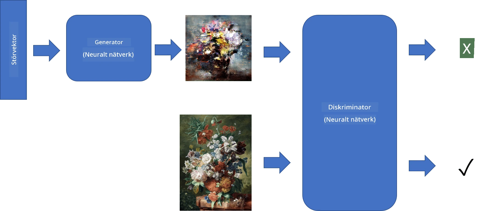
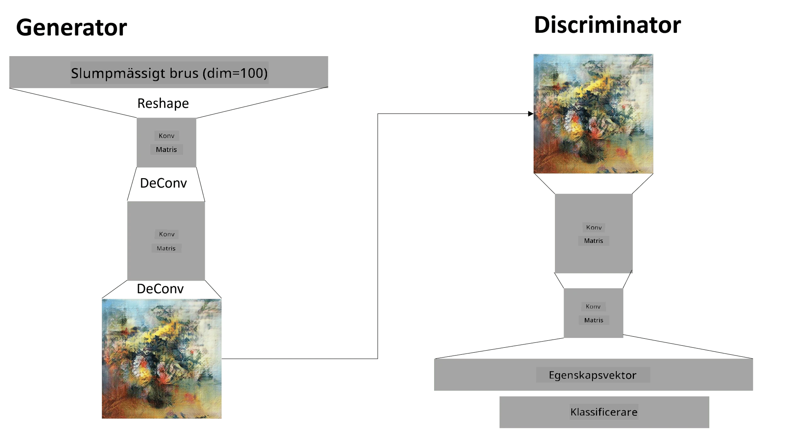

# Generativa Adversariella Nätverk

I föregående avsnitt lärde vi oss om **generativa modeller**: modeller som kan generera nya bilder som liknar de i träningsdatamängden. VAE var ett bra exempel på en generativ modell.

## [Quiz före föreläsningen](https://ff-quizzes.netlify.app/en/ai/quiz/19)

Men om vi försöker generera något riktigt meningsfullt, som en målning med rimlig upplösning, med VAE, kommer vi att märka att träningen inte konvergerar särskilt bra. För detta användningsområde bör vi lära oss om en annan arkitektur som är specifikt inriktad på generativa modeller - **Generativa Adversariella Nätverk**, eller GANs.

Huvudidén med en GAN är att ha två neurala nätverk som tränas mot varandra:

> Bild av [Dmitry Soshnikov](http://soshnikov.com)

> ✅ Lite vokabulär:
> * **Generator** är ett nätverk som tar en slumpmässig vektor och producerar en bild som resultat.
> * **Discriminator** är ett nätverk som tar en bild och ska avgöra om det är en riktig bild (från träningsdatamängden) eller om den genererats av en generator. Det är i grunden en bildklassificerare.

### Discriminator

Discriminatorns arkitektur skiljer sig inte från ett vanligt bildklassificeringsnätverk. I det enklaste fallet kan det vara en helt ansluten klassificerare, men oftast kommer det att vara ett [konvolutionellt nätverk](../07-ConvNets/README.md).

> ✅ En GAN baserad på konvolutionella nätverk kallas en [DCGAN](https://arxiv.org/pdf/1511.06434.pdf)

En CNN-discriminator består av följande lager: flera konvolutioner + pooling (med minskande spatial storlek) och en eller flera helt anslutna lager för att få en "funktionsvektor", samt en slutlig binär klassificerare.

> ✅ "Pooling" i detta sammanhang är en teknik som minskar bildens storlek. "Pooling-lager minskar datans dimensioner genom att kombinera utgångarna från neuronkluster i ett lager till en enda neuron i nästa lager." - [källa](https://wikipedia.org/wiki/Convolutional_neural_network#Pooling_layers)

### Generator

En generator är något mer komplicerad. Du kan se den som en omvänd discriminator. Med start från en latent vektor (istället för en funktionsvektor) har den ett helt anslutet lager för att omvandla den till önskad storlek/form, följt av dekonvolutioner + uppskalning. Detta liknar *dekoder*-delen av [autoencoder](../09-Autoencoders/README.md).

> ✅ Eftersom konvolutionslagret implementeras som ett linjärt filter som traverserar bilden, är dekonvolution i princip liknande konvolution och kan implementeras med samma lagerlogik.

> Bild av [Dmitry Soshnikov](http://soshnikov.com)

### Träning av GAN

GANs kallas **adversariella** eftersom det pågår en ständig tävling mellan generatorn och discriminatorn. Under denna tävling förbättras både generatorn och discriminatorn, vilket gör att nätverket lär sig att producera bättre och bättre bilder.

Träningen sker i två steg:

* **Träning av discriminatorn**. Denna uppgift är ganska enkel: vi genererar en batch av bilder med generatorn, märker dem som 0 (vilket står för falska bilder), och tar en batch av bilder från inmatningsdatamängden (med etikett 1, riktiga bilder). Vi får en *discriminatorförlust* och utför backpropagation.
* **Träning av generatorn**. Detta är något mer komplicerat eftersom vi inte direkt vet det förväntade resultatet för generatorn. Vi tar hela GAN-nätverket som består av en generator följt av en discriminator, matar det med några slumpmässiga vektorer och förväntar oss att resultatet ska vara 1 (motsvarande riktiga bilder). Vi fryser sedan parametrarna för discriminatorn (vi vill inte att den ska tränas i detta steg) och utför backpropagation.

Under denna process går varken generatorns eller discriminatorns förluster ner särskilt mycket. I en idealisk situation bör de oscillera, vilket motsvarar att båda nätverken förbättrar sin prestanda.

## ✍️ Övningar: GANs

* [GAN Notebook i TensorFlow/Keras](GANTF.ipynb)
* [GAN Notebook i PyTorch](GANPyTorch.ipynb)

### Problem med GAN-träning

GANs är kända för att vara särskilt svåra att träna. Här är några problem:

* **Mode Collapse**. Med detta menas att generatorn lär sig att producera en framgångsrik bild som lurar discriminatorn, men inte en variation av olika bilder.
* **Känslighet för hyperparametrar**. Ofta kan man se att en GAN inte konvergerar alls, och sedan plötsligt minskar inlärningshastigheten vilket leder till konvergens.
* Att hålla en **balans** mellan generatorn och discriminatorn. I många fall kan discriminatorns förlust sjunka till noll relativt snabbt, vilket resulterar i att generatorn inte kan träna vidare. För att övervinna detta kan vi försöka sätta olika inlärningshastigheter för generatorn och discriminatorn, eller hoppa över träningen av discriminatorn om förlusten redan är för låg.
* Träning för **hög upplösning**. Detta problem liknar det med autoencoders och uppstår eftersom rekonstruktion av för många lager i ett konvolutionellt nätverk leder till artefakter. Problemet löses vanligtvis med så kallad **progressiv tillväxt**, där de första lagren tränas på lågupplösta bilder och sedan "låses upp" eller läggs till fler lager. En annan lösning är att lägga till extra kopplingar mellan lager och träna flera upplösningar samtidigt - se denna [Multi-Scale Gradient GANs-artikel](https://arxiv.org/abs/1903.06048) för detaljer.

## Stilöverföring

GANs är ett utmärkt sätt att generera konstnärliga bilder. En annan intressant teknik är så kallad **stilöverföring**, som tar en **innehållsbild** och ritar om den i en annan stil genom att applicera filter från en **stilbild**.

Så här fungerar det:
* Vi börjar med en slumpmässig brusbild (eller med en innehållsbild, men för förståelsens skull är det enklare att börja med slumpmässigt brus).
* Vårt mål är att skapa en bild som ligger nära både innehållsbilden och stilbilden. Detta bestäms av två förlustfunktioner:
   - **Innehållsförlust** beräknas baserat på de funktioner som extraheras av CNN vid vissa lager från den aktuella bilden och innehållsbilden.
   - **Stilförlust** beräknas mellan den aktuella bilden och stilbilden på ett smart sätt med hjälp av Gram-matriser (mer detaljer i [exempelnotebooken](StyleTransfer.ipynb)).
* För att göra bilden mjukare och ta bort brus introducerar vi också **Variationsförlust**, som beräknar det genomsnittliga avståndet mellan närliggande pixlar.
* Den huvudsakliga optimeringsloopen justerar den aktuella bilden med hjälp av gradientnedstigning (eller någon annan optimeringsalgoritm) för att minimera den totala förlusten, som är en viktad summa av alla tre förluster.

## ✍️ Exempel: [Stilöverföring](StyleTransfer.ipynb)

## [Quiz efter föreläsningen](https://ff-quizzes.netlify.app/en/ai/quiz/20)

## Slutsats

I denna lektion lärde du dig om GANs och hur man tränar dem. Du lärde dig också om de speciella utmaningar som denna typ av neuralt nätverk kan möta och några strategier för att övervinna dem.

## 🚀 Utmaning

Kör igenom [Stilöverföringsnotebooken](StyleTransfer.ipynb) med dina egna bilder.

## Granskning & Självstudier

För referens, läs mer om GANs i dessa resurser:

* Marco Pasini, [10 Lessons I Learned Training GANs for one Year](https://towardsdatascience.com/10-lessons-i-learned-training-generative-adversarial-networks-gans-for-a-year-c9071159628)
* [StyleGAN](https://en.wikipedia.org/wiki/StyleGAN), en *de facto* GAN-arkitektur att överväga
* [Skapa generativ konst med GANs på Azure ML](https://soshnikov.com/scienceart/creating-generative-art-using-gan-on-azureml/)

## Uppgift

Gå tillbaka till en av de två notebookarna som är kopplade till denna lektion och träna om GAN på dina egna bilder. Vad kan du skapa?

---

