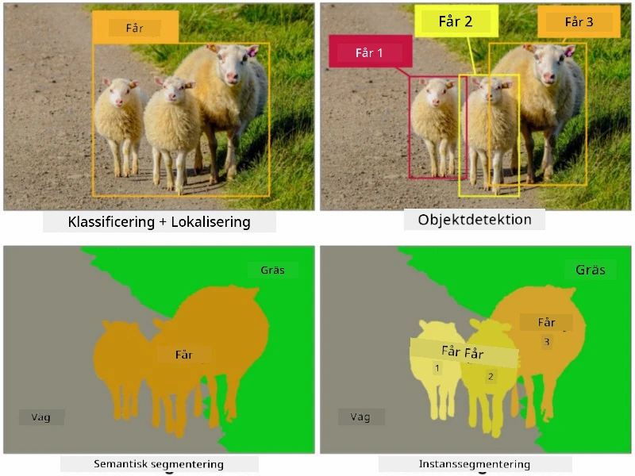
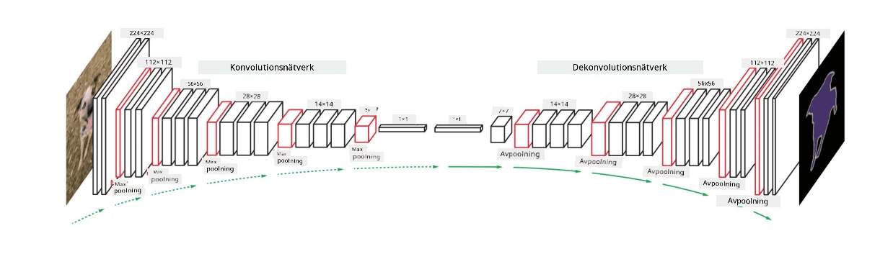

# Segmentering

Vi har tidigare lärt oss om objektigenkänning, som gör det möjligt att lokalisera objekt i en bild genom att förutsäga deras *begränsningsramar*. Men för vissa uppgifter behöver vi inte bara begränsningsramar, utan också mer exakt objektlokalisering. Denna uppgift kallas **segmentering**.

## [Quiz före föreläsningen](https://ff-quizzes.netlify.app/en/ai/quiz/23)

Segmentering kan ses som **pixelklassificering**, där vi för **varje** pixel i bilden måste förutsäga dess klass (*bakgrund* är en av klasserna). Det finns två huvudsakliga segmenteringsalgoritmer:

* **Semantisk segmentering** anger endast pixelklassen och gör ingen skillnad mellan olika objekt av samma klass.
* **Instancesegmentering** delar upp klasser i olika instanser.

Vid instancesegmentering är dessa får olika objekt, men vid semantisk segmentering representeras alla får av en och samma klass.

> Bild från [denna bloggpost](https://nirmalamurali.medium.com/image-classification-vs-semantic-segmentation-vs-instance-segmentation-625c33a08d50)

Det finns olika neurala arkitekturer för segmentering, men de har alla samma struktur. På sätt och vis liknar det den autoencoder du tidigare lärt dig om, men istället för att dekonstruera den ursprungliga bilden är vårt mål att dekonstruera en **mask**. En segmenteringsnätverk har följande delar:

* **Encoder** extraherar funktioner från inmatningsbilden.
* **Decoder** omvandlar dessa funktioner till **maskbilden**, med samma storlek och antal kanaler som motsvarar antalet klasser.

> Bild från [denna publikation](https://arxiv.org/pdf/2001.05566.pdf)

Vi bör särskilt nämna förlustfunktionen som används för segmentering. När vi använder klassiska autoencoders behöver vi mäta likheten mellan två bilder, och vi kan använda medelkvadratfel (MSE) för att göra det. Vid segmentering representerar varje pixel i målmaskbilden klassnumret (one-hot-kodad längs den tredje dimensionen), så vi behöver använda förlustfunktioner specifika för klassificering - korsentropiförlust, genomsnittligt över alla pixlar. Om masken är binär används **binär korsentropiförlust** (BCE).

> ✅ One-hot-kodning är ett sätt att koda en klassetikett till en vektor med längd som motsvarar antalet klasser. Ta en titt på [denna artikel](https://datagy.io/sklearn-one-hot-encode/) om denna teknik.

## Segmentering för medicinsk bildbehandling

I denna lektion kommer vi att se segmentering i praktiken genom att träna nätverket att känna igen mänskliga nevi (även kända som födelsemärken) på medicinska bilder. Vi kommer att använda <a href="https://www.fc.up.pt/addi/ph2%20database.html">PH2-databasen</a> med dermoskopibilder som bildkälla. Denna datamängd innehåller 200 bilder av tre klasser: typisk nevus, atypisk nevus och melanom. Alla bilder innehåller också en motsvarande **mask** som markerar nevusen.

> ✅ Denna teknik är särskilt lämplig för denna typ av medicinsk bildbehandling, men vilka andra verkliga tillämpningar kan du föreställa dig?

> Bild från PH2-databasen

Vi kommer att träna en modell för att segmentera vilken nevus som helst från dess bakgrund.

## ✍️ Övningar: Semantisk segmentering

Öppna nedanstående notebooks för att lära dig mer om olika semantiska segmenteringsarkitekturer, öva på att arbeta med dem och se dem i praktiken.

* [Semantisk segmentering Pytorch](SemanticSegmentationPytorch.ipynb)
* [Semantisk segmentering TensorFlow](SemanticSegmentationTF.ipynb)

## [Quiz efter föreläsningen](https://ff-quizzes.netlify.app/en/ai/quiz/24)

## Slutsats

Segmentering är en mycket kraftfull teknik för bildklassificering, som går bortom begränsningsramar till pixelnivåklassificering. Det är en teknik som används inom medicinsk bildbehandling, bland andra tillämpningar.

## 🚀 Utmaning

Kroppssegmentering är bara en av de vanliga uppgifterna vi kan utföra med bilder av människor. Andra viktiga uppgifter inkluderar **skelettdetektion** och **posedetektion**. Prova [OpenPose](https://github.com/CMU-Perceptual-Computing-Lab/openpose)-biblioteket för att se hur posedetektion kan användas.

## Granskning & Självstudier

Denna [Wikipedia-artikel](https://wikipedia.org/wiki/Image_segmentation) erbjuder en bra översikt över de olika tillämpningarna av denna teknik. Lär dig mer på egen hand om subdomänerna instancesegmentering och panoptisk segmentering inom detta område.

## [Uppgift](lab/README.md)

I detta labb, prova **segmentering av människokroppar** med [Segmentation Full Body MADS Dataset](https://www.kaggle.com/datasets/tapakah68/segmentation-full-body-mads-dataset) från Kaggle.

---

