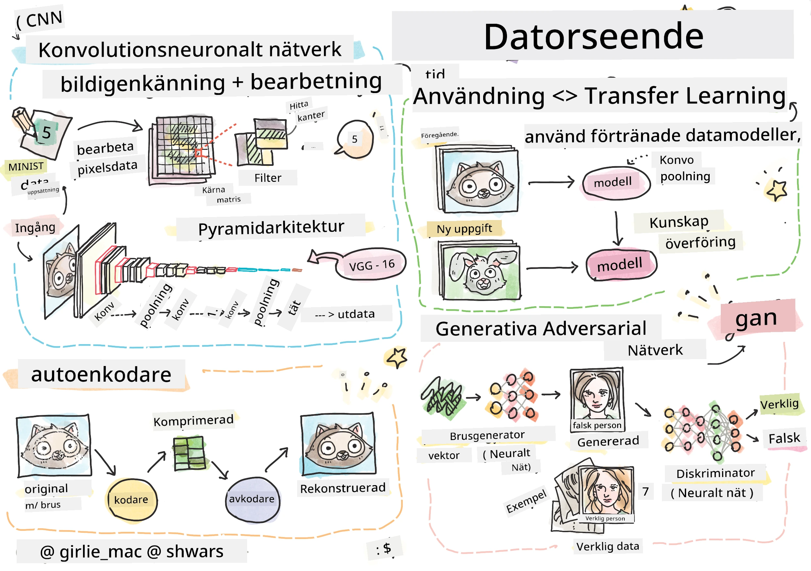

# Datorseende

I den här delen kommer vi att lära oss om:

* [Introduktion till datorseende och OpenCV](06-IntroCV/README.md)
* [Konvolutionella neurala nätverk](07-ConvNets/README.md)
* [Förtränade nätverk och transfer learning](08-TransferLearning/README.md) 
* [Autoenkoders](09-Autoencoders/README.md)
* [Generativa adversariella nätverk](10-GANs/README.md)
* [Objektdetektering](11-ObjectDetection/README.md)
* [Semantisk segmentering](12-Segmentation/README.md)

---

**Ansvarsfriskrivning**:  
Detta dokument har översatts med hjälp av AI-översättningstjänsten [Co-op Translator](https://github.com/Azure/co-op-translator). Även om vi strävar efter noggrannhet, bör du vara medveten om att automatiserade översättningar kan innehålla fel eller brister. Det ursprungliga dokumentet på dess originalspråk bör betraktas som den auktoritativa källan. För kritisk information rekommenderas professionell mänsklig översättning. Vi ansvarar inte för eventuella missförstånd eller feltolkningar som uppstår vid användning av denna översättning.