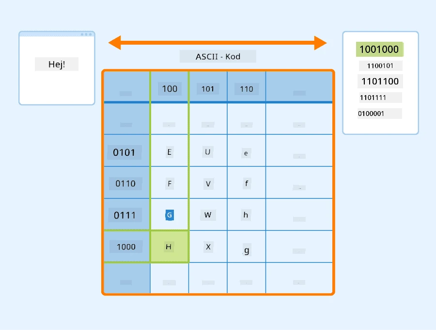
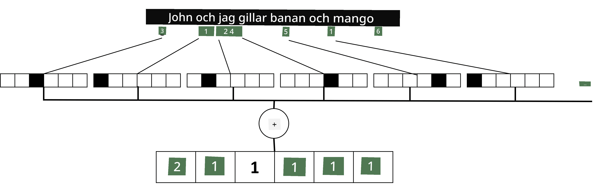

# Representera text som tensorer

## [Förhandsquiz](https://ff-quizzes.netlify.app/en/ai/quiz/25)

## Textklassificering

I den första delen av detta avsnitt kommer vi att fokusera på uppgiften **textklassificering**. Vi kommer att använda [AG News](https://www.kaggle.com/amananandrai/ag-news-classification-dataset)-datasetet, som innehåller nyhetsartiklar som följande:

* Kategori: Vetenskap/Teknik  
* Titel: Ky. Företag vinner bidrag för att studera peptider (AP)  
* Brödtext: AP - Ett företag grundat av en kemiforskare vid University of Louisville vann ett bidrag för att utveckla...

Vårt mål kommer att vara att klassificera nyhetsartikeln i en av kategorierna baserat på texten.

## Att representera text

Om vi vill lösa uppgifter inom Natural Language Processing (NLP) med neurala nätverk behöver vi ett sätt att representera text som tensorer. Datorer representerar redan texttecken som siffror som mappas till typsnitt på din skärm med hjälp av kodningar som ASCII eller UTF-8.

> [Bildkälla](https://www.seobility.net/en/wiki/ASCII)

Som människor förstår vi vad varje bokstav **representerar** och hur alla tecken tillsammans bildar orden i en mening. Datorer har dock inte en sådan förståelse på egen hand, och det neurala nätverket måste lära sig betydelsen under träningen.

Därför kan vi använda olika metoder för att representera text:

* **Teckennivårepresentation**, där vi representerar text genom att behandla varje tecken som ett nummer. Givet att vi har *C* olika tecken i vår textkorpus, skulle ordet *Hello* representeras av en 5x*C*-tensor. Varje bokstav skulle motsvara en tensor-kolumn i en one-hot-kodning.  
* **Ordnivårepresentation**, där vi skapar ett **ordförråd** av alla ord i vår text och sedan representerar ord med hjälp av one-hot-kodning. Denna metod är något bättre eftersom varje bokstav i sig inte har mycket betydelse, och genom att använda högre semantiska koncept - ord - förenklar vi uppgiften för det neurala nätverket. Dock, med tanke på den stora ordbokens storlek, måste vi hantera högdimensionella glesa tensorer.

Oavsett representation måste vi först konvertera texten till en sekvens av **token**, där en token kan vara ett tecken, ett ord eller ibland till och med en del av ett ord. Sedan konverterar vi token till ett nummer, vanligtvis med hjälp av ett **ordförråd**, och detta nummer kan matas in i ett neuralt nätverk med hjälp av one-hot-kodning.

## N-Gram

I naturligt språk kan den exakta betydelsen av ord endast bestämmas i sitt sammanhang. Till exempel har *neuralt nätverk* och *fisknätverk* helt olika betydelser. Ett sätt att ta hänsyn till detta är att bygga vår modell på par av ord och betrakta ordpar som separata ordförrådstoken. På detta sätt kommer meningen *I like to go fishing* att representeras av följande sekvens av token: *I like*, *like to*, *to go*, *go fishing*. Problemet med denna metod är att ordförrådets storlek ökar avsevärt, och kombinationer som *go fishing* och *go shopping* representeras av olika token, som inte delar någon semantisk likhet trots samma verb.

I vissa fall kan vi överväga att använda tri-gram – kombinationer av tre ord – också. Därför kallas denna metod ofta för **n-gram**. Det kan också vara vettigt att använda n-gram med teckennivårepresentation, där n-gram ungefär motsvarar olika stavelser.

## Bag-of-Words och TF/IDF

När vi löser uppgifter som textklassificering behöver vi kunna representera text med en fast storlek på vektorn, som vi kommer att använda som indata till den slutliga täta klassificeraren. Ett av de enklaste sätten att göra detta är att kombinera alla individuella ordrepresentationer, t.ex. genom att addera dem. Om vi adderar one-hot-kodningar av varje ord kommer vi att få en frekvensvektor som visar hur många gånger varje ord förekommer i texten. En sådan representation av text kallas **bag of words** (BoW).

> Bild av författaren

En BoW representerar i huvudsak vilka ord som förekommer i texten och i vilka mängder, vilket verkligen kan vara en bra indikation på vad texten handlar om. Till exempel är det troligt att en nyhetsartikel om politik innehåller ord som *president* och *land*, medan en vetenskaplig publikation skulle ha något som *kolliderare*, *upptäckt*, etc. Således kan ordfrekvenser i många fall vara en bra indikator på textens innehåll.

Problemet med BoW är att vissa vanliga ord, som *och*, *är*, etc., förekommer i de flesta texter och har de högsta frekvenserna, vilket döljer de ord som verkligen är viktiga. Vi kan minska vikten av dessa ord genom att ta hänsyn till frekvensen med vilken ord förekommer i hela dokumentkollektionen. Detta är huvudidén bakom TF/IDF-metoden, som behandlas mer i detalj i de bifogade anteckningsböckerna till denna lektion.

Dock kan ingen av dessa metoder fullt ut ta hänsyn till textens **semantik**. Vi behöver kraftfullare neurala nätverksmodeller för att göra detta, vilket vi kommer att diskutera senare i detta avsnitt.

## ✍️ Övningar: Textrepresentation

Fortsätt ditt lärande i följande anteckningsböcker:

* [Textrepresentation med PyTorch](TextRepresentationPyTorch.ipynb)  
* [Textrepresentation med TensorFlow](TextRepresentationTF.ipynb)  

## Slutsats

Hittills har vi studerat tekniker som kan lägga till frekvensvikt till olika ord. De kan dock inte representera betydelse eller ordning. Som den berömda lingvisten J. R. Firth sa 1935: "Den fullständiga betydelsen av ett ord är alltid kontextuell, och ingen studie av betydelse utanför kontext kan tas på allvar." Vi kommer senare i kursen att lära oss hur man fångar kontextuell information från text med hjälp av språkmodellering.

## 🚀 Utmaning

Prova några andra övningar med bag-of-words och olika datamodeller. Du kanske blir inspirerad av denna [tävling på Kaggle](https://www.kaggle.com/competitions/word2vec-nlp-tutorial/overview/part-1-for-beginners-bag-of-words)

## [Efterföreläsningsquiz](https://ff-quizzes.netlify.app/en/ai/quiz/26)

## Granskning och självstudier

Öva dina färdigheter med textinbäddningar och bag-of-words-tekniker på [Microsoft Learn](https://docs.microsoft.com/learn/modules/intro-natural-language-processing-pytorch/?WT.mc_id=academic-77998-cacaste)

## [Uppgift: Anteckningsböcker](assignment.md)

---

