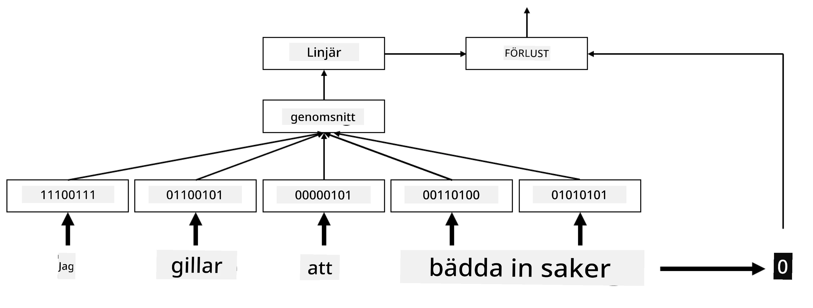
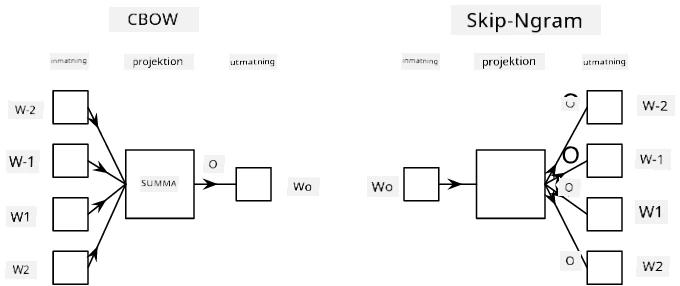

# Inbäddningar

## [Förföreläsningsquiz](https://ff-quizzes.netlify.app/en/ai/quiz/27)

När vi tränade klassificerare baserade på BoW eller TF/IDF arbetade vi med högdimensionella bag-of-words-vektorer med längden `vocab_size`, och vi konverterade uttryckligen från lågdimensionella positionsrepresentationsvektorer till glesa one-hot-representationer. Denna one-hot-representation är dock inte minneseffektiv. Dessutom behandlas varje ord oberoende av varandra, dvs. one-hot-kodade vektorer uttrycker ingen semantisk likhet mellan ord.

Idén med **inbäddning** är att representera ord med lågdimensionella täta vektorer som på något sätt reflekterar den semantiska betydelsen av ett ord. Vi kommer senare att diskutera hur man bygger meningsfulla ordinbäddningar, men för tillfället kan vi bara tänka på inbäddningar som ett sätt att minska dimensionaliteten hos en ordvektor.

Så, inbäddningslagret skulle ta ett ord som indata och producera en utdata-vektor med en specificerad `embedding_size`. På sätt och vis är det mycket likt ett `Linear`-lager, men istället för att ta en one-hot-kodad vektor kan det ta ett ordnummer som indata, vilket gör att vi kan undvika att skapa stora one-hot-kodade vektorer.

Genom att använda ett inbäddningslager som det första lagret i vårt klassificeringsnätverk kan vi byta från en bag-of-words till en **embedding bag**-modell, där vi först konverterar varje ord i vår text till motsvarande inbäddning och sedan beräknar någon aggregeringsfunktion över alla dessa inbäddningar, såsom `sum`, `average` eller `max`.  

> Bild av författaren

## ✍️ Övningar: Inbäddningar

Fortsätt ditt lärande i följande anteckningsböcker:
* [Inbäddningar med PyTorch](EmbeddingsPyTorch.ipynb)
* [Inbäddningar med TensorFlow](EmbeddingsTF.ipynb)

## Semantiska inbäddningar: Word2Vec

Även om inbäddningslagret lärde sig att kartlägga ord till vektorrepresentation, hade denna representation inte nödvändigtvis mycket semantisk betydelse. Det skulle vara bra att lära sig en vektorrepresentation där liknande ord eller synonymer motsvarar vektorer som är nära varandra i termer av någon vektordistans (t.ex. euklidisk distans).

För att göra detta behöver vi förträna vår inbäddningsmodell på en stor samling text på ett specifikt sätt. Ett sätt att träna semantiska inbäddningar kallas [Word2Vec](https://en.wikipedia.org/wiki/Word2vec). Det baseras på två huvudsakliga arkitekturer som används för att producera en distribuerad representation av ord:

 - **Continuous bag-of-words** (CBoW) — i denna arkitektur tränar vi modellen att förutsäga ett ord från den omgivande kontexten. Givet ngrammet $(W_{-2},W_{-1},W_0,W_1,W_2)$ är målet för modellen att förutsäga $W_0$ från $(W_{-2},W_{-1},W_1,W_2)$.
 - **Continuous skip-gram** är motsatsen till CBoW. Modellen använder det omgivande fönstret av kontextord för att förutsäga det aktuella ordet.

CBoW är snabbare, medan skip-gram är långsammare men gör ett bättre jobb med att representera sällsynta ord.

> Bild från [denna artikel](https://arxiv.org/pdf/1301.3781.pdf)

Förtränade Word2Vec-inbäddningar (liksom andra liknande modeller, såsom GloVe) kan också användas istället för inbäddningslager i neurala nätverk. Dock måste vi hantera vokabulärer, eftersom vokabulären som användes för att förträna Word2Vec/GloVe sannolikt skiljer sig från vokabulären i vår textkorpus. Titta i ovanstående anteckningsböcker för att se hur detta problem kan lösas.

## Kontextuella inbäddningar

En viktig begränsning med traditionella förtränade inbäddningsrepresentationer som Word2Vec är problemet med ords betydelseutredning. Även om förtränade inbäddningar kan fånga en del av ordens betydelse i kontext, kodas varje möjlig betydelse av ett ord i samma inbäddning. Detta kan orsaka problem i nedströmsmodeller, eftersom många ord, såsom ordet 'play', har olika betydelser beroende på kontexten de används i.

Till exempel har ordet 'play' i dessa två olika meningar ganska olika betydelser:

- Jag gick på en **pjäs** på teatern.
- John vill **leka** med sina vänner.

De förtränade inbäddningarna ovan representerar båda dessa betydelser av ordet 'play' i samma inbäddning. För att övervinna denna begränsning behöver vi bygga inbäddningar baserade på **språkmodellen**, som tränas på en stor textkorpus och *vet* hur ord kan sättas ihop i olika kontexter. Att diskutera kontextuella inbäddningar ligger utanför denna tutorials omfattning, men vi kommer tillbaka till dem när vi pratar om språkmodeller senare i kursen.

## Slutsats

I denna lektion upptäckte du hur man bygger och använder inbäddningslager i TensorFlow och PyTorch för att bättre reflektera ordens semantiska betydelser.

## 🚀 Utmaning

Word2Vec har använts för några intressanta tillämpningar, inklusive att generera sångtexter och poesi. Ta en titt på [denna artikel](https://www.politetype.com/blog/word2vec-color-poems) som går igenom hur författaren använde Word2Vec för att generera poesi. Titta också på [denna video av Dan Shiffmann](https://www.youtube.com/watch?v=LSS_bos_TPI&ab_channel=TheCodingTrain) för att upptäcka en annan förklaring av denna teknik. Försök sedan att tillämpa dessa tekniker på din egen textkorpus, kanske hämtad från Kaggle.

## [Efterföreläsningsquiz](https://ff-quizzes.netlify.app/en/ai/quiz/28)

## Granskning & Självstudier

Läs igenom denna artikel om Word2Vec: [Efficient Estimation of Word Representations in Vector Space](https://arxiv.org/pdf/1301.3781.pdf)

## [Uppgift: Anteckningsböcker](assignment.md)

---

