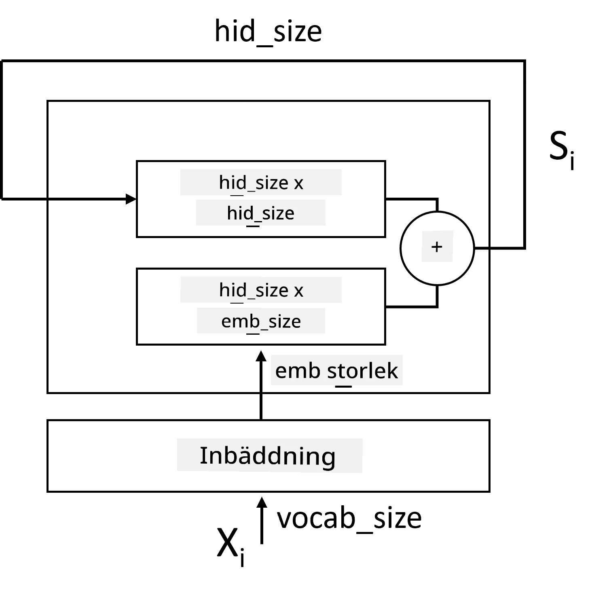
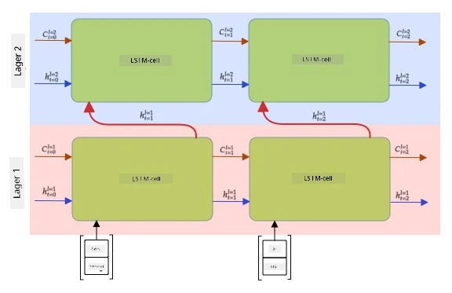

# Rekurrenta neurala nätverk

## [Quiz före föreläsning](https://ff-quizzes.netlify.app/en/ai/quiz/31)

I tidigare avsnitt har vi använt rika semantiska representationer av text och en enkel linjär klassificerare ovanpå embeddingarna. Vad denna arkitektur gör är att fånga den aggregerade betydelsen av ord i en mening, men den tar inte hänsyn till **ordningen** av orden, eftersom aggregeringsoperationen ovanpå embeddingarna tar bort denna information från den ursprungliga texten. Eftersom dessa modeller inte kan modellera ordningen av ord, kan de inte lösa mer komplexa eller tvetydiga uppgifter som textgenerering eller frågehantering.

För att fånga betydelsen av en textsekvens behöver vi använda en annan neural nätverksarkitektur, som kallas för ett **rekurrent neuralt nätverk**, eller RNN. I RNN skickar vi vår mening genom nätverket en symbol i taget, och nätverket producerar ett **tillstånd**, som vi sedan skickar tillbaka till nätverket tillsammans med nästa symbol.

> Bild av författaren

Givet en inmatningssekvens av token X0,...,Xn, skapar RNN en sekvens av neurala nätverksblock och tränar denna sekvens från början till slut med hjälp av backpropagation. Varje nätverksblock tar ett par (Xi,Si) som inmatning och producerar Si+1 som resultat. Det slutliga tillståndet Sn eller (utgång Yn) går in i en linjär klassificerare för att producera resultatet. Alla nätverksblock delar samma vikter och tränas från början till slut med en enda backpropagation-pass.

Eftersom tillståndsvektorerna S0,...,Sn skickas genom nätverket, kan det lära sig de sekventiella beroendena mellan ord. Till exempel, när ordet *inte* dyker upp någonstans i sekvensen, kan det lära sig att förneka vissa element inom tillståndsvektorn, vilket resulterar i negation.

> ✅ Eftersom vikterna för alla RNN-block i bilden ovan är delade, kan samma bild representeras som ett enda block (till höger) med en rekurrent återkopplingsslinga, som skickar nätverkets utgångstillstånd tillbaka till inmatningen.

## Anatomi av en RNN-cell

Låt oss se hur en enkel RNN-cell är organiserad. Den tar emot det tidigare tillståndet Si-1 och den aktuella symbolen Xi som inmatningar och måste producera utgångstillståndet Si (och ibland är vi också intresserade av någon annan utgång Yi, som i fallet med generativa nätverk).

En enkel RNN-cell har två viktmatriser inuti: en som transformerar en inmatningssymbol (vi kallar den W), och en annan som transformerar ett inmatningstillstånd (H). I detta fall beräknas nätverkets utgång som &sigma;(W&times;Xi+H&times;Si-1+b), där &sigma; är aktiveringsfunktionen och b är en ytterligare bias.

> Bild av författaren

I många fall skickas inmatningstoken genom ett embedding-lager innan de går in i RNN för att minska dimensionen. I detta fall, om dimensionen för inmatningsvektorerna är *emb_size*, och tillståndsvektorn är *hid_size* - är storleken på W *emb_size*&times;*hid_size*, och storleken på H är *hid_size*&times;*hid_size*.

## Long Short Term Memory (LSTM)

Ett av de största problemen med klassiska RNN är det så kallade **försvinnande gradienter**-problemet. Eftersom RNN tränas från början till slut i en enda backpropagation-pass, har det svårt att sprida fel till de första lagren i nätverket, och därmed kan nätverket inte lära sig relationer mellan avlägsna token. Ett sätt att undvika detta problem är att införa **explicit tillståndshantering** genom att använda så kallade **grindar**. Det finns två välkända arkitekturer av detta slag: **Long Short Term Memory** (LSTM) och **Gated Relay Unit** (GRU).

> Bildkälla TBD

LSTM-nätverket är organiserat på ett sätt som liknar RNN, men det finns två tillstånd som skickas från lager till lager: det faktiska tillståndet C och den dolda vektorn H. Vid varje enhet kombineras den dolda vektorn Hi med inmatningen Xi, och de styr vad som händer med tillståndet C via **grindar**. Varje grind är ett neuralt nätverk med sigmoid-aktivering (utgång i intervallet [0,1]), som kan betraktas som en bitvis mask när den multipliceras med tillståndsvektorn. Följande grindar finns (från vänster till höger på bilden ovan):

* **Glömskegrinden** tar en dold vektor och avgör vilka komponenter i vektorn C vi behöver glömma och vilka vi ska skicka vidare.
* **Inmatningsgrinden** tar viss information från inmatnings- och dolda vektorer och inför den i tillståndet.
* **Utgångsgrinden** transformerar tillståndet via ett linjärt lager med *tanh*-aktivering och väljer sedan några av dess komponenter med hjälp av en dold vektor Hi för att producera ett nytt tillstånd Ci+1.

Komponenter i tillståndet C kan betraktas som flaggor som kan slås på och av. Till exempel, när vi stöter på namnet *Alice* i sekvensen, kanske vi vill anta att det hänvisar till en kvinnlig karaktär och höja flaggan i tillståndet att vi har ett kvinnligt substantiv i meningen. När vi senare stöter på frasen *och Tom*, kommer vi att höja flaggan att vi har ett plural substantiv. Genom att manipulera tillståndet kan vi alltså hålla reda på de grammatiska egenskaperna hos meningens delar.

> ✅ En utmärkt resurs för att förstå LSTM:s interna funktioner är denna fantastiska artikel [Understanding LSTM Networks](https://colah.github.io/posts/2015-08-Understanding-LSTMs/) av Christopher Olah.

## Bidirektionella och flerskiktade RNN

Vi har diskuterat rekurrenta nätverk som arbetar i en riktning, från början av en sekvens till slutet. Det verkar naturligt, eftersom det liknar sättet vi läser och lyssnar på tal. Men eftersom vi i många praktiska fall har slumpmässig åtkomst till inmatningssekvensen, kan det vara vettigt att köra rekurrent beräkning i båda riktningarna. Sådana nätverk kallas **bidirektionella** RNN. När vi arbetar med ett bidirektionellt nätverk behöver vi två dolda tillståndsvektorer, en för varje riktning.

Ett rekurrent nätverk, antingen enkelriktat eller bidirektionellt, fångar vissa mönster inom en sekvens och kan lagra dem i en tillståndsvektor eller skicka dem till utgången. Precis som med konvolutionella nätverk kan vi bygga ett annat rekurrent lager ovanpå det första för att fånga högre nivåmönster och bygga från lågnivåmönster som extraherats av det första lagret. Detta leder oss till begreppet **flerskiktat RNN**, som består av två eller fler rekurrenta nätverk, där utgången från det föregående lagret skickas till nästa lager som inmatning.

*Bild från [detta fantastiska inlägg](https://towardsdatascience.com/from-a-lstm-cell-to-a-multilayer-lstm-network-with-pytorch-2899eb5696f3) av Fernando López*

## ✍️ Övningar: Embeddingar

Fortsätt ditt lärande i följande notebooks:

* [RNN med PyTorch](RNNPyTorch.ipynb)
* [RNN med TensorFlow](RNNTF.ipynb)

## Slutsats

I denna enhet har vi sett att RNN kan användas för sekvensklassificering, men de kan faktiskt hantera många fler uppgifter, såsom textgenerering, maskinöversättning och mer. Vi kommer att behandla dessa uppgifter i nästa enhet.

## 🚀 Utmaning

Läs igenom lite litteratur om LSTM och fundera över deras tillämpningar:

- [Grid Long Short-Term Memory](https://arxiv.org/pdf/1507.01526v1.pdf)
- [Show, Attend and Tell: Neural Image Caption
Generation with Visual Attention](https://arxiv.org/pdf/1502.03044v2.pdf)

## [Quiz efter föreläsning](https://ff-quizzes.netlify.app/en/ai/quiz/32)

## Granskning & Självstudier

- [Understanding LSTM Networks](https://colah.github.io/posts/2015-08-Understanding-LSTMs/) av Christopher Olah.

## [Uppgift: Notebooks](assignment.md)

---

