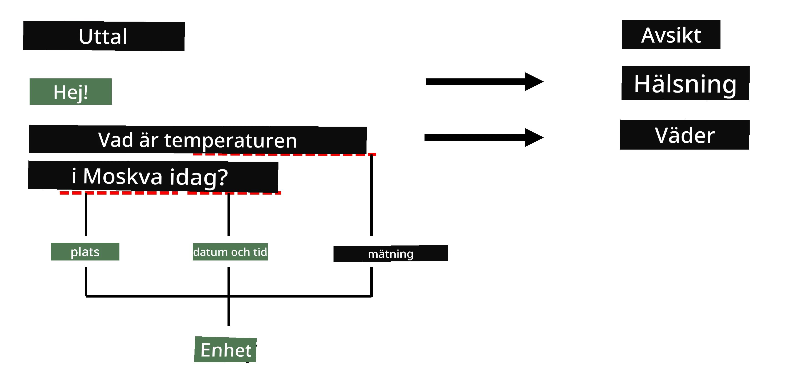
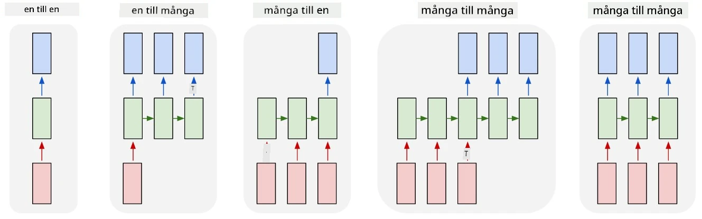

# Namngiven Entityigenkänning

Hittills har vi mest fokuserat på en NLP-uppgift - klassificering. Men det finns också andra NLP-uppgifter som kan lösas med neurala nätverk. En av dessa uppgifter är **[Namngiven Entityigenkänning](https://wikipedia.org/wiki/Named-entity_recognition)** (NER), som handlar om att identifiera specifika entiteter i text, såsom platser, personnamn, tidsintervall, kemiska formler och så vidare.

## [Quiz före föreläsningen](https://ff-quizzes.netlify.app/en/ai/quiz/37)

## Exempel på användning av NER

Anta att du vill utveckla en naturlig språkchatbot, liknande Amazon Alexa eller Google Assistant. Intelligenta chatbots fungerar genom att *förstå* vad användaren vill genom att utföra textklassificering på den inmatade meningen. Resultatet av denna klassificering är den så kallade **intentionen**, som avgör vad chatboten ska göra.

> Bild av författaren

Men en användare kan ge vissa parametrar som en del av frasen. Till exempel, när hon frågar om vädret, kan hon ange en plats eller ett datum. En bot bör kunna förstå dessa entiteter och fylla i parameterfälten därefter innan den utför åtgärden. Det är precis här NER kommer in.

> ✅ Ett annat exempel skulle vara [att analysera vetenskapliga medicinska artiklar](https://soshnikov.com/science/analyzing-medical-papers-with-azure-and-text-analytics-for-health/). En av de viktigaste sakerna vi behöver leta efter är specifika medicinska termer, såsom sjukdomar och medicinska substanser. Medan ett litet antal sjukdomar förmodligen kan extraheras med substring-sökning, kräver mer komplexa entiteter, såsom kemiska föreningar och medicinnamn, en mer avancerad metod.

## NER som Tokenklassificering

NER-modeller är i grunden **tokenklassificeringsmodeller**, eftersom vi för varje inmatad token måste avgöra om den tillhör en entitet eller inte, och om den gör det - vilken entitetsklass den tillhör.

Tänk på följande artikelrubrik:

**Tricuspidalklaffinsufficiens** och **litiumkarbonat** **toxicitet** hos ett nyfött barn.

Entiteter här är:

* Tricuspidalklaffinsufficiens är en sjukdom (`DIS`)
* Litiumkarbonat är en kemisk substans (`CHEM`)
* Toxicitet är också en sjukdom (`DIS`)

Observera att en entitet kan sträcka sig över flera tokens. Och, som i detta fall, måste vi skilja mellan två på varandra följande entiteter. Därför är det vanligt att använda två klasser för varje entitet - en som anger den första token i entiteten (ofta används prefixet `B-` för **början**), och en annan för fortsättningen av en entitet (`I-`, för **inre token). Vi använder också `O` som en klass för att representera alla **andra** tokens. Sådan tokenmärkning kallas [BIO-märkning](https://en.wikipedia.org/wiki/Inside%E2%80%93outside%E2%80%93beginning_(tagging)) (eller IOB). När den är märkt ser vår rubrik ut så här:

Token | Tagg
------|-----
Tricuspidalklaff | B-DIS
insufficiens | I-DIS
och | O
litium | B-CHEM
karbonat | I-CHEM
toxicitet | B-DIS
hos | O
ett | O
nyfött | O
barn | O
. | O

Eftersom vi behöver bygga en en-till-en-korrespondens mellan tokens och klasser, kan vi träna en högerställd **många-till-många** neural nätverksmodell från denna bild:

> *Bild från [denna bloggpost](http://karpathy.github.io/2015/05/21/rnn-effectiveness/) av [Andrej Karpathy](http://karpathy.github.io/). NER tokenklassificeringsmodeller motsvarar den högra nätverksarkitekturen på denna bild.*

## Träning av NER-modeller

Eftersom en NER-modell i grunden är en tokenklassificeringsmodell, kan vi använda RNN:er som vi redan är bekanta med för denna uppgift. I detta fall kommer varje block av det återkommande nätverket att returnera token-ID. Följande exempelnotebook visar hur man tränar LSTM för tokenklassificering.

## ✍️ Exempelnotebooks: NER

Fortsätt din inlärning i följande notebook:

* [NER med TensorFlow](NER-TF.ipynb)

## Slutsats

En NER-modell är en **tokenklassificeringsmodell**, vilket innebär att den kan användas för att utföra tokenklassificering. Detta är en mycket vanlig uppgift inom NLP, som hjälper till att identifiera specifika entiteter i text, inklusive platser, namn, datum och mer.

## 🚀 Utmaning

Slutför uppgiften som är länkad nedan för att träna en namngiven entityigenkänningsmodell för medicinska termer, och testa den sedan på en annan dataset.

## [Quiz efter föreläsningen](https://ff-quizzes.netlify.app/en/ai/quiz/38)

## Granskning & Självstudier

Läs igenom bloggen [The Unreasonable Effectiveness of Recurrent Neural Networks](http://karpathy.github.io/2015/05/21/rnn-effectiveness/) och följ med i avsnittet för vidare läsning i den artikeln för att fördjupa din kunskap.

## [Uppgift](lab/README.md)

I uppgiften för denna lektion kommer du att behöva träna en modell för medicinsk entityigenkänning. Du kan börja med att träna en LSTM-modell som beskrivs i denna lektion, och fortsätta med att använda BERT-transformermodellen. Läs [instruktionerna](lab/README.md) för att få alla detaljer.

---

