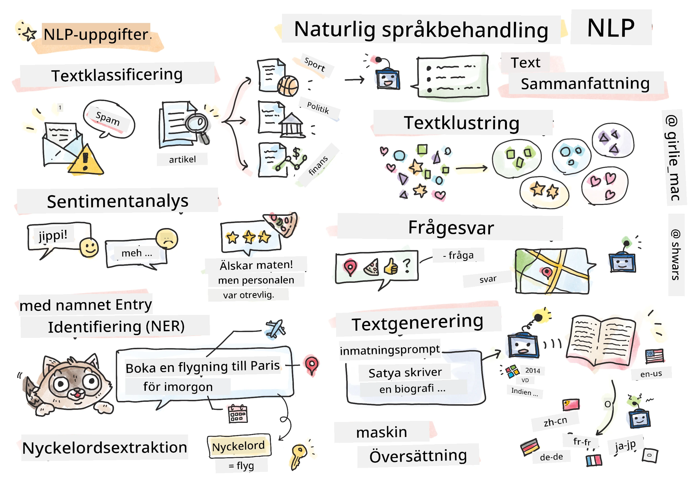

# Naturlig Språkbearbetning



I den här delen kommer vi att fokusera på att använda neurala nätverk för att hantera uppgifter relaterade till **naturlig språkbearbetning (NLP)**. Det finns många NLP-problem som vi vill att datorer ska kunna lösa:

* **Textklassificering** är ett typiskt klassificeringsproblem som rör textsekvenser. Exempel inkluderar att klassificera e-postmeddelanden som skräppost eller inte, eller att kategorisera artiklar som sport, ekonomi, politik, etc. När vi utvecklar chattbotar behöver vi ofta förstå vad en användare vill säga – i detta fall handlar det om **avsiktsklassificering**. Ofta måste vi hantera många kategorier i avsiktsklassificering.
* **Sentimentanalys** är ett typiskt regressionsproblem där vi behöver tilldela ett värde (ett sentiment) som motsvarar hur positivt/negativt innebörden av en mening är. En mer avancerad version av sentimentanalys är **aspektbaserad sentimentanalys** (ABSA), där vi tilldelar sentiment inte till hela meningen, utan till olika delar av den (aspekter), t.ex. *På den här restaurangen gillade jag maten, men atmosfären var hemsk*.
* **Named Entity Recognition** (NER) handlar om att extrahera vissa enheter från text. Till exempel kan vi behöva förstå att i frasen *Jag behöver flyga till Paris imorgon* hänvisar ordet *imorgon* till DATUM, och *Paris* är en PLATS.  
* **Nyckelordsutvinning** liknar NER, men här behöver vi automatiskt extrahera ord som är viktiga för meningen, utan att förträna för specifika enhetstyper.
* **Textklustring** kan vara användbart när vi vill gruppera liknande meningar, till exempel liknande förfrågningar i tekniska supportkonversationer.
* **Frågehantering** handlar om en modells förmåga att svara på en specifik fråga. Modellen får en textpassage och en fråga som indata, och den behöver ange en plats i texten där svaret på frågan finns (eller ibland generera själva svarstexten).
* **Textgenerering** är en modells förmåga att skapa ny text. Det kan ses som en klassificeringsuppgift där nästa bokstav/ord förutsägs baserat på en *textprompt*. Avancerade textgenereringsmodeller, som GPT-3, kan lösa andra NLP-uppgifter som klassificering med hjälp av en teknik som kallas [prompt-programmering](https://towardsdatascience.com/software-3-0-how-prompting-will-change-the-rules-of-the-game-a982fbfe1e0) eller [prompt-engineering](https://medium.com/swlh/openai-gpt-3-and-prompt-engineering-dcdc2c5fcd29).
* **Textsammanfattning** är en teknik där vi vill att en dator ska "läsa" lång text och sammanfatta den i några meningar.
* **Maskinöversättning** kan ses som en kombination av textförståelse på ett språk och textgenerering på ett annat.

Från början löstes de flesta NLP-uppgifter med traditionella metoder som grammatik. Till exempel användes parsers i maskinöversättning för att omvandla en ursprunglig mening till ett syntaxträd, sedan extraherades högre semantiska strukturer för att representera meningen av meningen, och baserat på denna mening och grammatiken i målspråket genererades resultatet. Idag löses många NLP-uppgifter mer effektivt med hjälp av neurala nätverk.

> Många klassiska NLP-metoder är implementerade i Python-biblioteket [Natural Language Processing Toolkit (NLTK)](https://www.nltk.org). Det finns en fantastisk [NLTK-bok](https://www.nltk.org/book/) tillgänglig online som täcker hur olika NLP-uppgifter kan lösas med NLTK.

I vår kurs kommer vi främst att fokusera på att använda neurala nätverk för NLP, och vi kommer att använda NLTK där det behövs.

Vi har redan lärt oss att använda neurala nätverk för att hantera tabulära data och bilder. Den största skillnaden mellan dessa typer av data och text är att text är en sekvens med variabel längd, medan indata i fallet med bilder är känd i förväg. Även om konvolutionella nätverk kan extrahera mönster från indata, är mönster i text mer komplexa. Till exempel kan negation vara separerad från subjektet med ett godtyckligt antal ord (t.ex. *Jag gillar inte apelsiner* vs. *Jag gillar inte de där stora färgglada goda apelsinerna*), och det bör fortfarande tolkas som ett mönster. Därför behöver vi introducera nya typer av neurala nätverk, såsom *rekurrenta nätverk* och *transformers*, för att hantera språk.

## Installera bibliotek

Om du använder en lokal Python-installation för att köra den här kursen kan du behöva installera alla nödvändiga bibliotek för NLP med följande kommandon:

**För PyTorch**
```bash
pip install -r requirements-torch.txt
```
**För TensorFlow**
```bash
pip install -r requirements-tf.txt
```

> Du kan prova NLP med TensorFlow på [Microsoft Learn](https://docs.microsoft.com/learn/modules/intro-natural-language-processing-tensorflow/?WT.mc_id=academic-77998-cacaste)

## GPU-varning

I den här delen kommer vi i vissa exempel att träna ganska stora modeller.
* **Använd en dator med GPU-stöd**: Det är lämpligt att köra dina anteckningsböcker på en dator med GPU-stöd för att minska väntetiderna när du arbetar med stora modeller.
* **Begränsningar för GPU-minne**: Att köra på en GPU kan leda till situationer där GPU-minnet tar slut, särskilt när du tränar stora modeller.
* **GPU-minnesförbrukning**: Mängden GPU-minne som används under träning beror på olika faktorer, inklusive minibatch-storleken.
* **Minimera minibatch-storlek**: Om du stöter på problem med GPU-minne, överväg att minska minibatch-storleken i din kod som en möjlig lösning.
* **TensorFlow GPU-minneshantering**: Äldre versioner av TensorFlow kanske inte frigör GPU-minne korrekt när flera modeller tränas inom en Python-kärna. För att hantera GPU-minnesanvändning effektivt kan du konfigurera TensorFlow att endast allokera GPU-minne vid behov.
* **Kod för inkludering**: För att ställa in TensorFlow att växa GPU-minnesallokering endast när det behövs, inkludera följande kod i dina anteckningsböcker:

```python
physical_devices = tf.config.list_physical_devices('GPU') 
if len(physical_devices)>0:
    tf.config.experimental.set_memory_growth(physical_devices[0], True) 
```

Om du är intresserad av att lära dig om NLP ur ett klassiskt ML-perspektiv, besök [denna serie lektioner](https://github.com/microsoft/ML-For-Beginners/tree/main/6-NLP)

## I den här delen
I den här delen kommer vi att lära oss om:

* [Att representera text som tensorer](13-TextRep/README.md)
* [Ordinbäddningar](14-Emdeddings/README.md)
* [Språkmodellering](15-LanguageModeling/README.md)
* [Rekurrenta neurala nätverk](16-RNN/README.md)
* [Generativa nätverk](17-GenerativeNetworks/README.md)
* [Transformers](18-Transformers/README.md)

---

**Ansvarsfriskrivning**:  
Detta dokument har översatts med hjälp av AI-översättningstjänsten [Co-op Translator](https://github.com/Azure/co-op-translator). Även om vi strävar efter noggrannhet, bör du vara medveten om att automatiserade översättningar kan innehålla fel eller inexaktheter. Det ursprungliga dokumentet på dess originalspråk bör betraktas som den auktoritativa källan. För kritisk information rekommenderas professionell mänsklig översättning. Vi ansvarar inte för eventuella missförstånd eller feltolkningar som uppstår vid användning av denna översättning.