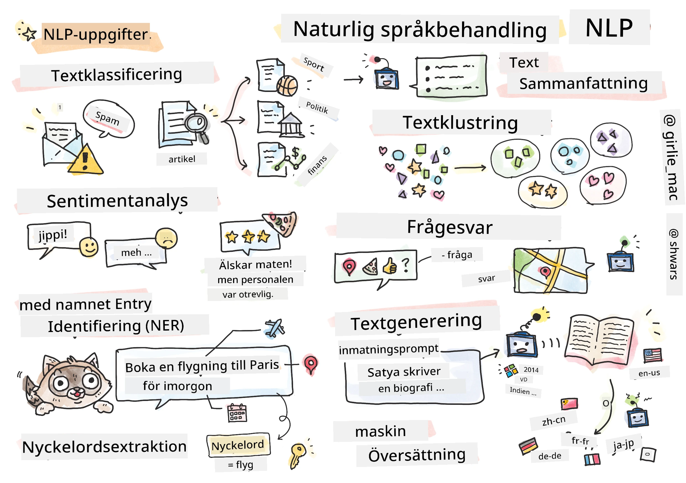

# Naturlig Språkbearbetning



I detta avsnitt kommer vi att fokusera på att använda neurala nätverk för att hantera uppgifter relaterade till **Naturlig Språkbearbetning (NLP)**. Det finns många NLP-problem som vi vill att datorer ska kunna lösa:

* **Textklassificering** är ett typiskt klassificeringsproblem som rör textsekvenser. Exempel inkluderar att klassificera e-postmeddelanden som skräppost vs. inte skräppost, eller att kategorisera artiklar som sport, affärer, politik, osv. Också när vi utvecklar chattbotar behöver vi ofta förstå vad en användare ville säga – i detta fall handlar det om **avsiktsklassificering**. Ofta, vid avsiktsklassificering, behöver vi hantera många kategorier.
* **Sentimentanalys** är ett typiskt regressionsproblem, där vi behöver tilldela ett nummer (en känsla) som motsvarar hur positiv/negativ meningen i en mening är. En mer avancerad version av sentimentanalys är **aspektbaserad sentimentanalys** (ABSA), där vi tilldelar sentiment inte till hela meningen, utan till olika delar av den (aspekter), t.ex. *I denna restaurang gillade jag maten, men atmosfären var hemsk*.
* **Named Entity Recognition** (NER) syftar på problemet att extrahera vissa entiteter från text. Till exempel kan vi behöva förstå att i frasen *Jag behöver flyga till Paris imorgon* refererar ordet *imorgon* till DATUM, och *Paris* är en PLATS.  
* **Nyckelordsutvinning** liknar NER, men vi behöver automatiskt extrahera ord som är viktiga för meningen i meningen, utan förträning för specifika entitetstyper.
* **Textklustring** kan vara användbart när vi vill gruppera liknande meningar, till exempel liknande förfrågningar i teknisk support.
* **Frågesvar** syftar på förmågan hos en modell att svara på en specifik fråga. Modellen får en textavsnitt och en fråga som indata, och den behöver ange en plats i texten där svaret på frågan finns (eller ibland generera svaret i textform).
* **Textgenerering** är en modells förmåga att generera ny text. Det kan ses som en klassificeringsuppgift där nästa bokstav/ord förutsägs baserat på någon *textprompt*. Avancerade textgenereringsmodeller, såsom GPT-3, kan lösa andra NLP-uppgifter som klassificering med en teknik som kallas [prompt programming](https://towardsdatascience.com/software-3-0-how-prompting-will-change-the-rules-of-the-game-a982fbfe1e0) eller [prompt engineering](https://medium.com/swlh/openai-gpt-3-and-prompt-engineering-dcdc2c5fcd29)
* **Textsammanfattning** är en teknik där vi vill att en dator "läser" lång text och sammanfattar den i några meningar.
* **Maskinöversättning** kan ses som en kombination av textförståelse på ett språk och textgenerering på ett annat.

Inledningsvis löstes de flesta NLP-uppgifter med traditionella metoder såsom grammatiker. Till exempel användes parsers i maskinöversättning för att omvandla den ursprungliga meningen till ett syntaxträd, sedan extraherades högre nivåers semantiska strukturer för att representera meningen av meningen, och baserat på denna mening och grammatiken i målspråket genererades resultatet. Numera löses många NLP-uppgifter mer effektivt med neurala nätverk.

> Många klassiska NLP-metoder är implementerade i Python-biblioteket [Natural Language Processing Toolkit (NLTK)](https://www.nltk.org). Det finns en utmärkt [NLTK Book](https://www.nltk.org/book/) tillgänglig online som täcker hur olika NLP-uppgifter kan lösas med NLTK.

I vår kurs kommer vi mestadels att fokusera på att använda neurala nätverk för NLP, och vi kommer att använda NLTK där det behövs.

Vi har redan lärt oss om att använda neurala nätverk för att hantera tabulär data och bilder. Den huvudsakliga skillnaden mellan dessa typer av data och text är att text är en sekvens med variabel längd, medan indatastorleken vid bilder är känd i förväg. Medan konvolutionsnätverk kan extrahera mönster från indata, är mönster i text mer komplexa. T.ex., kan negation vara separerad från subjektet med godtyckligt många ord (t.ex. *Jag gillar inte apelsiner*, vs. *Jag gillar inte de där stora färgglada goda apelsinerna*), och det bör ändå tolkas som ett mönster. Därför behöver vi nya typer av neurala nätverk för att hantera språk, såsom *rekurrenta nätverk* och *transformers*.

## Installera Bibliotek

Om du använder en lokal Python-installation för att köra denna kurs, kan du behöva installera alla nödvändiga bibliotek för NLP med följande kommandon:

**För PyTorch**
```bash
pip install -r requirements-pytorch.txt
```
**För TensorFlow**
```bash
pip install -r requirements-tf.txt
```

> Du kan prova NLP med TensorFlow på [Microsoft Learn](https://docs.microsoft.com/learn/modules/intro-natural-language-processing-tensorflow/?WT.mc_id=academic-77998-cacaste)

## GPU-varning

I detta avsnitt kommer vi i några av exemplen träna ganska stora modeller.
* **Använd en dator med GPU-stöd**: Det är rekommenderat att köra dina anteckningsböcker på en dator med GPU-stöd för att minska väntetider när du arbetar med stora modeller.
* **Begränsningar i GPU-minne**: Att köra på GPU kan leda till situationer där du får slut på GPU-minne, särskilt när du tränar stora modeller.
* **GPU-minnesförbrukning**: Mängden GPU-minne som förbrukas under träning beror på olika faktorer, bland annat minibatch-storleken.
* **Minimera minibatch-storleken**: Om du stöter på problem med GPU-minnet, överväg att minska minibatch-storleken i din kod som en möjlig lösning.
* **TensorFlow GPU-minnesfrigöring**: Äldre versioner av TensorFlow kan ha problem med att frigöra GPU-minnet korrekt när man tränar flera modeller i en och samma Python-kärna. För att effektivt hantera GPU-minnesanvändning kan du konfigurera TensorFlow att bara allokera GPU-minne vid behov.
* **Kod inkludering**: För att ställa in TensorFlow så att GPU-minnesallokeringen växer endast när det behövs, inkludera följande kod i dina anteckningsböcker:

```python
physical_devices = tf.config.list_physical_devices('GPU') 
if len(physical_devices)>0:
    tf.config.experimental.set_memory_growth(physical_devices[0], True) 
```

Om du är intresserad av att lära dig om NLP från ett klassiskt ML-perspektiv, besök [denna serie lektioner](https://github.com/microsoft/ML-For-Beginners/tree/main/6-NLP)

## I detta avsnitt
I detta avsnitt kommer vi att lära oss om:

* [Att representera text som tensorer](13-TextRep/README.md)
* [Ordbäddningar](14-Embeddings/README.md)
* [Språkmodellering](15-LanguageModeling/README.md)
* [Rekurrenta neurala nätverk](16-RNN/README.md)
* [Generativa nätverk](17-GenerativeNetworks/README.md)
* [Transformers](18-Transformers/README.md)

---

<!-- CO-OP TRANSLATOR DISCLAIMER START -->
**Ansvarsfriskrivning**:
Detta dokument har översatts med hjälp av AI-översättningstjänsten [Co-op Translator](https://github.com/Azure/co-op-translator). Även om vi strävar efter noggrannhet, var vänlig notera att automatiska översättningar kan innehålla fel eller brister. Det ursprungliga dokumentet på dess modersmål bör betraktas som den auktoritativa källan. För kritisk information rekommenderas professionell mänsklig översättning. Vi ansvarar inte för några missförstånd eller feltolkningar som uppstår till följd av användningen av denna översättning.
<!-- CO-OP TRANSLATOR DISCLAIMER END -->