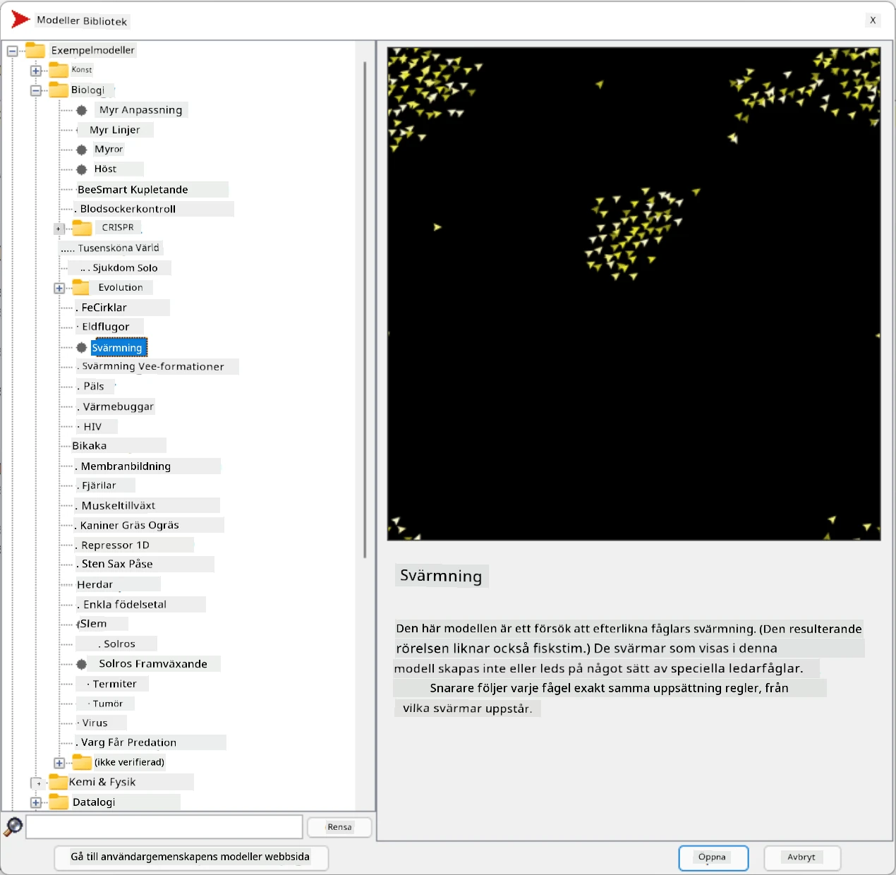
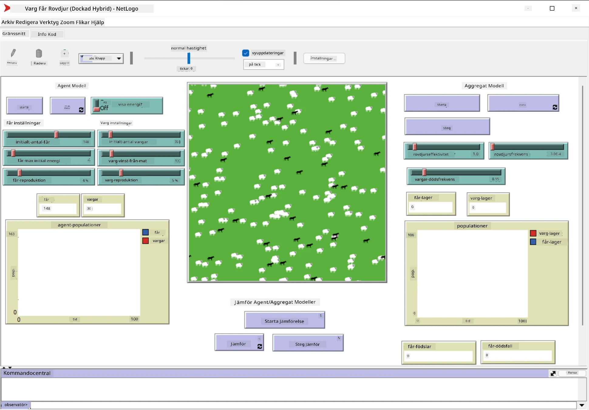

# Multi-Agent System

Ett av de möjliga sätten att uppnå intelligens är den så kallade **emergenta** (eller **synergetiska**) metoden, som bygger på att det kombinerade beteendet hos många relativt enkla agenter kan resultera i ett mer komplext (eller intelligent) beteende hos systemet som helhet. Teoretiskt baseras detta på principerna för [Kollektiv Intelligens](https://en.wikipedia.org/wiki/Collective_intelligence), [Emergentism](https://en.wikipedia.org/wiki/Global_brain) och [Evolutionär Cybernetik](https://en.wikipedia.org/wiki/Global_brain), som hävdar att högre nivåers system får någon form av mervärde när de kombineras korrekt från lägre nivåers system (den så kallade *principen om metasystemövergång*).

## [Quiz före föreläsningen](https://ff-quizzes.netlify.app/en/ai/quiz/45)

Riktningen **Multi-Agent Systems** uppstod inom AI på 1990-talet som ett svar på tillväxten av Internet och distribuerade system. En av de klassiska AI-läroböckerna, [Artificial Intelligence: A Modern Approach](https://en.wikipedia.org/wiki/Artificial_Intelligence:_A_Modern_Approach), fokuserar på klassisk AI ur perspektivet av multi-agent system.

Centralt för multi-agent metoden är begreppet **Agent** - en enhet som lever i en **miljö**, som den kan uppfatta och agera på. Detta är en mycket bred definition, och det kan finnas många olika typer och klassificeringar av agenter:

* Baserat på deras förmåga att resonera:
   - **Reaktiva** agenter har vanligtvis ett enkelt begär-svar-beteende
   - **Reflekterande** agenter använder någon form av logiskt resonemang och/eller planeringsförmåga
* Baserat på platsen där agenten kör sin kod:
   - **Statiska** agenter arbetar på en dedikerad nätverksnod
   - **Mobila** agenter kan flytta sin kod mellan nätverksnoder
* Baserat på deras beteende:
   - **Passiva agenter** har inga specifika mål. Sådana agenter kan reagera på externa stimuli, men kommer inte att initiera några handlingar själva.
   - **Aktiva agenter** har vissa mål som de strävar efter
   - **Kognitiva agenter** involverar komplex planering och resonemang

Multi-agent system används idag i ett antal applikationer:

* I spel använder många icke-spelbara karaktärer någon form av AI och kan betraktas som intelligenta agenter
* Vid videoproduktion görs rendering av komplexa 3D-scener som involverar folkmassor vanligtvis med hjälp av multi-agent simulering
* Vid systemmodellering används multi-agent metoden för att simulera beteendet hos en komplex modell. Till exempel har multi-agent metoden framgångsrikt använts för att förutsäga spridningen av COVID-19 globalt. Liknande metoder kan användas för att modellera trafik i en stad och se hur den reagerar på förändringar i trafikregler.
* I komplexa automationssystem kan varje enhet agera som en oberoende agent, vilket gör hela systemet mindre monolitiskt och mer robust.

Vi kommer inte att spendera mycket tid på att gå djupt in i multi-agent system, men vi ska titta på ett exempel på **Multi-Agent Modellering**.

## NetLogo

[NetLogo](https://ccl.northwestern.edu/netlogo/) är en miljö för multi-agent modellering baserad på en modifierad version av programmeringsspråket [Logo](https://en.wikipedia.org/wiki/Logo_(programming_language)). Detta språk utvecklades för att lära ut programmeringskoncept till barn och gör det möjligt att kontrollera en agent som kallas **sköldpadda**, som kan röra sig och lämna ett spår efter sig. Detta gör det möjligt att skapa komplexa geometriska figurer, vilket är ett mycket visuellt sätt att förstå en agents beteende.

I NetLogo kan vi skapa många sköldpaddor med kommandot `create-turtles`. Vi kan sedan beordra alla sköldpaddor att utföra vissa handlingar (i exemplet nedan - flytta 10 steg framåt):

```
create-turtles 10
ask turtles [
  forward 10
]
```

Naturligtvis är det inte intressant när alla sköldpaddor gör samma sak, så vi kan `ask` grupper av sköldpaddor, t.ex. de som befinner sig i närheten av en viss punkt. Vi kan också skapa sköldpaddor av olika *raser* med kommandot `breed [cats cat]`. Här är `cat` namnet på en ras, och vi behöver specificera både singular och plural, eftersom olika kommandon använder olika former för tydlighet.

> ✅ Vi kommer inte att gå in på att lära oss NetLogo-språket i sig - du kan besöka den fantastiska resursen [Beginner's Interactive NetLogo Dictionary](https://ccl.northwestern.edu/netlogo/bind/) om du är intresserad av att lära dig mer.

Du kan [ladda ner](https://ccl.northwestern.edu/netlogo/download.shtml) och installera NetLogo för att prova det.

### Modellbibliotek

En fantastisk sak med NetLogo är att det innehåller ett bibliotek med fungerande modeller som du kan prova. Gå till **File &rightarrow; Models Library**, och du har många kategorier av modeller att välja mellan.



> En skärmdump av modellbiblioteket av Dmitry Soshnikov

Du kan öppna en av modellerna, till exempel **Biology &rightarrow; Flocking**.

### Huvudprinciper

Efter att ha öppnat modellen tas du till huvudskärmen i NetLogo. Här är en exempelmodell som beskriver populationen av vargar och får, givet begränsade resurser (gräs).



> Skärmdump av Dmitry Soshnikov

På denna skärm kan du se:

* **Gränssnittet** som innehåller:
  - Huvudfältet, där alla agenter lever
  - Olika kontroller: knappar, reglage, etc.
  - Grafer som du kan använda för att visa parametrar för simuleringen
* **Kodfliken** som innehåller redigeraren där du kan skriva NetLogo-program

I de flesta fall skulle gränssnittet ha en **Setup**-knapp, som initierar simuleringsläget, och en **Go**-knapp som startar exekveringen. Dessa hanteras av motsvarande hanterare i koden som ser ut så här:

```
to go [
...
]
```

NetLogos värld består av följande objekt:

* **Agenter** (sköldpaddor) som kan röra sig över fältet och göra något. Du beordrar agenter med syntaxen `ask turtles [...]`, och koden inom hakparenteserna exekveras av alla agenter i *sköldpaddsläge*.
* **Plåster** är kvadratiska områden på fältet där agenter lever. Du kan referera till alla agenter på samma plåster, eller ändra plåsterfärger och vissa andra egenskaper. Du kan också `ask patches` att göra något.
* **Observatör** är en unik agent som kontrollerar världen. Alla knapphanterare exekveras i *observatörsläge*.

> ✅ Skönheten med en multi-agent miljö är att koden som körs i sköldpaddsläge eller plåsterläge exekveras samtidigt av alla agenter parallellt. Således kan du genom att skriva lite kod och programmera beteendet hos en enskild agent skapa ett komplext beteende hos simuleringssystemet som helhet.

### Flocking

Som ett exempel på multi-agent beteende, låt oss titta på **[Flocking](https://en.wikipedia.org/wiki/Flocking_(behavior))**. Flocking är ett komplext mönster som är mycket likt hur fågelflockar flyger. När du ser dem flyga kan du tro att de följer någon form av kollektiv algoritm, eller att de besitter någon form av *kollektiv intelligens*. Men detta komplexa beteende uppstår när varje enskild agent (i detta fall en *fågel*) endast observerar några andra agenter på kort avstånd och följer tre enkla regler:

* **Justering** - den styr mot den genomsnittliga riktningen hos närliggande agenter
* **Sammanhållning** - den försöker styra mot den genomsnittliga positionen hos grannar (*långdistansattraktion*)
* **Separation** - när den kommer för nära andra fåglar försöker den flytta sig bort (*kortdistansavstötning*)

Du kan köra flocking-exemplet och observera beteendet. Du kan också justera parametrar, såsom *grad av separation* eller *synfält*, som definierar hur långt varje fågel kan se. Observera att om du minskar synfältet till 0 blir alla fåglar blinda och flocking upphör. Om du minskar separationen till 0 samlas alla fåglar i en rak linje.

> ✅ Växla till **Kodfliken** och se var de tre reglerna för flocking (justering, sammanhållning och separation) implementeras i koden. Observera hur vi endast refererar till de agenter som är inom synhåll.

### Andra modeller att se

Det finns några fler intressanta modeller som du kan experimentera med:

* **Art &rightarrow; Fireworks** visar hur ett fyrverkeri kan betraktas som ett kollektivt beteende hos individuella eldströmmar
* **Social Science &rightarrow; Traffic Basic** och **Social Science &rightarrow; Traffic Grid** visar modellen för stadstrafik i 1D och 2D Grid med eller utan trafikljus. Varje bil i simuleringen följer följande regler:
   - Om utrymmet framför är tomt - accelerera (upp till en viss maxhastighet)
   - Om den ser ett hinder framför - bromsa (och du kan justera hur långt en förare kan se)
* **Social Science &rightarrow; Party** visar hur människor grupperar sig under en cocktailfest. Du kan hitta kombinationen av parametrar som leder till den snabbaste ökningen av gruppens lycka.

Som du kan se från dessa exempel kan multi-agent simuleringar vara ett användbart sätt att förstå beteendet hos ett komplext system bestående av individer som följer samma eller liknande logik. Det kan också användas för att kontrollera virtuella agenter, såsom [NPCs](https://en.wikipedia.org/wiki/NPC) i datorspel eller agenter i 3D-animerade världar.

## Reflekterande agenter

De agenter som beskrivs ovan är mycket enkla och reagerar på förändringar i miljön med hjälp av någon form av algoritm. Som sådana är de **reaktiva agenter**. Men ibland kan agenter resonera och planera sina handlingar, i vilket fall de kallas **reflekterande**.

Ett typiskt exempel skulle vara en personlig agent som får en instruktion från en människa att boka en semesterresa. Anta att det finns många agenter som lever på internet och kan hjälpa till. Den bör då kontakta andra agenter för att se vilka flyg som är tillgängliga, vad hotellpriserna är för olika datum och försöka förhandla fram det bästa priset. När semesterplanen är klar och bekräftad av ägaren kan den fortsätta med bokningen.

För att göra detta behöver agenter **kommunicera**. För att kommunikationen ska lyckas behöver de:

* Några **standardiserade språk för att utbyta kunskap**, såsom [Knowledge Interchange Format](https://en.wikipedia.org/wiki/Knowledge_Interchange_Format) (KIF) och [Knowledge Query and Manipulation Language](https://en.wikipedia.org/wiki/Knowledge_Query_and_Manipulation_Language) (KQML). Dessa språk är utformade baserat på [Speech Act-teorin](https://en.wikipedia.org/wiki/Speech_act).
* Dessa språk bör också inkludera några **protokoll för förhandlingar**, baserade på olika **auktionstyper**.
* En **gemensam ontologi** att använda, så att de refererar till samma begrepp och förstår deras semantik
* Ett sätt att **upptäcka** vad olika agenter kan göra, också baserat på någon form av ontologi

Reflekterande agenter är mycket mer komplexa än reaktiva, eftersom de inte bara reagerar på förändringar i miljön, utan också bör kunna *initiera* handlingar. En av de föreslagna arkitekturerna för reflekterande agenter är den så kallade Belief-Desire-Intention (BDI) agenten:

* **Beliefs** utgör en uppsättning kunskap om agentens miljö. Det kan struktureras som en kunskapsbas eller en uppsättning regler som en agent kan tillämpa på en specifik situation i miljön.
* **Desires** definierar vad en agent vill göra, dvs. dess mål. Till exempel är målet för den personliga assistentagenten ovan att boka en resa, och målet för en hotellagent är att maximera vinsten.
* **Intentions** är specifika handlingar som en agent planerar för att uppnå sina mål. Handlingar förändrar vanligtvis miljön och orsakar kommunikation med andra agenter.

Det finns några plattformar tillgängliga för att bygga multi-agent system, såsom [JADE](https://jade.tilab.com/). [Denna artikel](https://arxiv.org/ftp/arxiv/papers/2007/2007.08961.pdf) innehåller en översikt över multi-agent plattformar, tillsammans med en kort historia av multi-agent system och deras olika användningsområden.

## Slutsats

Multi-agent system kan ta mycket olika former och användas i många olika applikationer. 
De tenderar alla att fokusera på det enklare beteendet hos en enskild agent och uppnå mer komplext beteende hos det övergripande systemet tack vare **synergetisk effekt**.

## 🚀 Utmaning

Ta denna lektion till verkligheten och försök att konceptualisera ett multi-agent system som kan lösa ett problem. Vad skulle till exempel ett multi-agent system behöva göra för att optimera en skolbussrutt? Hur skulle det kunna fungera i ett bageri?

## [Quiz efter föreläsningen](https://ff-quizzes.netlify.app/en/ai/quiz/46)

## Granskning & Självstudier

Granska användningen av denna typ av system inom industrin. Välj ett område, såsom tillverkning eller spelindustrin, och upptäck hur multi-agent system kan användas för att lösa unika problem.

## [NetLogo-uppgift](assignment.md)

---

