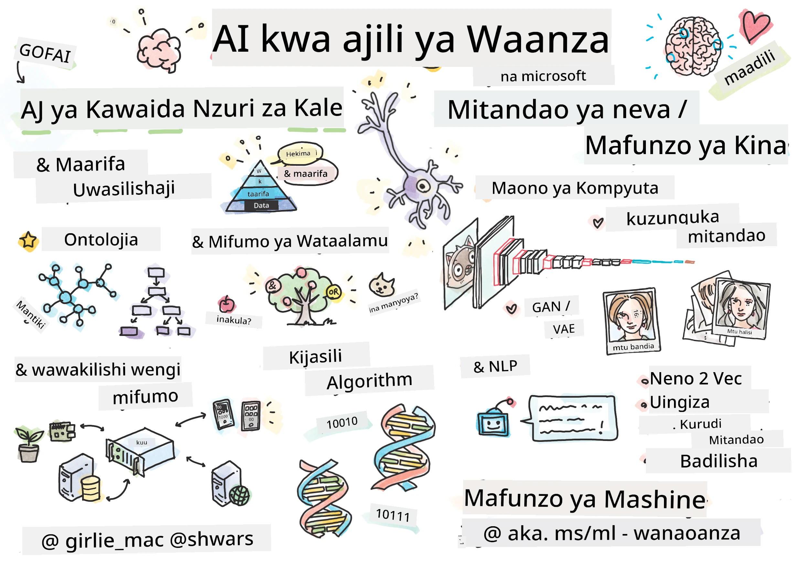

[](https://github.com/microsoft/AI-For-Beginners/blob/main/LICENSE)
[](https://GitHub.com/microsoft/AI-For-Beginners/graphs/contributors/)
[](https://GitHub.com/microsoft/AI-For-Beginners/issues/)
[](https://GitHub.com/microsoft/AI-For-Beginners/pulls/)
[](http://makeapullrequest.com)

[](https://GitHub.com/microsoft/AI-For-Beginners/watchers/)
[](https://GitHub.com/microsoft/AI-For-Beginners/network/)
[](https://GitHub.com/microsoft/AI-For-Beginners/stargazers/)
[](https://mybinder.org/v2/gh/microsoft/ai-for-beginners/HEAD)
[](https://gitter.im/Microsoft/ai-for-beginners?utm_source=badge&utm_medium=badge&utm_campaign=pr-badge)

[](https://discord.gg/nTYy5BXMWG)

# Akili Bandia kwa Waanzilishi - Mtaala

||
|:---:|
| Akili Bandia kwa Waanzilishi - _Picha Picha na [@girlie_mac](https://twitter.com/girlie_mac)_ |

Gundua ulimwengu wa **Akili Bandia** (AI) kwa mtaala wetu wa wiki 12 na somo 24! Inajumuisha masomo ya vitendo, maswali ya utambuzi, na maabara. Mtaala huu ni rafiki kwa wanaoanza na unashughulikia zana kama TensorFlow na PyTorch, pamoja na maadili katika AI.


### 🌐 Msaada wa Lugha Nyingi

#### Unaungwa mkono kupitia Hatua za GitHub (Kivoautomatia & Kila Wakati Kikiwa Sasisho)

<!-- CO-OP TRANSLATOR LANGUAGES TABLE START -->
[Kiarabu](../ar/README.md) | [Kibengali](../bn/README.md) | [Kibulgaria](../bg/README.md) | [Kiburma (Myanmari)](../my/README.md) | [Kichina (Kisalimu)](../zh-CN/README.md) | [Kichina (Kiasili, Hong Kong)](../zh-HK/README.md) | [Kichina (Kiasili, Makao)](../zh-MO/README.md) | [Kichina (Kiasili, Taiwan)](../zh-TW/README.md) | [Kikroeshia](../hr/README.md) | [Kicheki](../cs/README.md) | [Kidenmaki](../da/README.md) | [Kiholanzi](../nl/README.md) | [Kiestonia](../et/README.md) | [Kifini](../fi/README.md) | [Kifaransa](../fr/README.md) | [Kijerumani](../de/README.md) | [Kigiriki](../el/README.md) | [Kiebrania](../he/README.md) | [Kihindi](../hi/README.md) | [Kihungari](../hu/README.md) | [Kiindonesia](../id/README.md) | [Kiitaliano](../it/README.md) | [Kijapani](../ja/README.md) | [Kikannada](../kn/README.md) | [Kikorea](../ko/README.md) | [Kilithuania](../lt/README.md) | [Kimalay](../ms/README.md) | [Kimalayalam](../ml/README.md) | [Kimarathi](../mr/README.md) | [Kinepali](../ne/README.md) | [Kipidgin cha Nigeria](../pcm/README.md) | [Kinorwe](../no/README.md) | [Kiajemi (Farsi)](../fa/README.md) | [Kilandi](../pl/README.md) | [Kireno (Brazil)](../pt-BR/README.md) | [Kireno (Portugal)](../pt-PT/README.md) | [Kipunja (Gurmukhi)](../pa/README.md) | [Kironania](../ro/README.md) | [Kirusi](../ru/README.md) | [Kiserbia (Kisiriliki)](../sr/README.md) | [Kislovakia](../sk/README.md) | [Kislovenia](../sl/README.md) | [Kihispania](../es/README.md) | [Kiswahili](./README.md) | [Kiswidi](../sv/README.md) | [Kitagalog (Kifilipino)](../tl/README.md) | [Kitamili](../ta/README.md) | [Kitelugu](../te/README.md) | [Kithai](../th/README.md) | [Kituruki](../tr/README.md) | [Kiukreni](../uk/README.md) | [Kiurdu](../ur/README.md) | [Kivietinamu](../vi/README.md)

> **Unapenda Kuwakilisha Mahali Pale?**

> Hifadhidata hii ina tafsiri zaidi ya lugha 50 ambazo huongeza kiasi cha kupakua kwa kiasi kikubwa. Ili kuwakilisha bila tafsiri, tumia sparse checkout:
> ```bash
> git clone --filter=blob:none --sparse https://github.com/microsoft/AI-For-Beginners.git
> cd AI-For-Beginners
> git sparse-checkout set --no-cone '/*' '!translations' '!translated_images'
> ```
> Hii inakupa kila kitu unachohitaji kukamilisha kozi kwa kupakua kwa kasi zaidi.
<!-- CO-OP TRANSLATOR LANGUAGES TABLE END -->

**Ikiwa unataka kuwa na lugha za ziada za tafsiri zinazoungwa mkono ziko [hapa](https://github.com/Azure/co-op-translator/blob/main/getting_started/supported-languages.md)**

## Jiunge na Jamii
[](https://discord.gg/nTYy5BXMWG)

## Utajifunza Nini

**[Ramani ya Mawazo ya Kozi](http://soshnikov.com/courses/ai-for-beginners/mindmap.html)**

Katika mtaala huu, utajifunza:

* Mbinu tofauti za Akili Bandia, ikiwa ni pamoja na njia ya "kawaida" ya alama na **Uwakilishi wa Maarifa** na hoja ([GOFAI](https://en.wikipedia.org/wiki/Symbolic_artificial_intelligence)).
* **Mitandao ya Neva** na **Kujifunza kwa Kina**, ambavyo ni msingi wa AI ya kisasa. Tutataja dhana zinazohusika na mada hizi muhimu kwa kutumia msimbo katika mifumo miwili maarufu - [TensorFlow](http://Tensorflow.org) na [PyTorch](http://pytorch.org).
* **Miamala ya Neva** kwa kazi na picha na maandishi. Tutashughulikia mifano ya hivi karibuni lakini inaweza kuwa na upungufu kidogo katika hali ya kisasa kabisa.
* Mbinu zisizopendwa sana za AI, kama vile **Algorithmi za Kibayolojia** na **Mifumo ya Wakala Wengi**.

Tunavyotakuwa kuivunjika katika mtaala huu:

> [Pata rasilimali zote za ziada kwa kozi hii katika mkusanyiko wetu wa Microsoft Learn](https://learn.microsoft.com/en-us/collections/7w28iy2xrqzdj0?WT.mc_id=academic-77998-bethanycheum)

* Mifano ya biashara inayotumia **AI katika Biashara**. Fikiria kuchukua njia ya kujifunza [Utangulizi wa AI kwa watumiaji wa biashara](https://docs.microsoft.com/learn/paths/introduction-ai-for-business-users/?WT.mc_id=academic-77998-bethanycheum) kwenye Microsoft Learn, au [AI Business School](https://www.microsoft.com/ai/ai-business-school/?WT.mc_id=academic-77998-bethanycheum), iliyotengenezwa kwa ushirikiano na [INSEAD](https://www.insead.edu/).
* **Kujifunza kwa Mashine Kawaida**, ambako kimeelezewa vizuri katika [Mtaala wa Kujifunza kwa Mashine kwa Waanzilishi](http://github.com/Microsoft/ML-for-Beginners).
* Programu za vitendo za AI zilizojengwa kwa kutumia **[Huduma za Fahamu](https://azure.microsoft.com/services/cognitive-services/?WT.mc_id=academic-77998-bethanycheum)**. Kwa hili, tunapendekeza uanze na moduli za Microsoft Learn za [maono](https://docs.microsoft.com/learn/paths/create-computer-vision-solutions-azure-cognitive-services/?WT.mc_id=academic-77998-bethanycheum), [usindikaji wa lugha asilia](https://docs.microsoft.com/learn/paths/explore-natural-language-processing/?WT.mc_id=academic-77998-bethanycheum), **[AI ya kuzalisha na Azure OpenAI Service](https://learn.microsoft.com/en-us/training/paths/develop-ai-solutions-azure-openai/?WT.mc_id=academic-77998-bethanycheum)** na nyinginezo.
* **Mifumo Mahususi ya Wingu ya ML**, kama [Azure Machine Learning](https://azure.microsoft.com/services/machine-learning/?WT.mc_id=academic-77998-bethanycheum), [Microsoft Fabric](https://learn.microsoft.com/en-us/training/paths/get-started-fabric/?WT.mc_id=academic-77998-bethanycheum), au [Azure Databricks](https://docs.microsoft.com/learn/paths/data-engineer-azure-databricks?WT.mc_id=academic-77998-bethanycheum). Fikiria kutumia njia za kujifunza za [Jenga na endesha suluhisho za kujifunza mashine na Azure Machine Learning](https://docs.microsoft.com/learn/paths/build-ai-solutions-with-azure-ml-service/?WT.mc_id=academic-77998-bethanycheum) na [Jenga na Endesha Suluhisho za Kujifunza Mashine na Azure Databricks](https://docs.microsoft.com/learn/paths/build-operate-machine-learning-solutions-azure-databricks/?WT.mc_id=academic-77998-bethanycheum).
* **AI ya Mazungumzo** na **Bots za Mazungumzo**. Kuna njia tofauti ya kujifunza [Tengeneza suluhisho za AI za mazungumzo](https://docs.microsoft.com/learn/paths/create-conversational-ai-solutions/?WT.mc_id=academic-77998-bethanycheum), na unaweza pia rejelea [chapisho hili la blogu](https://soshnikov.com/azure/hello-bot-conversational-ai-on-microsoft-platform/) kwa maelezo zaidi.
* **Hisabati ya Kina** nyuma ya kujifunza kwa kina. Kwa hili, tunapendekeza [Deep Learning](https://www.amazon.com/Deep-Learning-Adaptive-Computation-Machine/dp/0262035618) ya Ian Goodfellow, Yoshua Bengio na Aaron Courville, ambayo pia inapatikana mtandaoni kwenye [https://www.deeplearningbook.org/](https://www.deeplearningbook.org/).

Kwa utangulizi mpole kwa mada za _AI katika Wingu_ unaweza kuzingatia kuchukua Njia ya Kujifunza [Anza na akili bandia kwenye Azure](https://docs.microsoft.com/learn/paths/get-started-with-artificial-intelligence-on-azure/?WT.mc_id=academic-77998-bethanycheum).

# Yaliyomo

|     |                                                                 Kiungo cha Somo                                                                  |                                           PyTorch/Keras/TensorFlow                                          | Maabara                                                            |
| :-: | :------------------------------------------------------------------------------------------------------------------------------------------: | :---------------------------------------------------------------------------------------------: | ------------------------------------------------------------------------------ |
| 0  |                                 [Mipangilio ya Kozi](./lessons/0-course-setup/setup.md)                                 |                      [Weka Mazingira Yako ya Maendeleo](./lessons/0-course-setup/how-to-run.md)                       |   |
| I  |               [**Utangulizi wa AI**](./lessons/1-Intro/README.md)      | | |
| 01  |       [Utangulizi na Historia ya AI](./lessons/1-Intro/README.md)       |           -                            | -  |
| II |              **AI ya Alama**              |
| 02  |       [Uwakilishi wa Maarifa na Mifumo ya Wataalamu](./lessons/2-Symbolic/README.md)       |            [Mifumo ya Wataalamu](./lessons/2-Symbolic/Animals.ipynb) /  [Ontolojia](./lessons/2-Symbolic/FamilyOntology.ipynb) /[Mchoro wa Dhana](./lessons/2-Symbolic/MSConceptGraph.ipynb)                             |  |
| III |                        [**Utangulizi kwa Mtandao wa Neva**](./lessons/3-NeuralNetworks/README.md) |||
| 03  |                [Perseptron](./lessons/3-NeuralNetworks/03-Perceptron/README.md)                 |                       [Daftari](./lessons/3-NeuralNetworks/03-Perceptron/Perceptron.ipynb)                      | [Semina](./lessons/3-NeuralNetworks/03-Perceptron/lab/README.md) |
| 04  |                   [Perseptroni yenye Tabaka Nyingi na Kuunda Mfumo Wetu wenyewe](./lessons/3-NeuralNetworks/04-OwnFramework/README.md)                   |        [Daftari](./lessons/3-NeuralNetworks/04-OwnFramework/OwnFramework.ipynb)        | [Semina](./lessons/3-NeuralNetworks/04-OwnFramework/lab/README.md) |
| 05  |            [Utangulizi kwa Mifumo (PyTorch/TensorFlow) na Kupitiliza Kujifunza](./lessons/3-NeuralNetworks/05-Frameworks/README.md)             |           [PyTorch](./lessons/3-NeuralNetworks/05-Frameworks/IntroPyTorch.ipynb) / [Keras](./lessons/3-NeuralNetworks/05-Frameworks/IntroKeras.ipynb) / [TensorFlow](./lessons/3-NeuralNetworks/05-Frameworks/IntroKerasTF.ipynb)             | [Semina](./lessons/3-NeuralNetworks/05-Frameworks/lab/README.md) |
| IV  |            [**Uchunguzi wa Kompyuta**](./lessons/4-ComputerVision/README.md)             | [PyTorch](https://docs.microsoft.com/learn/modules/intro-computer-vision-pytorch/?WT.mc_id=academic-77998-cacaste) / [TensorFlow](https://docs.microsoft.com/learn/modules/intro-computer-vision-TensorFlow/?WT.mc_id=academic-77998-cacaste)| [Chunguza Uchunguzi wa Kompyuta kwenye Microsoft Azure](https://learn.microsoft.com/en-us/collections/7w28iy2xrqzdj0?WT.mc_id=academic-77998-bethanycheum) |
| 06  |            [Utangulizi kwa Uchunguzi wa Kompyuta. OpenCV](./lessons/4-ComputerVision/06-IntroCV/README.md)             |           [Daftari](./lessons/4-ComputerVision/06-IntroCV/OpenCV.ipynb)         | [Semina](./lessons/4-ComputerVision/06-IntroCV/lab/README.md) |
| 07  |            [Mitandao ya Neva ya Kuunganisha](./lessons/4-ComputerVision/07-ConvNets/README.md) &  [Miundo ya CNN](./lessons/4-ComputerVision/07-ConvNets/CNN_Architectures.md)             |           [PyTorch](./lessons/4-ComputerVision/07-ConvNets/ConvNetsPyTorch.ipynb) /[TensorFlow](./lessons/4-ComputerVision/07-ConvNets/ConvNetsTF.ipynb)             | [Semina](./lessons/4-ComputerVision/07-ConvNets/lab/README.md) |
| 08  |            [Mitandao Iliyofunzwa awali na Kujifunza Kuanzisha](./lessons/4-ComputerVision/08-TransferLearning/README.md) na [Mbinu za Mafunzo](./lessons/4-ComputerVision/08-TransferLearning/TrainingTricks.md)             |           [PyTorch](./lessons/4-ComputerVision/08-TransferLearning/TransferLearningPyTorch.ipynb) / [TensorFlow](./lessons/3-NeuralNetworks/05-Frameworks/IntroKerasTF.ipynb)             | [Semina](./lessons/4-ComputerVision/08-TransferLearning/lab/README.md) |
| 09  |            [Autoencoders na VAEs](./lessons/4-ComputerVision/09-Autoencoders/README.md)             |           [PyTorch](./lessons/4-ComputerVision/09-Autoencoders/AutoEncodersPyTorch.ipynb) / [TensorFlow](./lessons/4-ComputerVision/09-Autoencoders/AutoencodersTF.ipynb)             |  |
| 10  |            [Mitandao ya Ushindani wa Kizazi & Uhamishaji wa Mtindo wa Sanaa](./lessons/4-ComputerVision/10-GANs/README.md)             |           [PyTorch](./lessons/4-ComputerVision/10-GANs/GANPyTorch.ipynb) / [TensorFlow](./lessons/4-ComputerVision/10-GANs/GANTF.ipynb)             |  |
| 11  |            [Utambuzi wa Vitu](./lessons/4-ComputerVision/11-ObjectDetection/README.md)             |         [TensorFlow](./lessons/4-ComputerVision/11-ObjectDetection/ObjectDetection.ipynb)             | [Semina](./lessons/4-ComputerVision/11-ObjectDetection/lab/README.md) |
| 12  |            [Ugawaji wa Maana. U-Net](./lessons/4-ComputerVision/12-Segmentation/README.md)             |           [PyTorch](./lessons/4-ComputerVision/12-Segmentation/SemanticSegmentationPytorch.ipynb) / [TensorFlow](./lessons/4-ComputerVision/12-Segmentation/SemanticSegmentationTF.ipynb)             |  |
| V  |            [**Usindikaji Lugha Asilia**](./lessons/5-NLP/README.md)             | [PyTorch](https://docs.microsoft.com/learn/modules/intro-natural-language-processing-pytorch/?WT.mc_id=academic-77998-cacaste) /[TensorFlow](https://docs.microsoft.com/learn/modules/intro-natural-language-processing-TensorFlow/?WT.mc_id=academic-77998-cacaste) | [Chunguza Usindikaji Lugha Asilia kwenye Microsoft Azure](https://learn.microsoft.com/en-us/collections/7w28iy2xrqzdj0?WT.mc_id=academic-77998-bethanycheum)|
| 13  |            [Uwakilishi wa Maneno. Bow/TF-IDF](./lessons/5-NLP/13-TextRep/README.md)             |           [PyTorch](https://github.com/microsoft/AI-For-Beginners/blob/main/lessons/5-NLP/13-TextRep/TextRepresentationPyTorch.ipynb) / [TensorFlow](https://github.com/microsoft/AI-For-Beginners/blob/main/lessons/5-NLP/13-TextRep/TextRepresentationTF.ipynb)             | |
| 14  |            [M wekahishaji wa Maneno ya Maana. Word2Vec na GloVe](./lessons/5-NLP/14-Embeddings/README.md)             |           [PyTorch](https://github.com/microsoft/AI-For-Beginners/blob/main/lessons/5-NLP/14-Embeddings/EmbeddingsPyTorch.ipynb) / [TensorFlow](https://github.com/microsoft/AI-For-Beginners/blob/main/lessons/5-NLP/14-Embeddings/EmbeddingsTF.ipynb)             |  |
| 15  |            [Uundaji Lugha. Mafunzo ya Wekaisho zako mwenyewe](./lessons/5-NLP/15-LanguageModeling/README.md)             |           [PyTorch](https://github.com/microsoft/AI-For-Beginners/blob/main/lessons/5-NLP/15-LanguageModeling/CBoW-PyTorch.ipynb) / [TensorFlow](https://github.com/microsoft/AI-For-Beginners/blob/main/lessons/5-NLP/15-LanguageModeling/CBoW-TF.ipynb)             | [Semina](./lessons/5-NLP/15-LanguageModeling/lab/README.md) |
| 16  |            [Mitandao ya Neva Inayojiendesha](./lessons/5-NLP/16-RNN/README.md)             |           [PyTorch](https://github.com/microsoft/AI-For-Beginners/blob/main/lessons/5-NLP/16-RNN/RNNPyTorch.ipynb) / [TensorFlow](https://github.com/microsoft/AI-For-Beginners/blob/main/lessons/5-NLP/16-RNN/RNNTF.ipynb)             |  |
| 17  |            [Mitandao ya Neva ya Kizazi Inayojiendesha](./lessons/5-NLP/17-GenerativeNetworks/README.md)             |           [PyTorch](https://github.com/microsoft/AI-For-Beginners/blob/main/lessons/5-NLP/17-GenerativeNetworks/GenerativePyTorch.ipynb) / [TensorFlow](https://github.com/microsoft/AI-For-Beginners/blob/main/lessons/5-NLP/17-GenerativeNetworks/GenerativeTF.ipynb)             | [Semina](./lessons/5-NLP/17-GenerativeNetworks/lab/README.md) |
| 18  |            [Transformers. BERT.](./lessons/5-NLP/18-Transformers/README.md)             |           [PyTorch](https://github.com/microsoft/AI-For-Beginners/blob/main/lessons/5-NLP/18-Transformers/TransformersPyTorch.ipynb) /[TensorFlow](https://github.com/microsoft/AI-For-Beginners/blob/main/lessons/5-NLP/18-Transformers/TransformersTF.ipynb)             |  |
| 19  |            [Utambuzi wa Vyombo Vilivyoainishwa](./lessons/5-NLP/19-NER/README.md)             |           [TensorFlow](https://microsoft.github.io/AI-For-Beginners/lessons/5-NLP/19-NER/NER-TF.ipynb)             | [Semina](./lessons/5-NLP/19-NER/lab/README.md) |
| 20  |            [Modeli Kubwa za Lugha, Uandishi wa Haitihati na Kazi chache za Kumuonyesha](./lessons/5-NLP/20-LangModels/README.md)             |           [PyTorch](https://microsoft.github.io/AI-For-Beginners/lessons/5-NLP/20-LangModels/GPT-PyTorch.ipynb) | |
| VI |            **Mbinu Nyingine za AI** || |
| 21  |            [Algoritmi za Kijenetiki](./lessons/6-Other/21-GeneticAlgorithms/README.md)             |           [Daftari](./lessons/6-Other/21-GeneticAlgorithms/Genetic.ipynb) | |
| 22  |            [Mafunzo ya Tiefu ya Uimarishaji](./lessons/6-Other/22-DeepRL/README.md)             |           [PyTorch](./lessons/6-Other/22-DeepRL/CartPole-RL-PyTorch.ipynb) /[TensorFlow](./lessons/6-Other/22-DeepRL/CartPole-RL-TF.ipynb)             | [Semina](./lessons/6-Other/22-DeepRL/lab/README.md) |
| 23  |            [Mifumo ya Wakala Wengi](./lessons/6-Other/23-MultiagentSystems/README.md)             |  | |
| VII |            **Maadili ya AI** | | |
| 24  |            [Maadili ya AI na AI yenye Uwajibikaji](./lessons/7-Ethics/README.md)             |           [Microsoft Learn: Kanuni za AI yenye Uwajibikaji](https://docs.microsoft.com/learn/paths/responsible-ai-business-principles/?WT.mc_id=academic-77998-cacaste) | |
| IX  |            **Zidisho** | | |
| 25  |            [Mitandao ya Modal nyingi, CLIP na VQGAN](./lessons/X-Extras/X1-MultiModal/README.md)             |           [Daftari](./lessons/X-Extras/X1-MultiModal/Clip.ipynb)    | |

## Kila somo lina

* Nyenzo za kusoma kabla
* Daftari za Jupyter zinazoweza kutekelezwa, ambazo mara nyingi zinategemea mfumo maalum (**PyTorch** au **TensorFlow**). Daftari inayoweza kutekelezwa pia ina nadharia nyingi, hivyo kuelewa mada unahitaji kupitia angalau toleo moja la daftari (PyTorch au TensorFlow).
* **Maabara** zinapatikana kwa baadhi ya mada, zinazokupa fursa ya kujaribu kutumia nyenzo ulizojifunza kwa tatizo fulani.
* Sehemu zingine zina viungo vya modules za [**MS Learn**](https://learn.microsoft.com/en-us/collections/7w28iy2xrqzdj0?WT.mc_id=academic-77998-bethanycheum) zinazoshughulikia mada zinazohusiana.

## Kuanzia

### 🎯 Mpya kwa AI? Anza Hapa!

Ikiwa wewe ni mpya kabisa kwa AI na unataka mifano ya haraka na ya vitendo, angalia [**Mifano Rahisi kwa Wa Mwanzo**](./examples/README.md)! Hizi ni pamoja na:

- 🌟 **Habari Dunia ya AI** - Programu yako ya kwanza ya AI (utambuzi wa mifumo)
- 🧠 **Mtandao wa Neva Rahisi** - Jenga mtandao wa neva kutoka mwanzo  

- 🖼️ **Kipangishaji Picha** - Pangilia picha zako kwa maelezo ya kina
- 💬 **Hisia za Maandishi** - Changanua maandishi chanya/negativa

Mifano hii imeundwa kukusaidia kuelewa dhana za AI kabla ya kuingia kwenye mtaala mzima.

### 📚 Mipangilio ya Mtaala Kamili

- Tumetengeneza [somo la mipangilio](./lessons/0-course-setup/setup.md) kukuza msaada wa kuweka mazingira yako ya maendeleo. - Kwa Walimu, tumetengeneza [somu la mipangilio ya mitaala](./lessons/0-course-setup/for-teachers.md) pia kwa ajili yenu!
- Jinsi ya [Kuendesha nambari katika VSCode au Codespace](./lessons/0-course-setup/how-to-run.md)

Fuata hatua hizi:

Fanya Nakala ya Hazina: Bonyeza kitufe cha "Fork" kilicho kona ya juu kulia ya ukurasa huu.

Nakili Hazina: `git clone https://github.com/microsoft/AI-For-Beginners.git`

Usisahau kuipa nyota (🌟) hazina hii kupata kirahisi baadaye.

## Kutana na Wanafunzi Wengine

Ungana na [server rasmi ya AI Discord](https://aka.ms/genai-discord?WT.mc_id=academic-105485-bethanycheum) ili ukutane na kuungana na wanafunzi wengine wanaojifunza kozi hii na kupata msaada.

Kama una maoni au maswali kuhusu bidhaa wakati wa kujenga, tembelea [Azure AI Foundry Developer Forum](https://aka.ms/foundry/forum)

## Mtihani 

> **Kumbuka kuhusu mitihani**: Mitihani yote iko katika folda ya Quiz-app ndani ya etc\quiz-app, au [Mtandaoni Hapa](https://ff-quizzes.netlify.app/) Imeunganishwa kutoka ndani ya masomo, programu ya mtihani inaweza kuendeshwa kwa local au kuachwa Azure; fuata maelekezo katika folda `quiz-app`. Hizo ziko katika mchakato wa kutafsiriwa kidogo kidogo.

## Tunahitaji Msaada

Je, una mapendekezo au umeona makosa ya tahajia au nambari? Wasilisha suala au tengeneza ombi la kuchangia.

## Shukrani Maalum

* **✍️ Mwandishi Mkuu:** [Dmitry Soshnikov](http://soshnikov.com), PhD
* **🔥 Mhariri:** [Jen Looper](https://twitter.com/jenlooper), PhD
* **🎨 Mchora Sketchnote:** [Tomomi Imura](https://twitter.com/girlie_mac)
* **✅ Mtengenezaji wa Mitihani:** [Lateefah Bello](https://github.com/CinnamonXI), [MLSA](https://studentambassadors.microsoft.com/)
* **🙏 Washiriki Wakuu:** [Evgenii Pishchik](https://github.com/Pe4enIks)

## Mitaala Mengine

Timu yetu hutengeneza mitaala mingine! Angalia:

<!-- CO-OP TRANSLATOR OTHER COURSES START -->
### LangChain
[](https://aka.ms/langchain4j-for-beginners)
[](https://aka.ms/langchainjs-for-beginners?WT.mc_id=m365-94501-dwahlin)
[](https://github.com/microsoft/langchain-for-beginners?WT.mc_id=m365-94501-dwahlin)
---

### Azure / Edge / MCP / Agents
[](https://github.com/microsoft/AZD-for-beginners?WT.mc_id=academic-105485-koreyst)
[](https://github.com/microsoft/edgeai-for-beginners?WT.mc_id=academic-105485-koreyst)
[](https://github.com/microsoft/mcp-for-beginners?WT.mc_id=academic-105485-koreyst)
[](https://github.com/microsoft/ai-agents-for-beginners?WT.mc_id=academic-105485-koreyst)

---
 
### Generative AI Series
[](https://github.com/microsoft/generative-ai-for-beginners?WT.mc_id=academic-105485-koreyst)
[-9333EA?style=for-the-badge&labelColor=E5E7EB&color=9333EA)](https://github.com/microsoft/Generative-AI-for-beginners-dotnet?WT.mc_id=academic-105485-koreyst)
[-C084FC?style=for-the-badge&labelColor=E5E7EB&color=C084FC)](https://github.com/microsoft/generative-ai-for-beginners-java?WT.mc_id=academic-105485-koreyst)
[-E879F9?style=for-the-badge&labelColor=E5E7EB&color=E879F9)](https://github.com/microsoft/generative-ai-with-javascript?WT.mc_id=academic-105485-koreyst)

---
 
### Core Learning
[](https://aka.ms/ml-beginners?WT.mc_id=academic-105485-koreyst)
[](https://aka.ms/datascience-beginners?WT.mc_id=academic-105485-koreyst)
[](https://aka.ms/ai-beginners?WT.mc_id=academic-105485-koreyst)
[](https://github.com/microsoft/Security-101?WT.mc_id=academic-96948-sayoung)
[](https://aka.ms/webdev-beginners?WT.mc_id=academic-105485-koreyst)
[](https://aka.ms/iot-beginners?WT.mc_id=academic-105485-koreyst)
[](https://github.com/microsoft/xr-development-for-beginners?WT.mc_id=academic-105485-koreyst)

---
 
### Copilot Series
[](https://aka.ms/GitHubCopilotAI?WT.mc_id=academic-105485-koreyst)
[](https://github.com/microsoft/mastering-github-copilot-for-dotnet-csharp-developers?WT.mc_id=academic-105485-koreyst)
[](https://github.com/microsoft/CopilotAdventures?WT.mc_id=academic-105485-koreyst)
<!-- CO-OP TRANSLATOR OTHER COURSES END -->

## Kupata Msaada

Kama umeishia au una maswali yoyote kuhusu kujenga programu za AI. Ungana na wanafunzi wenza na waendelezaji wenye uzoefu katika mijadala kuhusu MCP. Ni jamii yenye msaada ambapo maswali yanakaribishwa na maarifa hushirikiwa huru.

[](https://discord.gg/nTYy5BXMWG)

Kama una maoni kuhusu bidhaa au makosa wakati wa kujenga tembelea:

[](https://aka.ms/foundry/forum)

---

<!-- CO-OP TRANSLATOR DISCLAIMER START -->
**Katombo La Majukumu**:
Nyaraka hii imetafsiriwa kwa kutumia huduma ya tafsiri ya AI [Co-op Translator](https://github.com/Azure/co-op-translator). Ingawa tunajitahidi kuhakikisha usahihi, tafadhali fahamu kwamba tafsiri za kiotomatiki zinaweza kuwa na makosa au kasoro. Nyaraka ya asili katika lugha yake ya asili inapaswa kuzingatiwa kama chanzo cha mamlaka. Kwa taarifa muhimu, tafsiri ya kitaalamu inayotolewa na watu inashauriwa. Hatubebei lawama kwa kutoelewana au tafsiri potofu zinazotokana na matumizi ya tafsiri hii.
<!-- CO-OP TRANSLATOR DISCLAIMER END -->