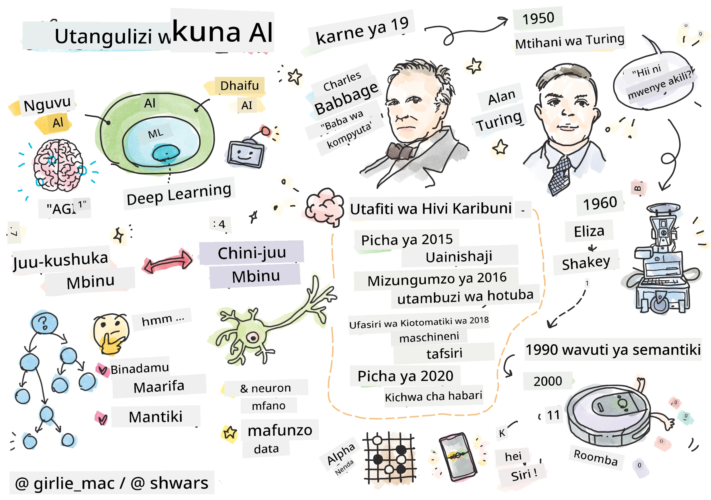
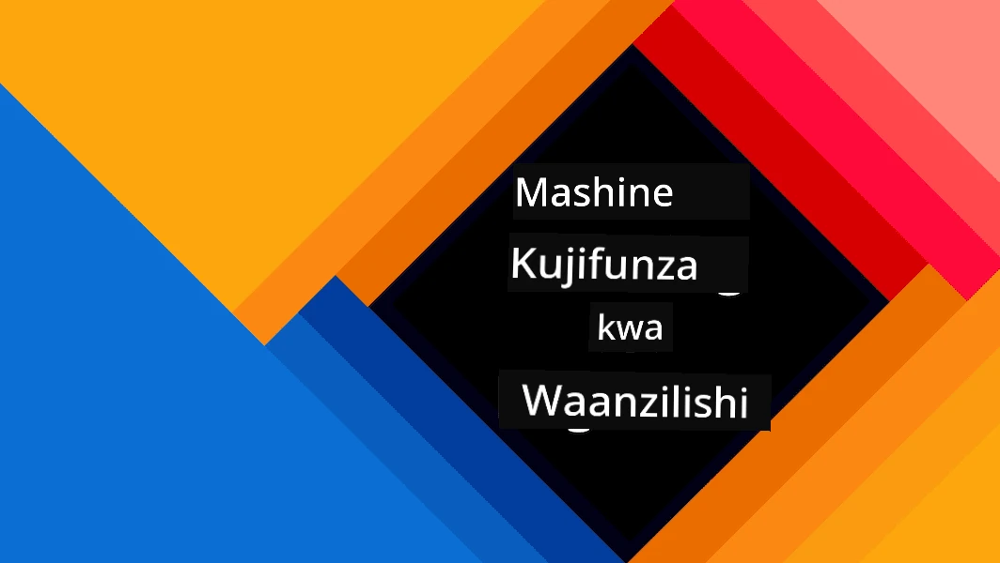
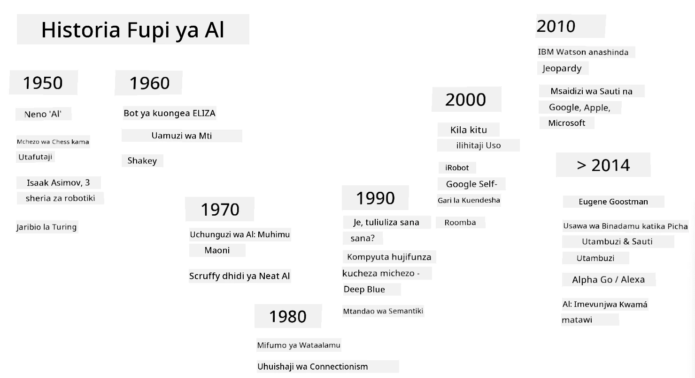
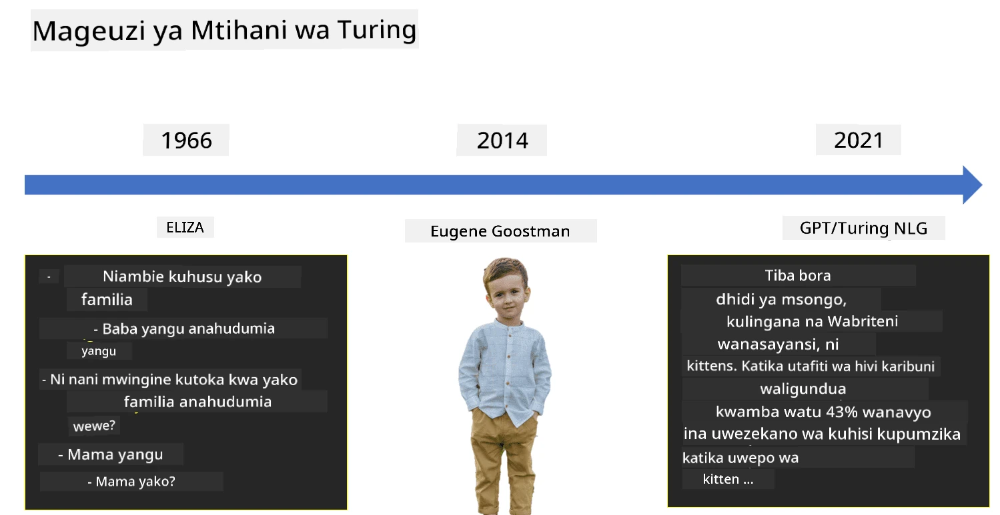

# Utangulizi wa AI

> Mchoro na [Tomomi Imura](https://twitter.com/girlie_mac)

## [Jaribio la kabla ya somo](https://ff-quizzes.netlify.app/en/ai/quiz/1)

**Akili Bandia** ni taaluma ya kisayansi ya kusisimua inayochunguza jinsi tunavyoweza kufanya kompyuta kuonyesha tabia ya akili, kwa mfano kufanya mambo ambayo binadamu ni wazuri kuyafanya.

Awali, kompyuta ziligunduliwa na [Charles Babbage](https://en.wikipedia.org/wiki/Charles_Babbage) ili kufanya kazi na namba kwa kufuata utaratibu ulioelezwa vizuri - algorithimu. Kompyuta za kisasa, ingawa zimeendelea sana kuliko mfano wa awali uliopendekezwa katika karne ya 19, bado zinafuata wazo lile lile la hesabu zinazoongozwa. Kwa hivyo inawezekana kuipanga kompyuta kufanya jambo fulani ikiwa tunajua mlolongo halisi wa hatua tunazohitaji kuchukua ili kufanikisha lengo.

> Picha na [Vickie Soshnikova](http://twitter.com/vickievalerie)

> ✅ Kufafanua umri wa mtu kutoka kwa picha yake ni kazi ambayo haiwezi kupangwa waziwazi, kwa sababu hatujui jinsi tunavyopata namba ndani ya akili zetu tunapofanya hivyo.

---

Kuna baadhi ya kazi, hata hivyo, ambazo hatujui waziwazi jinsi ya kuzitatua. Fikiria kuamua umri wa mtu kutoka kwa picha yake. Tunajifunza kufanya hivyo kwa namna fulani, kwa sababu tumeona mifano mingi ya watu wa umri tofauti, lakini hatuwezi kueleza waziwazi jinsi tunavyofanya hivyo, wala hatuwezi kuipanga kompyuta kufanya hivyo. Hii ni aina ya kazi inayovutia **Akili Bandia** (AI kwa kifupi).

✅ Fikiria baadhi ya kazi ambazo ungeweza kuhamishia kwa kompyuta ambazo zingefaidika na AI. Fikiria nyanja za fedha, tiba, na sanaa - nyanja hizi zinanufaikaje leo kutokana na AI?

## AI Dhaifu vs. AI Nguvu

AI Dhaifu | AI Nguvu
---------------------------------------|-------------------------------------
AI dhaifu inahusu mifumo ya AI ambayo imeundwa na kufundishwa kwa kazi maalum au seti ndogo ya kazi.|AI Nguvu, au Akili Bandia ya Kijumla (AGI), inahusu mifumo ya AI yenye akili ya kiwango cha binadamu na uelewa.
Mifumo hii ya AI si ya akili kwa ujumla; inang'aa katika kutekeleza kazi iliyofafanuliwa lakini haina uelewa wa kweli au ufahamu.|Mifumo hii ya AI ina uwezo wa kutekeleza kazi yoyote ya kiakili ambayo binadamu anaweza kufanya, kubadilika kwa nyanja tofauti, na kuwa na aina ya ufahamu au kujitambua.
Mifano ya AI dhaifu ni pamoja na wasaidizi wa mtandaoni kama Siri au Alexa, algorithimu za mapendekezo zinazotumiwa na huduma za utiririshaji, na chatbots zilizoundwa kwa kazi maalum za huduma kwa wateja.|Kufanikisha AI Nguvu ni lengo la muda mrefu la utafiti wa AI na kungehitaji maendeleo ya mifumo ya AI inayoweza kufikiri, kujifunza, kuelewa, na kubadilika katika anuwai ya kazi na muktadha.
AI dhaifu ni maalum sana na haina uwezo wa kiakili wa binadamu au uwezo wa kutatua matatizo kwa ujumla nje ya uwanja wake mdogo.|AI Nguvu kwa sasa ni dhana ya kinadharia, na hakuna mfumo wa AI ambao umefikia kiwango hiki cha akili ya kijumla.

Kwa maelezo zaidi rejelea **[Akili Bandia ya Kijumla](https://en.wikipedia.org/wiki/Artificial_general_intelligence)** (AGI).
## Ufafanuzi wa Akili na Mtihani wa Turing

Moja ya matatizo tunaposhughulikia neno **[Akili](https://en.wikipedia.org/wiki/Intelligence)** ni kwamba hakuna ufafanuzi wazi wa neno hili. Mtu anaweza kusema akili inahusiana na **fikra za dhahania**, au na **kujifahamu**, lakini hatuwezi kuifafanua ipasavyo.

> [Picha](https://unsplash.com/photos/75715CVEJhI) na [Amber Kipp](https://unsplash.com/@sadmax) kutoka Unsplash

Ili kuona utata wa neno *akili*, jaribu kujibu swali: "Je, paka ana akili?". Watu tofauti huwa na majibu tofauti kwa swali hili, kwa kuwa hakuna mtihani unaokubalika ulimwenguni kuthibitisha dai hilo ni kweli au si kweli. Na ikiwa unafikiri kuna - jaribu kumfanyisha paka wako mtihani wa IQ...

✅ Fikiria kwa dakika moja jinsi unavyofafanua akili. Je, kunguru anayejua kutatua fumbo na kupata chakula ni mwenye akili? Je, mtoto ana akili?

---

Tunapozungumza kuhusu AGI tunahitaji kuwa na njia ya kujua ikiwa tumetengeneza mfumo wa kweli wenye akili. [Alan Turing](https://en.wikipedia.org/wiki/Alan_Turing) alipendekeza njia inayoitwa **[Mtihani wa Turing](https://en.wikipedia.org/wiki/Turing_test)**, ambayo pia hufanya kama ufafanuzi wa akili. Mtihani unalinganisha mfumo fulani na kitu chenye akili - binadamu halisi, na kwa sababu kulinganisha kiotomatiki kunaweza kupitishwa na programu ya kompyuta, tunatumia mwulizaji binadamu. Kwa hivyo, ikiwa binadamu hawezi kutofautisha kati ya mtu halisi na mfumo wa kompyuta katika mazungumzo ya maandishi - mfumo unachukuliwa kuwa na akili.

> Chat-bot inayoitwa [Eugene Goostman](https://en.wikipedia.org/wiki/Eugene_Goostman), iliyotengenezwa huko St.Petersburg, ilikaribia kupita mtihani wa Turing mnamo 2014 kwa kutumia ujanja wa tabia. Ilitangaza mapema kwamba ilikuwa mvulana wa Kiukreni mwenye umri wa miaka 13, jambo ambalo lingeweza kuelezea ukosefu wa maarifa na baadhi ya kasoro katika maandishi. Bot hiyo iliwashawishi 30% ya majaji kwamba ilikuwa binadamu baada ya mazungumzo ya dakika 5, kipimo ambacho Turing aliamini mashine ingeweza kupita kufikia mwaka 2000. Hata hivyo, mtu anapaswa kuelewa kwamba hii haionyeshi kuwa tumetengeneza mfumo wenye akili, au kwamba mfumo wa kompyuta umewadanganya waulizaji binadamu - mfumo haukuwadanganya binadamu, bali watengenezaji wa bot walifanya hivyo!

✅ Je, umewahi kudanganywa na chat bot ukidhani unazungumza na binadamu? Ilikushawishi vipi?

## Njia Tofauti za AI

Ikiwa tunataka kompyuta itende kama binadamu, tunahitaji kwa namna fulani kuiga ndani ya kompyuta njia yetu ya kufikiri. Kwa hivyo, tunahitaji kujaribu kuelewa ni nini kinachomfanya binadamu kuwa na akili.

> Ili kuweza kuprogramu akili ndani ya mashine, tunahitaji kuelewa jinsi michakato yetu ya kufanya maamuzi inavyofanya kazi. Ukijitafakari kidogo, utagundua kuwa kuna baadhi ya michakato inayotokea bila kufikiri – kwa mfano, tunaweza kutofautisha paka na mbwa bila kufikiria - wakati mingine inahusisha kufikiri.

Kuna njia mbili zinazowezekana za kushughulikia tatizo hili:

Njia ya Juu-Chini (Ufikiri wa Kimaumbo) | Njia ya Chini-Juu (Mitandao ya Neva)
---------------------------------------|-------------------------------------
Njia ya juu-chini inaiga jinsi mtu anavyofikiri kutatua tatizo. Inahusisha kutoa **maarifa** kutoka kwa binadamu, na kuyaweka katika mfumo unaosomwa na kompyuta. Tunahitaji pia kuunda njia ya kuiga **ufikiri** ndani ya kompyuta. | Njia ya chini-juu inaiga muundo wa ubongo wa binadamu, unaojumuisha idadi kubwa ya vitengo rahisi vinavyoitwa **neva**. Kila neva hufanya kama wastani wa uzito wa pembejeo zake, na tunaweza kufundisha mtandao wa neva kutatua matatizo muhimu kwa kutoa **data ya mafunzo**.

Kuna pia njia nyingine zinazowezekana za akili:

* Njia ya **Kuibuka**, **Synergetic** au **wakala wengi** inategemea ukweli kwamba tabia ya akili ya hali ya juu inaweza kupatikana kwa mwingiliano wa idadi kubwa ya mawakala rahisi. Kulingana na [cybernetics ya mageuzi](https://en.wikipedia.org/wiki/Global_brain#Evolutionary_cybernetics), akili inaweza *kuibuka* kutoka kwa tabia rahisi zaidi, ya kujibu katika mchakato wa *mpito wa metasystem*.

* Njia ya **Mageuzi**, au **algorithimu ya kijenetiki** ni mchakato wa uboreshaji unaotegemea kanuni za mageuzi.

Tutazingatia njia hizo baadaye katika kozi, lakini kwa sasa tutazingatia mwelekeo kuu mbili: juu-chini na chini-juu.

### Njia ya Juu-Chini

Katika **njia ya juu-chini**, tunajaribu kuiga ufikiri wetu. Kwa sababu tunaweza kufuata mawazo yetu tunapofikiri, tunaweza kujaribu kuhalalisha mchakato huu na kuuprogramu ndani ya kompyuta. Hii inaitwa **ufikiri wa kimaumbo**.

Watu huwa na baadhi ya sheria ndani ya akili zao zinazowaongoza katika michakato ya kufanya maamuzi. Kwa mfano, daktari anapogundua ugonjwa wa mgonjwa, anaweza kugundua kuwa mtu ana homa, na hivyo kunaweza kuwa na uvimbe unaoendelea ndani ya mwili. Kwa kutumia seti kubwa ya sheria kwa tatizo maalum daktari anaweza kufikia utambuzi wa mwisho.

Njia hii inategemea sana **uwakilishi wa maarifa** na **ufikiri**. Kutoa maarifa kutoka kwa mtaalamu wa binadamu inaweza kuwa sehemu ngumu zaidi, kwa sababu daktari mara nyingi hajui hasa kwa nini anafikia utambuzi fulani. Wakati mwingine suluhisho hujitokeza tu ndani ya akili yake bila kufikiri waziwazi. Baadhi ya kazi, kama vile kuamua umri wa mtu kutoka kwa picha, haziwezi kabisa kupunguzwa hadi kudhibiti maarifa.

### Njia ya Chini-Juu

Vinginevyo, tunaweza kujaribu kuiga vipengele rahisi zaidi ndani ya ubongo wetu – neva. Tunaweza kuunda mtandao wa neva bandia ndani ya kompyuta, na kisha kujaribu kuufundisha kutatua matatizo kwa kutoa mifano. Mchakato huu ni sawa na jinsi mtoto mchanga anavyojifunza kuhusu mazingira yake kwa kufanya uchunguzi.

✅ Fanya utafiti kidogo kuhusu jinsi watoto wachanga wanavyojifunza. Ni vipengele gani vya msingi vya ubongo wa mtoto?

> | Je, kuhusu ML?         |      |
> |--------------|-----------|
> | Sehemu ya Akili Bandia inayotegemea kompyuta kujifunza kutatua tatizo kwa msingi wa data fulani inaitwa **Machine Learning**. Hatutazingatia ujifunzaji wa mashine wa kawaida katika kozi hii - tunakuelekeza kwenye mtaala tofauti wa [Machine Learning for Beginners](http://aka.ms/ml-beginners). |       |

## Historia Fupi ya AI

Akili Bandia ilianza kama uwanja katikati ya karne ya ishirini. Awali, ufikiri wa kimaumbo ulikuwa njia maarufu, na ulisababisha mafanikio kadhaa muhimu, kama vile mifumo ya wataalamu – programu za kompyuta ambazo ziliweza kutenda kama mtaalamu katika baadhi ya maeneo ya tatizo yaliyopunguzwa. Hata hivyo, hivi karibuni ilibainika kuwa njia hiyo haipimi vizuri. Kutoa maarifa kutoka kwa mtaalamu, kuyaweka katika kompyuta, na kuweka msingi wa maarifa sahihi inageuka kuwa kazi ngumu sana, na ghali sana kuwa ya vitendo katika hali nyingi. Hii ilisababisha kile kinachoitwa [Majira ya Baridi ya AI](https://en.wikipedia.org/wiki/AI_winter) katika miaka ya 1970.

> Picha na [Dmitry Soshnikov](http://soshnikov.com)

Kadri muda ulivyopita, rasilimali za kompyuta zikawa nafuu, na data zaidi ikapatikana, hivyo njia za mitandao ya neva zilianza kuonyesha utendaji mzuri katika kushindana na binadamu katika maeneo mengi, kama vile maono ya kompyuta au uelewa wa hotuba. Katika muongo uliopita, neno Akili Bandia limekuwa likitumika zaidi kama kisawe cha Mitandao ya Neva, kwa sababu mafanikio mengi ya AI tunayosikia kuhusu yanategemea mitandao hiyo.

Tunaweza kuona jinsi njia zilivyobadilika, kwa mfano, katika kuunda programu ya kompyuta inayocheza chess:

* Programu za chess za awali zilitegemea utafutaji – programu ilijaribu waziwazi kukadiria hatua zinazowezekana za mpinzani kwa idadi fulani ya hatua zijazo, na kuchagua hatua bora kulingana na nafasi bora inayoweza kupatikana katika hatua chache. Hii ilisababisha maendeleo ya algorithimu ya utafutaji inayoitwa [alpha-beta pruning](https://en.wikipedia.org/wiki/Alpha%E2%80%93beta_pruning).
* Mikakati ya utafutaji hufanya kazi vizuri kuelekea mwisho wa mchezo, ambapo nafasi ya utafutaji imepunguzwa na idadi ndogo ya hatua zinazowezekana. Hata hivyo, mwanzoni mwa mchezo, nafasi ya utafutaji ni kubwa, na algorithimu inaweza kuboreshwa kwa kujifunza kutoka kwa mechi zilizopo kati ya wachezaji wa binadamu. Majaribio ya baadaye yalitumia kile kinachoitwa [case-based reasoning](https://en.wikipedia.org/wiki/Case-based_reasoning), ambapo programu ilitafuta kesi katika msingi wa maarifa zinazofanana sana na nafasi ya sasa katika mchezo.
* Programu za kisasa zinazoshinda wachezaji wa binadamu zinategemea mitandao ya neva na [ujifunzaji wa kuimarisha](https://en.wikipedia.org/wiki/Reinforcement_learning), ambapo programu hujifunza kucheza kwa kucheza muda mrefu dhidi ya yenyewe na kujifunza kutokana na makosa yake – kama binadamu wanavyofanya wanapojifunza kucheza chess. Hata hivyo, programu ya kompyuta inaweza kucheza michezo mingi zaidi kwa muda mfupi zaidi, na hivyo inaweza kujifunza haraka zaidi.

✅ Fanya utafiti kidogo kuhusu michezo mingine ambayo imechezwa na AI.

Vivyo hivyo, tunaweza kuona jinsi mbinu za kuunda “programu zinazozungumza” (ambazo zinaweza kupita mtihani wa Turing) zilivyobadilika:

* Programu za awali za aina hii kama [Eliza](https://en.wikipedia.org/wiki/ELIZA), zilitegemea sheria rahisi sana za kisarufi na uundaji upya wa sentensi ya pembejeo kuwa swali.
* Wasaidizi wa kisasa, kama Cortana, Siri au Google Assistant ni mifumo mseto inayotumia Mitandao ya Neva kubadilisha hotuba kuwa maandishi na kutambua nia yetu, na kisha kutumia baadhi ya ufikiri au algorithimu wazi kutekeleza vitendo vinavyohitajika.
* Katika siku zijazo, tunaweza kutarajia mfano kamili unaotegemea neva kushughulikia mazungumzo yenyewe. Familia ya hivi karibuni ya mitandao ya neva ya GPT na [Turing-NLG](https://www.microsoft.com/research/blog/turing-nlg-a-17-billion-parameter-language-model-by-microsoft) inaonyesha mafanikio makubwa katika hili.

> Picha na Dmitry Soshnikov, [picha](https://unsplash.com/photos/r8LmVbUKgns) na [Marina Abrosimova](https://unsplash.com/@abrosimova_marina_foto), Unsplash

## Utafiti wa Hivi Karibuni wa AI

Ukuaji mkubwa wa hivi karibuni katika utafiti wa mitandao ya neva ulianza karibu mwaka 2010, wakati seti kubwa za data za umma zilipoanza kupatikana. Mkusanyiko mkubwa wa picha unaoitwa [ImageNet](https://en.wikipedia.org/wiki/ImageNet), ambao una takriban picha milioni 14 zilizo na maelezo, ulizaa [ImageNet Large Scale Visual Recognition Challenge](https://image-net.org/challenges/LSVRC/).

> Picha na [Dmitry Soshnikov](http://soshnikov.com)

Mnamo 2012, [Mitandao ya Neva ya Convolutional](../4-ComputerVision/07-ConvNets/README.md) ilitumiwa kwa mara ya kwanza katika uainishaji wa picha, jambo ambalo lilisababisha kupungua kwa makosa ya uainishaji (kutoka karibu 30% hadi 16.4%). Mnamo 2015, usanifu wa ResNet kutoka Microsoft Research [ulifanikisha usahihi wa kiwango cha binadamu](https://doi.org/10.1109/ICCV.2015.123).

Tangu wakati huo, Mitandao ya Neva imeonyesha mafanikio makubwa katika kazi nyingi:

---

Mwaka | Usawa wa Binadamu Umefikiwa
-----|--------
2015 | [Uainishaji wa Picha](https://doi.org/10.1109/ICCV.2015.123)
2016 | [Utambuzi wa Hotuba ya Mazungumzo](https://arxiv.org/abs/1610.05256)
2018 | [Tafsiri ya Mashine Moja kwa Moja](https://arxiv.org/abs/1803.05567) (Kichina hadi Kiingereza)
2020 | [Uwekaji Maelezo ya Picha](https://arxiv.org/abs/2009.13682)

Katika miaka michache iliyopita tumeshuhudia mafanikio makubwa na mifano mikubwa ya lugha, kama BERT na GPT-3. Hii ilitokea hasa kwa sababu kuna data nyingi za maandishi ya jumla zinazopatikana ambazo zinaturuhusu kufundisha mifano ili kuelewa muundo na maana ya maandishi, kuwafundisha awali kwenye makusanyo ya maandishi ya jumla, na kisha kuiboresha mifano hiyo kwa kazi maalum zaidi. Tutajifunza zaidi kuhusu [Usindikaji wa Lugha Asilia](../5-NLP/README.md) baadaye katika kozi hii.

## 🚀 Changamoto

Fanya ziara ya mtandao ili kubaini wapi, kwa maoni yako, AI inatumiwa kwa ufanisi zaidi. Je, ni katika programu ya Ramani, au huduma ya hotuba-kwa-maandishi au mchezo wa video? Tafiti jinsi mfumo huo ulivyojengwa.

## [Jaribio baada ya somo](https://ff-quizzes.netlify.app/en/ai/quiz/2)

## Mapitio na Kujisomea

Pitia historia ya AI na ML kwa kusoma [somo hili](https://github.com/microsoft/ML-For-Beginners/tree/main/1-Introduction/2-history-of-ML). Chukua kipengele kutoka kwenye sketchnote mwanzoni mwa somo hilo au hili na kifanyie utafiti kwa kina ili kuelewa muktadha wa kitamaduni uliosaidia mabadiliko yake.

**Kazi**: [Game Jam](assignment.md)

---

<!-- CO-OP TRANSLATOR DISCLAIMER START -->
**Kanusho**:  
Hati hii imetafsiriwa kwa kutumia huduma ya tafsiri ya AI [Co-op Translator](https://github.com/Azure/co-op-translator). Ingawa tunajitahidi kwa usahihi, tafadhali fahamu kuwa tafsiri za kiotomatiki zinaweza kuwa na makosa au kutokuwa sahihi. Hati ya asili katika lugha yake ya awali inapaswa kuzingatiwa kama chanzo cha mamlaka. Kwa taarifa muhimu, tafsiri ya kitaalamu ya binadamu inapendekezwa. Hatutawajibika kwa kutoelewana au tafsiri zisizo sahihi zinazotokana na matumizi ya tafsiri hii.
<!-- CO-OP TRANSLATOR DISCLAIMER END -->