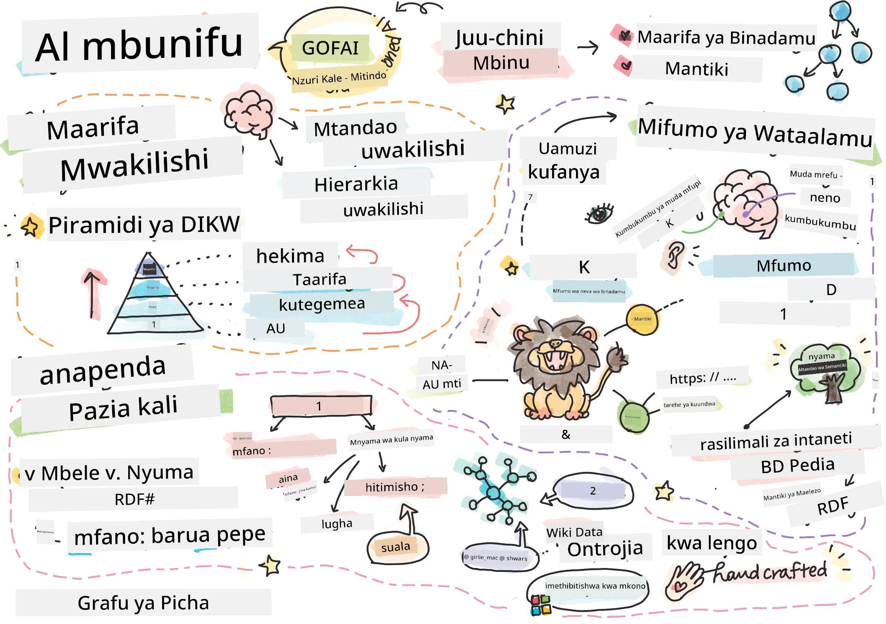
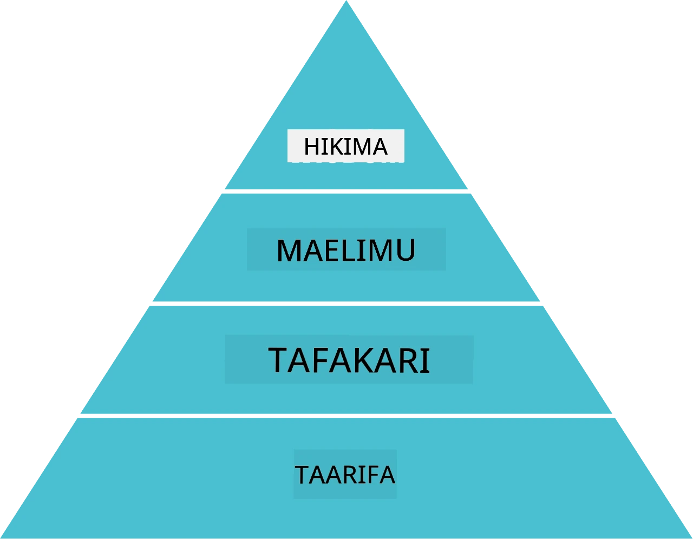
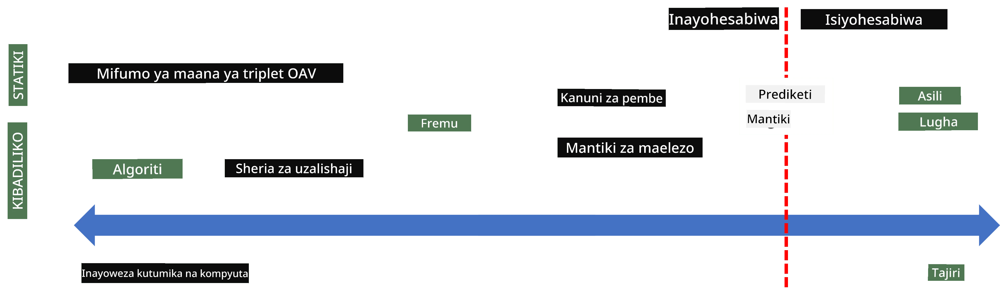
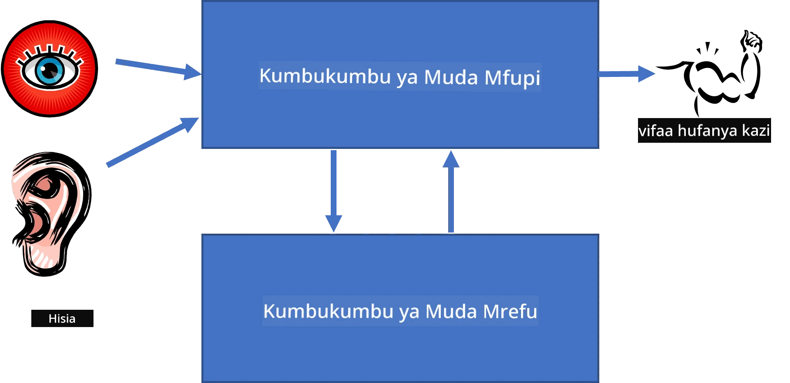
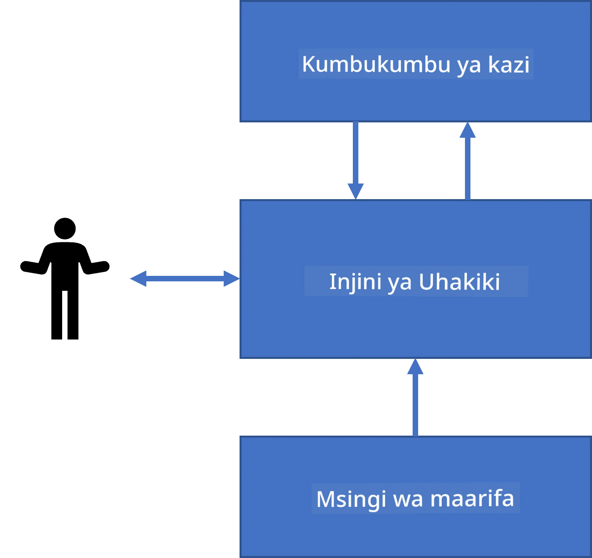
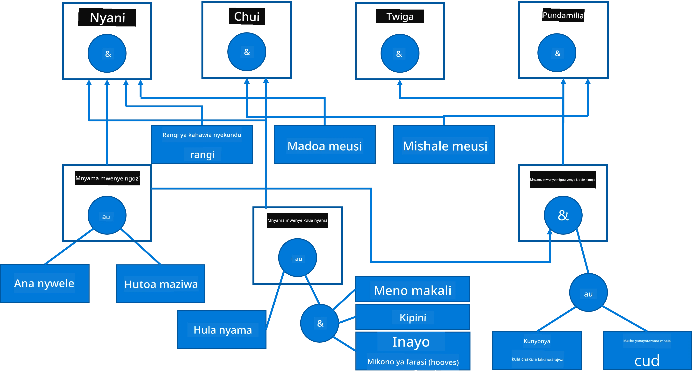
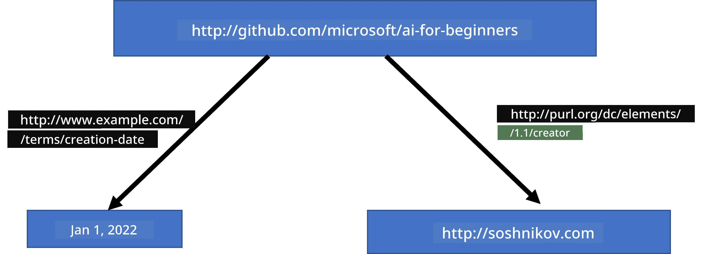
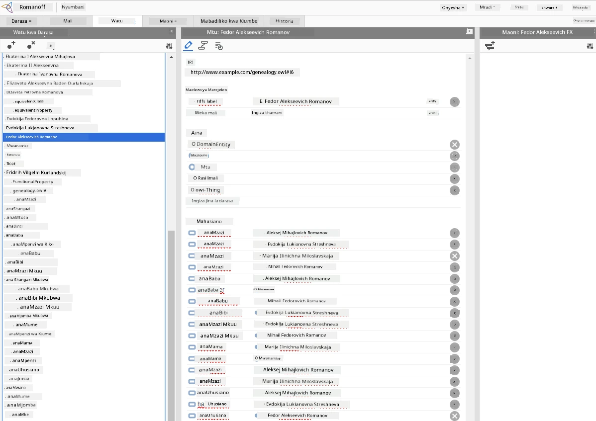

# Uwakilishi wa Maarifa na Mifumo ya Wataalamu



> Sketchnote na [Tomomi Imura](https://twitter.com/girlie_mac)

Jitihada za akili bandia zinatokana na kutafuta maarifa, kuelewa dunia kama wanadamu wanavyofanya. Lakini unaweza kufanya hivyo vipi?

## [Mtihani wa kabla ya somo](https://ff-quizzes.netlify.app/en/ai/quiz/3)

Katika siku za mwanzo za AI, mbinu ya kutoka juu hadi chini ya kuunda mifumo ya akili (iliyokuwa imetajwa katika somo la awali) ilikuwa maarufu. Wazo lilikuwa kuchukua maarifa kutoka kwa watu na kuyahifadhi katika mfumo wa kusomwa na mashine, kisha kuyatumia kutatua matatizo kiotomatiki. Mbinu hii ilizingatia mawazo mawili makubwa:

* Uwakilishi wa Maarifa
* Kutoa Madai/Kuelewa (Reasoning)

## Uwakilishi wa Maarifa

Moja ya dhana muhimu katika AI ya Ikoniki ni **maarifa**. Ni muhimu kutofautisha maarifa na *taarifa* au *data*. Kwa mfano, mtu anaweza kusema kwamba vitabu vina maarifa, kwa sababu mtu anaweza kusoma vitabu na kuwa mtaalamu. Hata hivyo, kile vitabu vinachonacho kinaitwa *data*, na kwa kusoma vitabu na kuingiza data hii katika mfano wetu wa dunia, tunabadilisha data kuwa maarifa.

> ✅ **Maarifa** ni kitu kilicho kichwani mwetu kinachoonyesha ufahamu wetu wa dunia. Yanapatikana kupitia mchakato wa **kujifunza** unaochukua vipande vya taarifa tunazopata na kuviunganisha katika mfano wetu wa dunia unaotumika.

Mara nyingi, hatufafanui maarifa kwa ukamilifu, lakini tunayalinganisha na dhana nyingine zinazohusiana kwa kutumia [Piramidi ya DIKW](https://en.wikipedia.org/wiki/DIKW_pyramid). Ina dhana zifuatazo:

* **Data** ni vitu vinavyowakilishwa katika vyombo vya kimwili, kama maandishi yaliyoandikwa au maneno yaliyosemwa. Data ipo huru bila kuhusiana na wanadamu na inaweza kupelekwa kati ya watu.
* **Taarifa** ni jinsi tunavyotafsiri data kichwani mwetu. Kwa mfano, tunapomsikia neno *kompyuta*, tuna ufahamu fulani wa kinachomaanisha.
* **Maarifa** ni taarifa zinazoingizwa katika mfano wetu wa dunia. Kwa mfano, tunapojifunza ni nini kompyuta, tunaanza kuwa na mawazo ya jinsi inavyofanya kazi, gharama zake, na matumizi yake. Mtandao huu wa dhana zinazohusiana huunda maarifa yetu.
* **Hekima** ni ngazi nyingine ya ufahamu wetu wa dunia, na huwakilisha *meta-maarifa*, mfano. wazo fulani kuhusu jinsi na lini maarifa yanapaswa kutumiwa.



*Picha [kutoka Wikipedia](https://commons.wikimedia.org/w/index.php?curid=37705247), Na Longlivetheux - Kazi binafsi, CC BY-SA 4.0*

Hivyo, tatizo la **uwakilishi wa maarifa** ni kupata njia madhubuti ya kuwakilisha maarifa ndani ya kompyuta katika mfumo wa data, ili yaweze kutumika kiotomatiki. Hii inaonekana kama spektra:



> Picha na [Dmitry Soshnikov](http://soshnikov.com)

* Kushoto, kuna aina rahisi za uwakilishi wa maarifa ambazo kompyuta zinaweza kuzitumia kwa ufanisi. Rahisi zaidi ni ya algorithmic, ambapo maarifa yanawakilishwa na programu ya kompyuta. Hii, hata hivyo, si njia bora ya kuwakilisha maarifa, kwa sababu si rahisi kubadilika. Maarifa ya kichwani mwetu mara nyingi si algorithmic.
* Kulia, kuna uwakilishi kama maandishi ya asili. Hii ni yenye nguvu zaidi, lakini haiwezi kutumika kwa kufikiri kwa kiotomatiki.

> ✅ Fikiria kwa muda mfupi jinsi unavyo wakilisha maarifa kichwani mwako na kuyaandika kama noti. Kuna muundo maalum unaofaa kwako kusaidia kuhifadhi maarifa?

## Kushiriki Aina za Uwakilishi wa Maarifa ya Kompyuta

Tunaweza kugawanya njia mbalimbali za uwakilishi wa maarifa ya kompyuta katika makundi yafuatayo:

* **Uwakilishi wa mtandao** unategemea ukweli kwamba tunayo mtandao wa dhana zinazohusiana kichwani mwetu. Tunaweza kujaribu kuunda mitandao hiyo kama grafu chini ya kompyuta - inayoitwa **mtandao wa semantiki**.

1. **Vitu-Sifa-Thamani triplets** au **vipengele-thamani**. Kwa kuwa grafu inaweza kuwakilishwa kwenye kompyuta kama orodha ya nodes na edges, tunaweza kuwakilisha mtandao wa semantiki kwa orodha ya triplets, zenye vitu, sifa, na thamani. Kwa mfano, tunajenga triplets zifuatazo kuhusu lugha za programu:

Kitu | Sifa | Thamani
-------|-----------|------
Python | ni | Lugha Isiyo na Aina
Python | ilibuniwa-na | Guido van Rossum
Python | sarufi-ya-kipande | uingizaji nafasi
Lugha Isiyo na Aina | haina | ufafanuzi wa aina

> ✅ Fikiria jinsi triplets zinaweza kutumika kuwakilisha aina nyingine za maarifa.

2. **Uwakilishi wa kihierarki** unaweka mkazo kuwa mara nyingi tunaunda hierarchy ya vitu kichwani mwetu. Kwa mfano, tunajua kwamba manyoya ni ndege, na ndege wote wana mabawa. Pia tuna wazo kuhusu rangi ya kawaida ya manyoya, na kasi yao ya kuruka.

   - **Uwakilishi wa fremu** unategemea kuwakilisha kila kitu au darasa la vitu kama **fremu** yenye **slots**. Slots zinaweza kuwa na thamani za msingi, vizuizi vya thamani, au taratibu za kuhifadhiwa zinazoweza kuitwa kupata thamani ya slot. Fremu zote huunda hierarchy kama ile ya vitu katika lugha za programu za kitu.
   - **Skenario** ni aina maalum za fremu zinazowakilisha hali ngumu zinazoweza kutokea katika muda.

**Python**

Slot | Thamani | Thamani ya Msingi | Kipindi |
-----|-------|---------------|----------|
Jina | Python | | |
Ni-A | Lugha Isiyo na Aina | | |
Mfumo wa Variable | | CamelCase | |
Urefu wa Programu | | | mistari 5-5000 |
Sarufi ya Kipande | Uingizaji nafasi | | |

3. **Uwakilishi wa taratibu** unategemea kuwakilisha maarifa kwa orodha ya hatua zinazoweza kutekelezwa pale hali fulani inapotokea.
   - Masharti ya uzalishaji ni msemo-la-kisha (if-then) unaoturuhusu kutoa hitimisho. Kwa mfano, daktari anaweza kuwa na sheria isemayo **KAMA** mgonjwa ana homa kali **AU** kiwango cha juu cha protini ya C-reactive kwenye mtihani wa damu **KWA HIVYO** ana maambukizi. Tukikutana na moja ya masharti, tunaweza kutoa hitimisho kuhusu maambukizi, kisha kuitumia katika fikra zaidi.
   - Algorithm zinaweza kuzingatiwa kama njia nyingine ya uwakilishi wa taratibu, ingawa hazitumiki mara kwa mara moja kwa moja katika mifumo yenye maarifa.

4. **Mantiki** ilipendekezwa awali na Aristotle kama njia ya kuwakilisha maarifa ya binadamu kwa ujumla.
   - Mantiki ya Prediketi kama nadharia ya hisabati ni pana mno kwa kuwa iweze kompyutwa, hivyo sehemu ya mantiki hutumika kama vile Horn clauses zinazotumika kwenye Prolog.
   - Mantiki ya Maelezo ni familia ya mifumo ya mantiki inayotumika kuwakilisha na kutoa mantiki kuhusu hiari ya vitu na uwakilishi wa maarifa uliosambazwa kama *wavu wa semanti*.

## Mifumo ya Wataalamu

Moja ya mafanikio ya mwanzo ya AI ya Ikoniki ilikuwa mifumo inayoitwa **mifumo ya wataalamu** - mifumo ya kompyuta iliyotengenezwa kutenda kama mtaalamu katika eneo fulani la tatizo lililo wazi. Ilijengwa kwa msingi wa **hifadhidata ya maarifa** iliyochukuliwa kutoka kwa wataalamu mmoja au zaidi wa binadamu, na ilijumuisha **mashine ya hitimisho** iliyofanya fikra juu yake.

 | 
---------------------------------------------|------------------------------------------------
Muundo rahisi wa mfumo wa neva wa binadamu | Muundo wa mfumo wenye maarifa

Mifumo ya wataalamu imejengwa kama mfumo wa fikra wa binadamu, wenye **kumbukumbu ya muda mfupi** na **kumbukumbu ya muda mrefu**. Vivyo hivyo, katika mifumo yenye maarifa tunatofautisha vipengele vifuatavyo:

* **Kumbukumbu ya tatizo**: ina maarifa kuhusu tatizo linalotatuliwa kwa sasa, mfano joto au shinikizo la damu la mgonjwa, kama ana maambukizi au hapana n.k. Maarifa haya pia hujulikana kama **maarifa ya takatifu**, kwa kuwa ni picha ya hali ya tatizo kwa sasa - inayoitwa *hali ya tatizo*.
* **Hifadhidata ya maarifa**: huwakilisha maarifa ya muda mrefu kuhusu eneo la tatizo. Huchukuliwa kwa mkono kutoka kwa wataalamu wa binadamu, na haibadiliki kati ya mazungumzo. Kwa sababu huturuhusu kuhamia kutoka hali moja ya tatizo hadi nyingine, pia hujulikana kama **maarifa ya mabadiliko**.
* **Mashine ya hitimisho**: inaendesha mchakato mzima wa kutafuta katika chombo cha hali za tatizo, kuuliza maswali kwa mtumiaji inapohitajika. Pia inahusika na kupata sheria zinazofaa kutumika kwa kila hali.

Kwa mfano, tuchukulie mfumo wa wataalamu wa kubaini mnyama kwa msingi wa sifa zake za kimwili:



> Picha na [Dmitry Soshnikov](http://soshnikov.com)

Mchoro huu unaitwa **mti wa AND-OR**, na ni uwakilishi wa kielelezo wa seti ya sheria za uzalishaji. Kuchora mti ni muhimu mwanzoni mwa kuchukua maarifa kutoka kwa mtaalamu. Kuweka maarifa ndani ya kompyuta ni rahisi kutumia sheria:

```
IF the animal eats meat
OR (animal has sharp teeth
    AND animal has claws
    AND animal has forward-looking eyes
) 
THEN the animal is a carnivore
```

Unaweza kuona kwamba kila hali upande wa kushoto wa sheria na kitendo ni kwa msingi wa triplets za kitu-sifa-thamani (OAV). **Kumbukumbu ya kazi** ina seti ya triplets za OAV zinazolingana na tatizo linalotatuliwa sasa. **Mashine ya sheria** hutafuta sheria ambazo hali yake imetimizwa na kuzitumia, na kuongeza triplet nyingine kwenye kumbukumbu ya kazi.

> ✅ Andika mti wako wa AND-OR kuhusu mada unayopenda!

### Hitimisho la Mbele dhidi ya Hitimisho la Nyuma

Mchakato ulioelezwa hapo juu unaitwa **hitimisho la mbele**. Unaanzia na data ya awali kuhusu tatizo iliyopo kwenye kumbukumbu ya kazi, na kisha unatekeleza mzunguko wa tafakari ufuatao:

1. Ikiwa sifa lengwa ipo kwenye kumbukumbu ya kazi - simama na toa matokeo
2. Tafuta sheria zote ambazo hali yake imetimizwa sasa - pata **seti ya migongano** ya sheria.
3. Fanya **mgongano wa utatuzi** - chagua sheria moja itakayotekelezwa hatua hii. Kuna mikakati tofauti ya utatuzi:
   - Chagua sheria inayoanza katika hifadhidata ya maarifa
   - Chagua sheria kwa bahati nasibu
   - Chagua sheria *ya kina zaidi*, yaani ile inayotimiza masharti mengi upande wa kushoto (LHS)
4. Tekeleza sheria iliyochaguliwa na ongeza kipande kipya cha maarifa katika hali ya tatizo
5. Rudia hatua ya 1.

Hata hivyo, katika baadhi ya hali tungependa kuanza na maarifa tupu kuhusu tatizo, na kuuliza maswali yatakayotusaidia kufikia hitimisho. Kwa mfano, tunapofanya uchunguzi wa matibabu, kawaida hatufanyi uchunguzi wote kabla ya kuanza kugundua mgonjwa. Tunapendelea kufanya uchunguzi pale tu kinapohitajika kufanya uamuzi.

Mchakato huu unaweza kuigwa kwa kutumia **hitimisho la nyuma**. Unaendeshwa na **lengo** - thamani ya sifa tunayoiangalia:

1. Chagua sheria zote zinazoweza kutupa thamani ya lengo (yaani na lengo upande wa kulia (RHS)) - seti ya migongano
1. Ikiwa hakuna sheria za sifa hii, au kuna sheria inayosema kwamba tunapaswa kuuliza thamani kutoka kwa mtumiaji - uliza, vinginevyo:
1. Tumia mkakati wa utatuzi kuchagua sheria moja ambayo tutaitumia kama *nadharia* - tutajaribu kuthibitisha
1. Rudia mchakato kwa sifa zote upande wa kushoto wa sheria, ukijaribu kuzithibitisha kama malengo
1. Ikiwa mchakato unashindwa mahali popote - tumia sheria nyingine hatua ya 3.

> ✅ Katika hali gani hitimisho la mbele linafaa zaidi? Vipi kuhusu hitimisho la nyuma?

### Kutekeleza Mifumo ya Wataalamu

Mifumo ya wataalamu inaweza kutekelezwa kwa kutumia zana tofauti:

* Kuprogramu moja kwa moja kwa lugha ya programu ya kiwango cha juu. Hii si wazo nzuri, kwa sababu faida kuu ya mfumo wenye maarifa ni kwamba maarifa yamegawanyika na hitimisho, na mtaalamu wa eneo la tatizo anapaswa kuweza kuandika sheria bila kuelewa mchakato wa hitimisho
* Kutumia **shell ya mfumo wa wataalamu**, yaani mfumo uliobuniwa mahsusi kuingizwa maarifa kwa kutumia lugha fulani ya uwakilishi wa maarifa.

## ✍️ Zoefu: Hitimisho la Mnyama

Angalia [Animals.ipynb](https://github.com/microsoft/AI-For-Beginners/blob/main/lessons/2-Symbolic/Animals.ipynb) kwa mfano wa kutekeleza hitimisho la mbele na la nyuma katika mfumo wa wataalamu.

> **Kumbuka**: Mfano huu ni rahisi tu, na unatoa wazo la jinsi mfumo wa wataalamu unavyoonekana. Mara tu unapoanza kuunda mfumo kama huu, utaona tabia *mwerevu* kutoka kwake tu unapotumia sheria nyingi, takriban 200+. Katika hatua fulani, sheria zinakuwa changamano sana kuhifadhi zote akili, na wakati huu utaanza kuuliza ni kwa nini mfumo unafanya maamuzi fulani. Hata hivyo, sifa muhimu za mifumo yenye maarifa ni kwamba unaweza *kueleza* kwa usahihi jinsi maamuzi yoyote yalivyotolewa.

## Ontolojia na Wavu wa Semantiki

Mwisho wa karne ya 20 kulikuwepo na jitihada ya kutumia uwakilishi wa maarifa kuashiria rasilimali za mtandao, ili iwezekane kupata rasilimali zinazolingana na maswali maalum sana. Harakati hii ilijulikana kama **Wavu wa Semantiki**, na ilitegemea dhana kadhaa:

- Uwakilishi maalum wa maarifa unaotegemea **[mantiki za maelezo](https://en.wikipedia.org/wiki/Description_logic)** (DL). Inafanana na uwakilishi wa fremu wa maarifa, kwa kuwa huunda hierarchy ya vitu vyenye mali, lakini ina semantiki rasmi ya mantiki na hitimisho. Kuna familia nzima ya DL zinazopima kati ya uwezo wa kuelezea na ugumu wa algorithm wa hitimisho.
- Uwakilishi wa maarifa uliosambazwa, ambapo dhana zote zina wakilishaji wa kipekee wa URI wa kimataifa, kuruhusu kuunda hierarchy za maarifa zinazovuka mtandao.
- Familia ya lugha zinazotegemea XML kwa maelezo ya maarifa: RDF (Resource Description Framework), RDFS (RDF Schema), OWL (Ontology Web Language).

Dhana kuu katika Wavuti ya Semantiki ni dhana ya **Ontolojia**. Inahusu ufafanuzi wazi wa eneo la tatizo kwa kutumia baadhi ya uwakilishi rasmi wa maarifa. Ontolojia rahisi inaweza kuwa msaada tu wa vitu katika eneo la tatizo, lakini ontolojia ngumu zaidi zitajumuisha sheria ambazo zinaweza kutumika kwa hitimisho.

Katika wavuti ya semantiki, uwakilishi wote unatokana na tripleti. Kila kitu na kila uhusiano hutambulishwa kwa kipekee na URI. Kwa mfano, ikiwa tunataka kusema ukweli kwamba Mtaala huu wa AI umeandaliwa na Dmitry Soshnikov tarehe 1 Januari, 2022 - hapa ni tripleti tunazoweza kutumia:



```
http://github.com/microsoft/ai-for-beginners http://www.example.com/terms/creation-date “Jan 1, 2022”
http://github.com/microsoft/ai-for-beginners http://purl.org/dc/elements/1.1/creator http://soshnikov.com
```

> ✅ Hapa `http://www.example.com/terms/creation-date` na `http://purl.org/dc/elements/1.1/creator` ni URI maarufu na zinazokubalika ulimwenguni kote kuelezea dhana za *muumba* na *tarehe ya uundaji*.

Katika kesi ngumu zaidi, ikiwa tunataka kufafanua orodha ya waumba, tunaweza kutumia baadhi ya miundo ya data iliyoainishwa katika RDF.


> Michoro hapo juu na [Dmitry Soshnikov](http://soshnikov.com)

Maendeleo ya ujenzi wa Wavuti ya Semantiki yalimshwausha kidogo mafanikio ya injini za utafutaji na mbinu za usindikaji wa lugha ya asili, zinazoruhusu kutoa data iliyopangwa kutoka kwenye maandishi. Hata hivyo, katika maeneo fulani bado kuna juhudi kubwa za kudumisha ontolojia na misingi ya maarifa. Miradi michache inayostahili kutajwa:

* [WikiData](https://wikidata.org/) ni mkusanyiko wa misingi ya maarifa inayoeleweka na mashine inayohusishwa na Wikipedia. Zaidi ya data hupatikana kutoka *InfoBoxes* za Wikipedia, vipande vya maudhui yaliyopangwa ndani ya kurasa za Wikipedia. Unaweza [kuuliza](https://query.wikidata.org/) wikidata kwa kutumia SPARQL, lugha maalum ya kuuliza kwa Wavuti ya Semantiki. Hapa ni mfano wa kuuliza unaoonyesha rangi maarufu zaidi za macho miongoni mwa wanadamu:

```sparql
#defaultView:BubbleChart
SELECT ?eyeColorLabel (COUNT(?human) AS ?count)
WHERE
{
  ?human wdt:P31 wd:Q5.       # human instance-of homo sapiens
  ?human wdt:P1340 ?eyeColor. # human eye-color ?eyeColor
  SERVICE wikibase:label { bd:serviceParam wikibase:language "en". }
}
GROUP BY ?eyeColorLabel
```

* [DBpedia](https://www.dbpedia.org/) ni jitihada nyingine inayofanana na WikiData.

> ✅ Ikiwa unataka kujaribu kujenga ontolojia zako mwenyewe, au kufungua ontolojia zilizopo, kuna mhariri mzuri wa ontolojia unaoitwa [Protégé](https://protege.stanford.edu/). Pakua au uvitumie mtandaoni.



*Mhariri wa Wavuti Protégé ulio wazi na ontolojia ya Familia ya Romanov. Picha ya skrini na Dmitry Soshnikov*

## ✍️ Zoefaa: Ontolojia ya Familia


Tazama [FamilyOntology.ipynb](https://github.com/Ezana135/AI-For-Beginners/blob/main/lessons/2-Symbolic/FamilyOntology.ipynb) kwa mfano wa kutumia mbinu za Wavuti ya Semantiki kufikiria kuhusu mahusiano ya familia. Tutachukua mti wa familia uliowakilishwa kwa muundo wa kawaida wa GEDCOM na ontolojia ya mahusiano ya familia na kuunda grafu ya mahusiano yote ya familia kwa seti ya watu waliowekwa.

## Graph ya Dhana ya Microsoft

Katika hali nyingi, ontolojia huundwa kwa uangalifu kwa mkono. Hata hivyo, pia inawezekana **kuchimba** ontolojia kutoka kwa data isiyo na muundo, kwa mfano, kutoka kwa maandishi ya lugha ya asili.

Jaribio kama hilo limefanywa na Microsoft Research, na kusababisha [Microsoft Concept Graph](https://blogs.microsoft.com/ai/microsoft-researchers-release-graph-that-helps-machines-conceptualize/?WT.mc_id=academic-77998-cacaste).

Ni mkusanyiko mkubwa wa vitu vilivyofungwa pamoja kwa kutumia uhusiano wa urithi wa `is-a`. Inaruhusu kujibu maswali kama "Microsoft ni nini?" - jibu likiwa kama "kampuni kwa uwezekano wa 0.87, na chapa kwa uwezekano wa 0.75".

Grafu inapatikana kama REST API, au kama faili kubwa la maandishi linaweza kupakuliwa linaloorodhesha jozi zote za vitu.

## ✍️ Zoefaa: Graph ya Dhana

Jaribu daftari la [MSConceptGraph.ipynb](https://github.com/microsoft/AI-For-Beginners/blob/main/lessons/2-Symbolic/MSConceptGraph.ipynb) kuona jinsi tunavyoweza kutumia Microsoft Concept Graph kuunganisha makala za habari katika makundi kadhaa.

## Hitimisho

Siku hizi, AI mara nyingi huonekana kama mfanano wa *Machine Learning* au *Neural Networks*. Hata hivyo, mwanadamu pia anaonyesha kufikiri wazi, jambo ambalo kwa sasa halijashughulikiwa na mitandao ya neva. Katika miradi halisi, kufikiri wazi bado kunatumika kufanya kazi zinazohitaji maelezo, au uwezo wa kubadilisha tabia ya mfumo kwa njia inayodhibitiwa.

## 🚀 Changamoto

Katika daftari la Ontolojia ya Familia linalohusiana na somo hili, kuna fursa ya kujaribu mahusiano mengine ya familia. Jaribu kugundua uhusiano mpya kati ya watu katika mti wa familia.

## [Mtihani baada ya somo](https://ff-quizzes.netlify.app/en/ai/quiz/4)

## Mapitio & Kujifunza Binafsi

Fanya utafiti mtandaoni kugundua maeneo ambapo wanadamu wamejaribu kupima na kuweka kumbukumbu maarifa. Angalia Taxonomy ya Bloom, na rudi nyuma kihistoria kujifunza jinsi wanadamu walijaribu kuelewa dunia yao. Chunguza kazi ya Linnaeus kuunda taxonomy ya viumbe, na angalia jinsi Dmitri Mendeleev alivyounda njia ya kuelezea na kuorodhesha elementi za kemikali. Ni mifano gani mingine ya kuvutia unaweza kupata?

**Zoezi**: [Jenga Ontolojia](assignment.md)

---

<!-- CO-OP TRANSLATOR DISCLAIMER START -->
**Vikwazo**:
Hati hii imetafsiriwa kwa kutumia huduma ya tafsiri ya AI [Co-op Translator](https://github.com/Azure/co-op-translator). Wakati tunajitahidi kuwa sahihi, tafadhali fahamu kuwa tafsiri za moja kwa moja zinaweza kuwa na makosa au upungufu wa usahihi. Hati ya asili katika lugha yake ya kienyeji inapaswa kuzingatiwa kama chanzo cha kimsingi. Kwa taarifa muhimu, tafsiri ya mtaalamu wa binadamu inashauriwa. Hatujawajibika kwa kutoelewana au tafsiri potofu zinazotokana na matumizi ya tafsiri hii.
<!-- CO-OP TRANSLATOR DISCLAIMER END -->