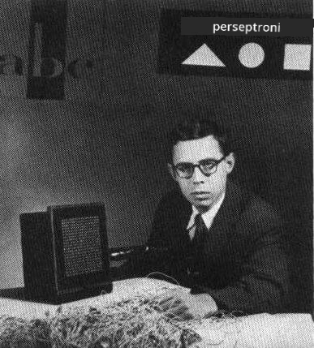

# Utangulizi wa Mitandao ya Neva: Perceptron

## [Jaribio la awali ya somo](https://ff-quizzes.netlify.app/en/ai/quiz/5)

Moja ya majaribio ya kwanza ya kutekeleza kitu kinachofanana na mtandao wa neva wa kisasa yalifanywa na Frank Rosenblatt kutoka Cornell Aeronautical Laboratory mwaka 1957. Ilikuwa ni utekelezaji wa vifaa vilivyoitwa "Mark-1", iliyoundwa kutambua maumbo ya kijiometri rahisi, kama vile pembetatu, mraba, na duara.

|      |      |
|--------------|-----------|
| | |

> Picha [kutoka Wikipedia](https://en.wikipedia.org/wiki/Perceptron)

Picha ya pembejeo iliwakilishwa na safu ya seli za picha 20x20, hivyo mtandao wa neva ulikuwa na pembejeo 400 na moja ya matokeo ya binary. Mtandao rahisi ulikuwa na neuron moja, pia inayoitwa **threshold logic unit**. Uzito wa mtandao wa neva ulifanya kazi kama potentiometers ambazo zilihitaji kurekebishwa kwa mikono wakati wa awamu ya mafunzo.

> ✅ Potentiometer ni kifaa kinachoruhusu mtumiaji kurekebisha upinzani wa mzunguko.

> New York Times iliandika kuhusu perceptron wakati huo: *kiinitete cha kompyuta ya kielektroniki ambayo [Jeshi la Majini] linatarajia itaweza kutembea, kuzungumza, kuona, kuandika, kujizalisha yenyewe na kufahamu uwepo wake.*

## Mfano wa Perceptron

Tuseme tuna vipengele N katika mfano wetu, ambapo vector ya pembejeo itakuwa vector ya ukubwa N. Perceptron ni mfano wa **uainishaji wa binary**, yaani inaweza kutofautisha kati ya madarasa mawili ya data ya pembejeo. Tutadhani kwamba kwa kila vector ya pembejeo x, matokeo ya perceptron yetu yatakuwa aidha +1 au -1, kulingana na darasa. Matokeo yatakokotolewa kwa kutumia fomula:

y(x) = f(w<sup>T</sup>x)

ambapo f ni kazi ya hatua ya uanzishaji

<!-- img src="http://www.sciweavers.org/tex2img.php?eq=f%28x%29%20%3D%20%5Cbegin%7Bcases%7D%0A%20%20%20%20%20%20%20%20%20%2B1%20%26%20x%20%5Cgeq%200%20%5C%5C%0A%20%20%20%20%20%20%20%20%20-1%20%26%20x%20%3C%200%0A%20%20%20%20%20%20%20%5Cend%7Bcases%7D%20%5C%5C%0A&bc=White&fc=Black&im=jpg&fs=12&ff=arev&edit=0" align="center" border="0" alt="f(x) = \begin{cases} +1 & x \geq 0 \\ -1 & x < 0 \end{cases} \\" width="154" height="50" / -->


## Mafunzo ya Perceptron

Ili kufundisha perceptron tunahitaji kupata vector ya uzito w ambayo inatofautisha kwa usahihi data nyingi, yaani inasababisha **kosa** ndogo zaidi. Kosa hili E linafafanuliwa na **kigezo cha perceptron** kwa njia ifuatayo:

E(w) = -&sum;w<sup>T</sup>x<sub>i</sub>t<sub>i</sub>

ambapo:

* jumla inachukuliwa kwa pointi za data za mafunzo i ambazo zinasababisha uainishaji usio sahihi
* x<sub>i</sub> ni data ya pembejeo, na t<sub>i</sub> ni aidha -1 au +1 kwa mifano hasi na chanya ipasavyo.

Kigezo hiki kinachukuliwa kama kazi ya uzito w, na tunahitaji kuipunguza. Mara nyingi, njia inayoitwa **gradient descent** hutumika, ambapo tunaanza na uzito wa awali w<sup>(0)</sup>, na kisha katika kila hatua tunasasisha uzito kulingana na fomula:

w<sup>(t+1)</sup> = w<sup>(t)</sup> - &eta;&nabla;E(w)

Hapa &eta; ni kinachoitwa **kiwango cha kujifunza**, na &nabla;E(w) inaonyesha **gradient** ya E. Baada ya kukokotoa gradient, tunapata:

w<sup>(t+1)</sup> = w<sup>(t)</sup> + &sum;&eta;x<sub>i</sub>t<sub>i</sub>

Algoriti katika Python inaonekana kama hii:

```python
def train(positive_examples, negative_examples, num_iterations = 100, eta = 1):

    weights = [0,0,0] # Initialize weights (almost randomly :)
        
    for i in range(num_iterations):
        pos = random.choice(positive_examples)
        neg = random.choice(negative_examples)

        z = np.dot(pos, weights) # compute perceptron output
        if z < 0: # positive example classified as negative
            weights = weights + eta*weights.shape

        z  = np.dot(neg, weights)
        if z >= 0: # negative example classified as positive
            weights = weights - eta*weights.shape

    return weights
```

## Hitimisho

Katika somo hili, umejifunza kuhusu perceptron, ambayo ni mfano wa uainishaji wa binary, na jinsi ya kuifundisha kwa kutumia vector ya uzito.

## 🚀 Changamoto

Ikiwa ungependa kujaribu kujenga perceptron yako mwenyewe, jaribu [maabara hii kwenye Microsoft Learn](https://docs.microsoft.com/en-us/azure/machine-learning/component-reference/two-class-averaged-perceptron?WT.mc_id=academic-77998-cacaste) ambayo inatumia [Azure ML designer](https://docs.microsoft.com/en-us/azure/machine-learning/concept-designer?WT.mc_id=academic-77998-cacaste).

## [Jaribio la baada ya somo](https://ff-quizzes.netlify.app/en/ai/quiz/6)

## Mapitio na Kujisomea

Ili kuona jinsi tunavyoweza kutumia perceptron kutatua tatizo la mfano pamoja na matatizo ya maisha halisi, na kuendelea kujifunza - nenda kwenye daftari la [Perceptron](Perceptron.ipynb).

Hapa kuna [makala ya kuvutia kuhusu perceptrons](https://towardsdatascience.com/what-is-a-perceptron-basics-of-neural-networks-c4cfea20c590
) pia.

## [Kazi ya Nyumbani](lab/README.md)

Katika somo hili, tumetekeleza perceptron kwa kazi ya uainishaji wa binary, na tumeitumia kutofautisha kati ya tarakimu mbili za maandishi ya mkono. Katika maabara hii, unahitajika kutatua tatizo la uainishaji wa tarakimu kikamilifu, yaani kuamua ni tarakimu gani inayowezekana kuendana na picha fulani.

* [Maelekezo](lab/README.md)
* [Daftari](lab/PerceptronMultiClass.ipynb)

---

