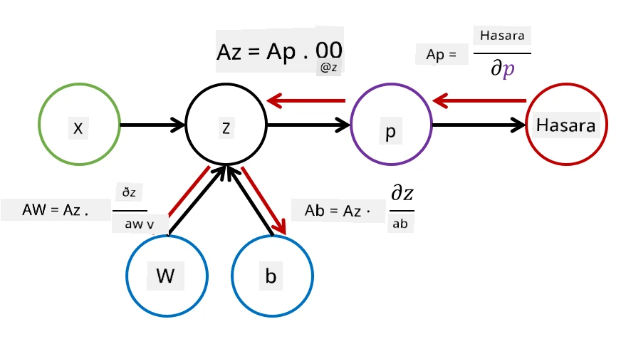

# Utangulizi wa Mitandao ya Neural. Multi-Layered Perceptron

Katika sehemu iliyopita, ulijifunza kuhusu mfano rahisi wa mtandao wa neural - perceptron ya tabaka moja, mfano wa uainishaji wa tabaka mbili wa mstari.

Katika sehemu hii tutapanua mfano huu kuwa mfumo wenye kubadilika zaidi, ambao utatuwezesha:

* kufanya **uainishaji wa tabaka nyingi** badala ya tabaka mbili tu
* kutatua **matatizo ya regression** badala ya uainishaji pekee
* kutenganisha tabaka ambazo hazitenganishwi kwa mstari

Pia tutatengeneza mfumo wetu wa modular kwa kutumia Python ambao utatuwezesha kujenga usanifu tofauti wa mitandao ya neural.

## [Maswali ya awali ya somo](https://ff-quizzes.netlify.app/en/ai/quiz/7)

## Urasimishaji wa Kujifunza kwa Mashine

Tuanzie kwa kurasimisha tatizo la Kujifunza kwa Mashine. Tuseme tuna seti ya mafunzo **X** yenye lebo **Y**, na tunahitaji kujenga mfano *f* ambao utatoa utabiri sahihi zaidi. Ubora wa utabiri hupimwa kwa kutumia **Loss function** &lagran;. Kazi za hasara zifuatazo hutumika mara nyingi:

* Kwa tatizo la regression, ambapo tunahitaji kutabiri namba, tunaweza kutumia **absolute error** &sum;i|f(x(i))-y(i)|, au **squared error** &sum;i(f(x(i))-y(i))2
* Kwa uainishaji, tunatumia **0-1 loss** (ambayo kimsingi ni sawa na **usahihi** wa mfano), au **logistic loss**.

Kwa perceptron ya tabaka moja, kazi *f* ilifafanuliwa kama kazi ya mstari *f(x)=wx+b* (hapa *w* ni matriki ya uzito, *x* ni vekta ya vipengele vya ingizo, na *b* ni vekta ya upendeleo). Kwa usanifu tofauti wa mitandao ya neural, kazi hii inaweza kuchukua umbo tata zaidi.

> Katika hali ya uainishaji, mara nyingi ni muhimu kupata uwezekano wa tabaka husika kama matokeo ya mtandao. Ili kubadilisha namba za kawaida kuwa uwezekano (mfano, kuhalalisha matokeo), mara nyingi tunatumia kazi ya **softmax** &sigma;, na kazi *f* inakuwa *f(x)=&sigma;(wx+b)*

Katika ufafanuzi wa *f* hapo juu, *w* na *b* huitwa **vigezo** &theta;=⟨*w,b*⟩. Tukizingatia seti ya data ⟨**X**,**Y**⟩, tunaweza kuhesabu makosa ya jumla kwenye seti nzima ya data kama kazi ya vigezo &theta;.

> ✅ **Lengo la mafunzo ya mtandao wa neural ni kupunguza makosa kwa kubadilisha vigezo &theta;**

## Uboreshaji wa Gradient Descent

Kuna mbinu inayojulikana ya uboreshaji wa kazi inayoitwa **gradient descent**. Wazo ni kwamba tunaweza kuhesabu derivative (katika hali ya vipimo vingi inayoitwa **gradient**) ya kazi ya hasara kwa kuzingatia vigezo, na kubadilisha vigezo kwa njia ambayo makosa yatapungua. Hii inaweza kurasimishwa kama ifuatavyo:

* Anzisha vigezo kwa thamani za nasibu w(0), b(0)
* Rudia hatua ifuatayo mara nyingi:
    - w(i+1) = w(i)-&eta;&part;&lagran;/&part;w
    - b(i+1) = b(i)-&eta;&part;&lagran;/&part;b

Wakati wa mafunzo, hatua za uboreshaji zinapaswa kuhesabiwa kwa kuzingatia seti nzima ya data (kumbuka kwamba hasara inahesabiwa kama jumla kupitia sampuli zote za mafunzo). Hata hivyo, katika maisha halisi tunachukua sehemu ndogo za seti ya data inayoitwa **minibatches**, na kuhesabu gradients kwa kuzingatia sehemu ndogo ya data. Kwa sababu sehemu ndogo huchukuliwa kwa nasibu kila wakati, mbinu hii inaitwa **stochastic gradient descent** (SGD).

## Multi-Layered Perceptrons na Backpropagation

Mtandao wa tabaka moja, kama tulivyoona hapo juu, una uwezo wa kuainisha tabaka zinazotenganishwa kwa mstari. Ili kujenga mfano tajiri zaidi, tunaweza kuunganisha tabaka kadhaa za mtandao. Kihisabati, hii ingemaanisha kwamba kazi *f* ingekuwa na umbo tata zaidi, na itahesabiwa kwa hatua kadhaa:
* z1=w1x+b1
* z2=w2&alpha;(z1)+b2
* f = &sigma;(z2)

Hapa, &alpha; ni **kazi ya uanzishaji isiyo ya mstari**, &sigma; ni kazi ya softmax, na vigezo &theta;=<*w1,b1,w2,b2*>.

Algorithimu ya gradient descent ingesalia ile ile, lakini ingekuwa ngumu zaidi kuhesabu gradients. Kwa kuzingatia kanuni ya mnyororo wa differentiation, tunaweza kuhesabu derivatives kama:

* &part;&lagran;/&part;w2 = (&part;&lagran;/&part;&sigma;)(&part;&sigma;/&part;z2)(&part;z2/&part;w2)
* &part;&lagran;/&part;w1 = (&part;&lagran;/&part;&sigma;)(&part;&sigma;/&part;z2)(&part;z2/&part;&alpha;)(&part;&alpha;/&part;z1)(&part;z1/&part;w1)

> ✅ Kanuni ya mnyororo wa differentiation hutumika kuhesabu derivatives za kazi ya hasara kwa kuzingatia vigezo.

Kumbuka kwamba sehemu ya kushoto kabisa ya maelezo haya yote ni sawa, na hivyo tunaweza kuhesabu derivatives kwa ufanisi kuanzia kazi ya hasara na kwenda "nyuma" kupitia grafu ya hesabu. Hivyo mbinu ya kufundisha perceptron ya tabaka nyingi inaitwa **backpropagation**, au 'backprop'.

> TODO: rejea ya picha

> ✅ Tutashughulikia backprop kwa undani zaidi katika mfano wetu wa notebook.  

## Hitimisho

Katika somo hili, tumetengeneza maktaba yetu ya mtandao wa neural, na tumeitumia kwa kazi rahisi ya uainishaji wa vipimo viwili.

## 🚀 Changamoto

Katika notebook inayotolewa, utatekeleza mfumo wako mwenyewe wa kujenga na kufundisha perceptron za tabaka nyingi. Utaweza kuona kwa undani jinsi mitandao ya neural ya kisasa inavyofanya kazi.

Endelea na notebook ya [OwnFramework](OwnFramework.ipynb) na fanya kazi nayo.

## [Maswali ya baada ya somo](https://ff-quizzes.netlify.app/en/ai/quiz/8)

## Mapitio na Kujisomea

Backpropagation ni algorithimu ya kawaida inayotumika katika AI na ML, inafaa kujifunza [kwa undani zaidi](https://wikipedia.org/wiki/Backpropagation)

## [Kazi ya Nyumbani](lab/README.md)

Katika maabara hii, unatakiwa kutumia mfumo uliotengeneza katika somo hili kutatua uainishaji wa namba za mkono za MNIST.

* [Maelekezo](lab/README.md)
* [Notebook](lab/MyFW_MNIST.ipynb)

---

