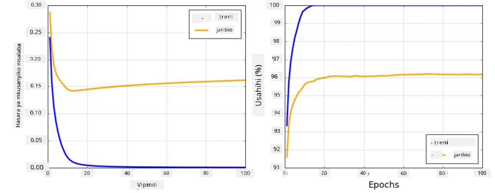

# Mfumo wa Mitandao ya Neural

Kama tulivyojifunza tayari, ili kuweza kufundisha mitandao ya neural kwa ufanisi tunahitaji kufanya mambo mawili:

* Kufanya kazi na tensors, kwa mfano kuzidisha, kuongeza, na kuhesabu baadhi ya kazi kama sigmoid au softmax
* Kuhesabu derivatives za maelezo yote, ili kutekeleza uboreshaji wa gradient descent

## [Maswali ya awali ya somo](https://ff-quizzes.netlify.app/en/ai/quiz/9)

Ingawa maktaba ya `numpy` inaweza kufanya sehemu ya kwanza, tunahitaji mfumo wa kuhesabu derivatives. Katika [mfumo wetu](../04-OwnFramework/OwnFramework.ipynb) ambao tulitengeneza katika sehemu iliyopita, tulilazimika kuandika kwa mkono kazi zote za derivatives ndani ya njia ya `backward`, ambayo hufanya backpropagation. Kwa hali bora, mfumo unapaswa kutupa fursa ya kuhesabu derivatives za *maelezo yoyote* tunayoweza kufafanua.

Jambo lingine muhimu ni uwezo wa kufanya mahesabu kwenye GPU, au vitengo vingine maalum vya mahesabu, kama [TPU](https://en.wikipedia.org/wiki/Tensor_Processing_Unit). Mafunzo ya mitandao ya neural yanahitaji *mahesabu mengi sana*, na uwezo wa kuendesha mahesabu hayo kwa sambamba kwenye GPUs ni muhimu sana.

> ✅ Neno 'kuendesha kwa sambamba' linamaanisha kusambaza mahesabu kwenye vifaa vingi.

Kwa sasa, mifumo miwili maarufu ya neural ni: [TensorFlow](http://TensorFlow.org) na [PyTorch](https://pytorch.org/). Zote zinatoa API ya kiwango cha chini ya kufanya kazi na tensors kwenye CPU na GPU. Juu ya API ya kiwango cha chini, kuna API ya kiwango cha juu, inayoitwa [Keras](https://keras.io/) na [PyTorch Lightning](https://pytorchlightning.ai/) kwa mtiririko huo.

API ya Kiwango cha Chini | [TensorFlow](http://TensorFlow.org) | [PyTorch](https://pytorch.org/)
--------------------------|-------------------------------------|--------------------------------
API ya Kiwango cha Juu   | [Keras](https://keras.io/) | [PyTorch Lightning](https://pytorchlightning.ai/)

**API za kiwango cha chini** katika mifumo yote miwili zinakuruhusu kujenga kinachoitwa **grafu za mahesabu**. Grafu hii inaelezea jinsi ya kuhesabu matokeo (kawaida kazi ya hasara) kwa kutumia vigezo vilivyotolewa, na inaweza kusukumwa kwa mahesabu kwenye GPU, ikiwa inapatikana. Kuna kazi za kutofautisha grafu hii ya mahesabu na kuhesabu derivatives, ambazo zinaweza kutumika kuboresha vigezo vya modeli.

**API za kiwango cha juu** zinachukulia mitandao ya neural kama **mlolongo wa tabaka**, na hufanya ujenzi wa mitandao mingi ya neural kuwa rahisi zaidi. Mafunzo ya modeli kawaida yanahitaji kuandaa data na kisha kuita kazi ya `fit` kufanya kazi hiyo.

API ya kiwango cha juu inakuruhusu kujenga mitandao ya neural ya kawaida haraka sana bila kuwa na wasiwasi kuhusu maelezo mengi. Wakati huo huo, API ya kiwango cha chini inatoa udhibiti zaidi juu ya mchakato wa mafunzo, na hivyo hutumika sana katika utafiti, unaposhughulika na usanifu mpya wa mitandao ya neural.

Ni muhimu pia kuelewa kwamba unaweza kutumia API zote mbili pamoja, kwa mfano unaweza kutengeneza usanifu wa tabaka la mtandao wako mwenyewe kwa kutumia API ya kiwango cha chini, na kisha kuitumia ndani ya mtandao mkubwa uliotengenezwa na kufundishwa kwa API ya kiwango cha juu. Au unaweza kufafanua mtandao kwa kutumia API ya kiwango cha juu kama mlolongo wa tabaka, na kisha kutumia mzunguko wako wa mafunzo wa kiwango cha chini kufanya uboreshaji. API zote mbili zinatumia dhana za msingi zinazofanana, na zimetengenezwa kufanya kazi vizuri pamoja.

## Kujifunza

Katika kozi hii, tunatoa maudhui mengi kwa PyTorch na TensorFlow. Unaweza kuchagua mfumo unaopendelea na kupitia tu daftari zinazohusiana. Ikiwa huna uhakika ni mfumo gani wa kuchagua, soma mijadala kwenye mtandao kuhusu **PyTorch vs. TensorFlow**. Unaweza pia kuangalia mifumo yote miwili ili kupata uelewa bora.

Pale inapowezekana, tutatumia API za kiwango cha juu kwa urahisi. Hata hivyo, tunaamini ni muhimu kuelewa jinsi mitandao ya neural inavyofanya kazi kutoka mwanzo, hivyo mwanzoni tunaanza kwa kufanya kazi na API ya kiwango cha chini na tensors. Hata hivyo, ikiwa unataka kuanza haraka na hutaki kutumia muda mwingi kujifunza maelezo haya, unaweza kuruka hayo na kwenda moja kwa moja kwenye daftari za API ya kiwango cha juu.

## ✍️ Mazoezi: Mifumo

Endelea kujifunza katika daftari zifuatazo:

API ya Kiwango cha Chini | [Daftari la TensorFlow+Keras](IntroKerasTF.ipynb) | [PyTorch](IntroPyTorch.ipynb)
--------------------------|-------------------------------------|--------------------------------
API ya Kiwango cha Juu   | [Keras](IntroKeras.ipynb) | *PyTorch Lightning*

Baada ya kufahamu mifumo, hebu tukumbuke dhana ya overfitting.

# Overfitting

Overfitting ni dhana muhimu sana katika ujifunzaji wa mashine, na ni muhimu sana kuielewa vizuri!

Fikiria tatizo lifuatalo la kukadiria alama 5 (zinazoonyeshwa na `x` kwenye grafu hapa chini):

 | 
-------------------------|--------------------------
**Modeli ya mstari, vigezo 2** | **Modeli isiyo ya mstari, vigezo 7**
Makosa ya mafunzo = 5.3 | Makosa ya mafunzo = 0
Makosa ya uthibitishaji = 5.1 | Makosa ya uthibitishaji = 20

* Kushoto, tunaona makadirio mazuri ya mstari wa moja kwa moja. Kwa sababu idadi ya vigezo ni ya kutosha, modeli inapata wazo sahihi kuhusu usambazaji wa alama.
* Kulia, modeli ni yenye nguvu kupita kiasi. Kwa sababu tuna alama 5 tu na modeli ina vigezo 7, inaweza kubadilika kwa njia ya kupita kwenye alama zote, na kufanya makosa ya mafunzo kuwa 0. Hata hivyo, hii inazuia modeli kuelewa muundo sahihi wa data, hivyo makosa ya uthibitishaji ni makubwa sana.

Ni muhimu sana kupata usawa sahihi kati ya utajiri wa modeli (idadi ya vigezo) na idadi ya sampuli za mafunzo.

## Kwa nini overfitting hutokea

  * Data ya mafunzo haitoshi
  * Modeli yenye nguvu kupita kiasi
  * Kelele nyingi sana katika data ya ingizo

## Jinsi ya kugundua overfitting

Kama unavyoona kutoka kwenye grafu hapo juu, overfitting inaweza kugunduliwa kwa makosa ya mafunzo ya chini sana, na makosa ya uthibitishaji ya juu. Kawaida wakati wa mafunzo tutaona makosa ya mafunzo na uthibitishaji yakianza kupungua, na kisha wakati fulani makosa ya uthibitishaji yanaweza kuacha kupungua na kuanza kuongezeka. Hii itakuwa ishara ya overfitting, na kiashiria kwamba tunapaswa labda kuacha mafunzo wakati huo (au angalau kufanya nakala ya modeli).

## Jinsi ya kuzuia overfitting

Ikiwa unaona kwamba overfitting inatokea, unaweza kufanya mojawapo ya yafuatayo:

 * Ongeza idadi ya data ya mafunzo
 * Punguza ugumu wa modeli
 * Tumia baadhi ya [mbinu za regularization](../../4-ComputerVision/08-TransferLearning/TrainingTricks.md), kama [Dropout](../../4-ComputerVision/08-TransferLearning/TrainingTricks.md#Dropout), ambayo tutazingatia baadaye.

## Overfitting na Bias-Variance Tradeoff

Overfitting kwa kweli ni hali ya tatizo la jumla zaidi katika takwimu linaloitwa [Bias-Variance Tradeoff](https://en.wikipedia.org/wiki/Bias%E2%80%93variance_tradeoff). Ikiwa tutazingatia vyanzo vinavyowezekana vya makosa katika modeli yetu, tunaweza kuona aina mbili za makosa:

* **Makosa ya Bias** yanayosababishwa na algorithm yetu kushindwa kukamata uhusiano kati ya data ya mafunzo kwa usahihi. Inaweza kusababishwa na ukweli kwamba modeli yetu si yenye nguvu ya kutosha (**underfitting**).
* **Makosa ya Variance**, ambayo husababishwa na modeli kukadiria kelele katika data ya ingizo badala ya uhusiano wa maana (**overfitting**).

Wakati wa mafunzo, makosa ya bias hupungua (kadri modeli yetu inavyojifunza kukadiria data), na makosa ya variance huongezeka. Ni muhimu kuacha mafunzo - ama kwa mkono (tunapogundua overfitting) au kiotomatiki (kwa kuanzisha regularization) - ili kuzuia overfitting.

## Hitimisho

Katika somo hili, umejifunza kuhusu tofauti kati ya API mbalimbali za mifumo miwili maarufu ya AI, TensorFlow na PyTorch. Zaidi ya hayo, umejifunza kuhusu mada muhimu sana, overfitting.

## 🚀 Changamoto

Katika daftari zinazohusiana, utapata 'majukumu' mwishoni; pitia daftari hizo na ukamilishe majukumu.

## [Maswali ya baada ya somo](https://ff-quizzes.netlify.app/en/ai/quiz/10)

## Mapitio na Kujisomea

Fanya utafiti kuhusu mada zifuatazo:

- TensorFlow
- PyTorch
- Overfitting

Jiulize maswali yafuatayo:

- Tofauti kati ya TensorFlow na PyTorch ni ipi?
- Tofauti kati ya overfitting na underfitting ni ipi?

## [Kazi ya nyumbani](lab/README.md)

Katika maabara hii, unatakiwa kutatua matatizo mawili ya uainishaji kwa kutumia mitandao ya tabaka moja na tabaka nyingi zilizounganishwa kikamilifu kwa kutumia PyTorch au TensorFlow.

* [Maelekezo](lab/README.md)
* [Daftari](lab/LabFrameworks.ipynb)

---

