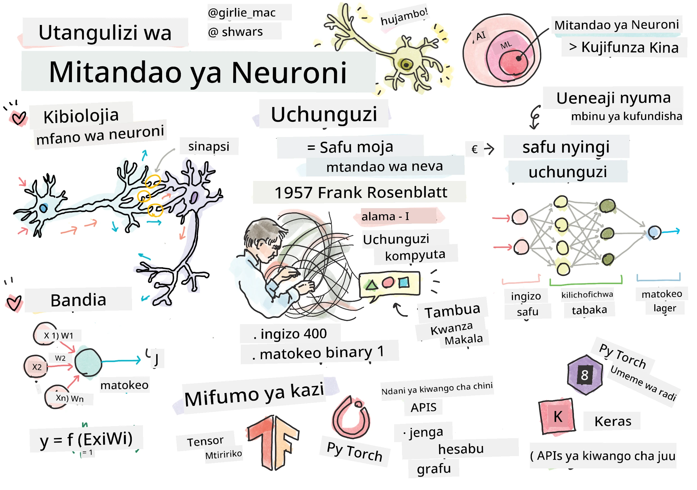
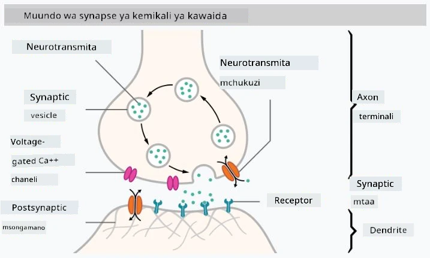

# Utangulizi wa Mitandao ya Neva

Kama tulivyojadili katika utangulizi, mojawapo ya njia za kufanikisha akili ni kufundisha **mfano wa kompyuta** au **ubongo bandia**. Tangu katikati ya karne ya 20, watafiti walijaribu mifano mbalimbali ya kihisabati, hadi miaka ya hivi karibuni ambapo mwelekeo huu ulionekana kufanikiwa sana. Mifano hii ya kihisabati ya ubongo inaitwa **mitandao ya neva**.

> Wakati mwingine mitandao ya neva huitwa *Mitandao ya Neva Bandia*, ANNs, ili kuonyesha kuwa tunazungumzia mifano, si mitandao halisi ya neva.

## Kujifunza kwa Mashine

Mitandao ya Neva ni sehemu ya taaluma kubwa inayoitwa **Kujifunza kwa Mashine**, ambayo inalenga kutumia data kufundisha mifano ya kompyuta inayoweza kutatua matatizo. Kujifunza kwa Mashine ni sehemu kubwa ya Akili Bandia, hata hivyo, hatutashughulikia Kujifunza kwa Mashine kwa njia ya kawaida katika mtaala huu.

> Tembelea mtaala wetu tofauti wa **[Kujifunza kwa Mashine kwa Kompyuta za Kuanza](http://github.com/microsoft/ml-for-beginners)** ili kujifunza zaidi kuhusu Kujifunza kwa Mashine kwa njia ya kawaida.

Katika Kujifunza kwa Mashine, tunadhani kuwa tuna seti fulani ya data ya mifano **X**, na thamani za matokeo zinazolingana **Y**. Mifano mara nyingi ni vekta za N-dimensional zinazojumuisha **vipengele**, na matokeo huitwa **lebo**.

Tutazingatia matatizo mawili ya kawaida ya kujifunza kwa mashine:

* **Uainishaji**, ambapo tunahitaji kuainisha kitu cha ingizo katika madarasa mawili au zaidi.
* **Urejeshaji**, ambapo tunahitaji kutabiri namba ya nambari kwa kila sampuli ya ingizo.

> Wakati wa kuwakilisha viingizo na matokeo kama tensors, seti ya data ya ingizo ni matriki ya ukubwa M&times;N, ambapo M ni idadi ya sampuli na N ni idadi ya vipengele. Lebo za matokeo Y ni vekta ya ukubwa M.

Katika mtaala huu, tutazingatia tu mifano ya mitandao ya neva.

## Mfano wa Neva

Kutoka kwa biolojia, tunajua kuwa ubongo wetu unajumuisha seli za neva (neuroni), kila moja ikiwa na "viingizo" vingi (dendriti) na "matokeo" moja (aksoni). Dendriti na aksoni zote mbili zinaweza kusafirisha ishara za umeme, na miunganisho kati yao — inayojulikana kama sinapsi — inaweza kuonyesha viwango tofauti vya usafirishaji, ambavyo vinadhibitiwa na nyurotransmita.

 | 
----|----
Neva Halisi *([Picha](https://en.wikipedia.org/wiki/Synapse#/media/File:SynapseSchematic_lines.svg) kutoka Wikipedia)* | Neva Bandia *(Picha na Mwandishi)*

Kwa hivyo, mfano rahisi wa kihisabati wa neva una viingizo kadhaa X1, ..., XN na matokeo Y, na mfululizo wa uzito W1, ..., WN. Matokeo huhesabiwa kama:

ambapo f ni **kazi ya uanzishaji** isiyo ya mstari.

> Mifano ya awali ya neva ilielezewa katika karatasi ya kihistoria [A logical calculus of the ideas immanent in nervous activity](https://www.cs.cmu.edu/~./epxing/Class/10715/reading/McCulloch.and.Pitts.pdf) na Warren McCullock na Walter Pitts mwaka 1943. Donald Hebb katika kitabu chake "[The Organization of Behavior: A Neuropsychological Theory](https://books.google.com/books?id=VNetYrB8EBoC)" alipendekeza jinsi mitandao hiyo inaweza kufundishwa.

## Katika Sehemu Hii

Katika sehemu hii tutajifunza kuhusu:
* [Perceptron](03-Perceptron/README.md), mojawapo ya mifano ya awali ya mitandao ya neva kwa uainishaji wa madarasa mawili
* [Mitandao ya Tabaka Nyingi](04-OwnFramework/README.md) na daftari lililoambatanishwa [jinsi ya kujenga mfumo wetu wenyewe](04-OwnFramework/OwnFramework.ipynb)
* [Mifumo ya Mitandao ya Neva](05-Frameworks/README.md), na madaftari haya: [PyTorch](05-Frameworks/IntroPyTorch.ipynb) na [Keras/Tensorflow](05-Frameworks/IntroKerasTF.ipynb)
* [Kuzidisha Mafunzo](../../../../lessons/3-NeuralNetworks/05-Frameworks)

---

**Kanusho**:  
Hati hii imetafsiriwa kwa kutumia huduma ya tafsiri ya AI [Co-op Translator](https://github.com/Azure/co-op-translator). Ingawa tunajitahidi kuhakikisha usahihi, tafadhali fahamu kuwa tafsiri za kiotomatiki zinaweza kuwa na makosa au kutokuwa sahihi. Hati ya asili katika lugha yake ya awali inapaswa kuzingatiwa kama chanzo cha mamlaka. Kwa taarifa muhimu, tafsiri ya kitaalamu ya binadamu inapendekezwa. Hatutawajibika kwa kutoelewana au tafsiri zisizo sahihi zinazotokana na matumizi ya tafsiri hii.