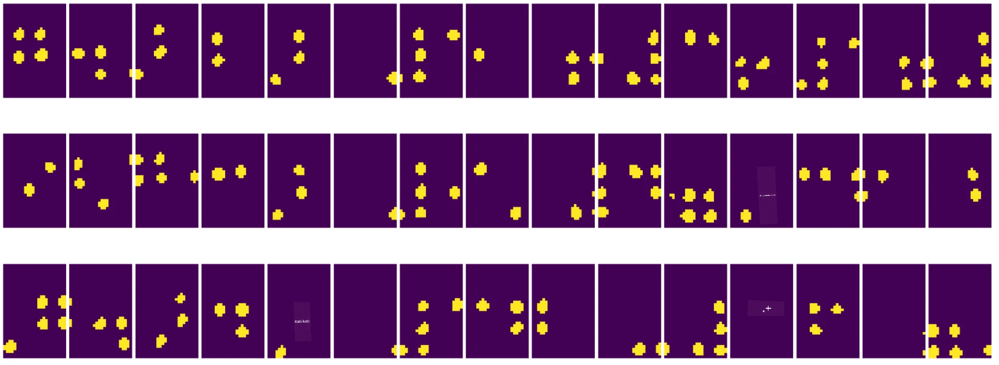

# Utangulizi wa Uelewa wa Picha na Kompyuta

[Computer Vision](https://wikipedia.org/wiki/Computer_vision) ni taaluma inayolenga kuwezesha kompyuta kupata uelewa wa kiwango cha juu wa picha za kidijitali. Hii ni tafsiri pana, kwa sababu *uelewa* unaweza kumaanisha mambo mengi tofauti, ikiwa ni pamoja na kutambua kitu kwenye picha (**utambuzi wa vitu**), kuelewa kinachotokea (**utambuzi wa matukio**), kuelezea picha kwa maandishi, au kujenga upya mandhari kwa 3D. Pia kuna kazi maalum zinazohusiana na picha za binadamu: makadirio ya umri na hisia, utambuzi wa uso na utambulisho, na makadirio ya mkao wa 3D, miongoni mwa mengine.

## [Maswali ya awali ya somo](https://ff-quizzes.netlify.app/en/ai/quiz/11)

Moja ya kazi rahisi za uelewa wa picha ni **uwekaji wa picha katika makundi**.

Uelewa wa picha mara nyingi huchukuliwa kuwa tawi la AI. Siku hizi, kazi nyingi za uelewa wa picha zinatatuliwa kwa kutumia mitandao ya neva. Tutajifunza zaidi kuhusu aina maalum ya mitandao ya neva inayotumika kwa uelewa wa picha, [convolutional neural networks](../07-ConvNets/README.md), katika sehemu hii.

Hata hivyo, kabla ya kupitisha picha kwenye mtandao wa neva, mara nyingi inafaa kutumia mbinu za kialgorithimu kuboresha picha.

Kuna maktaba kadhaa za Python zinazopatikana kwa usindikaji wa picha:

* **[imageio](https://imageio.readthedocs.io/en/stable/)** inaweza kutumika kusoma/kuandika miundo tofauti ya picha. Pia inaunga mkono ffmpeg, zana muhimu ya kubadilisha fremu za video kuwa picha.
* **[Pillow](https://pillow.readthedocs.io/en/stable/index.html)** (pia inajulikana kama PIL) ina nguvu zaidi, na pia inaunga mkono baadhi ya urekebishaji wa picha kama kubadilisha maumbo, kurekebisha paleti, na zaidi.
* **[OpenCV](https://opencv.org/)** ni maktaba yenye nguvu ya usindikaji wa picha iliyoandikwa kwa C++, ambayo imekuwa kiwango cha *de facto* kwa usindikaji wa picha. Ina kiolesura cha Python kinachofaa.
* **[dlib](http://dlib.net/)** ni maktaba ya C++ inayotekeleza algorithimu nyingi za kujifunza kwa mashine, ikiwa ni pamoja na baadhi ya algorithimu za uelewa wa picha. Pia ina kiolesura cha Python, na inaweza kutumika kwa kazi ngumu kama utambuzi wa uso na alama za uso.

## OpenCV

[OpenCV](https://opencv.org/) inachukuliwa kuwa kiwango cha *de facto* kwa usindikaji wa picha. Ina algorithimu nyingi muhimu, zilizotekelezwa kwa C++. Unaweza pia kuitumia OpenCV kutoka Python.

Mahali pazuri pa kujifunza OpenCV ni [kozi hii ya Learn OpenCV](https://learnopencv.com/getting-started-with-opencv/). Katika mtaala wetu, lengo letu si kujifunza OpenCV, bali kukuonyesha mifano ya jinsi inavyoweza kutumika, na jinsi ya kuitumia.

### Kupakia Picha

Picha katika Python zinaweza kuwakilishwa kwa urahisi na safu za NumPy. Kwa mfano, picha za kijivu zenye ukubwa wa pikseli 320x200 zingewekwa kwenye safu ya 200x320, na picha za rangi za vipimo sawa zingekuwa na umbo la 200x320x3 (kwa njia 3 za rangi). Ili kupakia picha, unaweza kutumia msimbo ufuatao:

```python
import cv2
import matplotlib.pyplot as plt

im = cv2.imread('image.jpeg')
plt.imshow(im)
```

Kiasili, OpenCV hutumia usimbaji wa BGR (Blue-Green-Red) kwa picha za rangi, wakati zana nyingine za Python hutumia RGB (Red-Green-Blue) ya jadi zaidi. Ili picha ionekane sawa, unahitaji kuibadilisha kuwa nafasi ya rangi ya RGB, ama kwa kubadilisha vipimo kwenye safu ya NumPy, au kwa kuita kazi ya OpenCV:

```python
im = cv2.cvtColor(im,cv2.COLOR_BGR2RGB)
```

Kazi hiyo hiyo ya `cvtColor` inaweza kutumika kufanya mabadiliko mengine ya nafasi ya rangi kama kubadilisha picha kuwa kijivu au nafasi ya rangi ya HSV (Hue-Saturation-Value).

Unaweza pia kutumia OpenCV kupakia fremu za video moja baada ya nyingine - mfano umetolewa katika zoezi [OpenCV Notebook](OpenCV.ipynb).

### Usindikaji wa Picha

Kabla ya kulisha picha kwenye mtandao wa neva, unaweza kutaka kutumia hatua kadhaa za usindikaji wa awali. OpenCV inaweza kufanya mambo mengi, ikiwa ni pamoja na:

* **Kubadilisha ukubwa** wa picha kwa kutumia `im = cv2.resize(im, (320,200),interpolation=cv2.INTER_LANCZOS)`
* **Kufifisha** picha kwa kutumia `im = cv2.medianBlur(im,3)` au `im = cv2.GaussianBlur(im, (3,3), 0)`
* Kubadilisha **mwangaza na utofauti** wa picha kunaweza kufanywa kwa kutumia manipulations za safu za NumPy, kama ilivyoelezwa [katika maelezo haya ya Stackoverflow](https://stackoverflow.com/questions/39308030/how-do-i-increase-the-contrast-of-an-image-in-python-opencv).
* Kutumia [thresholding](https://docs.opencv.org/4.x/d7/d4d/tutorial_py_thresholding.html) kwa kuita kazi za `cv2.threshold`/`cv2.adaptiveThreshold`, ambayo mara nyingi inapendekezwa kuliko kurekebisha mwangaza au utofauti.
* Kutumia [mabadiliko tofauti](https://docs.opencv.org/4.5.5/da/d6e/tutorial_py_geometric_transformations.html) kwenye picha:
    - **[Affine transformations](https://docs.opencv.org/4.5.5/d4/d61/tutorial_warp_affine.html)** inaweza kuwa muhimu ikiwa unahitaji kuchanganya mzunguko, kubadilisha ukubwa na kupotosha picha na unajua eneo la chanzo na marudio la alama tatu kwenye picha. Mabadiliko ya affine huhifadhi mistari sambamba.
    - **[Perspective transformations](https://medium.com/analytics-vidhya/opencv-perspective-transformation-9edffefb2143)** inaweza kuwa muhimu unapojua nafasi za chanzo na marudio za alama 4 kwenye picha. Kwa mfano, ikiwa unapiga picha ya hati ya mstatili kupitia kamera ya simu kutoka pembe fulani, na unataka kufanya picha ya mstatili ya hati yenyewe.
* Kuelewa harakati ndani ya picha kwa kutumia **[optical flow](https://docs.opencv.org/4.5.5/d4/dee/tutorial_optical_flow.html)**.

## Mifano ya Kutumia Uelewa wa Picha

Katika [OpenCV Notebook](OpenCV.ipynb) yetu, tunatoa mifano ya wakati uelewa wa picha unaweza kutumika kutekeleza kazi maalum:

* **Usindikaji wa awali wa picha ya kitabu cha Braille**. Tunazingatia jinsi tunavyoweza kutumia thresholding, utambuzi wa vipengele, mabadiliko ya mtazamo na manipulations za NumPy kutenganisha alama za Braille kwa uainishaji zaidi na mtandao wa neva.

 |  | 
----|-----|-----

> Picha kutoka [OpenCV.ipynb](OpenCV.ipynb)

* **Kutambua harakati kwenye video kwa kutumia tofauti ya fremu**. Ikiwa kamera imetulia, basi fremu kutoka mlisho wa kamera zinapaswa kufanana sana. Kwa kuwa fremu zinawakilishwa kama safu, kwa kutoa tofauti ya safu hizo kwa fremu mbili mfululizo tutapata tofauti ya pikseli, ambayo inapaswa kuwa ndogo kwa fremu tuli, na kuwa kubwa zaidi mara kuna harakati kubwa kwenye picha.


> Picha kutoka [OpenCV.ipynb](OpenCV.ipynb)

* **Kutambua harakati kwa kutumia Optical Flow**. [Optical flow](https://docs.opencv.org/3.4/d4/dee/tutorial_optical_flow.html) inatuwezesha kuelewa jinsi pikseli za kibinafsi kwenye fremu za video zinavyohama. Kuna aina mbili za optical flow:

   - **Dense Optical Flow** huhesabu uwanja wa vekta unaoonyesha kwa kila pikseli inahama wapi.
   - **Sparse Optical Flow** inategemea kuchukua vipengele vya kipekee kwenye picha (mfano, kingo), na kujenga mwelekeo wake kutoka fremu hadi fremu.


> Picha kutoka [OpenCV.ipynb](OpenCV.ipynb)

## ✍️ Mifano ya Notebooks: OpenCV [jaribu OpenCV kwa Vitendo](OpenCV.ipynb)

Hebu tufanye majaribio na OpenCV kwa kuchunguza [OpenCV Notebook](OpenCV.ipynb)

## Hitimisho

Wakati mwingine, kazi ngumu kama kutambua harakati au kutambua ncha za vidole zinaweza kutatuliwa kwa kutumia uelewa wa picha pekee. Kwa hivyo, ni muhimu kujua mbinu za msingi za uelewa wa picha, na kile maktaba kama OpenCV zinaweza kufanya.

## 🚀 Changamoto

Tazama [video hii](https://docs.microsoft.com/shows/ai-show/ai-show--2021-opencv-ai-competition--grand-prize-winners--cortic-tigers--episode-32?WT.mc_id=academic-77998-cacaste) kutoka kipindi cha AI ili ujifunze kuhusu mradi wa Cortic Tigers na jinsi walivyojenga suluhisho la msingi wa vizuizi ili kurahisisha kazi za uelewa wa picha kupitia roboti. Fanya utafiti kuhusu miradi mingine kama hii inayosaidia wanafunzi wapya kuingia katika uwanja huu.

## [Maswali ya baada ya somo](https://ff-quizzes.netlify.app/en/ai/quiz/12)

## Mapitio na Kujisomea

Soma zaidi kuhusu optical flow [katika mafunzo haya mazuri](https://learnopencv.com/optical-flow-in-opencv/).

## [Kazi ya Nyumbani](lab/README.md)

Katika maabara hii, utachukua video yenye ishara rahisi, na lengo lako ni kutoa harakati za juu/chini/kushoto/kulia kwa kutumia optical flow.


---

