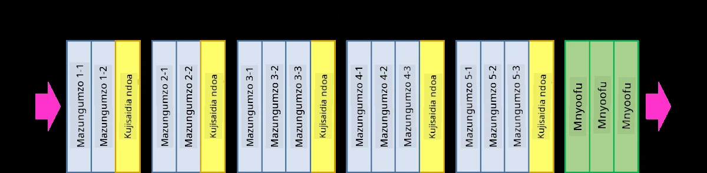
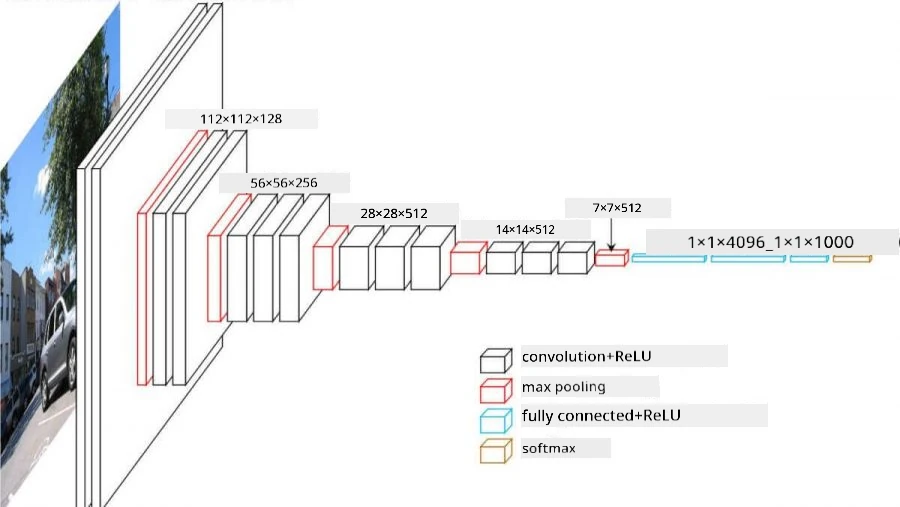
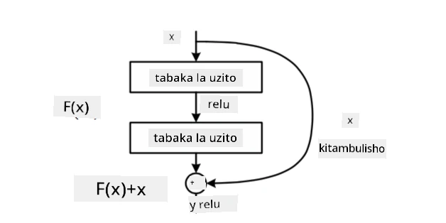
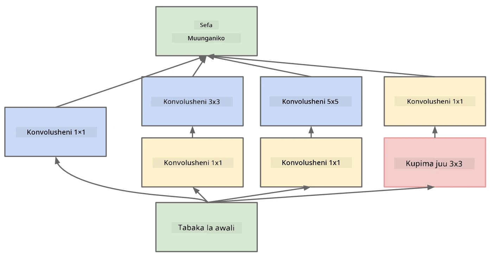

# Miundo Maarufu ya CNN

### VGG-16

VGG-16 ni mtandao uliopata usahihi wa 92.7% katika uainishaji wa ImageNet top-5 mwaka 2014. Una muundo wa tabaka zifuatazo:

Kama unavyoona, VGG inafuata muundo wa jadi wa piramidi, ambao ni mfululizo wa tabaka za convolution-pooling.

> Picha kutoka [Researchgate](https://www.researchgate.net/figure/Vgg16-model-structure-To-get-the-VGG-NIN-model-we-replace-the-2-nd-4-th-6-th-7-th_fig2_335194493)

### ResNet

ResNet ni familia ya miundo iliyopendekezwa na Microsoft Research mwaka 2015. Wazo kuu la ResNet ni kutumia **residual blocks**:

> Picha kutoka [karatasi hii](https://arxiv.org/pdf/1512.03385.pdf)

Sababu ya kutumia njia ya kupitisha utambulisho ni kuruhusu tabaka zetu kutabiri **tofauti** kati ya matokeo ya tabaka ya awali na matokeo ya residual block - hivyo jina *residual*. Bloki hizi ni rahisi zaidi kufundisha, na mtu anaweza kujenga mitandao yenye mamia ya bloki hizi (toleo maarufu zaidi ni ResNet-52, ResNet-101 na ResNet-152).

Unaweza pia kufikiria mtandao huu kama unaoweza kurekebisha ugumu wake kulingana na dataset. Mwanzoni, unapoanza kufundisha mtandao, thamani za uzito ni ndogo, na ishara nyingi hupitia tabaka za utambulisho. Kadri mafunzo yanavyoendelea na uzito unavyokuwa mkubwa, umuhimu wa vigezo vya mtandao unakua, na mtandao unajirekebisha ili kukidhi nguvu ya kuelezea inayohitajika kuainisha picha za mafunzo kwa usahihi.

### Google Inception

Muundo wa Google Inception unachukua wazo hili hatua moja mbele, na hujenga kila tabaka la mtandao kama mchanganyiko wa njia kadhaa tofauti:

> Picha kutoka [Researchgate](https://www.researchgate.net/figure/Inception-module-with-dimension-reductions-left-and-schema-for-Inception-ResNet-v1_fig2_355547454)

Hapa, tunahitaji kusisitiza jukumu la convolution za 1x1, kwa sababu mwanzoni hazionekani kuwa na maana. Kwa nini tunahitaji kupitisha picha kwa kichujio cha 1x1? Hata hivyo, unahitaji kukumbuka kwamba vichujio vya convolution pia hufanya kazi na njia kadhaa za kina (awali - rangi za RGB, katika tabaka zinazofuata - njia za vichujio tofauti), na convolution ya 1x1 hutumika kuchanganya njia hizo za pembejeo kwa kutumia uzito tofauti unaoweza kufundishwa. Inaweza pia kuonekana kama kupunguza ukubwa (pooling) juu ya mwelekeo wa njia.

Hapa kuna [blogu nzuri](https://medium.com/analytics-vidhya/talented-mr-1x1-comprehensive-look-at-1x1-convolution-in-deep-learning-f6b355825578) kuhusu mada hii, na [karatasi ya awali](https://arxiv.org/pdf/1312.4400.pdf).

### MobileNet

MobileNet ni familia ya miundo yenye ukubwa mdogo, inayofaa kwa vifaa vya mkononi. Tumia ikiwa una rasilimali chache, na unaweza kukubali kupoteza usahihi kidogo. Wazo kuu nyuma yake ni kinachoitwa **depthwise separable convolution**, ambacho huruhusu kuwakilisha vichujio vya convolution kwa muundo wa convolution za anga na convolution za 1x1 juu ya njia za kina. Hii inapunguza kwa kiasi kikubwa idadi ya vigezo, na kufanya mtandao kuwa mdogo kwa ukubwa, na pia rahisi kufundisha kwa data kidogo.

Hapa kuna [blogu nzuri kuhusu MobileNet](https://medium.com/analytics-vidhya/image-classification-with-mobilenet-cc6fbb2cd470).

## Hitimisho

Katika sehemu hii, umejifunza dhana kuu nyuma ya mitandao ya neural ya maono ya kompyuta - mitandao ya convolution. Miundo halisi inayowezesha uainishaji wa picha, utambuzi wa vitu, na hata mitandao ya kizazi cha picha yote inategemea CNNs, lakini ikiwa na tabaka zaidi na mbinu za ziada za mafunzo.

## 🚀 Changamoto

Katika daftari zinazotolewa, kuna maelezo chini kuhusu jinsi ya kupata usahihi mkubwa zaidi. Fanya majaribio ili kuona kama unaweza kufanikisha usahihi wa juu zaidi.

## [Jaribio baada ya somo](https://ff-quizzes.netlify.app/en/ai/quiz/14)

## Mapitio na Kujisomea

Ingawa CNNs hutumika mara nyingi kwa kazi za Maono ya Kompyuta, kwa ujumla ni nzuri kwa kutoa mifumo ya ukubwa maalum. Kwa mfano, ikiwa tunashughulika na sauti, tunaweza pia kutaka kutumia CNNs kutafuta mifumo maalum katika ishara ya sauti - ambapo vichujio vitakuwa vya mwelekeo mmoja (na CNN hii itaitwa 1D-CNN). Pia, wakati mwingine 3D-CNN hutumika kutoa vipengele katika nafasi ya mwelekeo mwingi, kama matukio fulani yanayotokea kwenye video - CNN inaweza kunasa mifumo fulani ya mabadiliko ya vipengele kwa muda. Fanya mapitio na kujisomea kuhusu kazi nyingine zinazoweza kufanywa na CNNs.

## [Kazi](lab/README.md)

Katika maabara hii, unakabidhiwa jukumu la kuainisha aina tofauti za paka na mbwa. Picha hizi ni ngumu zaidi kuliko dataset ya MNIST na zina vipimo vya juu, na kuna zaidi ya madarasa 10.

---

