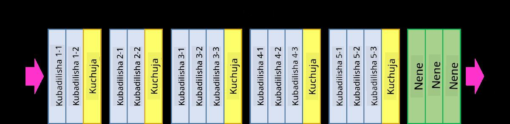

# Kända CNN-arkitekturer

### VGG-16

VGG-16 är ett nätverk som uppnådde 92,7% noggrannhet i ImageNet top-5 klassificering 2014. Det har följande lagerstruktur:

Som du kan se följer VGG en traditionell pyramidarkitektur, som är en sekvens av konvolution-poolingslager.

> Bild från [Researchgate](https://www.researchgate.net/figure/Vgg16-model-structure-To-get-the-VGG-NIN-model-we-replace-the-2-nd-4-th-6-th-7-th_fig2_335194493)

### ResNet

ResNet är en familj av modeller som föreslogs av Microsoft Research 2015. Huvudidén med ResNet är att använda **residualblock**:

> Bild från [denna artikel](https://arxiv.org/pdf/1512.03385.pdf)

Anledningen till att använda identitetspassering är att få vårt lager att förutsäga **skillnaden** mellan resultatet av ett tidigare lager och utgången av residualblocket - därav namnet *residual*. Dessa block är mycket lättare att träna, och man kan konstruera nätverk med flera hundra av dessa block (de vanligaste varianterna är ResNet-52, ResNet-101 och ResNet-152).

Du kan också tänka på detta nätverk som kapabelt att justera sin komplexitet efter datasetet. I början, när du börjar träna nätverket, är viktvärdena små, och mestadels av signalen går genom identitetslager. När träningen fortskrider och vikterna blir större, växer betydelsen av nätverksparametrarna, och nätverken justerar sig för att rymma den nödvändiga uttryckskraften för att korrekt klassificera träningsbilder.

### Google Inception

Google Inception-arkitekturen tar denna idé ett steg längre och bygger varje nätverkslager som en kombination av flera olika vägar:

> Bild från [Researchgate](https://www.researchgate.net/figure/Inception-module-with-dimension-reductions-left-and-schema-for-Inception-ResNet-v1_fig2_355547454)

Här behöver vi betona rollen av 1x1-konvolutioner, eftersom de i början inte verkar meningsfulla. Varför skulle vi behöva köra genom bilden med ett 1x1-filter? Men du måste komma ihåg att konvolutionsfilter också arbetar med flera djupkanaler (ursprungligen - RGB-färger, i efterföljande lager - kanaler för olika filter), och 1x1-konvolution används för att blanda dessa ingångskanaler tillsammans med hjälp av olika träningsbara vikter. Det kan också ses som nedsampling (pooling) över kanalens dimension.

Här är [ett bra blogginlägg](https://medium.com/analytics-vidhya/talented-mr-1x1-comprehensive-look-at-1x1-convolution-in-deep-learning-f6b355825578) om ämnet, och [den ursprungliga artikeln](https://arxiv.org/pdf/1312.4400.pdf).

### MobileNet

MobileNet är en familj av modeller med minskad storlek, lämpliga för mobila enheter. Använd dem om du har begränsade resurser och kan offra lite noggrannhet. Huvudidén bakom dem är den så kallade **djupseparerade konvolutionen**, som tillåter att representera konvolutionsfilter genom en sammansättning av rumsliga konvolutioner och 1x1-konvolution över djupkanaler. Detta minskar avsevärt antalet parametrar, vilket gör nätverket mindre i storlek och också lättare att träna med mindre data.

Här är [ett bra blogginlägg om MobileNet](https://medium.com/analytics-vidhya/image-classification-with-mobilenet-cc6fbb2cd470).

## Slutsats

I denna enhet har du lärt dig det huvudsakliga konceptet bakom datorvisionsneuronätverk - konvolutionella nätverk. Verkliga arkitekturer som driver bildklassificering, objektdetektering och till och med bildgenereringsnätverk är alla baserade på CNN, bara med fler lager och några ytterligare träningsknep.

## 🚀 Utmaning

I de medföljande anteckningarna finns det noteringar längst ner om hur man kan uppnå större noggrannhet. Gör några experiment för att se om du kan uppnå högre noggrannhet.

## [Efterföreläsningsquiz](https://red-field-0a6ddfd03.1.azurestaticapps.net/quiz/207)

## Granskning & Självstudie

Även om CNN oftast används för datorvisionsuppgifter, är de generellt bra för att extrahera mönster av fast storlek. Till exempel, om vi hanterar ljud, kan vi också vilja använda CNN för att leta efter specifika mönster i ljudsignalen - i vilket fall filter skulle vara 1-dimensionella (och detta CNN skulle kallas 1D-CNN). Dessutom används ibland 3D-CNN för att extrahera funktioner i flerdimensionellt utrymme, såsom vissa händelser som inträffar på video - CNN kan fånga vissa mönster av funktioner som förändras över tid. Gör en granskning och självstudie om andra uppgifter som kan göras med CNN.

## [Uppgift](lab/README.md)

I detta laboratorium är du ansvarig för att klassificera olika katt- och hundraser. Dessa bilder är mer komplexa än MNIST-datasetet och har högre dimensioner, och det finns mer än 10 klasser.

**Ansvarsfriskrivning**:  
Detta dokument har översatts med hjälp av maskinbaserade AI-översättningstjänster. Även om vi strävar efter noggrannhet, vänligen var medveten om att automatiserade översättningar kan innehålla fel eller oegentligheter. Det ursprungliga dokumentet på sitt modersmål bör betraktas som den auktoritativa källan. För kritisk information rekommenderas professionell mänsklig översättning. Vi ansvarar inte för några missförstånd eller felaktiga tolkningar som uppstår till följd av användningen av denna översättning.