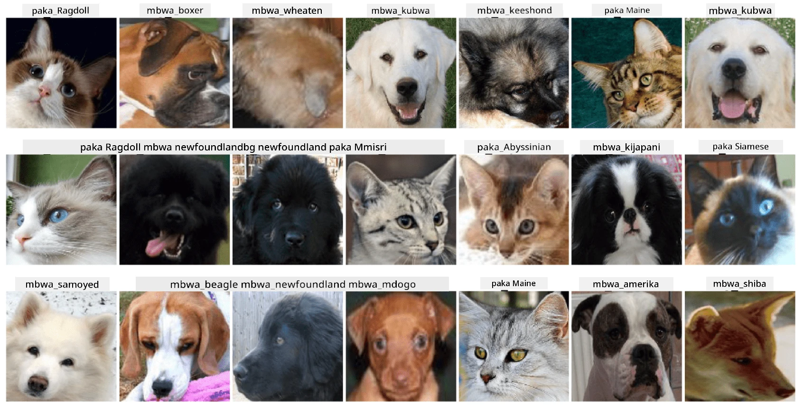

# Uainishaji wa Nyuso za Wanyama Kipenzi

Kazi ya Maabara kutoka [Mtaala wa AI kwa Kompyuta](https://github.com/microsoft/ai-for-beginners).

## Kazi

Fikiria unahitaji kuunda programu kwa ajili ya kituo cha kulelea wanyama kipenzi ili kuorodhesha wanyama wote. Moja ya vipengele bora vya programu kama hiyo itakuwa kugundua aina ya mnyama moja kwa moja kutoka kwenye picha. Hili linaweza kufanikiwa kwa kutumia mitandao ya neva.

Unahitaji kufundisha mtandao wa neva wa convolutional ili kuainisha aina tofauti za paka na mbwa kwa kutumia dataset ya **Nyuso za Wanyama Kipenzi**.

## Dataset

Tutatumia [Oxford-IIIT Pet Dataset](https://www.robots.ox.ac.uk/~vgg/data/pets/), ambayo ina picha za aina 37 tofauti za mbwa na paka.



Ili kupakua dataset, tumia kipande hiki cha msimbo:

```python
!wget https://thor.robots.ox.ac.uk/~vgg/data/pets/images.tar.gz
!tar xfz images.tar.gz
!rm images.tar.gz
```

**Kumbuka:** Picha za Oxford-IIIT Pet Dataset zimepangwa kwa jina la faili (mfano, `Abyssinian_1.jpg`, `Bengal_2.jpg`). Notebook inajumuisha msimbo wa kupanga picha hizi katika folda maalum za aina ili kurahisisha uainishaji.

## Kuanzisha Notebook

Anza maabara kwa kufungua [PetFaces.ipynb](PetFaces.ipynb)

## Mafanikio

Umesuluhisha tatizo gumu la uainishaji wa picha kutoka mwanzo! Kulikuwa na madarasa mengi, na bado uliweza kupata usahihi wa kuridhisha! Pia ina maana kupima usahihi wa top-k, kwa sababu ni rahisi kuchanganya baadhi ya madarasa ambayo hata kwa binadamu si rahisi kutofautisha.

---

**Kanusho**:  
Hati hii imetafsiriwa kwa kutumia huduma ya tafsiri ya AI [Co-op Translator](https://github.com/Azure/co-op-translator). Ingawa tunajitahidi kuhakikisha usahihi, tafadhali fahamu kuwa tafsiri za kiotomatiki zinaweza kuwa na makosa au kutokuwa sahihi. Hati ya asili katika lugha yake ya awali inapaswa kuzingatiwa kama chanzo cha mamlaka. Kwa taarifa muhimu, tafsiri ya kitaalamu ya binadamu inapendekezwa. Hatutawajibika kwa kutoelewana au tafsiri zisizo sahihi zinazotokana na matumizi ya tafsiri hii.