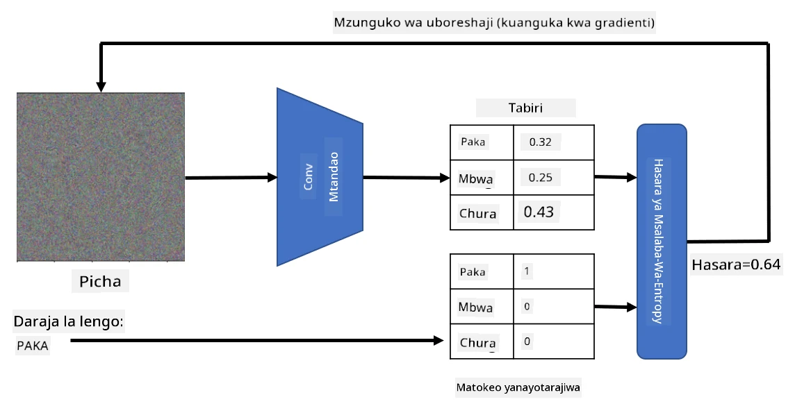

# Mitandao Iliyojifunza Kabla na Kujifunza kwa Uhamisho

Kufundisha CNNs inaweza kuchukua muda mwingi, na data nyingi inahitajika kwa kazi hiyo. Hata hivyo, muda mwingi hutumika kujifunza vichujio vya kiwango cha chini ambavyo mtandao unaweza kutumia kutoa mifumo kutoka kwa picha. Swali la asili linatokea - je, tunaweza kutumia mtandao wa neva uliyojifunza kwenye seti moja ya data na kuubadilisha ili kuainisha picha tofauti bila kuhitaji mchakato kamili wa mafunzo?

## [Maswali ya awali ya somo](https://ff-quizzes.netlify.app/en/ai/quiz/15)

Mbinu hii inaitwa **kujifunza kwa uhamisho**, kwa sababu tunahamisha maarifa fulani kutoka kwa mfano mmoja wa mtandao wa neva kwenda mwingine. Katika kujifunza kwa uhamisho, kwa kawaida tunaanza na mfano uliyojifunza kabla, ambao umefundishwa kwenye seti kubwa ya data ya picha, kama vile **ImageNet**. Mifano hiyo tayari inaweza kufanya kazi nzuri ya kutoa vipengele tofauti kutoka kwa picha za kawaida, na mara nyingi kujenga kionainishaji juu ya vipengele hivyo vilivyotolewa kunaweza kutoa matokeo mazuri.

> ✅ Kujifunza kwa Uhamisho ni neno linalopatikana katika nyanja nyingine za kitaaluma, kama vile Elimu. Linahusu mchakato wa kuchukua maarifa kutoka uwanja mmoja na kuyatumia kwa mwingine.

## Mifano Iliyojifunza Kabla kama Vitoa Vipengele

Mitandao ya convolutional tuliyozungumzia katika sehemu iliyopita ina idadi ya tabaka, kila moja ikitarajiwa kutoa vipengele fulani kutoka kwa picha, kuanzia mchanganyiko wa pikseli wa kiwango cha chini (kama vile mstari wa mlalo/mwima au stroke), hadi mchanganyiko wa kiwango cha juu wa vipengele, vinavyohusiana na vitu kama jicho la moto. Ikiwa tunafundisha CNN kwenye seti kubwa ya data ya picha za kawaida na tofauti, mtandao unapaswa kujifunza kutoa vipengele hivyo vya kawaida.

Keras na PyTorch zote zina kazi za kupakia kwa urahisi uzito wa mtandao wa neva uliyojifunza kabla kwa baadhi ya usanifu wa kawaida, nyingi zikiwa zimefundishwa kwenye picha za ImageNet. Zilizozoea zaidi zimeelezwa kwenye ukurasa wa [Usanifu wa CNN](../07-ConvNets/CNN_Architectures.md) kutoka somo la awali. Hasa, unaweza kutaka kuzingatia kutumia mojawapo ya zifuatazo:

* **VGG-16/VGG-19** ambazo ni mifano rahisi inayotoa usahihi mzuri. Mara nyingi kutumia VGG kama jaribio la kwanza ni chaguo zuri kuona jinsi kujifunza kwa uhamisho kunavyofanya kazi.
* **ResNet** ni familia ya mifano iliyopendekezwa na Microsoft Research mwaka 2015. Ina tabaka zaidi, na hivyo inahitaji rasilimali zaidi.
* **MobileNet** ni familia ya mifano yenye ukubwa mdogo, inayofaa kwa vifaa vya mkononi. Tumia ikiwa una uhaba wa rasilimali na unaweza kukubali kupoteza usahihi kidogo.

Hapa kuna vipengele vya mfano vilivyotolewa kutoka kwa picha ya paka na mtandao wa VGG-16:

## Seti ya Data ya Paka na Mbwa

Katika mfano huu, tutatumia seti ya data ya [Paka na Mbwa](https://www.microsoft.com/download/details.aspx?id=54765&WT.mc_id=academic-77998-cacaste), ambayo iko karibu sana na hali halisi ya uainishaji wa picha.

## ✍️ Zoezi: Kujifunza kwa Uhamisho

Tuone kujifunza kwa uhamisho kwa vitendo katika daftari husika:

* [Kujifunza kwa Uhamisho - PyTorch](TransferLearningPyTorch.ipynb)
* [Kujifunza kwa Uhamisho - TensorFlow](TransferLearningTF.ipynb)

## Kuonyesha Paka ya Kihasama

Mtandao wa neva uliyojifunza kabla una mifumo tofauti ndani ya "ubongo" wake, ikiwa ni pamoja na dhana za **paka bora** (pamoja na mbwa bora, punda milia bora, nk.). Itakuwa ya kuvutia kuonyesha **picha hii** kwa namna fulani. Hata hivyo, si rahisi, kwa sababu mifumo imesambazwa kote kwenye uzito wa mtandao, na pia imepangwa katika muundo wa kihierarkia.

Njia moja tunayoweza kuchukua ni kuanza na picha ya nasibu, kisha kujaribu kutumia mbinu ya **ufanisi wa gradient descent** kurekebisha picha hiyo kwa namna ambayo mtandao unaanza kufikiria kuwa ni paka.

Hata hivyo, tukifanya hivyo, tutapata kitu kinachofanana sana na kelele ya nasibu. Hii ni kwa sababu *kuna njia nyingi za kufanya mtandao kufikiria picha ya ingizo ni paka*, ikiwa ni pamoja na baadhi ambazo hazina maana kwa macho. Ingawa picha hizo zina mifumo mingi inayotambulika kwa paka, hakuna kitu kinachozuia kuwa tofauti kwa macho.

Ili kuboresha matokeo, tunaweza kuongeza kipengele kingine kwenye kazi ya hasara, kinachoitwa **variation loss**. Ni kipimo kinachoonyesha jinsi pikseli za jirani za picha zinavyofanana. Kupunguza variation loss hufanya picha kuwa laini, na kuondoa kelele - hivyo kufichua mifumo inayovutia zaidi kwa macho. Hapa kuna mfano wa picha "bora" zinazotambuliwa kama paka na kama punda milia kwa uwezekano mkubwa:

 | 
-----|-----
 *Paka Bora* | *Punda Milia Bora*

Njia sawa inaweza kutumika kufanya kile kinachoitwa **mashambulizi ya kihasama** kwenye mtandao wa neva. Tuseme tunataka kudanganya mtandao wa neva na kufanya mbwa aonekane kama paka. Ikiwa tutachukua picha ya mbwa, ambayo inatambuliwa na mtandao kama mbwa, tunaweza kuirekebisha kidogo kwa kutumia ufanisi wa gradient descent, hadi mtandao uanze kuainisha kama paka:

 | 
-----|-----
*Picha ya asili ya mbwa* | *Picha ya mbwa inayotambuliwa kama paka*

Tazama msimbo wa kuzalisha matokeo yaliyo hapo juu katika daftari lifuatalo:

* [Paka Bora na Kihasama - TensorFlow](AdversarialCat_TF.ipynb)

## Hitimisho

Kwa kutumia kujifunza kwa uhamisho, unaweza kuunda haraka kionainishaji kwa kazi ya uainishaji wa kitu maalum na kufikia usahihi wa juu. Unaweza kuona kwamba kazi ngumu zaidi tunazotatua sasa zinahitaji nguvu kubwa ya kompyuta, na haziwezi kutatuliwa kwa urahisi kwenye CPU. Katika kitengo kinachofuata, tutajaribu kutumia utekelezaji mwepesi zaidi kufundisha mfano huo kwa kutumia rasilimali za chini, ambayo inasababisha kupungua kidogo kwa usahihi.

## 🚀 Changamoto

Katika daftari zinazofuatana, kuna maelezo chini kuhusu jinsi maarifa ya uhamisho yanavyofanya kazi vizuri zaidi na data ya mafunzo inayofanana kidogo (aina mpya ya mnyama, labda). Fanya majaribio na aina mpya kabisa za picha ili kuona jinsi mifano yako ya maarifa ya uhamisho inavyofanya kazi vizuri au vibaya.

## [Maswali ya baada ya somo](https://ff-quizzes.netlify.app/en/ai/quiz/16)

## Mapitio na Kujisomea

Soma kupitia [TrainingTricks.md](TrainingTricks.md) ili kuongeza maarifa yako kuhusu njia nyingine za kufundisha mifano yako.

## [Kazi ya Nyumbani](lab/README.md)

Katika maabara hii, tutatumia seti halisi ya data ya [Oxford-IIIT](https://www.robots.ox.ac.uk/~vgg/data/pets/) ya wanyama wa kipenzi yenye aina 35 za paka na mbwa, na tutaunda kionainishaji cha kujifunza kwa uhamisho.

---

