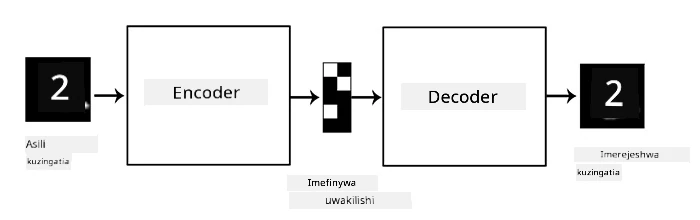
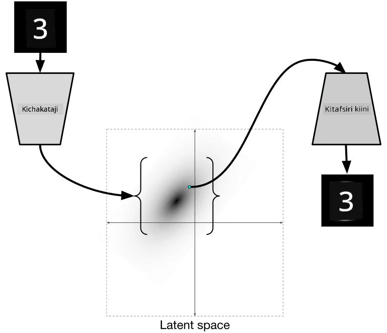

# Autoencoders

Wakati wa kufundisha CNNs, mojawapo ya changamoto ni kwamba tunahitaji data nyingi yenye lebo. Katika hali ya uainishaji wa picha, tunahitaji kutenganisha picha katika madarasa tofauti, jambo ambalo linahitaji juhudi za mikono.

## [Pre-lecture quiz](https://ff-quizzes.netlify.app/en/ai/quiz/17)

Hata hivyo, tunaweza kutaka kutumia data ghafi (isiyo na lebo) kwa kufundisha CNN feature extractors, jambo ambalo linaitwa **kujifunza kwa kujisimamia**. Badala ya lebo, tutatumia picha za mafunzo kama pembejeo na matokeo ya mtandao. Wazo kuu la **autoencoder** ni kwamba tutakuwa na **encoder network** inayobadilisha picha ya pembejeo kuwa **latent space** fulani (kawaida ni vector ya ukubwa mdogo), kisha **decoder network**, ambayo lengo lake litakuwa kurejesha picha ya asili.

> ✅ [Autoencoder](https://wikipedia.org/wiki/Autoencoder) ni "aina ya mtandao wa neva bandia unaotumika kujifunza coding bora za data isiyo na lebo."

Kwa kuwa tunafundisha autoencoder ili kunasa taarifa nyingi kutoka kwenye picha ya asili iwezekanavyo kwa ajili ya ujenzi sahihi, mtandao unajaribu kupata **embedding** bora ya picha za pembejeo ili kunasa maana yake.

> Picha kutoka [Keras blog](https://blog.keras.io/building-autoencoders-in-keras.html)

## Matumizi ya Autoencoders

Ingawa kurejesha picha za asili hakuonekani kuwa na manufaa peke yake, kuna hali kadhaa ambapo autoencoders ni muhimu sana:

* **Kupunguza vipimo vya picha kwa ajili ya kuona** au **kufundisha embeddings za picha**. Kawaida autoencoders hutoa matokeo bora kuliko PCA, kwa sababu inazingatia asili ya anga ya picha na vipengele vya kihierarkia.
* **Kuondoa kelele**, yaani kuondoa kelele kutoka kwenye picha. Kwa sababu kelele hubeba taarifa nyingi zisizo na maana, autoencoder haiwezi kuingiza zote kwenye latent space ndogo, na hivyo hunasa sehemu muhimu tu ya picha. Wakati wa kufundisha denoisers, tunaanza na picha za asili, na kutumia picha zilizo na kelele iliyoongezwa kwa makusudi kama pembejeo kwa autoencoder.
* **Super-resolution**, kuongeza azimio la picha. Tunaanza na picha zenye azimio la juu, na kutumia picha yenye azimio la chini kama pembejeo ya autoencoder.
* **Generative models**. Mara tu tunapofundisha autoencoder, sehemu ya decoder inaweza kutumika kuunda vitu vipya kuanzia latent vectors za nasibu.

## Variational Autoencoders (VAE)

Autoencoders za jadi hupunguza vipimo vya data ya pembejeo kwa namna fulani, ikigundua vipengele muhimu vya picha za pembejeo. Hata hivyo, latent vectors mara nyingi hazina maana kubwa. Kwa maneno mengine, tukichukua dataset ya MNIST kama mfano, kugundua ni namba gani zinazolingana na latent vectors tofauti si kazi rahisi, kwa sababu latent vectors zilizo karibu hazihusiani lazima na namba sawa.

Kwa upande mwingine, ili kufundisha *generative* models ni bora kuwa na uelewa fulani wa latent space. Wazo hili linatupeleka kwenye **variational auto-encoder** (VAE).

VAE ni autoencoder inayojifunza kutabiri *statistical distribution* ya vigezo vya latent, inayoitwa **latent distribution**. Kwa mfano, tunaweza kutaka latent vectors kusambazwa kawaida na wastani fulani zmean na mkengeuko wa kawaida zsigma (wastani na mkengeuko wa kawaida ni vectors za ukubwa fulani d). Encoder katika VAE hujifunza kutabiri vigezo hivyo, kisha decoder huchukua vector ya nasibu kutoka kwenye usambazaji huu ili kurejesha kitu.

Kwa muhtasari:

 * Kutoka vector ya pembejeo, tunatabiri `z_mean` na `z_log_sigma` (badala ya kutabiri mkengeuko wa kawaida yenyewe, tunatabiri logarithm yake)
 * Tunachukua vector `sample` kutoka kwenye usambazaji N(zmean,exp(zlog\_sigma))
 * Decoder hujaribu kurejesha picha ya asili kwa kutumia `sample` kama vector ya pembejeo

 

> Picha kutoka [blog post hii](https://ijdykeman.github.io/ml/2016/12/21/cvae.html) na Isaak Dykeman

Variational auto-encoders hutumia loss function ngumu inayojumuisha sehemu mbili:

* **Reconstruction loss** ni loss function inayonyesha jinsi picha iliyojengwa upya ilivyo karibu na lengo (inaweza kuwa Mean Squared Error, au MSE). Ni loss function sawa na ile ya autoencoders za kawaida.
* **KL loss**, ambayo inahakikisha kwamba usambazaji wa latent variable unakaribia usambazaji wa kawaida. Inategemea dhana ya [Kullback-Leibler divergence](https://www.countbayesie.com/blog/2017/5/9/kullback-leibler-divergence-explained) - kipimo cha kutathmini jinsi usambazaji wa takwimu mbili unavyofanana.

Faida moja muhimu ya VAEs ni kwamba zinaturuhusu kuunda picha mpya kwa urahisi, kwa sababu tunajua usambazaji wa kuchukua latent vectors. Kwa mfano, tukifundisha VAE na latent vector ya 2D kwenye MNIST, tunaweza kubadilisha vipengele vya latent vector ili kupata namba tofauti:

> Picha na [Dmitry Soshnikov](http://soshnikov.com)

Angalia jinsi picha zinavyoungana, tunapoanza kuchukua latent vectors kutoka sehemu tofauti za latent parameter space. Tunaweza pia kuona anga hii kwa 2D:

 

> Picha na [Dmitry Soshnikov](http://soshnikov.com)

## ✍️ Mazoezi: Autoencoders

Jifunze zaidi kuhusu autoencoders katika daftari hizi zinazohusiana:

* [Autoencoders katika TensorFlow](AutoencodersTF.ipynb)
* [Autoencoders katika PyTorch](AutoEncodersPyTorch.ipynb)

## Sifa za Autoencoders

* **Data Specific** - zinafanya kazi vizuri tu na aina ya picha ambazo zimefundishwa nazo. Kwa mfano, tukifundisha mtandao wa super-resolution kwenye maua, hautafanya kazi vizuri kwenye picha za watu. Hii ni kwa sababu mtandao unaweza kutoa picha ya azimio la juu kwa kuchukua maelezo mazuri kutoka kwa vipengele vilivyojifunza kutoka dataset ya mafunzo.
* **Lossy** - picha iliyojengwa upya si sawa na picha ya asili. Asili ya hasara inafafanuliwa na *loss function* iliyotumika wakati wa mafunzo.
* Inafanya kazi na **data isiyo na lebo**

## [Post-lecture quiz](https://ff-quizzes.netlify.app/en/ai/quiz/18)

## Hitimisho

Katika somo hili, umejifunza kuhusu aina mbalimbali za autoencoders zinazopatikana kwa mwanasayansi wa AI. Umejifunza jinsi ya kuzijenga, na jinsi ya kuzitumia kurejesha picha. Pia umejifunza kuhusu VAE na jinsi ya kuitumia kuunda picha mpya.

## 🚀 Changamoto

Katika somo hili, umejifunza kuhusu kutumia autoencoders kwa picha. Lakini zinaweza pia kutumika kwa muziki! Angalia mradi wa Magenta [MusicVAE](https://magenta.tensorflow.org/music-vae), ambao hutumia autoencoders kujifunza kurejesha muziki. Fanya [majaribio](https://colab.research.google.com/github/magenta/magenta-demos/blob/master/colab-notebooks/Multitrack_MusicVAE.ipynb) na maktaba hii ili kuona unachoweza kuunda.

## [Post-lecture quiz](https://ff-quizzes.netlify.app/en/ai/quiz/16)

## Mapitio & Kujisomea

Kwa marejeleo, soma zaidi kuhusu autoencoders katika rasilimali hizi:

* [Kujenga Autoencoders katika Keras](https://blog.keras.io/building-autoencoders-in-keras.html)
* [Blog post kwenye NeuroHive](https://neurohive.io/ru/osnovy-data-science/variacionnyj-avtojenkoder-vae/)
* [Variational Autoencoders Explained](https://kvfrans.com/variational-autoencoders-explained/)
* [Conditional Variational Autoencoders](https://ijdykeman.github.io/ml/2016/12/21/cvae.html)

## Kazi ya Nyumbani

Mwisho wa [daftari hili linalotumia TensorFlow](AutoencodersTF.ipynb), utapata 'kazi' - tumia hii kama kazi yako ya nyumbani.

---

