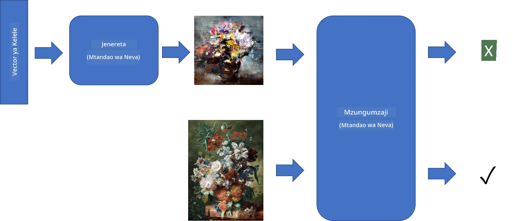
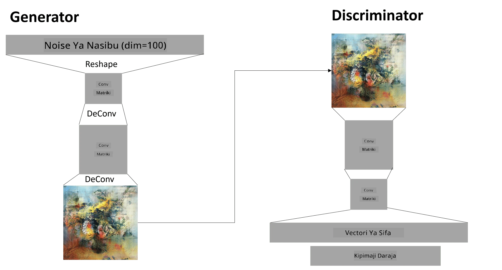

# Mitandao ya Kizazi ya Kihasama

Katika sehemu iliyopita, tulijifunza kuhusu **miundo ya kizazi**: miundo inayoweza kuzalisha picha mpya zinazofanana na zile zilizopo kwenye seti ya mafunzo. VAE ilikuwa mfano mzuri wa muundo wa kizazi.

## [Maswali ya awali ya somo](https://ff-quizzes.netlify.app/en/ai/quiz/19)

Hata hivyo, tukijaribu kuzalisha kitu chenye maana zaidi, kama mchoro wa ubora wa juu, kwa kutumia VAE, tutaona kuwa mafunzo hayafanikii vizuri. Kwa matumizi haya, tunapaswa kujifunza kuhusu usanifu mwingine maalum unaolenga miundo ya kizazi - **Mitandao ya Kizazi ya Kihasama**, au GANs.

Wazo kuu la GAN ni kuwa na mitandao miwili ya neva ambayo itafundishwa dhidi ya kila mmoja:

> Picha na [Dmitry Soshnikov](http://soshnikov.com)

> ✅ Maneno machache ya msamiati:
> * **Generator** ni mtandao unaochukua vector ya nasibu, na kuzalisha picha kama matokeo.
> * **Discriminator** ni mtandao unaochukua picha, na unapaswa kusema kama ni picha halisi (kutoka seti ya mafunzo), au ilizalishwa na generator. Kimsingi ni mtambuzi wa picha.

### Discriminator

Usanifu wa discriminator hauhitofautiani na mtandao wa kawaida wa uainishaji wa picha. Katika hali rahisi inaweza kuwa uainishaji wa tabaka zilizounganishwa kikamilifu, lakini mara nyingi itakuwa [mtandao wa convolutional](../07-ConvNets/README.md).

> ✅ GAN inayotegemea mitandao ya convolutional inaitwa [DCGAN](https://arxiv.org/pdf/1511.06434.pdf)

Discriminator ya CNN ina tabaka zifuatazo: convolution+pooling kadhaa (zikiwa na ukubwa wa anga unaopungua) na, tabaka moja au zaidi zilizounganishwa kikamilifu ili kupata "vector ya sifa", uainishaji wa mwisho wa binary.

> ✅ 'Pooling' katika muktadha huu ni mbinu inayopunguza ukubwa wa picha. "Tabaka za pooling hupunguza vipimo vya data kwa kuunganisha matokeo ya makundi ya neurons katika tabaka moja kuwa neuron moja katika tabaka inayofuata." - [chanzo](https://wikipedia.org/wiki/Convolutional_neural_network#Pooling_layers)

### Generator

Generator ni ngumu kidogo. Unaweza kuichukulia kama discriminator iliyogeuzwa. Kuanzia na vector ya latent (badala ya vector ya sifa), ina tabaka zilizounganishwa kikamilifu ili kuibadilisha kuwa ukubwa/umbo linalohitajika, ikifuatiwa na deconvolution+upscaling. Hii ni sawa na sehemu ya *decoder* ya [autoencoder](../09-Autoencoders/README.md).

> ✅ Kwa sababu tabaka ya convolution inatekelezwa kama kichujio cha mstari kinachopita kwenye picha, deconvolution kimsingi ni sawa na convolution, na inaweza kutekelezwa kwa kutumia mantiki sawa ya tabaka.

> Picha na [Dmitry Soshnikov](http://soshnikov.com)

### Mafunzo ya GAN

GANs zinaitwa **kihasama** kwa sababu kuna ushindani wa mara kwa mara kati ya generator na discriminator. Wakati wa ushindani huu, generator na discriminator zote zinaboreshwa, hivyo mtandao hujifunza kuzalisha picha bora zaidi.

Mafunzo hufanyika kwa hatua mbili:

* **Mafunzo ya discriminator**. Kazi hii ni rahisi: tunazalisha kundi la picha kwa kutumia generator, tukiziwekea lebo 0, ambayo inasimama kwa picha bandia, na kuchukua kundi la picha kutoka seti ya maingizo (zikiwa na lebo 1, picha halisi). Tunapata *discriminator loss*, na kufanya backprop.
* **Mafunzo ya generator**. Hii ni ngumu kidogo, kwa sababu hatujui matokeo yanayotarajiwa kwa generator moja kwa moja. Tunachukua mtandao mzima wa GAN unaojumuisha generator ikifuatiwa na discriminator, tunailisha na vectors za nasibu, na tunatarajia matokeo kuwa 1 (yanayolingana na picha halisi). Kisha tunagandisha vigezo vya discriminator (hatutaki ifundishwe katika hatua hii), na kufanya backprop.

Wakati wa mchakato huu, hasara za generator na discriminator hazishuki sana. Katika hali bora, zinapaswa kuzunguka, zikionyesha mitandao yote miwili ikiboresha utendaji wake.

## ✍️ Mazoezi: GANs

* [Notebook ya GAN katika TensorFlow/Keras](GANTF.ipynb)
* [Notebook ya GAN katika PyTorch](GANPyTorch.ipynb)

### Changamoto za Mafunzo ya GAN

GANs zinajulikana kuwa ngumu sana kufundisha. Hapa kuna changamoto chache:

* **Mode Collapse**. Kwa neno hili tunamaanisha kuwa generator inajifunza kuzalisha picha moja yenye mafanikio inayomdanganya discriminator, na si aina mbalimbali za picha tofauti.
* **Unyeti kwa hyperparameters**. Mara nyingi unaweza kuona kuwa GAN haifanikii kabisa, na kisha ghafla kupungua kwa kiwango cha kujifunza kunasababisha mafanikio.
* Kuweka **usawa** kati ya generator na discriminator. Katika hali nyingi hasara ya discriminator inaweza kushuka hadi sifuri haraka, ambayo husababisha generator kushindwa kuendelea kujifunza. Ili kushinda hili, tunaweza kujaribu kuweka viwango tofauti vya kujifunza kwa generator na discriminator, au kuruka mafunzo ya discriminator ikiwa hasara tayari ni ndogo sana.
* Mafunzo kwa **azimio la juu**. Kuonyesha tatizo sawa na autoencoders, tatizo hili linatokea kwa sababu ya kujenga tabaka nyingi za mtandao wa convolutional husababisha artifacts. Tatizo hili kwa kawaida linatatuliwa kwa kinachoitwa **progressive growing**, ambapo tabaka chache za kwanza zinafundishwa kwenye picha za azimio la chini, na kisha tabaka zinafunguliwa au kuongezwa. Suluhisho jingine litakuwa kuongeza miunganisho ya ziada kati ya tabaka na kufundisha maazimio kadhaa kwa wakati mmoja - angalia karatasi hii ya [Multi-Scale Gradient GANs](https://arxiv.org/abs/1903.06048) kwa maelezo zaidi.

## Uhamishaji wa Mtindo

GANs ni njia nzuri ya kuzalisha picha za kisanii. Mbinu nyingine ya kuvutia ni kinachoitwa **uhamishaji wa mtindo**, ambayo inachukua moja **picha ya maudhui**, na kuichora upya kwa mtindo tofauti, ikitumia vichujio kutoka **picha ya mtindo**.

Njia inavyofanya kazi ni kama ifuatavyo:
* Tunaanza na picha ya kelele ya nasibu (au na picha ya maudhui, lakini kwa ajili ya kuelewa ni rahisi kuanza na kelele ya nasibu)
* Lengo letu litakuwa kuunda picha ambayo itakuwa karibu na picha ya maudhui na picha ya mtindo. Hii itaamuliwa na kazi mbili za hasara:
   - **Hasara ya maudhui** inahesabiwa kulingana na sifa zilizotolewa na CNN katika tabaka fulani kutoka picha ya sasa na picha ya maudhui.
   - **Hasara ya mtindo** inahesabiwa kati ya picha ya sasa na picha ya mtindo kwa njia ya busara kwa kutumia matriki za Gram (maelezo zaidi katika [notebook ya mfano](StyleTransfer.ipynb)).
* Ili kufanya picha iwe laini na kuondoa kelele, tunatambulisha pia **Hasara ya mabadiliko**, ambayo inahesabu umbali wa wastani kati ya pikseli za jirani.
* Mzunguko mkuu wa uboreshaji unarekebisha picha ya sasa kwa kutumia gradient descent (au algorithm nyingine ya uboreshaji) ili kupunguza hasara ya jumla, ambayo ni jumla ya uzito wa hasara zote tatu.

## ✍️ Mfano: [Uhamishaji wa Mtindo](StyleTransfer.ipynb)

## [Maswali ya baada ya somo](https://ff-quizzes.netlify.app/en/ai/quiz/20)

## Hitimisho

Katika somo hili, umejifunza kuhusu GANs na jinsi ya kuzifundisha. Pia umejifunza kuhusu changamoto maalum ambazo aina hii ya Mtandao wa Neva inaweza kukutana nazo, na mikakati ya jinsi ya kuzishinda.

## 🚀 Changamoto

Pitisha [notebook ya Uhamishaji wa Mtindo](StyleTransfer.ipynb) ukitumia picha zako mwenyewe.

## Mapitio na Kujisomea

Kwa marejeleo, soma zaidi kuhusu GANs katika rasilimali hizi:

* Marco Pasini, [Masomo 10 Niliyoyajifunza Kufundisha GANs kwa Mwaka Mmoja](https://towardsdatascience.com/10-lessons-i-learned-training-generative-adversarial-networks-gans-for-a-year-c9071159628)
* [StyleGAN](https://en.wikipedia.org/wiki/StyleGAN), usanifu wa GAN wa *de facto* wa kuzingatia.
* [Kuunda Sanaa ya Kizazi kwa kutumia GANs kwenye Azure ML](https://soshnikov.com/scienceart/creating-generative-art-using-gan-on-azureml/)

## Kazi

Rudia moja ya notebook mbili zinazohusiana na somo hili na fundisha tena GAN kwa kutumia picha zako mwenyewe. Unaweza kuunda nini?

---

