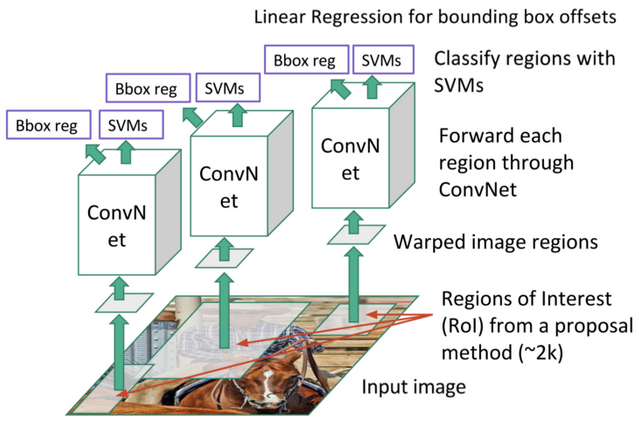

<!--
CO_OP_TRANSLATOR_METADATA:
{
  "original_hash": "d76a7eda28de5210c8b1ba50a6216c69",
  "translation_date": "2025-09-23T11:00:17+00:00",
  "source_file": "lessons/4-ComputerVision/11-ObjectDetection/README.md",
  "language_code": "sw"
}
-->
# Utambuzi wa Vitu

Mifano ya uainishaji wa picha tuliyojifunza hadi sasa ilichukua picha na kutoa matokeo ya kategoria, kama vile darasa 'namba' katika tatizo la MNIST. Hata hivyo, mara nyingi hatutaki tu kujua kwamba picha inaonyesha vitu - tunataka pia kujua mahali vilipo kwa usahihi. Hii ndiyo hasa dhumuni la **utambuzi wa vitu**.

## [Jaribio la awali la somo](https://ff-quizzes.netlify.app/en/ai/quiz/21)

> Picha kutoka [tovuti ya YOLO v2](https://pjreddie.com/darknet/yolov2/)

## Njia Rahisi ya Utambuzi wa Vitu

Tukidhani tunataka kutambua paka kwenye picha, njia rahisi ya utambuzi wa vitu inaweza kuwa kama ifuatavyo:

1. Gawanya picha katika vigae kadhaa.
2. Fanya uainishaji wa picha kwenye kila kigae.
3. Vigae vile vinavyotoa matokeo ya juu vya kutosha vinaweza kuchukuliwa kuwa na kitu kinachotafutwa.

> *Picha kutoka [Daftari la Mazoezi](ObjectDetection-TF.ipynb)*

Hata hivyo, njia hii si bora, kwa sababu inaruhusu tu algorithimu kupata eneo la kitu kwa usahihi mdogo. Kwa usahihi zaidi, tunahitaji kutumia aina fulani ya **usawazishaji** ili kutabiri mipaka ya maboksi - na kwa hilo, tunahitaji seti maalum za data.

## Usawazishaji kwa Utambuzi wa Vitu

[Chapisho hili la blogu](https://towardsdatascience.com/object-detection-with-neural-networks-a4e2c46b4491) lina utangulizi mzuri wa kutambua maumbo.

## Seti za Data kwa Utambuzi wa Vitu

Unaweza kukutana na seti zifuatazo za data kwa kazi hii:

* [PASCAL VOC](http://host.robots.ox.ac.uk/pascal/VOC/) - madarasa 20
* [COCO](http://cocodataset.org/#home) - Vitu vya Kawaida katika Muktadha. Madarasa 80, maboksi ya mipaka na maski za kugawanya

## Vipimo vya Utambuzi wa Vitu

### Muingiliano juu ya Muungano

Wakati kwa uainishaji wa picha ni rahisi kupima jinsi algorithimu inavyofanya kazi, kwa utambuzi wa vitu tunahitaji kupima usahihi wa darasa, pamoja na usahihi wa eneo la boksi lililotabiriwa. Kwa hili la mwisho, tunatumia kipimo kinachoitwa **Muingiliano juu ya Muungano** (IoU), ambacho hupima jinsi maboksi mawili (au maeneo mawili yoyote) yanavyofanana.

> *Mchoro wa 2 kutoka [blogu hii bora kuhusu IoU](https://pyimagesearch.com/2016/11/07/intersection-over-union-iou-for-object-detection/)*

Wazo ni rahisi - tunagawanya eneo la muingiliano kati ya maumbo mawili kwa eneo la muungano wao. Kwa maeneo mawili yanayofanana kabisa, IoU itakuwa 1, wakati kwa maeneo yasiyogusana kabisa itakuwa 0. Vinginevyo, itatofautiana kati ya 0 na 1. Kwa kawaida tunazingatia tu maboksi yale ambayo IoU iko juu ya thamani fulani.

### Usahihi wa Wastani

Tukidhani tunataka kupima jinsi darasa fulani la vitu $C$ linavyotambuliwa. Ili kupima hili, tunatumia kipimo cha **Usahihi wa Wastani**, ambacho huhesabiwa kama ifuatavyo:

1. Fikiria mchoro wa Usahihi-Kumbukumbu unaonyesha usahihi kulingana na thamani ya kizingiti cha utambuzi (kutoka 0 hadi 1).
2. Kulingana na kizingiti, tutapata vitu vingi au vichache vilivyotambuliwa kwenye picha, na maadili tofauti ya usahihi na kumbukumbu.
3. Mchoro utaonekana kama huu:

> *Picha kutoka [NeuroWorkshop](http://github.com/shwars/NeuroWorkshop)*

Usahihi wa Wastani kwa darasa fulani $C$ ni eneo chini ya mchoro huu. Kwa usahihi zaidi, mhimili wa Kumbukumbu kwa kawaida hugawanywa katika sehemu 10, na Usahihi huhesabiwa wastani kwa pointi zote hizo:

$$
AP = {1\over11}\sum_{i=0}^{10}\mbox{Precision}(\mbox{Recall}={i\over10})
$$

### AP na IoU

Tutazingatia tu utambuzi ule ambao IoU iko juu ya thamani fulani. Kwa mfano, katika seti ya data ya PASCAL VOC kwa kawaida $\mbox{IoU Threshold} = 0.5$ inachukuliwa, wakati katika COCO AP hupimwa kwa maadili tofauti ya $\mbox{IoU Threshold}$.

> *Picha kutoka [NeuroWorkshop](http://github.com/shwars/NeuroWorkshop)*

### Usahihi wa Wastani wa Kati - mAP

Kipimo kikuu cha Utambuzi wa Vitu kinaitwa **Usahihi wa Wastani wa Kati**, au **mAP**. Hii ni thamani ya Usahihi wa Wastani, wastani kwa madarasa yote ya vitu, na wakati mwingine pia kwa $\mbox{IoU Threshold}$. Kwa maelezo zaidi, mchakato wa kuhesabu **mAP** umeelezewa
[katika blogu hii](https://medium.com/@timothycarlen/understanding-the-map-evaluation-metric-for-object-detection-a07fe6962cf3)), na pia [hapa na sampuli za msimbo](https://gist.github.com/tarlen5/008809c3decf19313de216b9208f3734).

## Njia Tofauti za Utambuzi wa Vitu

Kuna makundi mawili makuu ya algorithimu za utambuzi wa vitu:

* **Mitandao ya Mapendekezo ya Maeneo** (R-CNN, Fast R-CNN, Faster R-CNN). Wazo kuu ni kuzalisha **Maeneo ya Maslahi** (ROI) na kuendesha CNN juu yao, kutafuta uanzishaji wa juu zaidi. Hii ni sawa kidogo na njia rahisi, isipokuwa kwamba ROI huzalishwa kwa njia ya busara zaidi. Mojawapo ya changamoto kuu za mbinu hizi ni kwamba ni polepole, kwa sababu tunahitaji kupitisha mara nyingi CNN juu ya picha.
* Mbinu za **kupita mara moja** (YOLO, SSD, RetinaNet). Katika usanifu huu tunabuni mtandao kutabiri madarasa na ROI kwa mara moja.

### R-CNN: CNN Inayozingatia Maeneo

[R-CNN](http://islab.ulsan.ac.kr/files/announcement/513/rcnn_pami.pdf) hutumia [Utafutaji wa Kuchagua](http://www.huppelen.nl/publications/selectiveSearchDraft.pdf) kuzalisha muundo wa kihierarkia wa maeneo ya ROI, ambayo kisha hupitishwa kupitia viondoa sifa vya CNN na vianuai vya SVM ili kubaini darasa la kitu, na usawazishaji wa mstari ili kubaini m coordinates ya *maboksi ya mipaka*. [Karatasi Rasmi](https://arxiv.org/pdf/1506.01497v1.pdf)

> *Picha kutoka van de Sande et al. ICCV’11*

> *Picha kutoka [blogu hii](https://towardsdatascience.com/r-cnn-fast-r-cnn-faster-r-cnn-yolo-object-detection-algorithms-36d53571365e)

### F-RCNN - Fast R-CNN

Mbinu hii ni sawa na R-CNN, lakini maeneo hufafanuliwa baada ya tabaka za convolution kutumika.

> Picha kutoka [Karatasi Rasmi](https://www.cv-foundation.org/openaccess/content_iccv_2015/papers/Girshick_Fast_R-CNN_ICCV_2015_paper.pdf), [arXiv](https://arxiv.org/pdf/1504.08083.pdf), 2015

### Faster R-CNN

Wazo kuu la mbinu hii ni kutumia mtandao wa neva kutabiri ROI - kinachoitwa *Mtandao wa Mapendekezo ya Maeneo*. [Karatasi](https://arxiv.org/pdf/1506.01497.pdf), 2016

> Picha kutoka [karatasi rasmi](https://arxiv.org/pdf/1506.01497.pdf)

### R-FCN: Mtandao wa Kikamilifu wa Convolutional Inayozingatia Maeneo

Algorithimu hii ni ya haraka zaidi kuliko Faster R-CNN. Wazo kuu ni kama ifuatavyo:

1. Tunatoa sifa kwa kutumia ResNet-101.
2. Sifa zinashughulikiwa na **Ramani ya Alama Inayozingatia Nafasi**. Kila kitu kutoka $C$ madarasa hugawanywa kwa maeneo $k\times k$, na tunafundisha kutabiri sehemu za vitu.
3. Kwa kila sehemu kutoka maeneo $k\times k$ mitandao yote hupiga kura kwa madarasa ya vitu, na darasa la kitu lenye kura nyingi zaidi huchaguliwa.

> Picha kutoka [karatasi rasmi](https://arxiv.org/abs/1605.06409)

### YOLO - You Only Look Once

YOLO ni algorithimu ya wakati halisi ya kupita mara moja. Wazo kuu ni kama ifuatavyo:

 * Picha inagawanywa katika maeneo $S\times S$.
 * Kwa kila eneo, **CNN** inatabiri vitu $n$ vinavyowezekana, m coordinates ya *maboksi ya mipaka* na *uhakika*=*uwezekano* * IoU.

 

> Picha kutoka [karatasi rasmi](https://arxiv.org/abs/1506.02640)

### Algorithimu Nyingine

* RetinaNet: [karatasi rasmi](https://arxiv.org/abs/1708.02002)
   - [Utekelezaji wa PyTorch katika Torchvision](https://pytorch.org/vision/stable/_modules/torchvision/models/detection/retinanet.html)
   - [Utekelezaji wa Keras](https://github.com/fizyr/keras-retinanet)
   - [Utambuzi wa Vitu na RetinaNet](https://keras.io/examples/vision/retinanet/) katika Sampuli za Keras
* SSD (Single Shot Detector): [karatasi rasmi](https://arxiv.org/abs/1512.02325)

## ✍️ Mazoezi: Utambuzi wa Vitu

Endelea kujifunza katika daftari lifuatalo:

[ObjectDetection.ipynb](ObjectDetection.ipynb)

## Hitimisho

Katika somo hili umejifunza njia mbalimbali za kutekeleza utambuzi wa vitu!

## 🚀 Changamoto

Soma makala na daftari hizi kuhusu YOLO na ujaribu mwenyewe:

* [Blogu nzuri](https://www.analyticsvidhya.com/blog/2018/12/practical-guide-object-detection-yolo-framewor-python/) inayofafanua YOLO
 * [Tovuti rasmi](https://pjreddie.com/darknet/yolo/)
 * Yolo: [Utekelezaji wa Keras](https://github.com/experiencor/keras-yolo2), [daftari la hatua kwa hatua](https://github.com/experiencor/basic-yolo-keras/blob/master/Yolo%20Step-by-Step.ipynb)
 * Yolo v2: [Utekelezaji wa Keras](https://github.com/experiencor/keras-yolo2), [daftari la hatua kwa hatua](https://github.com/experiencor/keras-yolo2/blob/master/Yolo%20Step-by-Step.ipynb)

## [Jaribio la baada ya somo](https://ff-quizzes.netlify.app/en/ai/quiz/22)

## Mapitio na Kujisomea

* [Utambuzi wa Vitu](https://tjmachinelearning.com/lectures/1718/obj/) na Nikhil Sardana
* [Ulinganisho mzuri wa algorithimu za utambuzi wa vitu](https://lilianweng.github.io/lil-log/2018/12/27/object-detection-part-4.html)
* [Mapitio ya Algorithimu za Kujifunza Kina kwa Utambuzi wa Vitu](https://medium.com/comet-app/review-of-deep-learning-algorithms-for-object-detection-c1f3d437b852)
* [Utangulizi wa Hatua kwa Hatua kwa Algorithimu za Msingi za Utambuzi wa Vitu](https://www.analyticsvidhya.com/blog/2018/10/a-step-by-step-introduction-to-the-basic-object-detection-algorithms-part-1/)
* [Utekelezaji wa Faster R-CNN kwa Python kwa Utambuzi wa Vitu](https://www.analyticsvidhya.com/blog/2018/11/implementation-faster-r-cnn-python-object-detection/)

## [Kazi: Utambuzi wa Vitu](lab/README.md)

---

