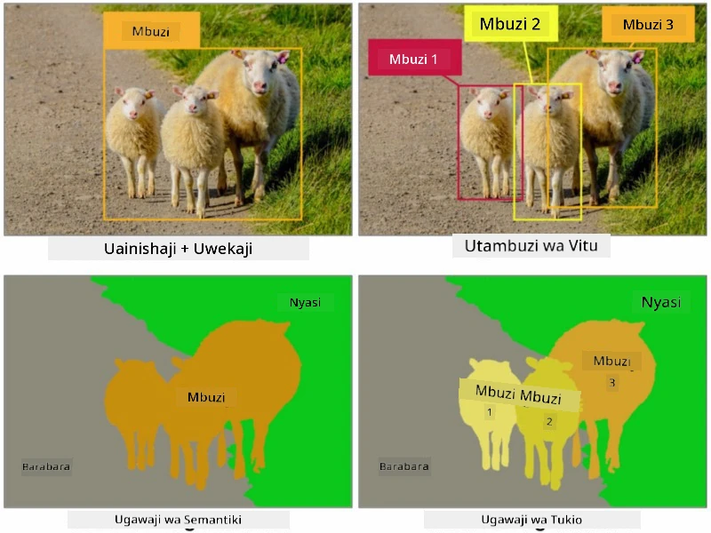
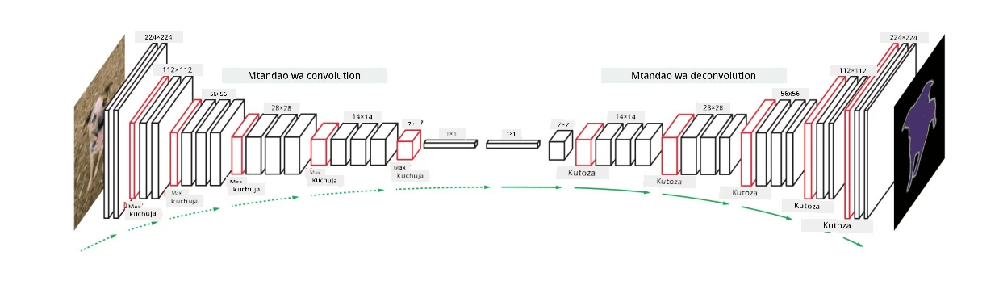

# Ugawaji

Tumejifunza awali kuhusu Utambuzi wa Vitu, ambao hutuwezesha kutambua vitu kwenye picha kwa kutabiri *maboksi ya mipaka*. Hata hivyo, kwa baadhi ya kazi hatuhitaji tu maboksi ya mipaka, bali pia utambuzi wa vitu kwa usahihi zaidi. Kazi hii inaitwa **ugawaji**.

## [Maswali ya awali ya somo](https://ff-quizzes.netlify.app/en/ai/quiz/23)

Ugawaji unaweza kuonekana kama **uainishaji wa pikseli**, ambapo kwa **kila** pikseli ya picha tunapaswa kutabiri darasa lake (*mandharinyuma* ikiwa mojawapo ya madarasa). Kuna mbinu kuu mbili za ugawaji:

* **Ugawaji wa kisemantiki** huonyesha tu darasa la pikseli, na haifanyi tofauti kati ya vitu tofauti vya darasa moja.
* **Ugawaji wa mfano** hugawanya madarasa katika mifano tofauti.

Kwa ugawaji wa mfano, kondoo hawa ni vitu tofauti, lakini kwa ugawaji wa kisemantiki kondoo wote wanawakilishwa na darasa moja.

> Picha kutoka [makala hii ya blogu](https://nirmalamurali.medium.com/image-classification-vs-semantic-segmentation-vs-instance-segmentation-625c33a08d50)

Kuna usanifu tofauti wa neva kwa ugawaji, lakini zote zina muundo sawa. Kwa namna fulani, ni sawa na autoencoder uliyojifunza awali, lakini badala ya kuvunja picha ya asili, lengo letu ni kuvunja **maski**. Kwa hivyo, mtandao wa ugawaji una sehemu zifuatazo:

* **Encoder** huchukua vipengele kutoka kwenye picha ya ingizo.
* **Decoder** hubadilisha vipengele hivyo kuwa **picha ya maski**, yenye ukubwa sawa na idadi ya njia zinazolingana na idadi ya madarasa.

> Picha kutoka [chapisho hili](https://arxiv.org/pdf/2001.05566.pdf)

Tunapaswa kutaja hasa kazi ya hasara inayotumika kwa ugawaji. Tunapotumia autoencoders za kawaida, tunahitaji kupima kufanana kati ya picha mbili, na tunaweza kutumia kosa la mraba wa wastani (MSE) kufanya hivyo. Katika ugawaji, kila pikseli kwenye picha ya maski ya lengo inawakilisha namba ya darasa (imekodwa kwa njia moja kwenye kipimo cha tatu), kwa hivyo tunahitaji kutumia kazi za hasara maalum kwa uainishaji - hasara ya msalaba-entropy, iliyowekwa wastani kwa pikseli zote. Ikiwa maski ni ya binary - **binary cross-entropy loss** (BCE) hutumika.

> ✅ Ukodaji wa njia moja ni njia ya kuweka lebo ya darasa kwenye vekta yenye urefu sawa na idadi ya madarasa. Angalia [makala hii](https://datagy.io/sklearn-one-hot-encode/) kuhusu mbinu hii.

## Ugawaji kwa Picha za Matibabu

Katika somo hili, tutaona ugawaji ukifanya kazi kwa kufundisha mtandao kutambua nevi za binadamu (pia zinajulikana kama moles) kwenye picha za matibabu. Tutatumia <a href="https://www.fc.up.pt/addi/ph2%20database.html">Hifadhidata ya PH2</a> ya picha za dermoscopy kama chanzo cha picha. Hifadhidata hii ina picha 200 za madarasa matatu: nevus ya kawaida, nevus isiyo ya kawaida, na melanoma. Picha zote pia zina **maski** inayotambulisha nevus.

> ✅ Mbinu hii inafaa hasa kwa aina hii ya picha za matibabu, lakini ni matumizi gani mengine ya ulimwengu halisi unayoweza kufikiria?

> Picha kutoka Hifadhidata ya PH2

Tutafundisha mfano wa kugawa nevus yoyote kutoka kwenye mandharinyuma yake.

## ✍️ Mazoezi: Ugawaji wa Kisemantiki

Fungua daftari zilizo hapa chini ili ujifunze zaidi kuhusu usanifu tofauti wa ugawaji wa kisemantiki, ufanye mazoezi ya kufanya kazi nao, na uone jinsi wanavyofanya kazi.

* [Ugawaji wa Kisemantiki Pytorch](SemanticSegmentationPytorch.ipynb)
* [Ugawaji wa Kisemantiki TensorFlow](SemanticSegmentationTF.ipynb)

## [Maswali ya baada ya somo](https://ff-quizzes.netlify.app/en/ai/quiz/24)

## Hitimisho

Ugawaji ni mbinu yenye nguvu sana kwa uainishaji wa picha, ikihama kutoka maboksi ya mipaka hadi uainishaji wa kiwango cha pikseli. Ni mbinu inayotumika katika picha za matibabu, miongoni mwa matumizi mengine.

## 🚀 Changamoto

Ugawaji wa mwili ni mojawapo ya kazi za kawaida tunazoweza kufanya na picha za watu. Kazi nyingine muhimu ni pamoja na **utambuzi wa mifupa** na **utambuzi wa mkao**. Jaribu maktaba ya [OpenPose](https://github.com/CMU-Perceptual-Computing-Lab/openpose) ili uone jinsi utambuzi wa mkao unavyoweza kutumika.

## Mapitio na Kujifunza Binafsi

Makala hii ya [Wikipedia](https://wikipedia.org/wiki/Image_segmentation) inatoa muhtasari mzuri wa matumizi mbalimbali ya mbinu hii. Jifunze zaidi peke yako kuhusu matawi madogo ya Ugawaji wa Mfano na Ugawaji wa Panoptiki katika uwanja huu wa uchunguzi.

## [Kazi ya nyumbani](lab/README.md)

Katika maabara hii, jaribu **ugawaji wa mwili wa binadamu** ukitumia [Hifadhidata ya Segmentation Full Body MADS](https://www.kaggle.com/datasets/tapakah68/segmentation-full-body-mads-dataset) kutoka Kaggle.

---

