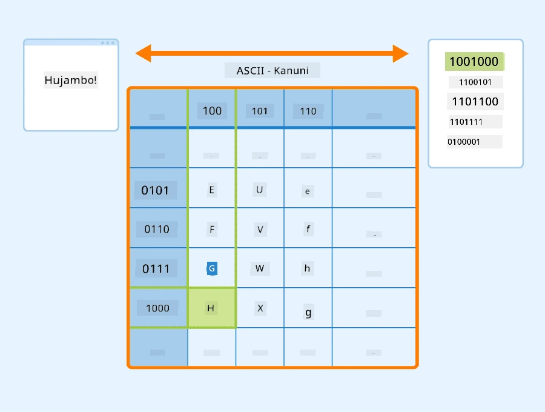
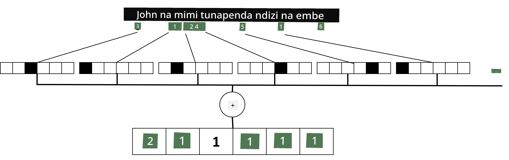

# Kuwakilisha Maandishi kama Tensors

## [Jaribio la kabla ya somo](https://ff-quizzes.netlify.app/en/ai/quiz/25)

## Uainishaji wa Maandishi

Katika sehemu ya kwanza ya somo hili, tutazingatia kazi ya **uainishaji wa maandishi**. Tutatumia Dataset ya [AG News](https://www.kaggle.com/amananandrai/ag-news-classification-dataset), ambayo ina makala za habari kama ifuatavyo:

* Kategoria: Sayansi/Technolojia  
* Kichwa: Kampuni ya Ky. Yashinda Ruzuku ya Kuchunguza Peptidi (AP)  
* Mwili: AP - Kampuni iliyoanzishwa na mtafiti wa kemia katika Chuo Kikuu cha Louisville ilishinda ruzuku ya kuendeleza...  

Lengo letu litakuwa kuainisha kipengele cha habari katika mojawapo ya kategoria kulingana na maandishi.

## Kuwakilisha Maandishi

Ikiwa tunataka kutatua kazi za Usindikaji wa Lugha Asilia (NLP) kwa kutumia mitandao ya neva, tunahitaji njia ya kuwakilisha maandishi kama tensors. Kompyuta tayari zinawakilisha herufi za maandishi kama namba zinazolingana na fonti kwenye skrini yako kwa kutumia encodings kama ASCII au UTF-8.

> [Chanzo cha Picha](https://www.seobility.net/en/wiki/ASCII)

Kwa binadamu, tunaelewa kile kila herufi **inawakilisha**, na jinsi herufi zote zinavyoungana kuunda maneno ya sentensi. Hata hivyo, kompyuta zenyewe hazina uelewa kama huo, na mtandao wa neva lazima ujifunze maana wakati wa mafunzo.

Kwa hivyo, tunaweza kutumia mbinu tofauti tunapowakilisha maandishi:

* **Uwakilishi wa kiwango cha herufi**, ambapo tunawakilisha maandishi kwa kutibu kila herufi kama namba. Kwa kuwa tuna *C* herufi tofauti katika maandishi yetu, neno *Hello* lingewakilishwa na tensor ya 5x*C*. Kila herufi ingelingana na safu ya tensor katika one-hot encoding.  
* **Uwakilishi wa kiwango cha neno**, ambapo tunaunda **msamiati** wa maneno yote katika maandishi yetu, na kisha kuwakilisha maneno kwa kutumia one-hot encoding. Mbinu hii ni bora kidogo, kwa sababu kila herufi yenyewe haina maana kubwa, na kwa hivyo kwa kutumia dhana za juu za kisemantiki - maneno - tunarahisisha kazi kwa mtandao wa neva. Hata hivyo, kwa ukubwa mkubwa wa kamusi, tunahitaji kushughulikia tensors za juu-dimensionali zilizo sparse.

Bila kujali uwakilishi, tunahitaji kwanza kubadilisha maandishi kuwa mlolongo wa **tokens**, token moja ikiwa ni herufi, neno, au wakati mwingine hata sehemu ya neno. Kisha, tunabadilisha token kuwa namba, kwa kawaida kwa kutumia **msamiati**, na namba hii inaweza kulishwa kwenye mtandao wa neva kwa kutumia one-hot encoding.

## N-Grams

Katika lugha asilia, maana halisi ya maneno inaweza tu kuamuliwa katika muktadha. Kwa mfano, maana za *neural network* na *fishing network* ni tofauti kabisa. Njia mojawapo ya kuzingatia hili ni kujenga modeli yetu kwa jozi za maneno, na kuzingatia jozi za maneno kama tokens tofauti za msamiati. Kwa njia hii, sentensi *I like to go fishing* itawakilishwa na mlolongo wa tokens: *I like*, *like to*, *to go*, *go fishing*. Tatizo la mbinu hii ni kwamba ukubwa wa kamusi unakua kwa kiasi kikubwa, na mchanganyiko kama *go fishing* na *go shopping* huwakilishwa na tokens tofauti, ambazo hazishiriki uhusiano wowote wa kisemantiki licha ya kitenzi sawa.  

Katika baadhi ya matukio, tunaweza kuzingatia kutumia tri-grams -- mchanganyiko wa maneno matatu -- pia. Kwa hivyo mbinu hii mara nyingi huitwa **n-grams**. Pia, ina mantiki kutumia n-grams na uwakilishi wa kiwango cha herufi, ambapo n-grams zitakaribia kuwakilisha silabi tofauti.

## Bag-of-Words na TF/IDF

Tunapokuwa tunatatua kazi kama uainishaji wa maandishi, tunahitaji kuwakilisha maandishi kwa vector ya ukubwa wa kudumu, ambayo tutatumia kama ingizo kwa classifier ya mwisho yenye dense. Njia rahisi zaidi ya kufanya hivyo ni kuunganisha uwakilishi wa maneno ya mtu binafsi, kwa mfano kwa kuyaongeza. Ikiwa tunaongeza one-hot encodings za kila neno, tutapata vector ya frequencies, inayoonyesha mara ngapi kila neno linatokea ndani ya maandishi. Uwakilishi wa maandishi kama huu unaitwa **bag of words** (BoW).

> Picha na mwandishi

BoW kimsingi inaonyesha ni maneno gani yanatokea katika maandishi na kwa idadi gani, ambayo inaweza kuwa kiashiria kizuri cha kile maandishi yanahusu. Kwa mfano, makala ya habari kuhusu siasa ina uwezekano wa kuwa na maneno kama *rais* na *nchi*, wakati chapisho la kisayansi linaweza kuwa na maneno kama *collider*, *discovered*, nk. Kwa hivyo, frequencies za maneno zinaweza mara nyingi kuwa kiashiria kizuri cha maudhui ya maandishi.

Tatizo la BoW ni kwamba maneno fulani ya kawaida, kama *and*, *is*, nk. yanatokea katika maandishi mengi, na yana frequencies za juu zaidi, yakificha maneno ambayo ni muhimu kweli. Tunaweza kupunguza umuhimu wa maneno hayo kwa kuzingatia frequency ambayo maneno yanatokea katika mkusanyiko mzima wa nyaraka. Hii ndiyo wazo kuu nyuma ya mbinu ya TF/IDF, ambayo imeelezewa kwa undani zaidi katika vitabu vya mazoezi vilivyoshikamana na somo hili.

Hata hivyo, hakuna mojawapo ya mbinu hizi zinazoweza kuzingatia kikamilifu **semantiki** ya maandishi. Tunahitaji modeli za mitandao ya neva zenye nguvu zaidi kufanya hivyo, ambazo tutajadili baadaye katika sehemu hii.

## ✍️ Mazoezi: Uwakilishi wa Maandishi

Endelea kujifunza katika vitabu vya mazoezi vifuatavyo:

* [Uwakilishi wa Maandishi na PyTorch](TextRepresentationPyTorch.ipynb)  
* [Uwakilishi wa Maandishi na TensorFlow](TextRepresentationTF.ipynb)  

## Hitimisho

Hadi sasa, tumejifunza mbinu zinazoweza kuongeza uzito wa frequency kwa maneno tofauti. Hata hivyo, hazina uwezo wa kuwakilisha maana au mpangilio. Kama mwanaisimu maarufu J. R. Firth alivyosema mwaka 1935, "Maana kamili ya neno daima ni ya muktadha, na hakuna utafiti wa maana bila muktadha unaoweza kuchukuliwa kwa uzito." Tutajifunza baadaye katika kozi jinsi ya kunasa taarifa za muktadha kutoka kwa maandishi kwa kutumia modeli za lugha.

## 🚀 Changamoto

Jaribu mazoezi mengine kwa kutumia bag-of-words na modeli tofauti za data. Unaweza kupata msukumo kutoka kwa [shindano hili kwenye Kaggle](https://www.kaggle.com/competitions/word2vec-nlp-tutorial/overview/part-1-for-beginners-bag-of-words)

## [Jaribio la baada ya somo](https://ff-quizzes.netlify.app/en/ai/quiz/26)

## Mapitio na Kujifunza Binafsi

Fanya mazoezi ya ujuzi wako kwa kutumia embeddings za maandishi na mbinu za bag-of-words kwenye [Microsoft Learn](https://docs.microsoft.com/learn/modules/intro-natural-language-processing-pytorch/?WT.mc_id=academic-77998-cacaste)

## [Kazi: Vitabu vya mazoezi](assignment.md)

---

