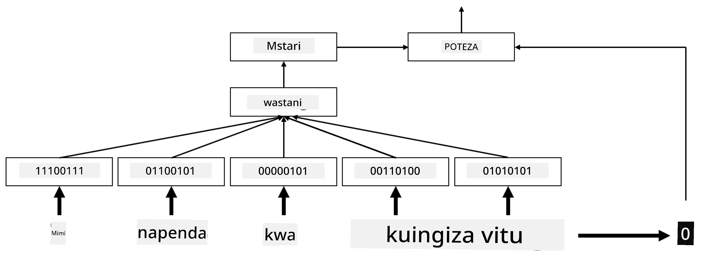

# Embeddings

## [Pre-lecture quiz](https://ff-quizzes.netlify.app/en/ai/quiz/27)

Tulipokuwa tunafundisha classifiers kwa kutumia BoW au TF/IDF, tulikuwa tunafanya kazi na vectors za maneno zenye vipimo vingi (high-dimensional) zenye urefu `vocab_size`, na tulikuwa tunabadilisha vectors za uwakilishi wa nafasi (positional representation) zenye vipimo vichache kuwa uwakilishi wa sparse one-hot. Hata hivyo, uwakilishi huu wa one-hot si wa ufanisi wa kumbukumbu. Zaidi ya hayo, kila neno linachukuliwa kuwa huru kutoka kwa mengine, yaani vectors za one-hot hazionyeshi uhusiano wa kimaana kati ya maneno.

Wazo la **embedding** ni kuwakilisha maneno kwa vectors zenye vipimo vichache na zenye density, ambazo kwa namna fulani zinaonyesha maana ya neno. Tutajadili baadaye jinsi ya kujenga embeddings za maneno zenye maana, lakini kwa sasa wazo ni kufikiria embeddings kama njia ya kupunguza vipimo vya vector ya neno.

Kwa hivyo, safu ya embedding itachukua neno kama ingizo, na kutoa vector ya matokeo yenye `embedding_size` maalum. Kwa namna fulani, ni sawa na safu ya `Linear`, lakini badala ya kuchukua vector ya one-hot, itaweza kuchukua namba ya neno kama ingizo, ikituwezesha kuepuka kuunda vectors kubwa za one-hot.

Kwa kutumia safu ya embedding kama safu ya kwanza katika mtandao wetu wa classifier, tunaweza kubadilisha kutoka bag-of-words kwenda kwenye **embedding bag** model, ambapo tunabadilisha kila neno katika maandishi yetu kuwa embedding inayolingana, kisha tunahesabu kazi ya jumla juu ya embeddings hizo zote, kama vile `sum`, `average` au `max`.  

> Picha na mwandishi

## ✍️ Mazoezi: Embeddings

Endelea kujifunza katika daftari zifuatazo:
* [Embeddings with PyTorch](EmbeddingsPyTorch.ipynb)
* [Embeddings TensorFlow](EmbeddingsTF.ipynb)

## Semantic Embeddings: Word2Vec

Ingawa safu ya embedding ilijifunza kuwakilisha maneno kwa vectors, uwakilishi huu haukuwa na maana ya kimaana sana. Ingekuwa vizuri kujifunza uwakilishi wa vector ambapo maneno yanayofanana au visawe vinahusiana na vectors zilizo karibu kwa umbali wa vector fulani (mfano, umbali wa Euclidean).

Ili kufanya hivyo, tunahitaji kufundisha awali (pre-train) mfano wetu wa embedding kwenye mkusanyiko mkubwa wa maandishi kwa njia maalum. Njia moja ya kufundisha semantic embeddings inaitwa [Word2Vec](https://en.wikipedia.org/wiki/Word2vec). Inategemea miundo miwili mikuu inayotumika kuzalisha uwakilishi wa maneno uliosambazwa:

 - **Continuous bag-of-words** (CBoW) — katika muundo huu, tunafundisha mfano kutabiri neno kutoka kwa muktadha wa karibu. Tukizingatia ngram $(W_{-2},W_{-1},W_0,W_1,W_2)$, lengo la mfano ni kutabiri $W_0$ kutoka $(W_{-2},W_{-1},W_1,W_2)$.
 - **Continuous skip-gram** ni kinyume cha CBoW. Mfano hutumia dirisha la muktadha wa maneno ya karibu kutabiri neno la sasa.

CBoW ni ya haraka, wakati skip-gram ni ya polepole, lakini inafanya kazi bora ya kuwakilisha maneno yasiyo ya kawaida.

> Picha kutoka [karatasi hii](https://arxiv.org/pdf/1301.3781.pdf)

Embeddings za Word2Vec zilizofundishwa awali (pamoja na mifano mingine kama GloVe) zinaweza pia kutumika badala ya safu ya embedding katika mitandao ya neural. Hata hivyo, tunahitaji kushughulikia misamiati, kwa sababu msamiati uliotumika kufundisha awali Word2Vec/GloVe huenda ukatofautiana na msamiati katika maandishi yetu. Angalia daftari zilizo juu ili kuona jinsi tatizo hili linaweza kutatuliwa.

## Contextual Embeddings

Kikwazo kimoja kikuu cha uwakilishi wa embeddings zilizofundishwa awali kama Word2Vec ni tatizo la kutofautisha maana ya neno. Ingawa embeddings zilizofundishwa awali zinaweza kunasa baadhi ya maana ya maneno katika muktadha, kila maana inayowezekana ya neno huwakilishwa katika embedding moja. Hii inaweza kusababisha matatizo katika mifano ya baadaye, kwa kuwa maneno mengi kama 'play' yana maana tofauti kulingana na muktadha yanayotumika.

Kwa mfano, neno 'play' katika sentensi hizi mbili lina maana tofauti kabisa:

- Nilikwenda kwenye **play** katika ukumbi wa michezo.
- John anataka **play** na marafiki zake.

Embeddings zilizofundishwa awali zinawakilisha maana zote mbili za neno 'play' katika embedding moja. Ili kushinda kikwazo hiki, tunahitaji kujenga embeddings kulingana na **language model**, ambayo imefundishwa kwenye mkusanyiko mkubwa wa maandishi, na *inajua* jinsi maneno yanavyoweza kuwekwa pamoja katika muktadha tofauti. Kujadili contextual embeddings ni nje ya mada ya mafunzo haya, lakini tutarudi kwao wakati wa kuzungumzia language models baadaye katika kozi.

## Hitimisho

Katika somo hili, umejifunza jinsi ya kujenga na kutumia safu za embedding katika TensorFlow na Pytorch ili kuonyesha vyema maana ya kimaana ya maneno.

## 🚀 Changamoto

Word2Vec imetumika kwa matumizi ya kuvutia, ikiwa ni pamoja na kutengeneza mashairi na nyimbo. Angalia [makala hii](https://www.politetype.com/blog/word2vec-color-poems) ambayo inaelezea jinsi mwandishi alitumia Word2Vec kutengeneza mashairi. Tazama [video hii na Dan Shiffmann](https://www.youtube.com/watch?v=LSS_bos_TPI&ab_channel=TheCodingTrain) pia ili kugundua maelezo tofauti ya mbinu hii. Kisha jaribu kutumia mbinu hizi kwenye mkusanyiko wako wa maandishi, labda kutoka Kaggle.

## [Post-lecture quiz](https://ff-quizzes.netlify.app/en/ai/quiz/28)

## Tathmini & Kujisomea

Soma karatasi hii kuhusu Word2Vec: [Efficient Estimation of Word Representations in Vector Space](https://arxiv.org/pdf/1301.3781.pdf)

## [Assignment: Notebooks](assignment.md)

---

