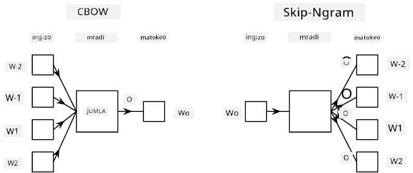

# Uundaji wa Lugha

Uwakilishi wa semantiki, kama Word2Vec na GloVe, ni hatua ya kwanza kuelekea **uundaji wa lugha** - kuunda mifano inayoweza *kuelewa* (au *kuwakilisha*) asili ya lugha.

## [Jaribio la kabla ya somo](https://ff-quizzes.netlify.app/en/ai/quiz/29)

Wazo kuu nyuma ya uundaji wa lugha ni kuifundisha kwenye seti za data zisizo na lebo kwa njia isiyo ya kusimamiwa. Hii ni muhimu kwa sababu tuna kiasi kikubwa cha maandishi yasiyo na lebo yanayopatikana, wakati maandishi yenye lebo yatakuwa na kikomo kulingana na juhudi tunazoweza kutumia kwenye kuweka lebo. Mara nyingi, tunaweza kujenga mifano ya lugha inayoweza **kutabiri maneno yanayokosekana** kwenye maandishi, kwa sababu ni rahisi kuficha neno la bahati nasibu kwenye maandishi na kulitumia kama sampuli ya mafunzo.

## Mafunzo ya Uwakilishi

Katika mifano yetu ya awali, tulitumia uwakilishi wa semantiki uliokwisha fundishwa, lakini ni jambo la kuvutia kuona jinsi uwakilishi huo unavyoweza kufundishwa. Kuna mawazo kadhaa yanayoweza kutumika:

* **Uundaji wa lugha wa N-Gram**, ambapo tunatabiri tokeni kwa kuangalia tokeni N za awali (N-gram).
* **Mfuko Endelevu wa Maneno** (CBoW), ambapo tunatabiri tokeni ya katikati $W_0$ katika mlolongo wa tokeni $W_{-N}$, ..., $W_N$.
* **Skip-gram**, ambapo tunatabiri seti ya tokeni za jirani {$W_{-N},\dots, W_{-1}, W_1,\dots, W_N$} kutoka tokeni ya katikati $W_0$.

> Picha kutoka [karatasi hii](https://arxiv.org/pdf/1301.3781.pdf)

## ✍️ Notibuku za Mfano: Mafunzo ya CBoW

Endelea kujifunza kupitia notibuku zifuatazo:

* [Mafunzo ya CBoW Word2Vec kwa kutumia TensorFlow](CBoW-TF.ipynb)
* [Mafunzo ya CBoW Word2Vec kwa kutumia PyTorch](CBoW-PyTorch.ipynb)

## Hitimisho

Katika somo la awali tumeona kwamba uwakilishi wa maneno hufanya kazi kama uchawi! Sasa tunajua kwamba kufundisha uwakilishi wa maneno si kazi ngumu sana, na tunapaswa kuwa na uwezo wa kufundisha uwakilishi wetu wa maneno kwa maandishi maalum ya kikoa ikiwa inahitajika.

## [Jaribio la baada ya somo](https://ff-quizzes.netlify.app/en/ai/quiz/30)

## Mapitio na Kujifunza Binafsi

* [Mafunzo rasmi ya PyTorch kuhusu Uundaji wa Lugha](https://pytorch.org/tutorials/beginner/nlp/word_embeddings_tutorial.html).
* [Mafunzo rasmi ya TensorFlow kuhusu kufundisha mfano wa Word2Vec](https://www.TensorFlow.org/tutorials/text/word2vec).
* Kutumia mfumo wa **gensim** kufundisha uwakilishi unaotumika sana kwa mistari michache ya msimbo imeelezwa [katika nyaraka hizi](https://pytorch.org/tutorials/beginner/nlp/word_embeddings_tutorial.html).

## 🚀 [Kazi: Fundisha Mfano wa Skip-Gram](lab/README.md)

Katika maabara, tunakupa changamoto ya kurekebisha msimbo kutoka somo hili ili kufundisha mfano wa skip-gram badala ya CBoW. [Soma maelezo](lab/README.md)

---

