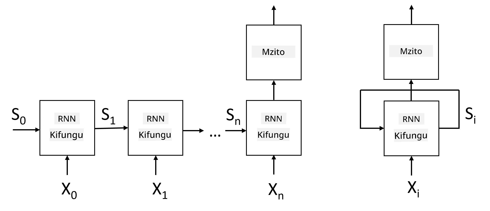
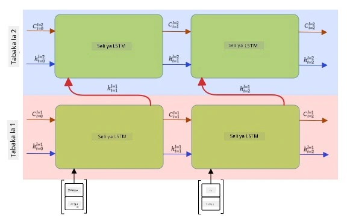

# Mitandao ya Neural Inayojirudia

## [Jaribio la Kabla ya Somo](https://ff-quizzes.netlify.app/en/ai/quiz/31)

Katika sehemu zilizopita, tumekuwa tukitumia uwakilishi wa kisemantiki wa maandishi na mtainishaji rahisi wa mstari juu ya embeddings. Hii inasaidia kunasa maana ya jumla ya maneno katika sentensi, lakini haizingatii **mpangilio** wa maneno, kwa sababu operesheni ya kujumlisha juu ya embeddings huondoa taarifa hii kutoka maandishi ya awali. Kwa kuwa mifano hii haiwezi kuiga mpangilio wa maneno, haiwezi kutatua kazi ngumu au zenye utata kama vile uzalishaji wa maandishi au kujibu maswali.

Ili kunasa maana ya mlolongo wa maandishi, tunahitaji kutumia usanifu mwingine wa mtandao wa neural, unaoitwa **mtandao wa neural unaojirudia**, au RNN. Katika RNN, tunapitisha sentensi yetu kupitia mtandao neno moja kwa wakati, na mtandao huzalisha hali fulani (**state**), ambayo tunapitisha tena kwenye mtandao pamoja na neno linalofuata.

> Picha na mwandishi

Kwa kuzingatia mlolongo wa pembejeo wa tokeni X0,...,Xn, RNN huunda mlolongo wa vizuizi vya mtandao wa neural, na kufundisha mlolongo huu kutoka mwanzo hadi mwisho kwa kutumia backpropagation. Kila kizuizi cha mtandao huchukua jozi (Xi,Si) kama pembejeo, na huzalisha Si+1 kama matokeo. Hali ya mwisho Sn au (matokeo Yn) huingia kwenye mtainishaji wa mstari ili kutoa matokeo. Vizuizi vyote vya mtandao vinashiriki uzito sawa, na hufundishwa kutoka mwanzo hadi mwisho kwa kutumia mchakato mmoja wa backpropagation.

Kwa sababu vekta za hali S0,...,Sn zinapitishwa kupitia mtandao, mtandao unaweza kujifunza utegemezi wa mlolongo kati ya maneno. Kwa mfano, neno *not* linapotokea mahali fulani kwenye mlolongo, linaweza kujifunza kukanusha vipengele fulani ndani ya vekta ya hali, na kusababisha kukanusha.

> ✅ Kwa kuwa uzito wa vizuizi vyote vya RNN kwenye picha hapo juu vinashirikiana, picha hiyo hiyo inaweza kuwakilishwa kama kizuizi kimoja (kulia) chenye kitanzi cha maoni kinachorudia, ambacho kinapitisha hali ya matokeo ya mtandao kurudi kwenye pembejeo.

## Muundo wa Kiini cha RNN

Tuangalie jinsi kiini rahisi cha RNN kinavyopangwa. Kinapokea hali ya awali Si-1 na ishara ya sasa Xi kama pembejeo, na kinapaswa kutoa hali ya matokeo Si (na, wakati mwingine, tunavutiwa pia na matokeo mengine Yi, kama ilivyo kwa mitandao ya kizazi).

Kiini rahisi cha RNN kina matriki mawili ya uzito ndani yake: moja hubadilisha ishara ya pembejeo (tuiite W), na nyingine hubadilisha hali ya pembejeo (H). Katika hali hii, matokeo ya mtandao huhesabiwa kama &sigma;(W&times;Xi+H&times;Si-1+b), ambapo &sigma; ni kazi ya uanzishaji na b ni upendeleo wa ziada.

> Picha na mwandishi

Katika hali nyingi, tokeni za pembejeo hupitishwa kupitia safu ya embedding kabla ya kuingia kwenye RNN ili kupunguza ukubwa wa vipimo. Katika hali hii, ikiwa kipimo cha vekta za pembejeo ni *emb_size*, na vekta ya hali ni *hid_size* - ukubwa wa W ni *emb_size*&times;*hid_size*, na ukubwa wa H ni *hid_size*&times;*hid_size*.

## Kumbukumbu ya Muda Mrefu na Mfupi (LSTM)

Moja ya matatizo makuu ya RNN za kawaida ni tatizo linaloitwa **kupotea kwa gradients**. Kwa sababu RNN hufundishwa kutoka mwanzo hadi mwisho kwa mchakato mmoja wa backpropagation, inapata ugumu wa kueneza makosa hadi kwenye tabaka za mwanzo za mtandao, na hivyo mtandao hauwezi kujifunza uhusiano kati ya tokeni za mbali. Njia moja ya kuepuka tatizo hili ni kuanzisha **usimamizi wa hali wazi** kwa kutumia milango inayoitwa **gates**. Kuna usanifu mbili maarufu wa aina hii: **Kumbukumbu ya Muda Mrefu na Mfupi** (LSTM) na **Kitengo cha Relay Chenye Milango** (GRU).

> Chanzo cha picha TBD

Mtandao wa LSTM umeandaliwa kwa namna inayofanana na RNN, lakini kuna hali mbili zinazopitishwa kutoka tabaka moja hadi nyingine: hali halisi C, na vekta iliyofichwa H. Katika kila kitengo, vekta iliyofichwa Hi inaunganishwa na pembejeo Xi, na vinadhibiti kinachotokea kwa hali C kupitia **milango**. Kila mlango ni mtandao wa neural wenye uanzishaji wa sigmoid (matokeo katika safu [0,1]), ambao unaweza kufikiriwa kama maski ya biti wakati unazidishwa na vekta ya hali. Kuna milango ifuatayo (kutoka kushoto kwenda kulia kwenye picha hapo juu):

* **Mlango wa kusahau** huchukua vekta iliyofichwa na kuamua ni vipengele vipi vya vekta C tunahitaji kusahau, na vipi kupitisha.
* **Mlango wa pembejeo** huchukua taarifa fulani kutoka kwa pembejeo na vekta zilizofichwa na kuingiza kwenye hali.
* **Mlango wa matokeo** hubadilisha hali kupitia safu ya mstari yenye uanzishaji wa *tanh*, kisha huchagua baadhi ya vipengele vyake kwa kutumia vekta iliyofichwa Hi ili kutoa hali mpya Ci+1.

Vipengele vya hali C vinaweza kufikiriwa kama bendera fulani zinazoweza kuwashwa na kuzimwa. Kwa mfano, tunapokutana na jina *Alice* kwenye mlolongo, tunaweza kudhani kuwa linahusu mhusika wa kike, na kuinua bendera katika hali kwamba tuna nomino ya kike kwenye sentensi. Tunapokutana na maneno *and Tom*, tutainua bendera kwamba tuna nomino ya wingi. Hivyo kwa kudhibiti hali tunaweza kufuatilia mali za kisarufi za sehemu za sentensi.

> ✅ Rasilimali bora ya kuelewa undani wa LSTM ni makala hii nzuri [Understanding LSTM Networks](https://colah.github.io/posts/2015-08-Understanding-LSTMs/) ya Christopher Olah.

## RNN za Mwelekeo Mbili na Tabaka Nyingi

Tumeelezea mitandao ya kujirudia inayofanya kazi kwa mwelekeo mmoja, kutoka mwanzo wa mlolongo hadi mwisho. Inaonekana kuwa ya kawaida, kwa sababu inafanana na jinsi tunavyosoma na kusikiliza hotuba. Hata hivyo, kwa kuwa katika hali nyingi za vitendo tunaweza kufikia mlolongo wa pembejeo kwa nasibu, inaweza kuwa na maana kuendesha hesabu ya kujirudia kwa mwelekeo wote. Mitandao kama hiyo inaitwa **RNN za mwelekeo mbili**. Tunaposhughulika na mtandao wa mwelekeo mbili, tutahitaji vekta mbili za hali zilizofichwa, moja kwa kila mwelekeo.

Mtandao wa kujirudia, iwe wa mwelekeo mmoja au wa mwelekeo mbili, hunasa mifumo fulani ndani ya mlolongo, na inaweza kuihifadhi kwenye vekta ya hali au kuipitisha kwenye matokeo. Kama ilivyo kwa mitandao ya convolutional, tunaweza kujenga safu nyingine ya kujirudia juu ya ile ya kwanza ili kunasa mifumo ya kiwango cha juu na kujenga kutoka kwa mifumo ya kiwango cha chini iliyotolewa na safu ya kwanza. Hii inatupeleka kwenye dhana ya **RNN ya tabaka nyingi** ambayo inajumuisha mitandao miwili au zaidi ya kujirudia, ambapo matokeo ya safu ya awali hupitishwa kwa safu inayofuata kama pembejeo.

*Picha kutoka [makala hii nzuri](https://towardsdatascience.com/from-a-lstm-cell-to-a-multilayer-lstm-network-with-pytorch-2899eb5696f3) ya Fernando López*

## ✍️ Mazoezi: Embeddings

Endelea kujifunza katika daftari zifuatazo:

* [RNNs na PyTorch](RNNPyTorch.ipynb)
* [RNNs na TensorFlow](RNNTF.ipynb)

## Hitimisho

Katika kitengo hiki, tumeona kwamba RNN zinaweza kutumika kwa uainishaji wa mlolongo, lakini kwa kweli, zinaweza kushughulikia kazi nyingi zaidi, kama vile uzalishaji wa maandishi, tafsiri ya mashine, na zaidi. Tutazingatia kazi hizo katika kitengo kijacho.

## 🚀 Changamoto

Soma fasihi fulani kuhusu LSTM na fikiria matumizi yake:

- [Grid Long Short-Term Memory](https://arxiv.org/pdf/1507.01526v1.pdf)
- [Show, Attend and Tell: Neural Image Caption
Generation with Visual Attention](https://arxiv.org/pdf/1502.03044v2.pdf)

## [Jaribio la Baada ya Somo](https://ff-quizzes.netlify.app/en/ai/quiz/32)

## Mapitio na Kujisomea

- [Understanding LSTM Networks](https://colah.github.io/posts/2015-08-Understanding-LSTMs/) ya Christopher Olah.

## [Kazi: Daftari](assignment.md)

---

