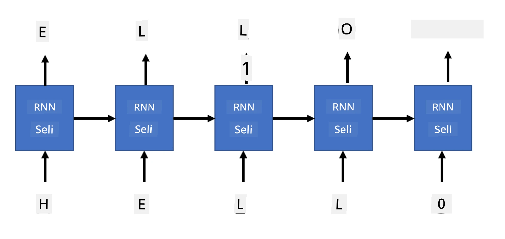

# Mitandao ya Kizazi

## [Jaribio la awali la somo](https://ff-quizzes.netlify.app/en/ai/quiz/33)

Mitandao ya Neural ya Kurudia (RNNs) na aina zake zenye milango kama vile Long Short Term Memory Cells (LSTMs) na Gated Recurrent Units (GRUs) zilitoa njia ya kuunda mifano ya lugha kwa kuwa zinaweza kujifunza mpangilio wa maneno na kutoa utabiri wa neno linalofuata katika mfululizo. Hii inatuwezesha kutumia RNNs kwa **kazi za kizazi**, kama vile uzalishaji wa maandishi ya kawaida, tafsiri ya mashine, na hata maelezo ya picha.

> ✅ Fikiria kuhusu nyakati zote uliponufaika na kazi za kizazi kama vile kukamilisha maandishi unapoandika. Fanya utafiti kuhusu programu unazozipenda ili kuona kama zilitumia RNNs.

Katika usanifu wa RNN tuliojadili katika kitengo kilichopita, kila kitengo cha RNN kilizalisha hali iliyofichwa inayofuata kama matokeo. Hata hivyo, tunaweza pia kuongeza matokeo mengine kwa kila kitengo cha kurudia, ambacho kingeturuhusu kutoa **mfululizo** (ambao ni sawa kwa urefu na mfululizo wa awali). Zaidi ya hayo, tunaweza kutumia vitengo vya RNN ambavyo havikubali pembejeo katika kila hatua, na kuchukua tu vector ya hali ya awali, na kisha kuzalisha mfululizo wa matokeo.

Hii inaruhusu usanifu tofauti wa neural unaoonyeshwa kwenye picha hapa chini:


> Picha kutoka kwa chapisho la blogu [Unreasonable Effectiveness of Recurrent Neural Networks](http://karpathy.github.io/2015/05/21/rnn-effectiveness/) na [Andrej Karpaty](http://karpathy.github.io/)

* **Moja-kwa-moja** ni mtandao wa neural wa jadi wenye pembejeo moja na matokeo moja
* **Moja-kwa-nyingi** ni usanifu wa kizazi unaokubali thamani moja ya pembejeo, na kuzalisha mfululizo wa thamani za matokeo. Kwa mfano, ikiwa tunataka kufundisha mtandao wa **maelezo ya picha** ambao utatoa maelezo ya maandishi ya picha, tunaweza kuchukua picha kama pembejeo, kuipitisha kupitia CNN ili kupata hali yake iliyofichwa, na kisha kuwa na mnyororo wa kurudia kuzalisha maelezo neno kwa neno.
* **Nyingi-kwa-moja** inahusiana na usanifu wa RNN tulioelezea katika kitengo kilichopita, kama vile uainishaji wa maandishi.
* **Nyingi-kwa-nyingi**, au **mfululizo-kwa-mfululizo** inahusiana na kazi kama vile **tafsiri ya mashine**, ambapo tunayo RNN ya kwanza inayokusanya taarifa zote kutoka kwa mfululizo wa pembejeo hadi hali iliyofichwa, na mnyororo mwingine wa RNN unafungua hali hii kuwa mfululizo wa matokeo.

Katika kitengo hiki, tutazingatia mifano rahisi ya kizazi inayotusaidia kuzalisha maandishi. Kwa urahisi, tutatumia tokeni za kiwango cha herufi.

Tutafundisha RNN hii kuzalisha maandishi hatua kwa hatua. Katika kila hatua, tutachukua mfululizo wa herufi za urefu `nchars`, na kuomba mtandao kuzalisha herufi inayofuata kwa kila herufi ya pembejeo:



Wakati wa kuzalisha maandishi (wakati wa utabiri), tunaanza na **msukumo fulani**, ambao unapitia seli za RNN ili kuzalisha hali yake ya kati, na kisha kutoka hali hii kizazi kinaanza. Tunazalisha herufi moja kwa wakati, na kupitisha hali na herufi iliyozalishwa kwa seli nyingine ya RNN ili kuzalisha inayofuata, hadi tutakapozalisha herufi za kutosha.


> Picha na mwandishi

## ✍️ Mazoezi: Mitandao ya Kizazi

Endelea kujifunza katika daftari zifuatazo:

* [Mitandao ya Kizazi na PyTorch](GenerativePyTorch.ipynb)
* [Mitandao ya Kizazi na TensorFlow](GenerativeTF.ipynb)

## Uzalishaji wa maandishi laini na joto

Matokeo ya kila seli ya RNN ni usambazaji wa uwezekano wa herufi. Ikiwa kila mara tunachukua herufi yenye uwezekano wa juu zaidi kama herufi inayofuata katika maandishi yaliyotengenezwa, maandishi mara nyingi yanaweza kuwa "yamezunguka" kati ya mfululizo wa herufi zile zile tena na tena, kama katika mfano huu:

```
today of the second the company and a second the company ...
```
  
Hata hivyo, tukitazama usambazaji wa uwezekano wa herufi inayofuata, inaweza kuwa tofauti kati ya uwezekano wa juu zaidi si kubwa sana, kwa mfano herufi moja inaweza kuwa na uwezekano wa 0.2, nyingine - 0.19, nk. Kwa mfano, tunapotafuta herufi inayofuata katika mfululizo '*play*', herufi inayofuata inaweza kuwa nafasi, au **e** (kama katika neno *player*).

Hii inatupeleka kwenye hitimisho kwamba si kila mara "haki" kuchagua herufi yenye uwezekano wa juu zaidi, kwa sababu kuchagua ya pili yenye uwezekano wa juu bado inaweza kutupeleka kwenye maandishi yenye maana. Ni busara zaidi **kuchagua kwa sampuli** herufi kutoka kwa usambazaji wa uwezekano uliotolewa na matokeo ya mtandao. Tunaweza pia kutumia parameter, **joto**, ambayo itapunguza usambazaji wa uwezekano, ikiwa tunataka kuongeza nasibu zaidi, au kuifanya kuwa kali zaidi, ikiwa tunataka kushikamana zaidi na herufi zenye uwezekano wa juu zaidi.

Chunguza jinsi uzalishaji huu laini wa maandishi unavyotekelezwa katika daftari zilizounganishwa hapo juu.

## Hitimisho

Ingawa uzalishaji wa maandishi unaweza kuwa na manufaa yenyewe, faida kubwa zinatokana na uwezo wa kuzalisha maandishi kwa kutumia RNNs kutoka kwa vector ya kipengele cha awali. Kwa mfano, uzalishaji wa maandishi hutumika kama sehemu ya tafsiri ya mashine (mfululizo-kwa-mfululizo, katika kesi hii vector ya hali kutoka *encoder* hutumika kuzalisha au *kufafanua* ujumbe uliotafsiriwa), au kuzalisha maelezo ya maandishi ya picha (ambapo vector ya kipengele ingekuwa inatoka kwa extractor ya CNN).

## 🚀 Changamoto

Chukua masomo fulani kwenye Microsoft Learn kuhusu mada hii

* Uzalishaji wa Maandishi na [PyTorch](https://docs.microsoft.com/learn/modules/intro-natural-language-processing-pytorch/6-generative-networks/?WT.mc_id=academic-77998-cacaste)/[TensorFlow](https://docs.microsoft.com/learn/modules/intro-natural-language-processing-tensorflow/5-generative-networks/?WT.mc_id=academic-77998-cacaste)

## [Jaribio la baada ya somo](https://ff-quizzes.netlify.app/en/ai/quiz/34)

## Mapitio & Kujifunza Mwenyewe

Hapa kuna makala za kupanua maarifa yako

* Njia tofauti za uzalishaji wa maandishi na Markov Chain, LSTM na GPT-2: [chapisho la blogu](https://towardsdatascience.com/text-generation-gpt-2-lstm-markov-chain-9ea371820e1e)
* Mfano wa uzalishaji wa maandishi katika [nyaraka za Keras](https://keras.io/examples/generative/lstm_character_level_text_generation/)

## [Kazi](lab/README.md)

Tumeona jinsi ya kuzalisha maandishi herufi kwa herufi. Katika maabara, utachunguza uzalishaji wa maandishi kwa kiwango cha neno.

---

