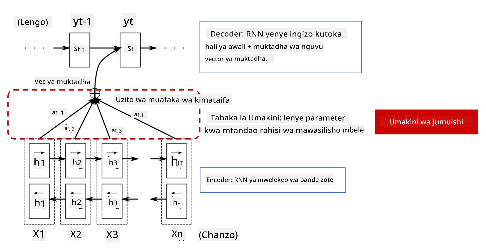
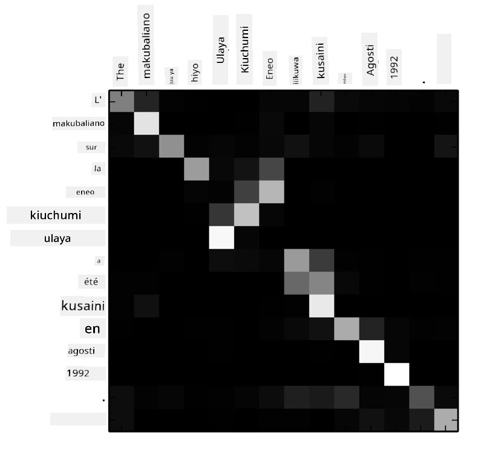
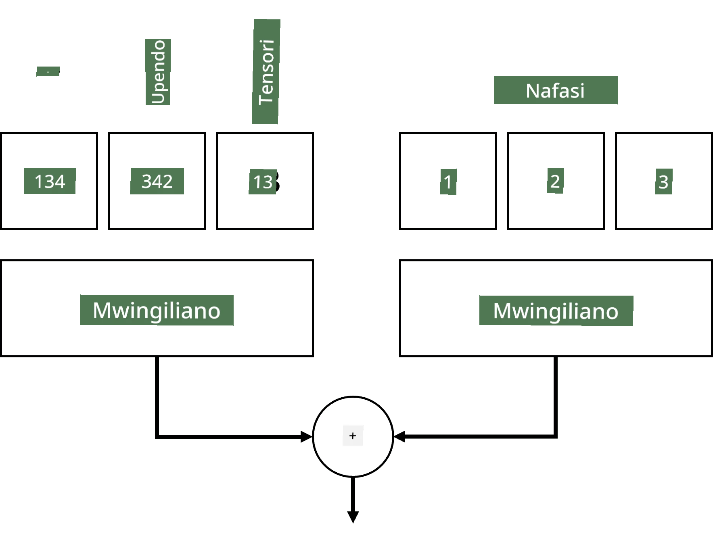
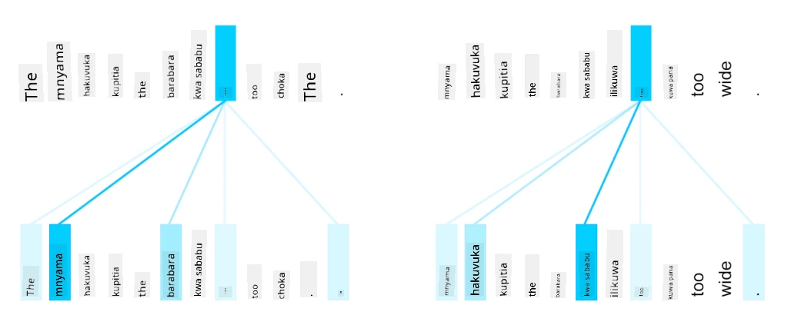
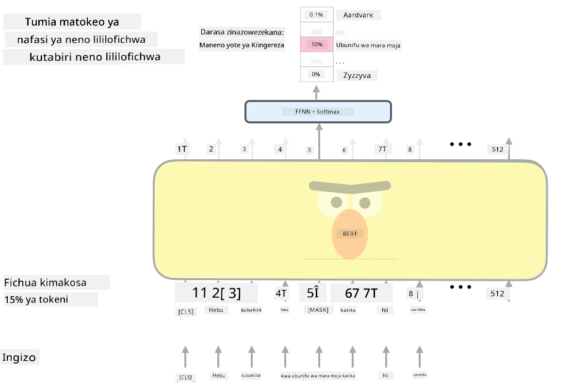

# Mbinu za Uangalizi na Transformers

## [Jaribio la awali ya somo](https://ff-quizzes.netlify.app/en/ai/quiz/35)

Moja ya matatizo muhimu zaidi katika uwanja wa NLP ni **tafsiri ya mashine**, kazi muhimu inayotumika katika zana kama Google Translate. Katika sehemu hii, tutazingatia tafsiri ya mashine, au kwa ujumla zaidi, kazi yoyote ya *mlolongo-kwa-mlolongo* (ambayo pia inaitwa **sentence transduction**).

Kwa kutumia RNNs, mlolongo-kwa-mlolongo unatekelezwa na mitandao miwili ya kurudia, ambapo mtandao mmoja, **encoder**, unakusanya mlolongo wa pembejeo katika hali ya siri, wakati mtandao mwingine, **decoder**, unafungua hali hiyo ya siri kuwa matokeo yaliyotafsiriwa. Kuna matatizo kadhaa na mbinu hii:

* Hali ya mwisho ya mtandao wa encoder ina ugumu wa kukumbuka mwanzo wa sentensi, hivyo kusababisha ubora duni wa modeli kwa sentensi ndefu.
* Maneno yote katika mlolongo yana athari sawa kwenye matokeo. Kwa kweli, hata hivyo, maneno maalum katika mlolongo wa pembejeo mara nyingi yana athari kubwa zaidi kwenye matokeo ya mlolongo kuliko mengine.

**Mbinu za Uangalizi** hutoa njia ya kupima athari ya muktadha wa kila vector ya pembejeo kwenye kila utabiri wa matokeo wa RNN. Njia ya kutekeleza hii ni kwa kuunda njia za mkato kati ya hali za kati za RNN ya pembejeo na RNN ya matokeo. Kwa njia hii, tunapozalisha alama ya matokeo yt, tutazingatia hali zote za siri za pembejeo hi, kwa kutumia viwango tofauti vya uzito &alpha;t,i.

> Modeli ya encoder-decoder na mbinu ya uangalizi wa kuongeza katika [Bahdanau et al., 2015](https://arxiv.org/pdf/1409.0473.pdf), iliyotajwa kutoka [blogu hii](https://lilianweng.github.io/lil-log/2018/06/24/attention-attention.html)

Matriki ya uangalizi {&alpha;i,j} ingeonyesha kiwango ambacho maneno fulani ya pembejeo yanachangia katika uzalishaji wa neno fulani katika mlolongo wa matokeo. Hapa chini kuna mfano wa matriki kama hiyo:

> Mchoro kutoka [Bahdanau et al., 2015](https://arxiv.org/pdf/1409.0473.pdf) (Fig.3)

Mbinu za uangalizi zinahusika na hali ya sanaa ya sasa au karibu na hali ya sanaa katika NLP. Kuongeza uangalizi hata hivyo kunazidisha idadi ya vigezo vya modeli, jambo ambalo lilisababisha changamoto za kupanua RNNs. Kizuizi kikuu cha kupanua RNNs ni kwamba asili ya kurudia ya modeli inafanya iwe changamoto kuunda vikundi na kuendesha mafunzo kwa sambamba. Katika RNN, kila kipengele cha mlolongo kinahitaji kuchakatwa kwa mpangilio wa mlolongo, jambo ambalo lina maana kuwa haliwezi kufanywa kwa urahisi kwa sambamba.

> Mchoro kutoka [Blogu ya Google](https://research.googleblog.com/2016/09/a-neural-network-for-machine.html)

Kupitishwa kwa mbinu za uangalizi pamoja na kizuizi hiki kulisababisha kuundwa kwa modeli za Transformer ambazo sasa ni hali ya sanaa, kama vile BERT na Open-GPT3.

## Modeli za Transformer

Moja ya mawazo makuu nyuma ya transformers ni kuepuka asili ya mlolongo ya RNNs na kuunda modeli inayoweza kufanywa kwa sambamba wakati wa mafunzo. Hii inafanikishwa kwa kutekeleza mawazo mawili:

* usimbaji wa nafasi
* kutumia mbinu ya uangalizi wa kibinafsi ili kunasa mifumo badala ya RNNs (au CNNs) (ndiyo maana karatasi inayotambulisha transformers inaitwa *[Attention is all you need](https://arxiv.org/abs/1706.03762)*)

### Usimbaji/Embedding wa Nafasi

Wazo la usimbaji wa nafasi ni kama ifuatavyo.  
1. Wakati wa kutumia RNNs, nafasi ya jamaa ya tokeni inawakilishwa na idadi ya hatua, na hivyo haitaji kuwakilishwa wazi.  
2. Hata hivyo, mara tu tunapobadilisha kwenda kwa uangalizi, tunahitaji kujua nafasi za jamaa za tokeni ndani ya mlolongo.  
3. Ili kupata usimbaji wa nafasi, tunaongeza mlolongo wetu wa tokeni na mlolongo wa nafasi za tokeni katika mlolongo (yaani, mlolongo wa namba 0,1, ...).  
4. Kisha tunachanganya nafasi ya tokeni na vector ya embedding ya tokeni. Ili kubadilisha nafasi (namba) kuwa vector, tunaweza kutumia mbinu tofauti:

* Embedding inayoweza kufundishwa, sawa na embedding ya tokeni. Hii ndiyo mbinu tunayoangalia hapa. Tunatumia safu za embedding juu ya tokeni na nafasi zao, na kusababisha vector za embedding za vipimo sawa, ambazo tunaziongeza pamoja.  
* Kazi ya usimbaji wa nafasi isiyobadilika, kama ilivyopendekezwa katika karatasi ya awali.  

> Picha na mwandishi

Matokeo tunayopata na embedding ya nafasi yanajumuisha tokeni asilia na nafasi yake ndani ya mlolongo.

### Uangalizi wa Kibinafsi wa Vichwa Vingi

Kisha, tunahitaji kunasa mifumo fulani ndani ya mlolongo wetu. Ili kufanya hivyo, transformers hutumia mbinu ya **uangalizi wa kibinafsi**, ambayo kimsingi ni uangalizi unaotumika kwa mlolongo sawa kama pembejeo na matokeo. Kutumia uangalizi wa kibinafsi kunatuwezesha kuzingatia **muktadha** ndani ya sentensi, na kuona ni maneno gani yanayohusiana. Kwa mfano, inatuwezesha kuona ni maneno gani yanayorejelewa na marejeo, kama *it*, na pia kuzingatia muktadha:

> Picha kutoka [Blogu ya Google](https://research.googleblog.com/2017/08/transformer-novel-neural-network.html)

Katika transformers, tunatumia **Uangalizi wa Vichwa Vingi** ili kutoa nguvu kwa mtandao kunasa aina tofauti za utegemezi, mfano uhusiano wa maneno wa muda mrefu dhidi ya muda mfupi, marejeo dhidi ya kitu kingine, n.k.

[Notebook ya TensorFlow](TransformersTF.ipynb) ina maelezo zaidi kuhusu utekelezaji wa safu za transformer.

### Uangalizi wa Encoder-Decoder

Katika transformers, uangalizi hutumika katika sehemu mbili:

* Kunasa mifumo ndani ya maandishi ya pembejeo kwa kutumia uangalizi wa kibinafsi.
* Kufanya tafsiri ya mlolongo - ni safu ya uangalizi kati ya encoder na decoder.

Uangalizi wa encoder-decoder ni sawa sana na mbinu ya uangalizi inayotumika katika RNNs, kama ilivyoelezwa mwanzoni mwa sehemu hii. Mchoro huu wa uhuishaji unaelezea jukumu la uangalizi wa encoder-decoder.

Kwa kuwa kila nafasi ya pembejeo inalinganishwa kwa uhuru na kila nafasi ya matokeo, transformers zinaweza kufanywa kwa sambamba vizuri zaidi kuliko RNNs, jambo ambalo linawezesha modeli kubwa zaidi na zenye kuelezea zaidi za lugha. Kila kichwa cha uangalizi kinaweza kutumika kujifunza uhusiano tofauti kati ya maneno, jambo ambalo linaboresha kazi za usindikaji wa lugha asilia.

## BERT

**BERT** (Bidirectional Encoder Representations from Transformers) ni mtandao mkubwa sana wa transformer wenye tabaka 12 kwa *BERT-base*, na 24 kwa *BERT-large*. Modeli hii kwanza inafundishwa awali kwenye hifadhidata kubwa ya maandishi (WikiPedia + vitabu) kwa kutumia mafunzo yasiyo ya kusimamiwa (kutabiri maneno yaliyofichwa katika sentensi). Wakati wa mafunzo ya awali, modeli inachukua viwango vikubwa vya uelewa wa lugha ambavyo vinaweza kutumika na hifadhidata nyingine kwa kutumia kurekebisha. Mchakato huu unaitwa **transfer learning**.

> Picha [chanzo](http://jalammar.github.io/illustrated-bert/)

## ✍️ Mazoezi: Transformers

Endelea kujifunza katika vitabu vya mazoezi vifuatavyo:

* [Transformers katika PyTorch](TransformersPyTorch.ipynb)
* [Transformers katika TensorFlow](TransformersTF.ipynb)

## Hitimisho

Katika somo hili umejifunza kuhusu Transformers na Mbinu za Uangalizi, zana muhimu katika kisanduku cha zana cha NLP. Kuna tofauti nyingi za usanifu wa Transformer ikiwa ni pamoja na BERT, DistilBERT, BigBird, OpenGPT3 na zaidi ambazo zinaweza kurekebishwa. [Kifurushi cha HuggingFace](https://github.com/huggingface/) kinatoa hifadhi ya mafunzo ya usanifu nyingi hizi kwa kutumia PyTorch na TensorFlow.

## 🚀 Changamoto

## [Jaribio la baada ya somo](https://ff-quizzes.netlify.app/en/ai/quiz/36)

## Mapitio na Kujisomea

* [Blogu ya maelezo](https://mchromiak.github.io/articles/2017/Sep/12/Transformer-Attention-is-all-you-need/), inayoelezea karatasi ya kawaida [Attention is all you need](https://arxiv.org/abs/1706.03762) kuhusu transformers.
* [Mfululizo wa blogu](https://towardsdatascience.com/transformers-explained-visually-part-1-overview-of-functionality-95a6dd460452) kuhusu transformers, unaoelezea usanifu kwa undani.

## [Kazi ya nyumbani](assignment.md)

---

