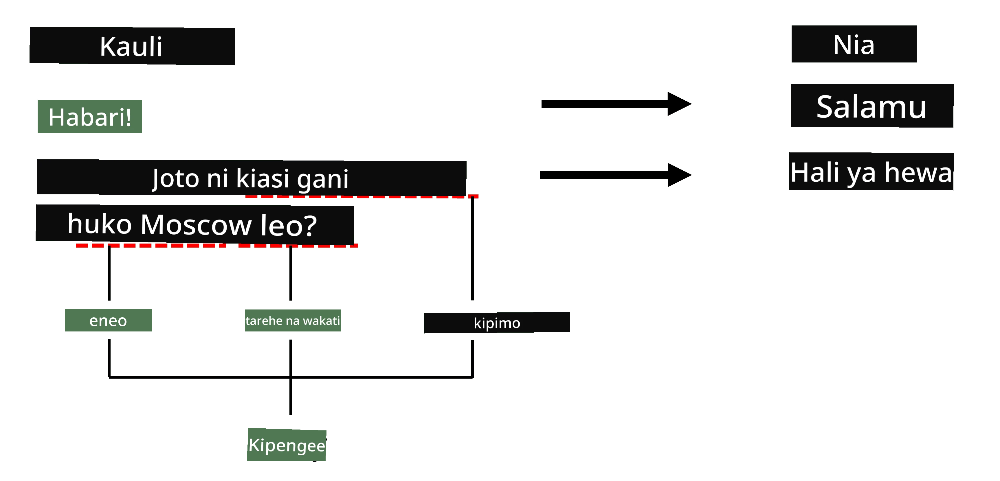
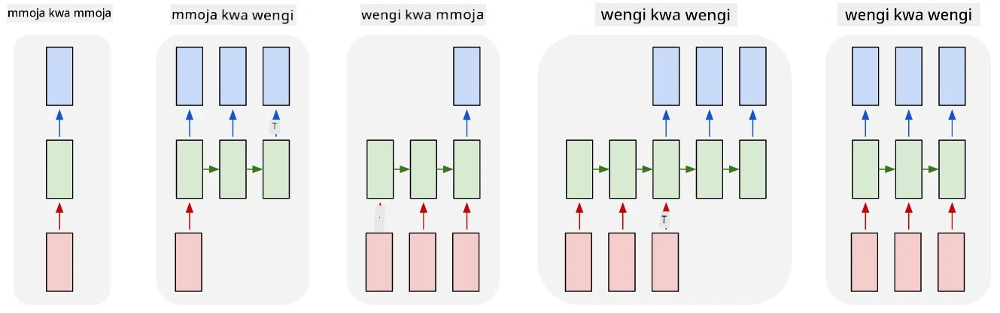

# Utambuzi wa Viumbe Vilivyotajwa

Hadi sasa, tumekuwa tukijikita zaidi kwenye kazi moja ya NLP - uainishaji. Hata hivyo, kuna kazi nyingine za NLP ambazo zinaweza kufanikishwa kwa kutumia mitandao ya neva. Mojawapo ya kazi hizo ni **[Utambuzi wa Viumbe Vilivyotajwa](https://wikipedia.org/wiki/Named-entity_recognition)** (NER), ambayo inahusika na kutambua viumbe maalum ndani ya maandishi, kama vile maeneo, majina ya watu, vipindi vya tarehe na muda, fomula za kemikali, na kadhalika.

## [Maswali ya awali ya somo](https://ff-quizzes.netlify.app/en/ai/quiz/37)

## Mfano wa Kutumia NER

Tuseme unataka kuunda roboti ya mazungumzo ya lugha asilia, sawa na Amazon Alexa au Google Assistant. Njia ambayo roboti za mazungumzo za akili hufanya kazi ni *kuelewa* kile mtumiaji anataka kwa kufanya uainishaji wa maandishi kwenye sentensi ya pembejeo. Matokeo ya uainishaji huu ni kile kinachoitwa **nia**, ambayo huamua roboti ya mazungumzo inapaswa kufanya nini.

> Picha na mwandishi

Hata hivyo, mtumiaji anaweza kutoa vigezo fulani kama sehemu ya sentensi. Kwa mfano, anapouliza kuhusu hali ya hewa, anaweza kutaja eneo au tarehe. Roboti inapaswa kuelewa viumbe hivyo, na kujaza nafasi za vigezo ipasavyo kabla ya kutekeleza kitendo. Hapa ndipo NER inahusika.

> ✅ Mfano mwingine ungekuwa [kuchambua makala za kisayansi za matibabu](https://soshnikov.com/science/analyzing-medical-papers-with-azure-and-text-analytics-for-health/). Mojawapo ya mambo makuu tunayotakiwa kutafuta ni istilahi maalum za matibabu, kama vile magonjwa na vitu vya matibabu. Ingawa idadi ndogo ya magonjwa inaweza kutolewa kwa kutumia utafutaji wa sehemu ya maandishi, viumbe changamano zaidi, kama vile misombo ya kemikali na majina ya dawa, vinahitaji mbinu ngumu zaidi.

## NER kama Uainishaji wa Tokeni

Mifano ya NER kimsingi ni **mifano ya uainishaji wa tokeni**, kwa sababu kwa kila tokeni ya pembejeo tunahitaji kuamua ikiwa inahusiana na kiumbe au la, na ikiwa inahusiana - ni darasa gani la kiumbe.

Fikiria kichwa cha makala kifuatacho:

**Tricuspid valve regurgitation** na **lithium carbonate** **toxicity** kwa mtoto mchanga.

Viumbe hapa ni:

* Tricuspid valve regurgitation ni ugonjwa (`DIS`)
* Lithium carbonate ni dutu ya kemikali (`CHEM`)
* Toxicity pia ni ugonjwa (`DIS`)

Kumbuka kwamba kiumbe kimoja kinaweza kuhusisha tokeni kadhaa. Na, kama ilivyo katika kesi hii, tunahitaji kutofautisha kati ya viumbe viwili vinavyofuatana. Kwa hivyo, ni kawaida kutumia madarasa mawili kwa kila kiumbe - moja inayotaja tokeni ya kwanza ya kiumbe (mara nyingi kiambishi awali `B-` hutumika, kwa **mwanzo**), na nyingine - kuendelea kwa kiumbe (`I-`, kwa **ndani ya tokeni**). Tunatumia pia `O` kama darasa kuwakilisha tokeni zote **nyingine**. Uwekaji wa tokeni kama huu unaitwa [BIO tagging](https://en.wikipedia.org/wiki/Inside%E2%80%93outside%E2%80%93beginning_(tagging)) (au IOB). Baada ya kuwekwa tagi, kichwa chetu kitaonekana kama hiki:

Tokeni | Tagi
-------|-----
Tricuspid | B-DIS
valve | I-DIS
regurgitation | I-DIS
and | O
lithium | B-CHEM
carbonate | I-CHEM
toxicity | B-DIS
in | O
a | O
newborn | O
infant | O
. | O

Kwa kuwa tunahitaji kujenga uhusiano wa moja kwa moja kati ya tokeni na madarasa, tunaweza kufundisha mfano wa mtandao wa neva wa **wengi-kwa-wengi** kutoka kwenye picha hii:

> *Picha kutoka [blogu hii](http://karpathy.github.io/2015/05/21/rnn-effectiveness/) na [Andrej Karpathy](http://karpathy.github.io/). Mifano ya uainishaji wa tokeni ya NER inahusiana na usanifu wa mtandao wa kulia kabisa kwenye picha hii.*

## Kufundisha Mifano ya NER

Kwa kuwa mfano wa NER kimsingi ni mfano wa uainishaji wa tokeni, tunaweza kutumia RNNs ambazo tayari tunazifahamu kwa kazi hii. Katika kesi hii, kila kizuizi cha mtandao wa kurudia kitarudisha kitambulisho cha tokeni. Notibuku ifuatayo inaonyesha jinsi ya kufundisha LSTM kwa uainishaji wa tokeni.

## ✍️ Notibuku za Mfano: NER

Endelea kujifunza katika notibuku ifuatayo:

* [NER na TensorFlow](NER-TF.ipynb)

## Hitimisho

Mfano wa NER ni **mfano wa uainishaji wa tokeni**, ambayo ina maana kwamba unaweza kutumika kufanya uainishaji wa tokeni. Hii ni kazi ya kawaida sana katika NLP, ikisaidia kutambua viumbe maalum ndani ya maandishi ikiwa ni pamoja na maeneo, majina, tarehe, na zaidi.

## 🚀 Changamoto

Kamilisha kazi iliyounganishwa hapa chini ili kufundisha mfano wa utambuzi wa viumbe vya matibabu, kisha ujaribu kwenye seti ya data tofauti.

## [Maswali ya baada ya somo](https://ff-quizzes.netlify.app/en/ai/quiz/38)

## Mapitio na Kujisomea

Soma kupitia blogu [The Unreasonable Effectiveness of Recurrent Neural Networks](http://karpathy.github.io/2015/05/21/rnn-effectiveness/) na fuata sehemu ya Kusoma Zaidi katika makala hiyo ili kuongeza maarifa yako.

## [Kazi](lab/README.md)

Katika kazi ya somo hili, utalazimika kufundisha mfano wa utambuzi wa viumbe vya matibabu. Unaweza kuanza kwa kufundisha mfano wa LSTM kama ilivyoelezwa katika somo hili, na kuendelea na kutumia mfano wa BERT transformer. Soma [maelekezo](lab/README.md) ili kupata maelezo yote.

---

