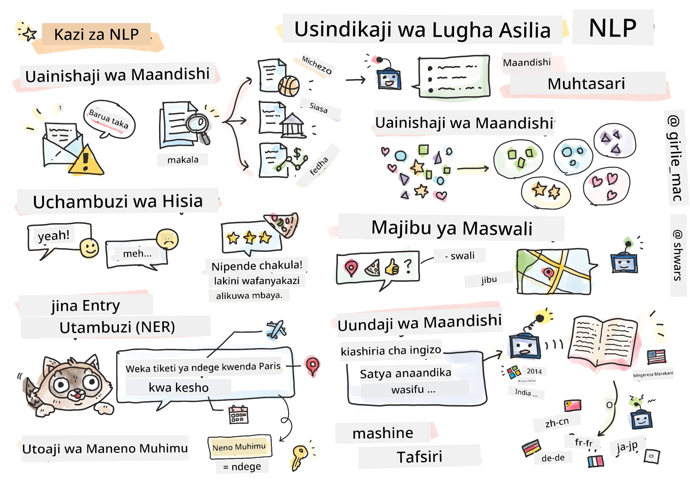

# Usindikaji wa Lugha Asilia



Katika sehemu hii, tutazingatia kutumia Mitandao ya Neural kushughulikia kazi zinazohusiana na **Usindikaji wa Lugha Asilia (NLP)**. Kuna matatizo mengi ya NLP ambayo tunataka kompyuta iweze kuyatatua:

* **Uainishaji wa maandishi** ni tatizo la kawaida la uainishaji linalohusiana na mfuatano wa maandishi. Mifano ni pamoja na kuainisha barua pepe kama spam au si-spam, au kuainisha makala kama michezo, biashara, siasa, n.k. Pia, tunapounda roboti za mazungumzo, mara nyingi tunahitaji kuelewa kile mtumiaji alitaka kusema -- katika kesi hii tunashughulika na **uainishaji wa nia**. Mara nyingi, katika uainishaji wa nia tunahitaji kushughulikia kategoria nyingi.

* **Uchambuzi wa hisia** ni tatizo la kawaida la regression, ambapo tunahitaji kuhusisha namba (hisia) inayolingana na jinsi maana ya sentensi ilivyo chanya/mbaya. Toleo la juu zaidi la uchambuzi wa hisia ni **uchambuzi wa hisia kulingana na vipengele** (ABSA), ambapo tunahusisha hisia si kwa sentensi nzima, bali kwa sehemu zake tofauti (vipengele), mfano: *Katika mgahawa huu, nilipenda chakula, lakini mazingira yalikuwa mabaya*.

* **Utambuzi wa Viumbe Vilivyotajwa** (NER) inahusu tatizo la kutoa viumbe fulani kutoka kwa maandishi. Kwa mfano, tunaweza kuhitaji kuelewa kwamba katika kifungu *Nahitaji kuruka kwenda Paris kesho* neno *kesho* linahusu TAREHE, na *Paris* ni MAHALI.

* **Uchimbaji wa maneno muhimu** ni sawa na NER, lakini tunahitaji kutoa maneno muhimu kwa maana ya sentensi moja kwa moja, bila mafunzo ya awali kwa aina maalum za viumbe.

* **Kugawanya maandishi katika makundi** kunaweza kuwa muhimu tunapotaka kuunganisha sentensi zinazofanana, kwa mfano, maombi yanayofanana katika mazungumzo ya msaada wa kiufundi.

* **Kujibu maswali** inahusu uwezo wa mfano kujibu swali maalum. Mfano hupokea kifungu cha maandishi na swali kama pembejeo, na inahitaji kutoa sehemu ya maandishi ambapo jibu la swali linapatikana (au, wakati mwingine, kutengeneza maandishi ya jibu).

* **Uzalishaji wa maandishi** ni uwezo wa mfano kutengeneza maandishi mapya. Inaweza kuchukuliwa kama kazi ya uainishaji inayotabiri herufi/maneno yanayofuata kulingana na *msukumo wa maandishi*. Mifano ya juu ya uzalishaji wa maandishi, kama vile GPT-3, inaweza kutatua kazi nyingine za NLP kama uainishaji kwa kutumia mbinu inayoitwa [programu ya msukumo](https://towardsdatascience.com/software-3-0-how-prompting-will-change-the-rules-of-the-game-a982fbfe1e0) au [uhandisi wa msukumo](https://medium.com/swlh/openai-gpt-3-and-prompt-engineering-dcdc2c5fcd29).

* **Muhtasari wa maandishi** ni mbinu tunapotaka kompyuta "kusoma" maandishi marefu na kuyafupisha kwa sentensi chache.

* **Tafsiri ya mashine** inaweza kuonekana kama mchanganyiko wa kuelewa maandishi kwa lugha moja, na uzalishaji wa maandishi kwa lugha nyingine.

Hapo awali, kazi nyingi za NLP zilitatuliwa kwa kutumia mbinu za jadi kama sarufi. Kwa mfano, katika tafsiri ya mashine, vichanganuzi vilitumika kubadilisha sentensi ya awali kuwa mti wa sintaksia, kisha miundo ya juu ya kisemantiki ilitolewa ili kuwakilisha maana ya sentensi, na kulingana na maana hii na sarufi ya lugha lengwa, matokeo yalitengenezwa. Siku hizi, kazi nyingi za NLP zinatatuliwa kwa ufanisi zaidi kwa kutumia mitandao ya neural.

> Mbinu nyingi za jadi za NLP zinatekelezwa katika maktaba ya Python inayoitwa [Natural Language Processing Toolkit (NLTK)](https://www.nltk.org). Kuna [Kitabu cha NLTK](https://www.nltk.org/book/) kinachopatikana mtandaoni ambacho kinaelezea jinsi kazi tofauti za NLP zinaweza kutatuliwa kwa kutumia NLTK.

Katika kozi yetu, tutazingatia zaidi kutumia Mitandao ya Neural kwa NLP, na tutatumia NLTK pale inapohitajika.

Tayari tumejifunza kuhusu kutumia mitandao ya neural kushughulikia data ya jedwali na picha. Tofauti kuu kati ya aina hizo za data na maandishi ni kwamba maandishi ni mfuatano wa urefu unaobadilika, wakati saizi ya pembejeo katika picha inajulikana mapema. Wakati mitandao ya convolutional inaweza kutoa mifumo kutoka kwa data ya pembejeo, mifumo katika maandishi ni changamano zaidi. Kwa mfano, tunaweza kuwa na kukanusha kunakotenganishwa na somo kwa maneno mengi (mfano: *Sipendi machungwa*, dhidi ya *Sipendi yale machungwa makubwa yenye rangi nzuri na ladha*), na hiyo bado inapaswa kufasiriwa kama muundo mmoja. Kwa hivyo, ili kushughulikia lugha tunahitaji kuanzisha aina mpya za mitandao ya neural, kama vile *mitandao ya kurudiarudia* na *transformers*.

## Sakinisha Maktaba

Ikiwa unatumia usakinishaji wa Python wa ndani kuendesha kozi hii, unaweza kuhitaji kusakinisha maktaba zote zinazohitajika kwa NLP kwa kutumia amri zifuatazo:

**Kwa PyTorch**  
```bash
pip install -r requirements-torch.txt
```  
**Kwa TensorFlow**  
```bash
pip install -r requirements-tf.txt
```  

> Unaweza kujaribu NLP na TensorFlow kwenye [Microsoft Learn](https://docs.microsoft.com/learn/modules/intro-natural-language-processing-tensorflow/?WT.mc_id=academic-77998-cacaste)

## Onyo Kuhusu GPU

Katika sehemu hii, katika baadhi ya mifano tutakuwa tukifundisha mifano mikubwa.  
* **Tumia Kompyuta Yenye GPU**: Inashauriwa kuendesha daftari zako kwenye kompyuta yenye GPU ili kupunguza muda wa kusubiri wakati wa kufanya kazi na mifano mikubwa.  
* **Vikwazo vya Kumbukumbu ya GPU**: Kuendesha kwenye GPU kunaweza kusababisha hali ambapo kumbukumbu ya GPU inajaa, hasa wakati wa kufundisha mifano mikubwa.  
* **Matumizi ya Kumbukumbu ya GPU**: Kiasi cha kumbukumbu ya GPU kinachotumika wakati wa mafunzo kinategemea mambo mbalimbali, ikiwa ni pamoja na ukubwa wa minibatch.  
* **Punguza Ukubwa wa Minibatch**: Ikiwa unakutana na matatizo ya kumbukumbu ya GPU, fikiria kupunguza ukubwa wa minibatch katika msimbo wako kama suluhisho linalowezekana.  
* **Utoaji wa Kumbukumbu ya GPU kwa TensorFlow**: Matoleo ya zamani ya TensorFlow yanaweza yasitoe kumbukumbu ya GPU ipasavyo wakati wa kufundisha mifano mingi ndani ya kernel moja ya Python. Ili kudhibiti matumizi ya kumbukumbu ya GPU kwa ufanisi, unaweza kusanidi TensorFlow kugawa kumbukumbu ya GPU tu inapohitajika.  
* **Ujumuishaji wa Msimbo**: Ili kuweka TensorFlow kugawa kumbukumbu ya GPU tu inapohitajika, jumuisha msimbo ufuatao katika daftari zako:  

```python
physical_devices = tf.config.list_physical_devices('GPU') 
if len(physical_devices)>0:
    tf.config.experimental.set_memory_growth(physical_devices[0], True) 
```  

Ikiwa una nia ya kujifunza kuhusu NLP kutoka mtazamo wa ML wa jadi, tembelea [hii seti ya masomo](https://github.com/microsoft/ML-For-Beginners/tree/main/6-NLP)

## Katika Sehemu Hii  
Katika sehemu hii tutajifunza kuhusu:

* [Kuwakilisha maandishi kama tensors](13-TextRep/README.md)  
* [Uwakilishi wa Maneno](14-Emdeddings/README.md)  
* [Uundaji wa Lugha](15-LanguageModeling/README.md)  
* [Mitandao ya Neural ya Kurudiarudia](16-RNN/README.md)  
* [Mitandao ya Kizazi](17-GenerativeNetworks/README.md)  
* [Transformers](18-Transformers/README.md)  

**Kanusho**:  
Hati hii imetafsiriwa kwa kutumia huduma ya kutafsiri ya AI [Co-op Translator](https://github.com/Azure/co-op-translator). Ingawa tunajitahidi kuhakikisha usahihi, tafadhali fahamu kuwa tafsiri za kiotomatiki zinaweza kuwa na makosa au kutokuwa sahihi. Hati ya asili katika lugha yake ya awali inapaswa kuzingatiwa kama chanzo cha mamlaka. Kwa taarifa muhimu, tafsiri ya kitaalamu ya binadamu inapendekezwa. Hatutawajibika kwa kutoelewana au tafsiri zisizo sahihi zinazotokana na matumizi ya tafsiri hii.