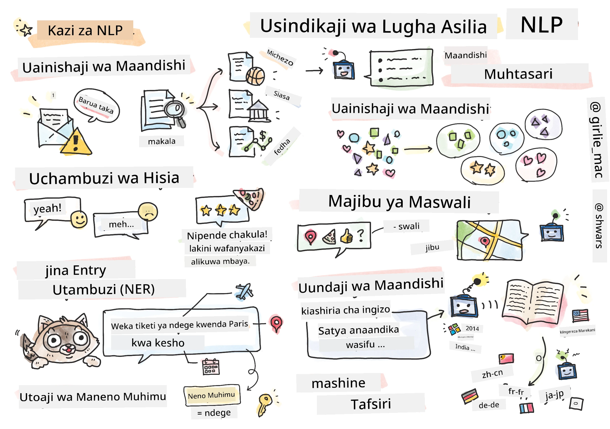

# Uchanganuzi wa Lugha Asilia



Katika sehemu hii, tutazingatia kutumia Mitandao ya Neva kushughulikia kazi zinazohusiana na **Uchambuzi wa Lugha Asilia (NLP)**. Kuna matatizo mengi ya NLP tunayopenda kompyuta ziweze kuyatatua:

* **Uainishaji wa maandishi** ni tatizo la kawaida la uainishaji linalohusiana na mfululizo wa maandishi. Mifano ni pamoja na kuainisha barua pepe kama taka au si taka, au kupangilia makala kama michezo, biashara, siasa, n.k. Pia, wakati wa kuendeleza roboti za mazungumzo, mara nyingi tunahitaji kuelewa kile mtumiaji alitaka kusema -- katika kesi hii tunashughulika na **uainishaji wa nia**. Mara nyingi, katika uainishaji wa nia tunahitaji kushughulikia makundi mengi.
* **Tathmini ya hisia** ni tatizo la kawaida la murejesho, ambapo tunahitaji kutoa nambari (hisia) inayolingana na jinsi maana ya sentensi ni chanya/negativi. Toleo la hali ya juu la tathmini ya hisia ni **tathmini ya hisia kwa misingi ya vipengele** (ABSA), ambapo tunahusisha hisia si kwa sentensi nzima, bali kwa sehemu tofauti za sentensi (vipengele), kwa mfano, *Katika mgahawa huu, nilipenda chakula, lakini mazingira yalikuwa mabaya*.
* **Utambuzi wa Vitu Vilivyopewa Majina** (NER) unahusu tatizo la kutoa vitu fulani kutoka kwa maandishi. Kwa mfano, tunaweza kuhitaji kuelewa kwamba katika kifungu *Nahitaji kuruka kwenda Paris kesho* neno *kesho* linahusu TAREHE, na *Paris* ni MAHALI.  
* **Utoaji wa maneno muhimu** ni sawa na NER, lakini tunahitaji kutoa maneno muhimu kwa maana ya sentensi kwa njia ya moja kwa moja, bila mafunzo ya awali kwa aina maalum za vitu.
* **Kukusanya maandishi** kunaweza kuwa muhimu tunapotaka kuunganisha sentensi zinazofanana pamoja, kwa mfano, maombi yanayofanana katika mazungumzo ya msaada wa kiufundi.
* **Kujibu maswali** kunahusu uwezo wa mfano kujibu swali maalum. Mfano hupokea kipande cha maandishi na swali kama ingizo, na unahitaji kutoa sehemu katika maandishi ambapo jibu la swali linapatikana (au, wakati mwingine, kuzalisha maandishi ya jibu).
* **Uundaji wa maandishi** ni uwezo wa mfano kuzalisha maandishi mapya. Inaweza kuzingatiwa kama kazi ya uainishaji inayotabiri herufi/neno lijalo kulingana na *mwanzo wa maandishi*. Mifano ya hali ya juu ya uzalishaji wa maandishi, kama GPT-3, inaweza kutatua kazi nyingine za NLP kama uainishaji kwa kutumia mbinu inayoitwa [programu ya kuwezesha](https://towardsdatascience.com/software-3-0-how-prompting-will-change-the-rules-of-the-game-a982fbfe1e0) au [ubunifu wa kuwezesha](https://medium.com/swlh/openai-gpt-3-and-prompt-engineering-dcdc2c5fcd29)
* **Kufupisha maandishi** ni mbinu tunapotaka kompyuta "ikusome" maandishi marefu na kuyafupisha kwa sentensi chache.
* **Tafsiri ya mashine** inaweza kuzingatiwa kama muunganiko wa kuelewa maandishi katika lugha moja, na kuzalisha maandishi katika nyingine.

Hapo awali, kazi nyingi za NLP zilitatuliwa kwa kutumia mbinu za jadi kama sarufi. Kwa mfano, katika tafsiri ya mashine, wachambuzi walitumiwa kubadilisha sentensi ya awali kuwa mti wa sarufi, kisha miundo ya hali ya juu ya semantiki ilitolewa kuonyesha maana ya sentensi, na kutegemea maana hii na sarufi ya lugha lengwa matokeo yalizalishwa. Siku hizi, kazi nyingi za NLP hutatuliwa kwa ufanisi zaidi kwa kutumia mitandao ya neva.

> Mbinu nyingi za jadi za NLP zimetekelezwa katika maktaba ya Python iitwayo [Natural Language Processing Toolkit (NLTK)](https://www.nltk.org). Kuna [Kitabu cha NLTK](https://www.nltk.org/book/) kizuri kinachopatikana mtandaoni kinachoelezea jinsi kazi tofauti za NLP zinavyoweza kutatuliwa kwa kutumia NLTK.

Katika kozi yetu, tutazingatia zaidi matumizi ya Mitandao ya Neva kwa NLP, na tutatumia NLTK pale itakapohitajika.

Tayari tumekuwa tukijifunza kuhusu matumizi ya mitandao ya neva kushughulikia data za jedwali na picha. Tofauti kuu kati ya aina hizi za data na maandishi ni kwamba maandishi ni mfuatano wa urefu unaobadilika, wakati ukubwa wa ingizo katika picha unajulikana mapema. Wakati mitandao ya convolutional inaweza kutoa mifumo kutoka kwa data ya ingizo, mifumo katika maandishi ni ngumu zaidi. Kwa mfano, tunaweza kuwa na kinyume kilichotengwa na somo kwa maneno mengi (mfano *Sipendi machungwa*, dhidi ya *Sipendi machungwa makubwa yenye rangi tofauti na ladha*), na hiyo bado inapaswa kufasiriwa kama mfumo mmoja. Hivyo, kushughulikia lugha tunahitaji kuanzisha aina mpya za mitandao ya neva, kama *mitandao inayorudia* na *transformers*.

## Sakinisha Maktaba

Ikiwa unatumia usakinishaji wa Python wa eneo lako kukamilisha kozi hii, unaweza kuhitaji kusakinisha maktaba zote zinazohitajika kwa NLP kwa kutumia amri zifuatazo:

**Kwa PyTorch**
```bash
pip install -r requirements-pytorch.txt
```
**Kwa TensorFlow**
```bash
pip install -r requirements-tf.txt
```

> Unaweza kujaribu NLP kwa TensorFlow kwenye [Microsoft Learn](https://docs.microsoft.com/learn/modules/intro-natural-language-processing-tensorflow/?WT.mc_id=academic-77998-cacaste)

## Onyo la GPU

Katika sehemu hii, katika baadhi ya mifano tutakuwa tukifundisha mifano mikubwa.
* **Tumia Kompyuta Yenye GPU**: Inashauriwa kuendesha daftari zako za kumbukumbu kwenye kompyuta yenye GPU ili kupunguza muda wa kusubiri wakati wa kufanya kazi na mifano mikubwa.
* **Mikwamo ya Kumbukumbu ya GPU**: Kuendesha kwenye GPU kunaweza kusababisha hali ambapo kumbukumbu ya GPU inakamilika, hasa wakati wa mafunzo ya mifano mikubwa.
* **Matumizi ya Kumbukumbu ya GPU**: Kiasi cha kumbukumbu ya GPU kinachotumiwa wakati wa mafunzo kinategemea mambo mbalimbali, ikiwa ni pamoja na ukubwa wa minibatch.
* **Punguza Ukubwa wa Minibatch**: Ikiwa unakutana na matatizo ya kumbukumbu ya GPU, fikiria kupunguza ukubwa wa minibatch katika msimbo wako kama suluhisho linalowezekana.
* **Uachishaji wa Kumbukumbu ya GPU kwa TensorFlow**: Matoleo ya zamani ya TensorFlow huenda yasitoe kumbukumbu ya GPU ipasavyo wakati wa kufundisha mifano mingi ndani ya kiini kimoja cha Python. Ili kudhibiti matumizi ya kumbukumbu ya GPU kwa ufanisi, unaweza kusanidi TensorFlow ili itenge kumbukumbu ya GPU tu inapohitajika.
* **Ujumuishaji wa Msimbo**: Ili kuweka TensorFlow iyatengenie kumbukumbu ya GPU polepole tu inapohitajika, jumuisha msimbo ifuatayo katika daftari zako za kumbukumbu:

```python
physical_devices = tf.config.list_physical_devices('GPU') 
if len(physical_devices)>0:
    tf.config.experimental.set_memory_growth(physical_devices[0], True) 
```

Ikiwa unavutiwa na kujifunza kuhusu NLP kutoka kwa mtazamo wa ML wa jadi, tembelea [mfululizo huu wa masomo](https://github.com/microsoft/ML-For-Beginners/tree/main/6-NLP)

## Katika Sehemu Hii
Katika sehemu hii tutajifunza kuhusu:

* [Kuonyesha maandishi kama tensors](13-TextRep/README.md)
* [Uingiliano wa Maneno](14-Embeddings/README.md)
* [Mifano ya Lugha](15-LanguageModeling/README.md)
* [Mitandao ya Neva Inayorudia](16-RNN/README.md)
* [Mitandao Inazozalisha](17-GenerativeNetworks/README.md)
* [Transformers](18-Transformers/README.md)

---

<!-- CO-OP TRANSLATOR DISCLAIMER START -->
**Kionyozo**:
Hati hii imetafsiriwa kwa kutumia huduma ya tafsiri ya AI [Co-op Translator](https://github.com/Azure/co-op-translator). Ingawa tunajitahidi kupata usahihi, tafadhali fahamu kwamba tafsiri za kiotomatiki zinaweza kuwa na makosa au upungufu wa usahihi. Hati ya asili katika lugha yake halisi inapaswa kuchukuliwa kama chanzo cha mamlaka. Kwa taarifa muhimu, tafsiri ya kitaalamu inayofanywa na binadamu inapendekezwa. Hatutojibu kwa kuelewa vibaya au tafsiri potofu zinazotokea kutokana na matumizi ya tafsiri hii.
<!-- CO-OP TRANSLATOR DISCLAIMER END -->